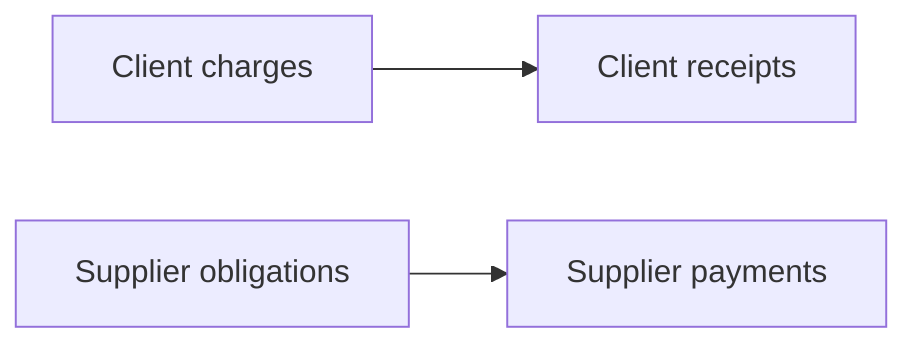

# AGENTS.md

This file is the repository contract for coding agents and automated contributors working on DepartureDesk. It applies to the entire repository unless a more specific `AGENTS.md` exists in a subdirectory.

## Mission

DepartureDesk helps travel agencies operate and account for group travel. It must preserve the real distinctions among supplier commitments, client sales, travelers, shared accommodations, payment responsibility, receipts, and supplier settlement.

The application should feel operationally calm, financially trustworthy, and travel-oriented without becoming recreational or decorative.

## Current boundary

Foundation 1 (agency membership, derived tenant context, profile administration, team invitations, and privileged provisioning/recovery) is shipped on `main`.

Phase 2A (agency-owned party identity, kind profiles, membership-to-person linkage, and the operational Directory) is implemented in this repository. Phase 2B (party contact information, effective-dated relationships, and retained notes) is implemented in this repository. Client and supplier profiles, merge, and party deactivation workflows are not. Do not assume that departures, suppliers, travelers, reservations, or money objects already exist. Before changing behavior, inspect routes, models, migrations, schema dumps, controllers, views, jobs, and tests. Describe planned features as planned until code and tests ship them.

## Architecture decisions

Accepted ADRs under `docs/adr` are authoritative. Read the relevant ADR before designing or changing its domain.

- [ADR 0001: Money and currency representation](docs/adr/0001-money-and-currency.md) accepts `money-rails`, `bigint` minor-unit persistence, explicit currencies, strict parsing, and explicit historical conversion facts. The dependency is not considered installed until `Gemfile`, the lockfile, initializer, and tests contain the implementation.
- [ADR 0004: Human-readable references and numbering](docs/adr/0004-human-readable-references.md) keeps UUIDv7 as internal identity, requires qualified reference names, and forbids a generic numbering engine. Foundation 1E implements office codes only.

## Canonical domain language

Use these terms consistently in code, migrations, UI labels, tests, and documentation.

| Term | Contract |
| --- | --- |
| Agency | The travel agency using DepartureDesk and owning operational records. Agency is the tenant. |
| Office | An agency-owned operating location or business unit. It is an authorization and operational-ownership scope inside one agency, not a tenant. Do not use `Branch` as a model or authorization concept. |
| Party | An agency-owned identity: a person, household, or organization. Party kind is immutable. Later client, supplier, traveler, organizer, and payer records are roles or profiles of a party, not a second identity. |
| Person | An individual party. Agency team members link to a person through `agency_memberships.person_party_id`. A person is not automatically a traveler, client, or payer. |
| Household | A servicing and communication collective stored as a party kind. Household membership is a later relationship. Do not treat directory household as an insurance household, traveling party, occupancy group, or payer group. Never infer household membership from shared occupancy. |
| Organization | A legal or trading entity stored as a party kind. Client and supplier remain later profiles of an organization or person. |
| Departure | The top-level operational container for one group trip. Do not use `Group` as the primary model name; it is too ambiguous. |
| Supplier | An external travel provider. |
| Travel component | One supplied part of a trip. A client reservation can include multiple components and suppliers. |
| Supplier arrangement | The commercial agreement between agency and supplier: rates, capacity, guarantees, deadlines, deposits, and cancellation terms. |
| Supplier reservation | A supplier-facing confirmation or booking. It is not the client reservation. |
| Client | A purchasing party. A client may be an individual, household, or organization and need not travel. |
| Client reservation | The agency-facing sale/trip record for a client within a departure. |
| Traveler | A person participating in travel. A traveler is not automatically the client or payer. |
| Payer / responsibility allocation | The party and amount or share responsible for client charges. |
| Occupancy assignment | Travelers sharing a cabin, room, or similar unit. Never infer financial responsibility from occupancy. |
| Client charge | An amount billed by the agency. |
| Client receipt | Money received from a client or payer. |
| Receipt application | The explicit allocation of a receipt to one or more client charges. |
| Supplier obligation | An amount owed or expected to be owed to a supplier. |
| Supplier payment | Money sent to a supplier. |
| Payment application | The explicit allocation of a supplier payment to obligations. |
| Guarantee / exposure | Agency liability that may remain even if related capacity is unsold. |

## Invariants agents must preserve

1. Supplier-side and client-side records are distinct even when they describe the same travel.
2. One client reservation may use zero, one, or many supplier reservations and suppliers.
3. A cabin or room may contain multiple travelers with separate payers or responsibility allocations.
4. Insurance is optional, separately sold inventory. Coverage grouping follows insurer/household rules rather than cabin occupancy.
5. Standard blocked hotel nights and optional extension nights must remain distinguishable.
6. Fixed supplier costs, per-unit costs, per-person costs, estimates, and guarantees must remain distinguishable.
7. Reservation, fulfillment, invoicing, receipt, and settlement statuses are independent state dimensions.
8. Never infer payment merely because travel is confirmed, ticketed, departed, or completed.
9. Client receipts and supplier payments require explicit applications.
10. Financial corrections should preserve history through reversal or adjustment rather than silent mutation once posted.
11. Air ticket records must be able to retain the ARC/BSP settlement amount per ticket without requiring full ARC/BSP reconciliation.
12. Parties are agency-owned. Load them through `Current.agency`. Do not use a tenant `default_scope`, and do not accept ownership from `params[:agency_id]`.
13. Party kind is immutable after create. Do not convert a person into a household or organization. Kind-profile rows carry a fixed `party_kind` and reference `parties (id, agency_id, party_kind)`.
14. Every agency membership, including invited, has exactly one same-agency person. Do not add `users.person_id`. Invitation acceptance and reactivation revalidate the link and must not create a person.
15. The operational Directory is agency-wide. Office selection does not partition party visibility.
16. Client, supplier, traveler, organizer, and payer are later roles or profiles. Do not duplicate party identity for those roles.

## Working examples

Use these scenarios when evaluating a proposed model.

### Smith Family Reunion cruise

- One departure includes a cruise-line group arrangement.
- Two friends share a cabin but each pays a defined portion.
- The agency guarantees a minimum pre-cruise hotel-room block.
- Travelers may add optional nights before the standard group night.
- Insurance is sold separately.
- One insurance policy may cover one household; unrelated cabin-mates need separate policies.

### Packaged wine-country tour

- The agency combines independently contracted components into one package.
- The motorcoach cost is fixed whether 15 or 30 seats sell.
- The vineyard charges per participant.
- Margin and exposure must reflect the different cost bases.

If a design cannot represent both scenarios without duplicated facts or special-case accounting, revise the design before implementation.

## Development environment

Development is Docker-only. Do not instruct contributors to install or run host Ruby, Rails, Bundler, PostgreSQL, or Tailwind.

Primary commands:

```bash
docker compose up --build
./dev/rails-docker bin/rails test
./dev/rails-docker bin/rails console
./dev/rails-docker bin/rails db:migrate
./dev/rails-docker bin/rails tailwindcss:build
```

Services:

- `web`: Rails server.
- `css`: Tailwind watcher; must run for styled development pages.
- `jobs`: Solid Queue worker.
- `db`: PostgreSQL 18.

When diagnosing a container failure, identify the first application error. Do not treat Docker Desktop suggestions such as Gordon as part of the Rails failure.

## Rails conventions

- Follow Rails 8.1 conventions and prefer framework capabilities already present.
- Use Active Record associations and validations for developer ergonomics, plus database constraints for durable invariants.
- Keep controllers focused on HTTP concerns.
- Put multi-record business workflows in clearly named service or command objects once controller/model callbacks would obscure transaction boundaries.
- Use transactions when an operation must update multiple durable facts atomically.
- Avoid callbacks for financial posting, payment application, or supplier commitment workflows.
- Normalize values at explicit boundaries. Do not use presentation formatting as normalization.
- Prevent N+1 queries on operational lists and dashboards.
- Use optimistic locking on mutable operational aggregates where concurrent edits matter.
- Prefer explicit enums or constrained string states whose values remain readable in SQL.
- Do not add gems when Rails or an existing dependency reasonably handles the need.
- `money-rails` is an explicitly accepted exception governed by ADR 0001; do not substitute a different money library without superseding that ADR.
- Phase 2B accepts `phonelib` (behind `PhoneNumberNormalizer`) and `countries` (namespaced `ISO3166::Country` only). Do not use the countries gem as a currency authority.

## PostgreSQL and Active Record

- PostgreSQL 18 is authoritative. Do not reduce the design to cross-database compatibility.
- `config.active_record.schema_format` is `:sql`; commit updated `db/structure.sql` after migrations.
- `pg_trgm` supports tolerant search and `citext` is available for selected case-insensitive attributes.
- Application-owned durable tables use UUID primary keys with database defaults of `uuidv7()`.
- When an ID is needed before persistence, assign UUIDv7 in Rails and retain the database default as a safety net.
- Every UUID foreign key must declare `type: :uuid` in its migration.
- Framework-owned tables such as Solid Queue and Active Storage internals may retain bigint identifiers.
- Rails operates timestamps in UTC; domain timestamps use PostgreSQL `timestamptz`.
- Store an agency’s display/business timezone as a recognized IANA timezone.
- Currency codes are uppercase three-character values.
- Store money in `bigint` integer minor-unit columns using the `_minor_units` suffix, with an explicit currency for every independently meaningful monetary fact.
- Never use floating-point columns for money, rates that post money, or allocations.
- Use decimal/numeric values only where fractional quantities or exchange rates require them, with explicit precision and scale.
- Add `null`, foreign-key, unique, check, and exclusion constraints as appropriate. Model validation alone is insufficient.
- Name important constraints and indexes so failures are diagnosable.

### Multiple databases

The application database and Solid Queue database are separate.

- Development primary: `departure_desk_development`.
- Development queue: `departure_desk_development_queue`.
- Production uses `DATABASE_URL` and `QUEUE_DATABASE_URL`.
- Development must configure `config.solid_queue.connects_to = { database: { writing: :queue } }`.
- Do not put a single shared `DATABASE_URL` into the default development database anchor; that can redirect both named connections to one database.
- Queue structure belongs in `db/queue_structure.sql`.

Do not “fix” missing queue tables by adding Solid Queue tables to the primary domain schema. Confirm the active connection and initialize the queue database instead.

## Identifier policy

Application domain models currently inherit Rails-side UUIDv7 preassignment from `ApplicationRecord`. Before introducing or retaining any application-owned bigint model, resolve that mismatch explicitly. Never let a UUID default write into a bigint primary key.

For migrations:

```ruby
create_table :example_records,
  id: :uuid,
  default: -> { "uuidv7()" } do |table|
  # ...
end
```

For references:

```ruby
table.references :agency,
  null: false,
  type: :uuid,
  foreign_key: true
```

## Migration policy

- Inspect both migrations and `db/structure.sql` before changing persistence.
- Prefer a new forward migration once a migration has been shared or run outside a disposable local environment.
- Rewriting foundational migrations is acceptable only when the project owner explicitly confirms that all affected databases are disposable and requests a clean-baseline rewrite.
- Never drop, reset, or recreate a database without stating exactly which database and data will be lost.
- Never edit generated structure SQL by hand to work around a migration problem.
- Verify migrations against both development and test databases.
- Preserve unrelated user data and existing worktree changes.

## Financial design

Keep two related but independent flows:



The exact implementation will evolve, but agents must not collapse these into one generic paid flag.

- Charges and obligations describe what is owed.
- Receipts and payments describe cash movement.
- Applications describe which cash movement settles which item.
- Estimates, commitments, actuals, commissions, service fees, and margin require explicit provenance.
- Posted financial facts should be immutable; correct them through linked reversal/adjustment facts.
- Preserve original currency, applicable exchange-rate facts, and agency reporting currency when multi-currency support is introduced.
- Use `money-rails` as a value-object and Rails-integration layer only. It is not a ledger, settlement engine, or accounting model.
- Use `with_model_currency` (or an equally explicit immutable owner) for persisted amounts; never rely on a global default currency to interpret stored financial facts.
- Disable implicit currency conversion. Mismatched-currency arithmetic must fail unless an explicit workflow supplies and persists the conversion facts required by ADR 0001.
- Do not use MoneyRails migration helpers without reviewing and overriding their amount type, names, defaults, nullability, and constraints. Explicit migrations are preferred.
- Formatting and parsing helpers are boundary concerns. Never persist a formatted string as the authoritative amount.
- Document and test precision, rounding mode, rounding boundary, and remainder allocation for every calculation that can produce fractional minor units.

## Authentication and tenancy

- Authentication uses `User`, `Session`, bcrypt, and a signed permanent session cookie.
- Tenant context is derived from `User#usable_agency_membership`. That resolver returns a membership only when exactly one active membership exists and its agency is active.
- `Current.session` is the authentication root. `Current.user`, `Current.agency_membership`, and `Current.agency` are derived from it. Never establish tenancy from `params[:agency_id]`, headers, or extra cookies. `Current.office` is subordinate to `Current.agency` and is resolved, without writing the session, from a valid stored `office_id`, else the membership’s active accessible default, else the sole accessible office. Never authorize from `params[:office_id]`, and do not persist or clear a session office selection on GET.
- Login and every authenticated request fail closed when a usable membership cannot be resolved. Do not reveal whether credentials, membership, or agency failed.
- Membership or agency suspension destroys the current session and clears the session cookie.
- Successful authentication redirects through the named root route; keep `root_url` available unless authentication behavior is intentionally changed.
- Do not expose whether an email address exists during password-reset flows.
- Never log plaintext passwords, tokens, payment credentials, passport data, or other sensitive traveler information.
- The current seed credential is development-only.
- Administrator capabilities are membership-scoped (`Current.agency_membership.administrator?`), not a property on `User`.
- Tenant administrators may edit the current agency profile. They may not create agencies, change lifecycle status, or delete an agency.
- Team administration manages `AgencyMembership` through explicit commands. Invitations are distinct from password resets and never disclose whether an email exists in another agency.
- Membership-target commands must confirm the membership belongs to the supplied agency after locking and before mutation. Tenant-facing team commands accept a user actor only. After the agency lock, that actor must have a usable administrator membership on the affected active agency. Do not rely on `administrator?` alone.
- Privileged system attribution is an explicit opt-in (`privileged` plus `actor_identifier`). Recovery-owned nested calls may use it. Provisioning and agency lifecycle keep their own system-only contracts. Invitation acceptance is the documented invitee exception: the invitee is the audit actor and is not yet an administrator.
- Directory contact, relationship, and note commands lock agency, then parties by UUID, then the contact point, relationship, or note, then a purpose assignment when it is independently mutated. They do not lock the actor user first. Nested directory commands use a locked primitive and must not reacquire those locks.
- Last-administrator and other team mutations lock agency, then membership. Activation (accept and reactivate) locks user, then agency, then membership, reloads those rows, and rechecks eligibility including office access. Membership-creation commands that lock an existing user take the same user → agency order and must not reacquire those locks from a nested person-link command; `LinkMembershipPerson.record_locked!` records the already-held link. Staff need an active assignment to an active office. Administrators need a default assignment when any active office exists. Acceptance must revalidate the presented invitation token after those locks. An obsolete token or missing staff office returns the generic public failure and must not change the password. Administrative reactivation without office access returns `:no_office_access`. Recovery `reactivate` must not insert an agency- or membership-referencing row before those locks; write `administrator_recovery_started` and grant a default only after the activation primitive holds them. Recovery `invite_replacement` lets `InviteTeamMember` acquire user → agency locks, then records `administrator_recovery_started` under those locks.
- Agency provisioning, lifecycle, and administrator recovery are privileged commands (`ProvisionAgency`, `ChangeAgencyStatus`, `RecoverAgencyAdministrator`), not tenant-facing routes. System audit events require `actor_identifier` and must not invent a platform user. Command output may print identifiers only—never passwords or invitation tokens.
- Audit subjects are narrowly typed: an `Agency` subject must equal the event agency; an `AgencyMembership`, `Office`, `OfficeAssignment`, `Party`, `Person`, `Household`, `Organization`, `PartyAlternateName`, `PartyContactPoint`, `ContactPointPurposeAssignment`, `PartyRelationship`, `RelationshipPurposeAssignment`, or `PartyNote` subject must belong to it. Unknown subject types raise. Do not infer tenancy for unknown subject types. Contact-point detail tables are not audit subjects.
- An office belongs to exactly one agency. Staff operate only in offices with an active assignment. Administrators may use every active office without an assignment per office; they still have one default assignment when any active office exists. Office access is not a role.
- Later office-owned records must carry a direct `agency_id` and enforce matching `(office_id, agency_id)` with a composite foreign key. Do not infer tenant ownership only through `office_id`. Human-readable office codes never authorize. See [ADR 0004](docs/adr/0004-human-readable-references.md).
- Administrative mutations write append-only `AuditEvent` records in the same transaction. Audit events reject update and destroy in the application and in PostgreSQL.
- Business records must be loaded through `Current.agency`. Do not use a tenant `default_scope`. Do not rely on a client-supplied agency ID without authorization against the current user/session.
- Action Cable identifies `current_user` and `current_agency` from the same resolver. It must not copy request `Current` onto a long-lived connection and must not persist `Current.office` on the connection. Future office-scoped channel actions must reload the current session selection and reapply office authorization for each action; connection-time `current_agency` is not sufficient.
- Jobs that need office scope accept an office identifier, reload the office through the agency, and re-check operational access.
- Treat passenger identity documents and payment information as sensitive data requiring explicit retention, access, and audit rules before implementation.

## Tests

Every behavior change requires focused automated coverage at the lowest useful level and integration coverage for important workflows.

Run:

```bash
./dev/rails-docker bin/rails test
```

Also run system tests for browser-visible workflows when a browser is available. They run in GitHub CI. The local Docker image does not include Chrome, so `bin/ci` skips that step there.

Testing rules:

- Test database constraints as well as model validations for important invariants.
- Test cross-agency authorization whenever agency-scoped records are introduced.
- Test fixed versus per-person pricing, unsold guarantee exposure, shared occupancy with split responsibility, household-specific insurance, and multi-supplier client reservations when those features ship.
- Test successful, invalid, duplicate, reversal, and concurrent paths for financial workflows.
- Fixtures must satisfy column limits and database constraints. Because Rails may load all fixtures before every test, one invalid fixture can break unrelated tests before assertions run.
- Avoid assertions tied only to CSS implementation details; assert accessible roles, labels, visible states, and outcomes.
- Do not weaken or delete a regression test merely to make a change pass.

## UI and design system

The canonical theme lives in `app/assets/tailwind/application.css`.

Brand meanings:

- Navy: structure and authority.
- Teal: movement, action, active, and selected states.
- Amber: waypoints, deadlines, focus, and guaranteed exposure.
- Red: destructive, invalid, cancelled, or overdue states.

Rules:

- Reuse `dd-` component classes and design tokens before creating one-off colors or spacing.
- Keep amber text dark; never use small white text on the logo amber.
- Amber is not the destructive color and is not the default active-navigation color.
- Never communicate status by color alone. Pair color with text and, when useful, an icon.
- Use visible horizontal separators in dense financial/operational tables; avoid excessive vertical grid lines.
- Keep inputs neutral until interaction. Use teal for active interaction and amber for the keyboard focus ring.
- Maintain WCAG-conscious contrast and complete keyboard access.
- Keep the skip link and meaningful focus indicators functional.
- Disabled navigation placeholders must become real links only when corresponding authorized routes exist.
- Do not introduce an external font, icon library, or JavaScript UI framework without an explicit product decision.
- Administration page, panel, button, and field anatomy is defined in [docs/ui/interface-contract.md](docs/ui/interface-contract.md). Reuse that contract before adding presentation classes.

## Background jobs

- Use Active Job with Solid Queue.
- Jobs must be idempotent or guarded by durable idempotency keys when duplicate execution would cause harm.
- Pass record identifiers, not full Active Record objects or sensitive payloads.
- Re-load and authorize/scoped records inside the job.
- Define retry/discard behavior intentionally for supplier APIs, mail delivery, and financial workflows.
- Never rely on an in-memory job adapter for behavior that must survive a process restart.

## Seeds and sample data

- Seeds must be idempotent.
- Development-only credentials and illustrative data must be guarded by `Rails.env.development?`.
- Never seed real traveler, client, payment, passport, or supplier credential data.
- Do not reset a production password or mutate production financial facts from general-purpose seeds.
- Print identifiers and safe status information only; never print plaintext secrets.

## Change workflow

Before editing:

1. Read the relevant model, migration, schema, route, controller/view/job, and tests.
2. State whether the change affects current behavior or planned requirements.
3. Identify affected supplier, client, traveler, reservation, and financial boundaries.

While editing:

1. Keep changes narrowly scoped.
2. Preserve established terminology and design tokens.
3. Add database constraints and tests alongside domain persistence.
4. Avoid unrelated formatting churn.
5. Update documentation when commands, architecture, terminology, or shipped scope changes.

Before handing off:

1. Run targeted tests, then the full test suite.
2. Run the Tailwind build for CSS/view changes.
3. Confirm migrations and committed structure dumps agree.
4. Check worker boot for job/database changes.
5. Report what changed, what was verified, and any remaining risk or manual check.

## Prohibited shortcuts

Do not:

- Model a departure as one supplier booking.
- Model a client reservation as belonging to only one supplier.
- Treat every traveler as a payer or every payer as a traveler.
- Infer household membership from cabin/room sharing.
- Infer payment state from reservation or travel state.
- Use a single `paid` boolean for client and supplier accounting.
- Hide agency guarantees or unsold exposure inside estimated margin.
- Use floating point for money.
- Use `_cents` as the general persistence suffix; DepartureDesk uses `_minor_units` because supported currencies do not all have cents.
- Enable automatic currency conversion or use a current exchange-rate bank as historical accounting authority.
- rely only on model validations for durable financial invariants.
- Put Solid Queue domain tables in the primary database to mask a connection error.
- Commit generated Tailwind output, `.env` files, secrets, or real personal data.
- Run destructive database or Git commands without explicit authorization and a precise target.

When domain requirements conflict or a proposed shortcut changes financial meaning, stop and request a product decision rather than silently choosing a lossy model.
