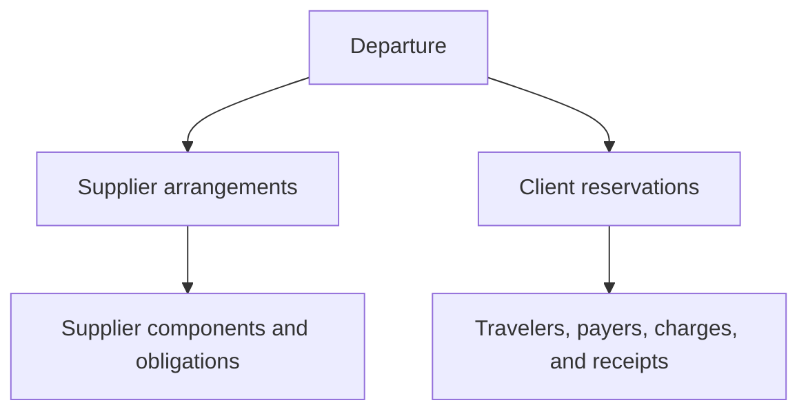

# DepartureDesk

DepartureDesk is an operations and financial-management application for travel agencies that plan, sell, and operate group travel.

The application is intended to connect four views of the same departure without collapsing them into one record:

1. What the agency has arranged or guaranteed with each supplier.
2. What the agency has sold to each client.
3. Which travelers are participating and who is financially responsible.
4. How reservations, client receipts, supplier obligations, and supplier payments progress over time.

DepartureDesk is in its foundation stage. Authentication, agency membership, tenant context, PostgreSQL, Solid Queue, Docker development, UUIDv7 support, and the initial application theme are present. The business-domain model described below is the product direction, not a claim that every feature is implemented.

Architecture decisions are recorded in [`docs/adr`](docs/adr). [ADR 0001](docs/adr/0001-money-and-currency.md) accepts `money-rails` and the application’s money/currency persistence contract; installation remains a pending implementation step. [ADR 0002](docs/adr/0002-agency-tenancy-and-membership.md) accepts agency memberships and derived tenant context. [ADR 0003](docs/adr/0003-membership-lifecycle-and-invitations.md) accepts invited/active/suspended/revoked memberships and invitation onboarding.

## Product model

A **departure** is the agency-managed operational container for one group trip, such as the *Smith Family Reunion Cruise* or a packaged wine-country tour. A departure is not merely a supplier confirmation or a collection of invoices. It brings together supplier arrangements, client reservations, travelers, inventory or capacity, deadlines, and financial exposure.



### Core terminology

| Term | Meaning |
| --- | --- |
| Agency | The travel agency operating DepartureDesk and responsible for the departure. |
| Departure | One agency-managed group travel program with shared dates, purpose, operational status, and financial reporting. |
| Supplier | A cruise line, hotel, motorcoach company, vineyard, insurer, airline, or other provider. |
| Travel component | A distinct supplied part of a departure, such as a cruise cabin, hotel room night, motorcoach seat, tasting, insurance policy, or air ticket. |
| Supplier arrangement | The agency’s commercial terms with a supplier, including pricing, capacity, guarantees, release dates, deposits, and cancellation exposure. |
| Supplier reservation | A supplier-facing confirmation or booking record. One client reservation can be fulfilled by multiple supplier reservations. |
| Client | The person, household, organization, or other party purchasing travel from the agency. A client is not necessarily a traveler. |
| Client reservation | The agency-facing sale or trip record for a client within a departure. It can contain multiple components from multiple suppliers. |
| Traveler | A person who will travel. Travelers can share accommodations while retaining separate financial responsibility. |
| Payer / responsibility allocation | The client or person responsible for a defined share of one or more charges. |
| Occupancy assignment | The placement of travelers into a cabin, room, or other shared unit. Occupancy does not determine payment responsibility. |
| Household | A grouping relevant to products whose coverage rules depend on household membership, especially travel insurance. It is not automatically the same as a cabin. |
| Client charge | An amount the agency bills to a client or payer. |
| Client receipt | Money received from a client, later applied to one or more charges. |
| Supplier obligation | An amount the agency owes or expects to owe a supplier. |
| Supplier payment | Money paid to a supplier and applied to one or more obligations. |
| Guarantee / exposure | A supplier commitment the agency may owe even when corresponding client inventory is not sold. |

### Examples the model must support

**Group cruise**

- The agency holds a cruise-line group booking and tracks the supplier confirmation.
- Two friends may share one cabin while each remains responsible for a defined portion of the agency booking.
- Pre-cruise hotel rooms may be blocked under a minimum guarantee.
- A traveler may add optional nights before the standard group night.
- Insurance is sold separately rather than drawn from blocked inventory.
- One insurance policy may cover members of one household; cabin-mates from different households require separate policies.

**Packaged wine-country tour**

- The agency combines independently arranged supplier components into one client-facing package.
- A motorcoach has a fixed cost whether 15 or 30 travelers participate.
- A vineyard tasting is charged per traveler.
- Departure profitability therefore depends on both fixed commitments and variable per-person costs.

**Air travel**

DepartureDesk does not intend to reproduce full ARC/BSP reconciliation. It should retain ticket-level financial facts such as passenger, carrier, ticket number, fare, taxes and fees, commission or service fee, issue/void/refund/exchange state, and the ARC/BSP settlement amount attributable to each ticket.

### Modeling principles

- Supplier-side and client-side arrangements are related but remain distinct.
- A client reservation may contain any number of supplier components.
- Travelers, clients, payers, households, and accommodation occupants are separate roles.
- Reservation state and payment state are tracked independently.
- Client receipts are applied explicitly rather than inferred from a reservation status.
- Supplier payments are applied explicitly to supplier obligations.
- Fixed, per-unit, per-person, optional, and guaranteed costs must remain distinguishable.
- Color, labels, and presentation must not substitute for durable accounting facts.

## Current implementation

The repository currently provides:

- Rails 8.1 on Ruby 3.4.
- PostgreSQL 18 with `pg_trgm`, `citext`, and native `uuidv7()` support.
- SQL schema dumps to preserve PostgreSQL-specific constraints and defaults.
- UUIDv7 defaults for application-owned domain records.
- Password authentication using Rails’ authentication generator and `has_secure_password`.
- Agency memberships that derive one trusted current agency from the authenticated user.
- Current-agency profile administration for administrators, with an append-only administrative audit trail.
- Team invitations and membership administration for the current agency.
- Privileged agency provisioning, lifecycle, and administrator-recovery commands. See [agency-provisioning-and-recovery.md](docs/planning/agency-provisioning-and-recovery.md).
- A separate Solid Queue database and worker process.
- Tailwind CSS 4 with the DepartureDesk “Harbor and Waypoint” theme.
- A Docker-only local development workflow.
- An initial authenticated dashboard and themed authentication screens.

## Technology

| Area | Choice |
| --- | --- |
| Application | Ruby 3.4, Rails 8.1 |
| Database | PostgreSQL 18 |
| ORM | Active Record |
| Background jobs | Solid Queue |
| Front end | Hotwire, Stimulus, Importmap |
| Styling | Tailwind CSS 4 plus DepartureDesk design tokens |
| Assets | Propshaft |
| Authentication | Rails authentication generator, bcrypt |
| Money values | MoneyRails (accepted; installation pending) |
| Development | Docker Compose |

## Local development

### Prerequisites

- Docker Desktop or another Docker Engine with Compose v2.
- Git.
- No host installation of Ruby, Rails, PostgreSQL, Node, or Tailwind is required.

The container image installs the PostgreSQL 18 client so `rails dbconsole` matches the PostgreSQL server major version.

### First-time setup

Clone the repository and enter it:

```bash
git clone https://github.com/tswarren/DepartureDesk.git
cd DepartureDesk
```

Build the image and start PostgreSQL first:

```bash
docker compose build
docker compose up -d db
```

Prepare the primary and queue databases:

```bash
docker compose run --rm web bin/rails db:prepare
```

Load the development seed user:

```bash
docker compose run --rm web bin/rails db:seed
```

Start the full application:

```bash
docker compose up
```

Open <http://localhost:3000>.

The development-only seed account is:

```text
Email: email@example.com
Password: ChangeMe123!
```

This is a public development credential. Never use it in production.

### Compose services

| Service | Purpose |
| --- | --- |
| `web` | Rails web server on port 3000 |
| `css` | Tailwind watcher that writes `app/assets/builds/tailwind.css` |
| `jobs` | Solid Queue supervisor and workers |
| `db` | PostgreSQL 18 server on port 5432 |

Compiled Tailwind assets are intentionally ignored by Git and are generated by the `css` service. If the page appears unstyled, inspect `docker compose logs css` and run `bin/rails tailwindcss:build` inside the container.

### Running Rails commands

Use the helper for application commands:

```bash
./dev/rails-docker bin/rails routes
./dev/rails-docker bin/rails console
./dev/rails-docker bin/rails db:migrate
./dev/rails-docker bin/rails test
```

The helper uses `docker compose exec web` when the web service is running and an ephemeral `docker compose run --rm web` otherwise.

### Common commands

```bash
# Start all services in the background
docker compose up -d

# Follow application logs
docker compose logs -f web

# Follow worker logs
docker compose logs -f jobs

# Follow Tailwind compilation
docker compose logs -f css

# Stop services without deleting data
docker compose down

# Rebuild after changing the Dockerfile or gems
docker compose up --build

# Open the primary database console
./dev/rails-docker bin/rails dbconsole

# Open the queue database console
./dev/rails-docker bin/rails dbconsole --database queue
```

## Databases

Development and test each use a primary application database and a separate Solid Queue database.

| Environment | Primary | Queue |
| --- | --- | --- |
| Development | `departure_desk_development` | `departure_desk_development_queue` |
| Test | `departure_desk_test` | `departure_desk_test_queue` |
| Production | `DATABASE_URL` | `QUEUE_DATABASE_URL` |

Development configuration selects the queue database explicitly:

```ruby
config.active_job.queue_adapter = :solid_queue
config.solid_queue.connects_to = { database: { writing: :queue } }
```

The application uses `db/structure.sql` rather than `db/schema.rb`. Queue tables are preserved separately in `db/queue_structure.sql`.

### PostgreSQL conventions

- Application-owned durable records use UUID primary keys with PostgreSQL 18 `uuidv7()` defaults.
- Rails may assign a UUIDv7 before persistence when workflows need an ID early; the database default remains the safety net.
- Foreign keys referencing UUID records must declare `type: :uuid`.
- Framework-owned tables, including Solid Queue and Active Storage internals, may retain bigint identifiers.
- Rails timestamps are handled in UTC and domain tables use PostgreSQL `timestamptz`.
- Database constraints enforce durable invariants in addition to model validations.
- Currency codes use uppercase ISO-style three-character values such as `USD`.

### Money and currency

[ADR 0001](docs/adr/0001-money-and-currency.md) is authoritative for money representation.

- Persist amounts in `bigint` columns named with the `_minor_units` suffix.
- Persist an explicit uppercase three-character currency with every independently meaningful monetary fact.
- Use `money-rails` to expose currency-aware `Money` values in Ruby; do not let gem defaults define the database schema.
- Disable implicit cross-currency conversion.
- Store durable exchange-rate and rounding facts when explicit conversion is introduced.
- Continue to model charges, receipts, receipt applications, supplier obligations, supplier payments, and payment applications separately.

Example persistence and model mapping:

```ruby
table.bigint :amount_minor_units, null: false
table.string :currency, null: false, limit: 3

monetize :amount_minor_units,
  as: :amount,
  with_model_currency: :currency
```

An agency’s default currency is a data-entry default and reporting preference. It does not determine or rewrite the currency of an existing financial record.

### Rebuilding disposable local databases

Only use this when development data can be discarded:

```bash
docker compose stop jobs
./dev/rails-docker bin/rails db:drop db:create db:schema:load
./dev/rails-docker bin/rails db:seed
docker compose up -d jobs
```

To rebuild only the disposable queue database:

```bash
docker compose stop jobs
./dev/rails-docker bin/rails db:drop:queue db:create:queue db:schema:load:queue
docker compose up -d jobs
```

Dropping the queue database deletes queued development jobs but does not delete primary application data.

## Testing

Run the complete test suite:

```bash
./dev/rails-docker bin/rails test
```

Run one test file:

```bash
./dev/rails-docker bin/rails test test/models/agency_test.rb
```

System tests require Chrome. They run in GitHub CI. The local Docker image
does not include a browser, so `bin/ci` and `bin/rails test:system` skip
them there. To force an attempt:

```bash
FORCE_SYSTEM_TESTS=1 ./dev/rails-docker bin/rails test:system
```

Rails loads fixtures before test methods. Fixture values must satisfy database limits and constraints; a bad fixture can cause every otherwise unrelated test to error during setup.

## Theme and interface

The visual system is defined in `app/assets/tailwind/application.css`.

- Navy represents structure and authority.
- Teal represents movement, action, and selection.
- Amber represents waypoints, focus, guarantees, and attention—not destructive errors.
- Conventional semantic colors remain responsible for success, warning, error, information, and inactive states.
- Dense operational tables use visible horizontal structure, restrained vertical rules, and explicit labels or icons in addition to color.
- Keyboard focus uses an amber outer ring.

Reusable CSS component classes use the `dd-` prefix, including `dd-button`, `dd-panel`, `dd-table`, `dd-field`, `dd-alert`, and `dd-badge`.

## Configuration

Docker supplies sensible development defaults. Supported database variables include:

| Variable | Default |
| --- | --- |
| `DATABASE_HOST` | `db` |
| `DATABASE_PORT` | `5432` |
| `DATABASE_USERNAME` | `departure_desk` |
| `DATABASE_PASSWORD` | `departure_desk_dev` |
| `DATABASE_NAME` | `departure_desk_development` |
| `QUEUE_DATABASE_NAME` | `departure_desk_development_queue` |
| `TEST_DATABASE_NAME` | `departure_desk_test` |
| `TEST_QUEUE_DATABASE_NAME` | `departure_desk_test_queue` |
| `RAILS_MAX_THREADS` | `5` |
| `DB_STATEMENT_TIMEOUT` | `15s` |
| `DB_LOCK_TIMEOUT` | `5s` |

Do not commit `.env` files, production credentials, or real client/traveler information.

## Troubleshooting

### The application is unstyled

Confirm the CSS service is running and the build exists:

```bash
docker compose ps css
docker compose logs css
ls -lh app/assets/builds/tailwind.css
```

Build once manually if needed:

```bash
./dev/rails-docker bin/rails tailwindcss:build
```

### `solid_queue_processes` does not exist

Confirm Solid Queue is connected to the queue database:

```bash
./dev/rails-docker bin/rails runner '
  puts SolidQueue::Record.connection_db_config.database
  puts SolidQueue::Record.connection.data_source_exists?("solid_queue_processes")
'
```

Expected output includes `departure_desk_development_queue` and `true`.

### `root_url` is undefined

Authentication redirects successful sign-ins to `root_url`. Ensure `config/routes.rb` contains an active root route:

```ruby
root "dashboard#show"
```

### A schema load reports `ar_internal_metadata` already exists

The target database is partially initialized. For a disposable development queue, stop the worker and recreate only the queue database using the commands above. Do not hand-edit `db/queue_structure.sql` to remove Rails metadata tables.

## Project status

DepartureDesk is pre-production and under active domain design. Keep implementation claims in this README synchronized with shipped code. Place detailed requirements and architectural decisions in version-controlled planning documents as the model matures.
