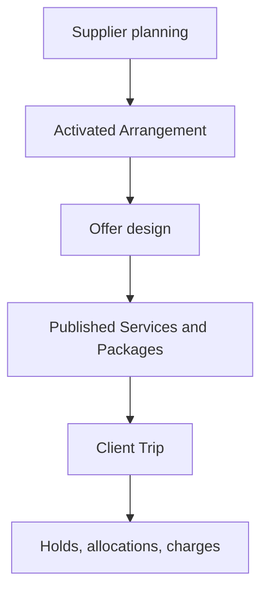

Yes—but I would call it a **boundary correction**, not a rollback.

We should remove Client pricing, Package placement, and Client terms from the definition of a Supplier-family adapter. We should **not** delete the shipped M4 pricing/Package models or discard the Cruise work that will still be useful later.

The correction is:

> Supplier Composition ends when the Supplier Arrangement is operationally complete.  
> Offer Design starts when Staff decide how to sell those Supplier services.  
> Client Trips start when a Client actually selects them.

# The corrected product layers



## 1. Supplier planning

Owns:

- Supplier Arrangements;
- Items and Occurrences;
- Resources;
- controlled capacity;
- Supplier costs;
- Supplier deposits;
- Supplier deadlines;
- activation;
- successor Supplier terms.

Answers:

> What did we contract from the Supplier?

## 2. Offer design

Owns:

- Service Offers;
- Supplier source bindings;
- Client choices;
- Client pricing;
- Client terms;
- Packages;
- included/optional placement;
- publication.

Answers:

> What are we prepared to sell, and under what Client-facing terms?

## 3. Client Trip

Owns:

- actual Package selection;
- actual add-ons;
- selected choices;
- named travelers;
- quantities;
- price/term snapshots;
- Holds;
- Allocations;
- Charges.

Answers:

> What did this Client book?

# What should remain in the Supplier workspace

For Hilton:

```text
Pre-cruise stay
├── dates and Hotel
├── Standard and Deluxe room categories
├── guaranteed room inventory
├── Supplier costs
├── Supplier deposit
├── Supplier deadlines
└── activation readiness
```

The Supplier workspace may show a quiet handoff:

```text
Client offer
No Client Service has been created for this stay.

[Create Client Service outline]
```

Or, if connected:

```text
Client offer
Connected to “Pre-cruise hotel”

[Open in Offer Design]
```

It should not contain:

- Client price entry;
- Package inclusion;
- add-on classification;
- Client payment schedules;
- Client cancellation terms;
- Client publication readiness;
- Client Trip selection.

# What should move to Offer Design

Once Staff open the connected Service Offer, they can decide:

```text
Pre-cruise hotel

Supplier source
Hilton pre-cruise stay
Standard and Deluxe rooms

How will this Service be sold?
• Separately
• Inside a Package
• Decide later

Client choices
• Standard
• Deluxe

Client pricing
Not configured

Client terms
Not configured

Package placement
Not configured
```

That is a different workspace with a different purpose.

# What to do with Cruise

The Cruise implementation already contains all three pre-sale layers. We should separate them rather than delete them.

## Keep in Cruise Supplier Planning

- sailing;
- cabin Resources;
- capacity Pools;
- Supplier rate matrix;
- Supplier deposits and deadlines;
- activation;
- successor editing.

## Keep as the connection handoff

- one Service Offer claim;
- Arrangement-version pin;
- cabin-category bindings;
- cabin-category choices;
- stable `cruise_cabin:` keys.

But present this as:

```text
Client Service connected
[Open in Offer Design]
```

## Move conceptually to Offer Design

- Cruise Client price matrix;
- source-copy proposal;
- Client-price provenance;
- Single/Double/Triple Client price review;
- Client publication readiness;
- Package placement;
- Client payment/cancellation terms.

The code can remain initially, but the product boundary and navigation should change.

# What not to delete

Do not remove these tables or authorities:

- `ServiceOffer`;
- `ServiceOfferVersion`;
- Service Offer definitions and source bindings;
- choice groups/options/activations;
- `ServiceOfferPriceDefinition`;
- Client price components;
- `Package`;
- `PackageVersion`;
- Package inclusions;
- Package pricing;
- Client term records;
- pricing evaluators;
- publication readiness.

Those belong in the architecture. They were just pulled too close to Supplier planning.

Deleting them would create unnecessary churn and remove capabilities we need before M5.

# What should be removed from Slice 3

The current Hilton walkthrough should remove:

- `Client-offer treatment: Optional add-on`;
- Hotel Client pricing;
- Package placement;
- Client terms;
- publication readiness;
- actual Client selection implications.

I would also reconsider whether Slice 3A needs to create the complete choice graph.

There are two defensible boundaries.

## Option A — Supplier-only Slice 3A

Ends at:

```text
Hilton Supplier planning ready for activation
No Client Service connected
```

Offer Design later creates:

- Service Offer;
- bindings;
- Standard/Deluxe choices;
- stable keys.

This is the cleanest separation.

## Option B — Supplier adapter plus narrow handoff

Ends at:

```text
Hilton Supplier planning ready for activation

Client Service connected
Choices: Standard and Deluxe
Pricing and placement not configured
```

This proves that the Hotel facts can safely become Client choices, but stops there.

I recommend **Option B** because the typed mapping from Hotel Resources to Client choices is one of the important adapter responsibilities. However, it must be nonblocking and visibly separate.

# Client terms also need separation

Supplier terms are not Client terms.

| Supplier fact | Client fact |
|---|---|
| Hilton deposit due Sep 19 | Client deposit schedule |
| Hilton final payment Feb 4 | Client final payment schedule |
| Hilton cancellation clause | Client cancellation policy |
| Rooming list due Oct 18 | Client traveler-information deadline |
| Cruise option date | Client booking deadline |

Client terms may be influenced by Supplier commitments, but they must never be copied or inferred automatically.

For example:

```text
Supplier final payment: February 4
Client final payment: January 15
```

The Agency needs time to collect and reconcile funds. These are deliberately different obligations.

Therefore, Client terms belong entirely in Offer/Package Design.

# Readiness must be split

Today, “ready” risks conflating multiple stages. Establish four separate readiness states:

| Readiness | Meaning |
|---|---|
| Supplier activation readiness | Arrangement has sufficient Supplier facts |
| Service connection readiness | Service Offer safely binds to Supplier sources |
| Client publication readiness | Prices, choices, and Client terms are publishable |
| Client Trip readiness | A specific booking can be confirmed and allocated |

A Hilton Arrangement can be:

```text
Supplier planning       Ready
Client Service          Not connected
Client pricing          Not configured
Package placement       Not configured
```

That is a valid, useful state.

# Recommended corrective work

## M4D.1-R — Boundary remediation

Before continuing Slice 3:

1. Amend the M4D.1 parent to separate:
   - Supplier Composition;
   - Service connection;
   - Offer Design;
   - Client Trip handoff.
2. Reclassify Cruise:
   - 2A/2B: Supplier planning;
   - 2C: Service connection;
   - 2D: Offer pricing.
3. State that 2C/2D are not requirements for every family adapter.
4. Remove Client pricing and Client terms from Slice 3 adapter completion.
5. Split readiness vocabulary.
6. Lock whether the Service connection handoff remains in each family adapter.

## Slice 3A — Hotel Supplier adapter

Include:

- Hotel stay;
- room categories;
- capacity;
- Supplier costs;
- Supplier deposit;
- Supplier deadlines;
- activation and successor behavior;
- optionally, narrow Service connection handoff.

Exclude:

- Hotel Client pricing;
- optional/add-on placement;
- Package assembly;
- Client terms;
- publication;
- Client Trip records.

## Later Offer Design adapters

Create dedicated, smaller adapters for:

- Cruise pricing;
- Hotel pricing;
- Transportation pricing;
- Activity pricing;
- Service/package placement;
- Client terms.

These can share the existing M4 pricing and Package engine without being embedded in Supplier workspaces.

# Immediate changes to the Hilton draft

I would make these exact edits:

### Remove from the fixture

```text
Client-offer treatment | Optional add-on
```

### Replace the Client choice section heading

From:

```text
Client choices
```

to:

```text
Service connection handoff
```

### Replace Step 14’s question

From:

> How should this Hotel stay appear in the Client offer?

to:

> Should this Hotel stay be connected to a Client Service now?

### Remove from Step 14

```text
Intended treatment: Optional add-on
```

### Replace the summary

```text
Client Service
Pre-cruise hotel
Connected to this Hilton stay
Choices: Standard and Deluxe

Client pricing: Not configured
Package placement: Not configured

[Open in Offer Design]
```

### Replace locked decision 14

With:

> Slice 3A does not assign Package placement, standalone status, or add-on treatment. It may create an unowned Hotel Service Offer connection with Standard and Deluxe choices. Later Offer Design owns pricing, Client terms, publication, and Package placement.

### Add explicit non-goals

- Service Offer price definitions;
- Client price components;
- Package creation or inclusion;
- included/optional placement;
- Client payment schedules;
- Client cancellation terms;
- publication readiness;
- Client Trip selection.

# Bottom line

We should backtrack **architecturally and in the workflow**, not destructively in the database.

Keep the Cruise pricing and Package machinery. Move it into a clearly separate Offer Design stage. Stop requiring new Supplier-family adapters to reproduce it. Let Slice 3 focus on creating trustworthy Supplier facts and, at most, a safe Service connection handoff.