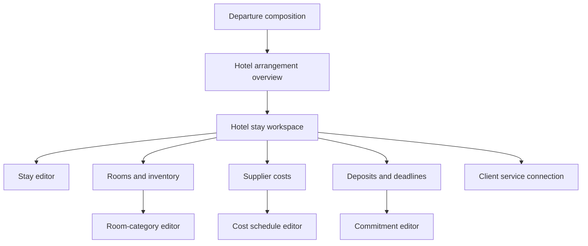

For Hotel, I would design one stable **Hotel workspace per Arrangement Item**, with focused editors opening from it. The workspace should answer four questions immediately:

1. What stay did we contract?
2. What rooms and inventory do we control?
3. What will the Supplier charge, and what must we do by when?
4. How does this become a Client-facing service?

## 1. Screen hierarchy



I would distinguish the screens this way:

| Screen                     | Purpose                                                                    |
| -------------------------- | -------------------------------------------------------------------------- |
| Hotel arrangement overview | Lists all Hotel stays covered by one Supplier Arrangement                  |
| Hotel stay workspace       | Summary and operational home for exactly one stable Hotel Item             |
| Stay editor                | Hotel identity, dates, location, confirmation, and occurrence details      |
| Rooms and inventory        | Room categories, occupancy, inventory treatment, and night coverage        |
| Supplier costs             | Hotel charge matrix or component schedule                                  |
| Deposits and deadlines     | Deposits, option/release dates, rooming list, final payment                |
| Client service connection  | Create/connect/defer the Client Service and select offered room categories |

The exact stable Hotel Item ID must be present in every route. Nothing should find a stay using `.first`, `.last`, or creation order.

---

# 2. Hotel arrangement overview

This screen is needed because a single Hotel Supplier Arrangement may contain more than one stay.

For example:

* pre-cruise stay;
* post-cruise stay;
* staff room block;
* overflow Hotel;
* an additional night range governed by different terms.

## Header

```text
HOTEL SUPPLIER PLANNING

Hilton Fort Lauderdale Marina
Smith Family Reunion · Draft · USD

[Add hotel stay]                         [Advanced arrangement]
```

## Stay list

```text
┌──────────────────────────────────────────────────────────────┐
│ Pre-cruise stay                              Needs attention │
│ November 2–5, 2027 · 3 nights                                │
│ 2 room categories · 18 guaranteed rooms                      │
│ Deposit base needs review                                    │
│                                              [Open stay]      │
└──────────────────────────────────────────────────────────────┘

┌──────────────────────────────────────────────────────────────┐
│ Post-cruise stay                                     Draft   │
│ November 13–14, 2027 · 1 night                               │
│ No room categories configured                                │
│                                              [Open stay]      │
└──────────────────────────────────────────────────────────────┘
```

Each card should summarize:

* Staff-facing stay name;
* arrival and departure dates;
* night count;
* Hotel/location;
* number of room categories;
* inventory classification;
* connection status;
* highest-priority blocker;
* exact action to open that Item.

The overview should not contain the detailed entry forms.

---

# 3. Hotel stay workspace

This is the central page for one Hotel Item. It should be summary-first, with no open form on initial load.

## Header

```text
HOTEL SUPPLIER PLANNING

Pre-cruise stay
Hilton Fort Lauderdale Marina
November 2–5, 2027 · 3 nights · Draft · USD

[Needs attention · 2]                        [Back to Hotel arrangement]
```

If the stay has a Supplier confirmation number, display it here or in the Contract summary:

```text
Supplier confirmation: HFM-29811
```

## Workspace sections

I recommend these sections:

1. Overview
2. Rooms and inventory
3. Supplier costs
4. Deposits and deadlines
5. Client service

These can be sections on one page or tabs that preserve a conventional URL. They should not become a JavaScript-only application whose state is lost on refresh. Each editor should have a durable route or at least a server-rendered edit state tied to the exact record.

---

# 4. Overview summary

The Overview provides a readable contract summary rather than duplicating all editors.

## Readiness panel

```text
Needs attention

2 items require review before activation:

• Signing deposit does not have a confirmed cost base.
  [Review deposit]

• Rooming-list deadline has not been entered.
  [Add rooming-list deadline]
```

The findings should be derived and actionable. Avoid vague messages such as “Hotel shape incomplete.”

## Stay facts

```text
Stay

Hotel             Hilton Fort Lauderdale Marina
Location          Fort Lauderdale, Florida
Check-in          November 2, 2027
Check-out         November 5, 2027
Nights            3
Contract date     September 12, 2026
Confirmation      Not entered
```

Actions:

```text
[Edit stay details]
```

## Rooms summary

```text
Rooms and inventory

Standard room      12 guaranteed · Maximum 2 adults
Double room         6 guaranteed · Maximum 4 adults

18 guaranteed rooms across 2 categories
Coverage: November 2–5
```

Actions:

```text
[Manage rooms and inventory]
```

## Supplier-cost summary

```text
Supplier costs

Standard room       $189 per room/night
Double room         $229 per room/night
Additional adult     $20 per person/night
Additional-adult tax  $3.20 per person/night
```

Actions:

```text
[Manage Supplier costs]  [Preview Hotel cost]
```

## Commitments summary

```text
Deposits and deadlines

Signing deposit     15% of guaranteed room charges · Upon signing
Option date         February 4, 2027
Final payment       February 4, 2027
Rooming list        October 18, 2027
```

Actions:

```text
[Manage deposits and deadlines]
```

## Client-service summary

```text
Client service

Pre-cruise hotel
Connected to this Hotel stay
Choices: Standard room, Double room
Client pricing: Not configured
```

Actions:

```text
[Edit connection]  [Open Client service]
```

---

# 5. Stay details form

The Stay editor should describe the occurrence and Supplier-specific identification. It should not contain room, cost, or deposit fields.

## Fields

### Identity

* Staff stay name

  * Example: `Pre-cruise stay`
* Contracting Hotel Supplier

  * Fixed if inherited from the Arrangement
* Hotel location

  * Select an existing Supplier Location where possible
  * Permit an appropriate location snapshot or Advanced path if necessary
* Supplier confirmation or group number
* Contract date
* Staff notes, if the existing canonical model supports them

### Dates and local time

* Check-in date
* Check-in time, optional
* Check-out date
* Check-out time, optional
* IANA time zone
* Earliest/latest arrival detail only if already supported by the underlying occurrence model

### Provider

* Use Arrangement Supplier
* Or an occurrence-level provider override, if valid under M3 authority

## Derived preview

Before saving:

```text
November 2–5, 2027
3 Hotel nights
Fort Lauderdale · America/New_York
```

## Validation

* Checkout must be after check-in.
* Time zone is required.
* Hotel/location must belong to the Agency-visible Supplier.
* Contract date cannot be mistaken for check-in date.
* Editing an active governing version is prohibited; direct Staff to its successor.

---

# 6. Rooms and inventory screen

This is the most important missing area in PR #156.

Rooms need two related but distinct concepts:

1. **Room category:** what one room is and whom it can hold.
2. **Inventory:** how many rooms, if any, the Supplier has committed to the group.

## Saved category list

```text
Rooms and inventory                         [Add room category]

Standard room
Maximum occupancy     2 adults
Stay nights           November 2–5
Inventory             12 guaranteed rooms
Status                Ready
                                      [Edit] [Remove]

Double room
Maximum occupancy     4 adults
Stay nights           November 2–5
Inventory             6 guaranteed rooms
Status                Ready
                                      [Edit] [Remove]
```

A table is also reasonable when night-by-night quantities matter:

| Room category | Max occupancy | Nov 2 | Nov 3 | Nov 4 | Inventory  |
| ------------- | ------------: | ----: | ----: | ----: | ---------- |
| Standard room |             2 |    12 |    12 |    12 | Guaranteed |
| Double room   |             4 |     6 |     6 |     6 | Guaranteed |

Do not force this matrix if only one quantity across the stay is supported initially. Start with a single quantity across all covered nights and route variable night-by-night blocks to Advanced until properly scoped.

## Add/edit room category form

### Category identity

* Supplier category code, optional

  * Example: `STD`
* Supplier category name

  * Example: `Standard room`
* Staff display name

  * Default from Supplier name, editable
* Maximum adult occupancy
* Maximum total occupancy, if the domain distinguishes it
* Description or bedding note only if there is an authoritative field for it

### Night coverage

* Entire stay
* Selected nights

Initially, I recommend requiring the entire stay for typed entry unless split-night coverage is necessary for the MVP Hotel contract.

### Inventory treatment

This must be an explicit choice:

```text
How is this room category supplied?

( ) Guaranteed or blocked room inventory
    The Supplier has committed a numeric room quantity.

( ) Available on request
    The Supplier confirms rooms individually; there is no controlled quantity.

( ) Externally managed availability
    Availability is managed outside DepartureDesk.

( ) Not yet decided
```

If guaranteed/blocked:

* Quantity
* Quantity meaning: rooms
* Effective/opening point
* Evidence/reference, when required by M3 capacity authority
* Pool time zone inherited from stay
* Optional release rules only through the proper capacity-event workflow

Do not ask Staff to understand “Resource” or “Capacity Pool.” The adapter translates:

* room category → Resource;
* controlled room block → Pool;
* opening quantity → authoritative initial capacity event.

### Saved preview

```text
Standard room
12 guaranteed rooms for November 2–5
Maximum occupancy: 2 adults per room
```

## Removal behavior

A room category cannot be destructively removed if it is used by:

* Supplier cost components;
* deposit bases;
* Client Service choices;
* reservations or downstream operational facts;
* active/governing versions.

The confirmation should name those dependencies and offer the relevant next action.

---

# 7. Supplier-cost screen

Hotel Supplier costs should resemble the Cruise cost matrix where that genuinely helps, but the axes are different.

The primary dimensions are:

* room category;
* charge component;
* calculation basis;
* night coverage;
* possibly occupancy/additional-person conditions.

## Recommended display

```text
Supplier costs                                  [Add charge]

                         Standard room    Double room
Room charge
Per room/night              $189.00          $229.00

Additional adult
Per additional person/night  $20.00           $20.00

Additional-adult tax
Per additional person/night   $3.20            $3.20
```

If the same component applies to multiple categories, it should still produce explicit durable coverage rather than depending on visual table location alone.

## Standard charge templates

Templates should only preconfigure fields. They are not separate durable economics.

* Room charge
* Additional adult
* Tax or mandatory fee
* Porterage
* Resort/destination fee
* Meal
* Complimentary-room credit
* Other Supplier charge

## Add/edit charge form

### Identity

* Charge template
* Staff/Supplier label
* Role:

  * Supplier cost
  * Expected commission
  * Informational allocation
* Stage:

  * Estimate
  * Contracted

### Calculation

Supported initial shapes could include:

* fixed amount;
* per room;
* per room/night;
* per person;
* per person/night;
* occupancy-position amount;
* percentage with explicit ordered bases;
* minimum shortfall.

Fields appear conditionally:

* amount or percentage rate;
* room categories covered;
* stay nights covered;
* occupancy positions or threshold;
* percentage contributors;
* minimum quantity;
* currency.

### Example: room charge

```text
Charge                    Standard room rate
Calculation               Per room/night
Amount                    $189.00
Room categories           Standard room
Nights                    Entire stay
Stage                     Contracted
```

### Example: additional adult

```text
Charge                    Additional adult
Calculation               Per person/night
Amount                    $20.00
Applies after             2 occupants
Room categories           Standard, Double
Nights                    Entire stay
```

The occupancy threshold must map to a supported Supplier-cost shape. It should not be stored as descriptive text that the evaluator cannot apply.

## Cost preview

The screen should provide a write-free preview based on confirmed occupancy profiles and capacity assumptions:

```text
Illustrative Supplier cost

Standard room · 2 adults · 3 nights
Room charge          3 × $189.00       $567.00
Total                                   $567.00

Standard room · 3 adults · 3 nights
Room charge          3 × $189.00       $567.00
Additional adult     3 ×  $20.00        $60.00
Tax                  3 ×   $3.20         $9.60
Total                                   $636.60
```

Label it illustrative and identify missing assumptions.

## Stable identity

Every edit must submit the component’s durable ID. Never identify an existing cost component by its label.

---

# 8. Deposits and deadlines screen

Deposits and deadlines should be presented together operationally but saved independently.

## Saved display

```text
Deposits                                             [Add deposit]

Signing deposit                              Needs review
15% of guaranteed room charges
Due upon signing
Base: Standard room and Double room charges
Coverage: Entire stay
                                    [Review base] [Edit] [Remove]


Supplier deadlines                                [Add deadline]

Option date                                         Ready
February 4, 2027
Action required · Release or confirm unused rooms
Coverage: Guaranteed room inventory
                                              [Edit] [Remove]

Rooming list due                                    Ready
October 18, 2027
Action required · Entire stay
                                              [Edit] [Remove]

Final payment                                       Ready
February 4, 2027
Action required · Entire stay
                                              [Edit] [Remove]
```

## Hotel deposit form

### Identity

* Template:

  * Signing deposit
  * Interim deposit
  * Final deposit
  * Other
* Name
* Description

### Amount

Supported shapes:

* fixed amount;
* amount per guaranteed room;
* percentage of explicitly selected Supplier cost components;
* cumulative target only if the underlying evaluator already supports the required semantics.

For percentage:

* percentage rate;
* selected contributing Supplier components;
* visible inclusion order if required;
* coverage;
* calculation preview.

Example:

```text
Deposit rate             15%

Included Supplier costs
[x] Standard room charge
[x] Double room charge
[ ] Additional-adult charge
[ ] Additional-adult tax
[ ] Porterage
```

Preview:

```text
Deposit base at activation
Guaranteed room charges: $10,206.00
15% deposit:              $1,530.90

This amount will change if the guaranteed quantities or included
contracted room rates change before activation.
```

No command should silently select all Hotel costs.

### Timing

* fixed date;
* date/time;
* relative to contract signing, if supported;
* earlier-of only where required and supported;
* Advanced fallback for unsupported rules.

## Hotel deadline form

Templates:

* Option/release date
* Rooming list due
* Final payment due
* Final counts due
* Cancellation date
* Other

Fields:

* name;
* actionable or informational;
* timing rule;
* fixed date/time or supported relative timing;
* coverage;
* warning lead;
* description;
* operational effect.

“Final payment due” can use the canonical `other` deadline type if the closed generic catalog lacks a specific type, while retaining the typed Hotel template.

---

# 9. Client-service connection screen

The connection screen must offer the same deliberate modes established in Cruise.

## Initial decision screen

```text
How should this Hotel stay appear to Clients?

( ) Create a new Client service
( ) Connect an existing undecided service outline
( ) Decide later
```

### Create new

Fields:

* Client title

  * Example: `Pre-cruise hotel`
* Internal Staff name, if different
* Arrangement version:

  * governing activated version by default;
  * tentative successor only through an explicit choice
* Room categories to expose:

  * Standard room
  * Double room
* Default/included behavior, if already governed by the Service Offer model

### Connect existing

Eligible offers only:

* editable;
* undecided;
* unbound;
* no choice graph;
* correct Departure and Agency;
* not claimed by another Item.

### Decide later

Creates only the deliberately accepted outline/claim state. The summary must clearly say what remains undecided.

## Saved connection summary

```text
Client service

Pre-cruise hotel
Connected to Hilton Fort Lauderdale Marina · Pre-cruise stay
Pinned to Arrangement version 2

Client choices
• Standard room
• Double room

Category pricing
Not configured

[Edit connection] [Open Client service]
```

Room choices need durable Client rate-category keys minted once and copied unchanged to successor versions if later pricing will target them.

---

# 10. Editor behavior

The previous Cruise work taught us that saved information and open forms must be visually unmistakable.

I recommend:

* summary by default;
* only one editor open at a time;
* editor has its own clear heading and bounded surface;
* saved cards disappear or become background context while editing that exact definition;
* primary action says what it saves;
* Cancel returns to the unchanged summary;
* successful save redirects with `303` to the summary;
* failed save renders `422`, retains fields, and focuses the error summary;
* browser refresh preserves a valid editor URL;
* no editor form silently opens on the default workspace visit.

Example:

```text
Edit room category
Standard room

[form fields]

[Save room category]  [Cancel]
```

Not merely:

```text
Standard room
...
Edit
...
Template
Name
Quantity
Save
```

---

# 11. Draft, governing, and successor behavior

## Draft

* All compatible definitions editable.
* Independent save per definition.
* Removal allowed when dependencies permit it.
* Readiness identifies missing facts.

## Governing active version

* Entire workspace remains readable.
* Definitions are read-only.
* Actions explain that active terms cannot be changed.
* Staff can open or create the successor according to shipped lifecycle rules.

## Successor draft

* Show a persistent banner:

```text
Editing proposed Hotel terms
These changes do not affect the governing version until activated.

[Compare with governing version]
```

* Copied stable identities remain intact.
* New room categories are clearly marked.
* Removed categories show their operational consequence.
* The connection remains pinned to its existing version unless Staff deliberately repin it through the authorized workflow.

---

# 12. Advanced fallback

Advanced should operate at the narrowest safe level.

Examples:

* One unsupported percentage cost should not make the entire Hotel stay unavailable.
* An unsupported deposit rule should open that deposit in Advanced planning.
* An unrecognized room-capacity topology may make the Rooms section read-only while costs and deadlines remain usable if they are independently safe.
* An incompatible Client choice graph should make only the connection section Advanced.

Each fallback should say why:

```text
This room category uses different quantities by night.
Typed Hotel editing currently supports one quantity across the stay.

[Open room inventory in Advanced planning]
```

Avoid generic messages like “Unsupported graph.”

---

# 13. Canonical Hilton proof

The Hotel vertical should not ship until a browser scenario can complete this setup:

| Area                 | Canonical fact                                       |
| -------------------- | ---------------------------------------------------- |
| Supplier             | Hilton Fort Lauderdale Marina                        |
| Stay                 | November 2–5, 2027                                   |
| Contract date        | September 12, 2026                                   |
| Option date          | February 4, 2027                                     |
| Rooming list         | October 18, 2027                                     |
| Additional adult     | $20 per night                                        |
| Additional-adult tax | $3.20 per night                                      |
| Deposit              | 15% of guaranteed room charges                       |
| Final payment        | Option date                                          |
| Client service       | Pre-cruise Hotel with selected room-category choices |

The proof should also include:

* at least two Hotel Items in one Arrangement or Departure;
* selecting the second Item opens the second Item;
* editing a cost preserves its component ID;
* renaming a cost does not duplicate it;
* deposit preview uses only selected bases;
* changing guaranteed quantity updates the preview without writing;
* an unsupported sibling definition remains unchanged;
* successor copy preserves room and Client-category identities;
* a Viewer cannot access management screens;
* active definitions are read-only.

## Recommended first implementation boundary

I would make **Hotel 3A** include:

* Hotel arrangement overview;
* exact Hotel stay workspace;
* stay editor;
* room categories and one-quantity-across-stay inventory;
* fixed, per-room/night, and per-person/night Supplier costs;
* explicit-base percentage deposit;
* fixed Hotel deadlines;
* create/connect/later Client-service connection;
* room-category choices with stable keys;
* summary/readiness/Advanced fallback.

I would defer:

* different room quantities for each night;
* complex occupancy bands beyond the confirmed supported profiles;
* concessions and attrition;
* complimentary room ratios;
* complicated cancellation schedules;
* meeting-space inventory;
* live availability;
* Client Hotel pricing, unless assigned to this slice explicitly.

That boundary would produce a genuinely usable Hilton workflow without pretending to cover every Hotel contract.
