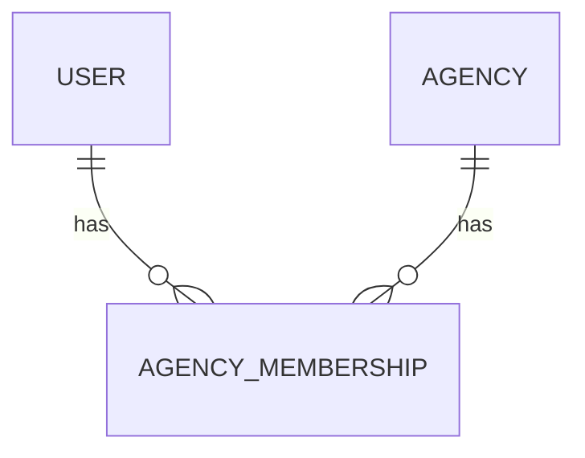

# Foundation 1 — Agency Membership and Tenant Context

## Status

Draft implementation plan for the first post-bootstrap feature slice.

## Purpose

Establish the tenant boundary that every later DepartureDesk domain record and workflow will depend on. After this slice, an authenticated request has one trusted current agency derived from the authenticated user's active membership. Application code must not select an agency from an untrusted request parameter.

This slice establishes membership, request context, and fail-closed authentication behavior. It does not introduce the first substantial travel or financial domain aggregate.

## Authority and existing constraints

- `Agency` is the tenant and owner of operational records.
- Rails' generated authentication remains the authentication foundation.
- Development remains Docker-only.
- Application-owned tables use UUID primary keys with PostgreSQL `uuidv7()` defaults.
- Domain timestamps use PostgreSQL `timestamptz`; Rails operates in UTC.
- Database constraints supplement model validations.
- Do not use `default_scope` for tenancy.
- Cross-agency resource access must eventually respond as not found rather than reveal that a record exists.
- Authenticated staff have full access within their agency for MVP, except administrative capabilities that later require an administrator role.
- Multi-agency switching is out of scope for MVP.

## Decision summary

### Use a membership join model

Model the user-to-agency relationship through `AgencyMembership`, not `users.agency_id`:



This preserves membership history and leaves room for later multi-agency access without redesigning user identity.

### One active membership during MVP

The schema may retain suspended or inactive historical memberships, but a user may have at most one active membership during MVP. This provides an unambiguous `Current.agency` without adding an agency chooser or storing agency selection in the session.

Authentication fails closed when the user has no active membership. A database partial unique index prevents more than one active membership per user. Supporting concurrent active memberships later requires an explicit migration plus a session-bound agency choice and switching workflow.

### Request context is derived, never submitted

`Current.session` remains the authentication root. `Current.user`, `Current.agency_membership`, and `Current.agency` are derived from it. Controllers must not establish tenant context from `params[:agency_id]`, headers, cookies other than the signed session identifier, or form input.

### Explicit scoping

Future tenant-owned records must declare `belongs_to :agency` and be loaded through the current agency, for example:

```ruby
Current.agency.departures.find(params[:id])
```

Do not use `Departure.find(params[:id])` followed by an authorization check. Scoped lookup naturally produces `ActiveRecord::RecordNotFound` for a record owned by another agency and avoids existence disclosure.

Do not add a global tenant `default_scope`. Explicit associations and scopes remain visible in controllers, services, jobs, reports, exports, and maintenance work.

## Data model

### `agency_memberships`

Create an application-owned table with:

| Column | Type | Contract |
| --- | --- | --- |
| `id` | UUID | Primary key; database default `uuidv7()` |
| `user_id` | UUID | Required foreign key to `users` |
| `agency_id` | UUID | Required foreign key to `agencies` |
| `role` | string | Required; `staff` or `administrator` |
| `status` | string | Required; `active` or `suspended` |
| `lock_version` | integer | Required optimistic-lock counter, default `0` |
| timestamps | timestamptz | Required |

Use named constraints and indexes:

- unique index on `[user_id, agency_id]`;
- partial unique index on `user_id` where `status = 'active'`;
- check constraint for allowed roles;
- check constraint for allowed statuses;
- check constraint that `lock_version >= 0`;
- indexes supporting agency membership lists and active-membership lookup.

Do not use a boolean `admin` flag. A constrained role is clearer and extends without mixing role with membership status.

### Associations

```ruby
class Agency < ApplicationRecord
  has_many :agency_memberships, dependent: :restrict_with_exception
  has_many :users, through: :agency_memberships
end

class User < ApplicationRecord
  has_many :agency_memberships, dependent: :restrict_with_exception
  has_many :agencies, through: :agency_memberships

  has_one :active_agency_membership,
    -> { where(status: "active") },
    class_name: "AgencyMembership"

  has_one :agency, through: :active_agency_membership
end
```

`dependent: :restrict_with_exception` is intentional. Memberships are authorization history and should not be silently deleted with an agency or user. Lifecycle management should suspend records rather than destroy them once the system has meaningful history.

`AgencyMembership` validates presence, inclusion, and uniqueness for developer ergonomics while the database remains authoritative.

## Request-context contract

Extend `Current`:

```ruby
class Current < ActiveSupport::CurrentAttributes
  attribute :session

  delegate :user, to: :session, allow_nil: true
  delegate :active_agency_membership, :agency,
    to: :user,
    allow_nil: true

  alias_method :agency_membership, :active_agency_membership
end
```

The final implementation may use explicit methods instead of delegation if that produces clearer nil handling. The observable contract is:

- no session → no user, membership, or agency;
- valid session plus one active membership → user, membership, and agency available;
- suspended membership → no current agency;
- suspended or closed agency → no usable current agency;
- ambiguous tenant context must fail closed.

Treat only an `active` agency as operationally accessible. Decide separately later whether a `suspended` agency receives a dedicated lockout page; this slice may use the same generic access-denied response as a missing membership.

## Authentication behavior

### Login

After credentials authenticate and before creating a session:

1. Load the user's active membership and agency.
2. Require exactly one active membership.
3. Require the agency itself to be active.
4. Create the session only after those checks pass.
5. Return the existing generic login failure message when access is unavailable.

Do not reveal whether the credentials were valid, whether membership was missing, or whether the agency was suspended.

### Existing sessions

Every authenticated request must confirm that the session's user still has one usable active membership. If the membership or agency becomes unavailable:

1. destroy the current session;
2. clear the session cookie;
3. redirect to sign-in with a generic message;
4. do not allow the request to continue.

This makes membership suspension effective without waiting for existing permanent cookies to expire.

### Password reset

Keep the existing non-enumerating password-reset behavior. Resetting a password does not reactivate a membership or agency.

## Authorization boundary

This slice introduces only the minimum role contract:

- `staff`: ordinary authenticated access within the current agency;
- `administrator`: ordinary access plus future agency administration, user membership management, and protected catalog/configuration operations.

Do not add a granular permission system, policy gem, field-level permissions, or record-by-record grants in this slice.

Provide a small controller predicate such as `Current.agency_membership.administrator?` only if a current surface needs it. Otherwise, establish the enum and defer admin-only controllers until the first administration feature.

## Tenant-owned record pattern

Every future operational table must normally include:

```ruby
table.references :agency,
  null: false,
  type: :uuid,
  foreign_key: true
```

Model:

```ruby
belongs_to :agency
```

Controller lookup:

```ruby
Current.agency.suppliers.find(params[:id])
```

Creation:

```ruby
Current.agency.suppliers.build(permitted_attributes)
```

Rules:

- do not permit `agency_id` in ordinary strong parameters;
- scope indexes representing business uniqueness by `agency_id` unless the value is deliberately global;
- scope reports, counts, search, autocomplete, exports, and dashboards—not only CRUD controllers;
- never infer tenant ownership indirectly through a client-supplied parent without reloading that parent through `Current.agency`;
- use unscoped/global lookup only in deliberately privileged maintenance code with explicit tests and documentation.

Because no substantive tenant-owned domain resource exists yet, this slice documents and tests the pattern at the membership/authentication boundary. The first later agency-owned resource must add cross-agency 404 tests before that resource is considered complete.

## Background-job contract

Future background jobs must accept an explicit `agency_id` or an agency-owned record identifier. At execution time they must reload the agency, verify it is still usable, and scope all reads and writes through it.

Do not serialize `Current` or assume request-local state carries into a job. Wrap job execution context with `Current.set(agency: agency)` only for the duration of the job, and reset it automatically afterward.

No new background job is required solely to complete this slice.

## Seed-data changes

Update development seeds idempotently:

1. create or find a named development agency;
2. create or find the seed user;
3. create or find an active administrator membership joining them;
4. print the agency and user identifiers without printing secrets beyond the already-public development password;
5. ensure repeated `db:seed` runs do not create duplicate memberships.

The seed must remain development-only.

## User-interface changes

Keep this slice deliberately small:

- show the current agency name in the authenticated application chrome or dashboard;
- do not add an agency switcher;
- do not add membership administration screens;
- provide a generic sign-in failure when a user lacks usable agency access;
- avoid exposing internal membership status on the public sign-in surface.

Showing the agency name gives operators and tests visible evidence of tenant context before larger workflows exist.

## Test plan

### Model and database tests

Test:

- valid staff and administrator memberships;
- invalid role rejected by model and database;
- invalid status rejected by model and database;
- duplicate user/agency membership rejected;
- a second active membership for one user rejected by the database;
- suspended historical membership can coexist with one active membership;
- UUID and foreign-key contracts;
- optimistic locking on membership updates;
- user and agency associations;
- agency deletion and user deletion do not silently erase memberships.

### Current-context tests

Test:

- session derives user, membership, and agency;
- no session yields no tenant context;
- suspended membership yields no usable tenant context;
- suspended or closed agency yields no usable tenant context;
- request-local context resets between requests/tests.

### Authentication/controller tests

Test:

- valid credentials plus active membership and active agency sign in;
- valid credentials with no active membership fail generically;
- valid credentials with suspended membership fail generically;
- valid credentials with suspended or closed agency fail generically;
- an existing session is terminated after membership suspension;
- an existing session is terminated after agency suspension/closure;
- unsuccessful access does not reveal whether credentials or membership failed;
- normal successful-login return-to behavior remains intact;
- `/up` and the existing unauthenticated session/password routes remain reachable under their existing rules.

### View/system tests

Test that a signed-in user sees the current agency name and that an unauthenticated visitor cannot reach the dashboard.

### Later resource test template

For every agency-owned controller introduced later, require:

- same-agency index contains only current-agency rows;
- same-agency show/edit/update succeeds;
- another agency's UUID returns 404 for show/edit/update/destroy;
- forged `agency_id` cannot move or create a record in another agency;
- search, export, counts, and nested-resource lookup remain scoped.

## Migration and implementation order

1. Add ADR 0002 documenting agency tenancy, memberships, explicit scoping, single-active-membership MVP, 404 behavior, and no `default_scope`.
2. Add the `agency_memberships` migration with UUIDs, foreign keys, constraints, and indexes.
3. Run migrations for development and test; commit the updated `db/structure.sql`.
4. Add `AgencyMembership` plus `Agency` and `User` associations.
5. Add focused model and database-constraint tests.
6. Extend `Current` with membership and agency context.
7. Update authentication to require a usable tenant before session creation and on every authenticated request.
8. Update test sign-in helpers so every signed-in fixture user has an active agency membership.
9. Update fixtures and development seeds idempotently.
10. Expose the current agency name on the authenticated surface.
11. Add authentication, context, and system coverage.
12. Run lint, security checks, unit/integration tests, and system tests locally.
13. Open a feature PR and require all CI checks to pass before merge.

## Suggested branch and PR

- Branch: `foundation-1-agency-tenancy`
- PR title: `Establish agency membership and tenant context`

Keep this as one reviewable PR. The migration, authentication behavior, context, seed update, and tests form one atomic security boundary and should not be merged partially.

## Manual acceptance checks

1. Rebuild or migrate the development database without dropping existing data.
2. Run seeds twice and confirm only one development agency, user, and membership exist.
3. Sign in with the development account and confirm the agency name appears.
4. Suspend its membership in the console and confirm the existing browser session loses access.
5. Reactivate the membership and confirm sign-in succeeds.
6. Suspend the agency and confirm sign-in fails generically.
7. Restore the agency and confirm sign-in succeeds.
8. Confirm password-reset responses still do not enumerate user accounts.
9. Confirm `/up` remains publicly reachable.

## Exit criteria

The slice is complete when:

- every authenticated request has a trusted, active current agency or is denied;
- tenant context is derived from authentication rather than request input;
- membership and agency suspension invalidate access promptly;
- the database prevents ambiguous active membership during MVP;
- the current agency is visible on the authenticated surface;
- development seeds create a valid membership idempotently;
- the explicit-scoping contract is documented for future resources and jobs;
- focused tests cover model constraints, request context, sign-in, and session invalidation;
- `db/structure.sql` is current;
- all CI jobs pass.

## Explicit non-goals

- agency switching;
- simultaneous active access to multiple agencies;
- invitation and onboarding workflows;
- membership administration UI;
- granular RBAC or a policy framework;
- impersonation or support access;
- SSO, OAuth, or MFA;
- tenant-specific custom domains;
- production deployment configuration;
- the first travel, client, supplier, reservation, or financial aggregate.

## Follow-on

The next feature slice should introduce the first genuinely agency-owned operational resource and use it to prove the complete tenant pattern, including scoped CRUD, cross-agency 404 behavior, forged-parameter protection, search/report scoping, and background-job context if applicable.
