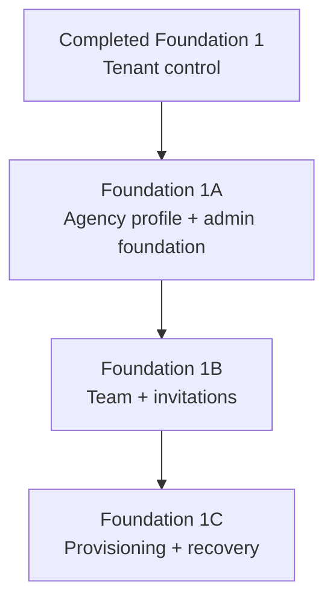

# DepartureDesk Foundation 1A–1C Plan

## Status

Proposed follow-on planning packet after completion of `foundation-1-agency-membership-tenant-control`.

## Purpose

Foundation 1 established the security boundary: `Agency` is the tenant, `AgencyMembership` controls access, `Current.session` is the authentication root, and `User#usable_agency_membership` is the sole tenant resolver.

Foundation 1A–1C make that boundary operational without beginning the travel or financial domain:

1. **Foundation 1A — Agency profile and administration foundation**
2. **Foundation 1B — Team administration and invitation onboarding**
3. **Foundation 1C — Agency provisioning, lifecycle, and administrator recovery**

These are follow-on slices. They must not reimplement or loosen the completed Foundation 1 tenant contract.

## Authority

- `AGENTS.md`
- `docs/adr/0002-agency-tenancy-and-membership.md`
- Completed Foundation 1 branch: `foundation-1-agency-membership-tenant-control`
- `docs/planning/production-readiness.md`

If this packet conflicts with ADR 0002, ADR 0002 controls unless it is explicitly superseded.

## Existing contract to preserve

- A user may have at most one active agency membership during MVP.
- Only an active membership in an active agency is usable.
- `User#usable_agency_membership` remains the sole resolver for login, request context, session resumption, and Action Cable.
- Tenant context is never accepted from request parameters, headers, or a separate agency cookie.
- No agency switcher or concurrent active memberships are introduced.
- Tenant-owned records are explicitly scoped through `Current.agency`; no tenant `default_scope`.
- Memberships preserve authorization history and are suspended rather than deleted.
- Agency lifecycle remains `active`, `suspended`, or `closed`.
- Staff and administrator remain the only membership roles; granular RBAC is deferred.
- Cross-agency identifiers return 404 rather than disclose another tenant's records.
- Password-reset behavior remains non-enumerating.

## Program-wide decisions

### Agency administration is singular, not tenant CRUD

Tenant administrators may view and edit their current agency profile. They may not create agencies, change tenant ownership, alter lifecycle status, or delete an agency.

```ruby
namespace :administration do
  resource :agency, only: %i[show edit update]
end
```

Agency creation, lifecycle changes, and recovery are privileged operational actions delivered in Foundation 1C, not ordinary tenant-facing CRUD.

### Team administration manages memberships, not arbitrary users

The tenant-facing surface centers `AgencyMembership`. It may expose the associated user's name/email as needed, but it must not provide unscoped `User` CRUD.

### Administrative changes are auditable

Foundation 1A introduces the narrow audit mechanism used by all three slices. Audit records are immutable application facts, not mutable activity-feed entries. They must not contain passwords, invitation tokens, password-reset tokens, session identifiers, or other secrets.

This administrative audit trail does not replace later financial posting, reversal, or accounting records.

### Invitations are distinct from password resets

An invitation establishes agency access and initial credentials. A password reset changes credentials for an existing user. They may share lower-level signed-token patterns or form components, but they remain separate workflows, messages, expiration policies, and audit actions.

### No password assignment by administrators

Administrators invite staff by email. Invitees choose their own password through an expiring, single-purpose link. No temporary or administrator-visible password is supported.

## Delivery sequence



Each slice should be independently reviewable and green before the next begins. The recommended branches are:

- `foundation-1a-agency-profile-administration`
- `foundation-1b-team-invitations`
- `foundation-1c-provisioning-and-recovery`

---

# Foundation 1A — Agency Profile and Administration Foundation

## Goal

Allow an agency administrator to maintain the stable identity and broad defaults of the current agency, while establishing the authorization and audit primitives required by later administration surfaces.

## Scope

### Agency profile data

Add:

| Field | Contract |
| --- | --- |
| `legal_name` | Optional formal/legal name; blank normalizes to `nil` |
| `country_code` | Required uppercase two-letter ISO-style country code; default `US` for the current MVP |

Retain:

- `name` as the short display name;
- `default_timezone` as a recognized IANA timezone;
- `default_currency` as a three-letter uppercase currency code and data-entry default only;
- `status` as platform-controlled lifecycle state;
- `lock_version` for optimistic concurrency.

Add `Agency#formal_name`, returning `legal_name.presence || name`.

Use a forward migration with named database checks:

- `legal_name` is null or nonblank after trimming;
- `country_code` matches `^[A-Z]{2}$`;
- preserve all existing agency constraints.

Do not add an agency code, numbering counters, contact columns, accreditation identifiers, logo fields, financial-policy columns, or generic `settings` JSON. Those belong to typed, agency-owned models when their workflows are designed.

### Administrator authorization

Add a reusable controller concern or private guard based only on:

```ruby
Current.agency_membership&.administrator?
```

Recommended behavior:

- unauthenticated or unusable membership: existing authentication flow;
- authenticated staff requesting the generic Administration entry point: clear not-authorized response or redirect;
- resource lookup outside the tenant: 404;
- never trust submitted role, membership, or agency identifiers to establish authorization.

Do not add a policy gem or granular permissions.

### Administrative audit events

Introduce an append-only `AuditEvent` (or equivalently named) application record with a deliberately narrow contract:

| Field | Contract |
| --- | --- |
| `id` | UUIDv7 primary key |
| `agency_id` | Required tenant owner |
| `actor_user_id` | Nullable only for an explicitly identified system/platform action |
| `action` | Required constrained application-defined action string |
| `subject_type` / `subject_id` | Identifies the affected record without transferring ownership |
| `details` | JSONB allowlisted metadata; default `{}` |
| `created_at` | Required `timestamptz`; no mutable lifecycle fields |

The exact actor representation must support Foundation 1C system-operated provisioning without inventing a fake user. Add a database check distinguishing a user actor from a system actor if an `actor_type` field is used.

Audit creation belongs inside the same database transaction as the administrative mutation. Provide one small writer/service so controllers do not build arbitrary audit payloads.

Initial action vocabulary:

- `agency.profile_updated`

Details may include an allowlisted set of changed field names and safe before/after values. Do not use a wholesale model serialization.

### Tenant-facing agency profile

Add an Administration entry point and singular agency profile pages:

- show;
- edit;
- update.

Editable fields:

- display name;
- legal name;
- country code;
- default timezone;
- default currency.

Read-only or hidden from form submission:

- UUID;
- lifecycle status;

The controller must load the agency from `Current.agency`, not `Agency.find(params[:id])`. Do not permit `id`, `agency_id`, `status`, or `lock_version` as ordinary editable attributes; use the lock version only through the intended optimistic-locking form contract.

On a stale update, preserve the submitted form values and show a conflict message rather than silently overwriting another administrator's changes.

Changing timezone or default currency affects future defaults and presentation only. It must never rewrite an existing operational or financial fact.

## Tests

### Model/database

- `legal_name` may be nil but not whitespace;
- `formal_name` falls back correctly;
- country code normalization and format validation;
- database checks reject invalid values;
- optimistic locking remains effective.

### Authorization/controller

- administrator can show, edit, and update the current agency;
- staff cannot enter or mutate the administration surface;
- forged `agency_id` and lifecycle/status values are ignored or rejected;
- there is no route for agency create, destroy, or tenant-facing status change;
- stale update is handled without lost data;
- successful update creates exactly one audit event in the same agency;
- failed validation and stale update create no success audit event.

### System/manual

- administrator edits all allowed fields;
- staff navigation does not imply access to administrator actions;
- validation and stale-write feedback are understandable;
- refreshed application chrome reflects a changed display name.

## Non-goals

- team list or membership changes;
- invitation emails;
- agency logo, addresses, contacts, branding, or document defaults;
- office/branch modeling;
- ARC, IATA, or BSP accreditation;
- agency creation, suspension, closure, or deletion;
- production deployment configuration.

## Exit criteria

- Current-agency administrators can safely maintain the agency profile.
- Staff cannot use the administrative endpoint.
- Agency identity changes are recorded in an immutable audit event.
- No route or submitted parameter can change the tenant or agency lifecycle.
- Full CI and focused browser coverage pass.

---

# Foundation 1B — Team Administration and Invitation Onboarding

## Goal

Give an agency administrator a safe, self-service way to invite staff, see membership state, change roles, suspend access, and restore access without exposing cross-agency user data or weakening the one-active-membership MVP rule.

## Scope

### Membership lifecycle

Expand `AgencyMembership::STATUSES` and its database constraint to:

```text
invited → active ↔ suspended
    └────────→ revoked
```

Recommended meanings:

- `invited`: invitation issued but not accepted; never usable for authentication;
- `active`: usable only while the agency is active;
- `suspended`: access disabled while preserving membership history;
- `revoked`: invitation cancelled before acceptance; terminal for that invitation attempt.

If retaining the existing unique `[user_id, agency_id]` constraint, a new invitation for a previously suspended membership must reactivate that membership or issue a replacement invitation against it; it cannot create a duplicate membership row. The UI and service names should reflect whether the operation is an invitation replacement or a reactivation.

The partial unique index on `user_id WHERE status = 'active'` remains authoritative. Invited memberships do not establish `Current.agency` and do not permit login.

Before implementation, add a short ADR amendment documenting the new states and allowed transitions. Do not encode transition rules only in controller conditionals.

### User profile minimum

Add only the identity fields the team and invitation surfaces actually require. At minimum, decide whether the existing email-only `User` display is acceptable. If names are added, keep the MVP direct (`first_name`, `last_name`, optional preferred/display name) rather than introducing a generic Party/Profile architecture.

Email remains normalized and globally unique. Administrators must not be told whether an entered address belongs to a user in another agency.

### Team surface

Recommended routes center current-agency memberships:

```ruby
namespace :administration do
  resources :team_members, only: %i[index show]
  resources :invitations, only: %i[new create]
end
```

Use explicit member actions or small command endpoints for:

- change role;
- suspend;
- reactivate;
- resend/replace invitation;
- revoke pending invitation.

The index should show:

- member name/email;
- role;
- access state;
- invitation sent/accepted state where applicable;
- available actions based on current state.

All records are loaded through `Current.agency.agency_memberships`. Never expose a global user index or search endpoint.

### Invitation workflow

Implement invitation issuance as a transactional command/service:

1. normalize the submitted email;
2. resolve what can safely be done without exposing another tenant's user;
3. create or reuse the appropriate user and current-agency membership;
4. assign the requested role and `invited` state;
5. create an `team.invitation_created` audit event;
6. enqueue the invitation email only after commit.

Because `users.password_digest` is currently non-null, an invited new user may receive an unguessable generated digest until acceptance. The generated value must never be logged or shown. Acceptance replaces it with the invitee's chosen password.

Use a signed, purpose-specific, expiring token tied to the invited membership and invalidate older invitation links when an invitation is replaced, revoked, accepted, or its relevant membership state changes. Persist only what is needed for revocation/versioning; never store a plaintext token.

Invitation acceptance must atomically:

1. validate token purpose, expiration, current membership state, and active agency;
2. set and confirm the user's password;
3. verify activating the membership does not violate the one-active-membership rule;
4. transition the membership to `active`;
5. record `team.invitation_accepted`;
6. invalidate the token;
7. start a session or redirect to sign-in according to one documented choice.

Errors must be generic for invalid, expired, revoked, cross-agency-conflicting, or already-used invitations.

Do not activate a membership through the existing password-reset controller.

### Role and access changes

Use explicit transactional commands for role change, suspension, and reactivation. Commands must lock the affected membership and the current agency's relevant administrator memberships before enforcing last-administrator rules.

Required protections:

- an agency must retain at least one active administrator;
- the last active administrator cannot demote or suspend themselves;
- the same rule applies when acting on another administrator;
- a staff membership cannot administer team records even by direct request;
- reactivation must fail safely if the user already has another active membership;
- membership suspension takes effect on the target user's next request through the existing Foundation 1 session revalidation;
- optionally destroy all target-user sessions immediately after commit for faster revocation, but do so consistently and test it.

Do not delete users, memberships, sessions belonging to unrelated users, or membership history.

### Audit actions

Add allowlisted actions:

- `team.invitation_created`
- `team.invitation_replaced`
- `team.invitation_revoked`
- `team.invitation_accepted`
- `team.role_changed`
- `team.membership_suspended`
- `team.membership_reactivated`

Audit details may include the affected membership, safe role/status changes, and actor. Never include token values or passwords.

### Email behavior

Add a dedicated invitation mailer with neutral, non-enumerating failure behavior and both HTML/text templates. Development may continue using Letter Opener Web; tests use the test adapter.

Transactional production email remains a Foundation 1C deployment prerequisite. Foundation 1B is complete when the workflow and delivery adapter contract are tested, even if the production provider has not yet been selected.

## Tests

### Model/database

- new status constraint and enum values;
- invited/suspended/revoked memberships never resolve as usable;
- one-active-membership partial unique index remains enforced;
- allowed and forbidden state transitions;
- invitation token expires and is invalidated by replacement, revocation, or acceptance;
- optimistic-lock conflicts do not silently overwrite membership changes.

### Commands/integration

- administrator invites a new email;
- repeated submission is idempotent or gives a safe actionable result;
- replacement invitation invalidates the earlier link;
- acceptance sets credentials and activates membership atomically;
- invalid/expired/revoked token is rejected generically;
- existing suspended member can be reactivated without a duplicate row;
- a user active in another agency is not attached or disclosed;
- role change, suspend, reactivate, and revoke are tenant scoped;
- last active administrator protection survives concurrent requests;
- suspension invalidates access under the Foundation 1 contract;
- each successful mutation produces one audit event; failed operations do not produce a success event;
- invitation email is enqueued only after a successful commit.

### Cross-agency

- index contains only current-agency memberships;
- another agency's membership UUID returns 404 for show and every mutation;
- forged user or agency identifiers cannot attach or move records;
- response wording does not reveal whether an email exists elsewhere.

### System/manual

- administrator completes invite → email link → password setup → sign-in;
- administrator changes a role and suspends/reactivates a member;
- pending, expired, revoked, active, and suspended states are understandable;
- keyboard and validation behavior are usable;
- staff cannot discover admin actions through navigation or direct URLs.

## Non-goals

- concurrent active memberships or agency switching;
- granular permissions;
- user deletion or membership-history deletion;
- administrator-set passwords;
- bulk CSV invitations;
- SSO, SCIM, MFA, or external identity providers;
- advisor workload, commission, or booking assignment rules;
- platform support UI.

## Exit criteria

- An administrator can onboard and manage the current agency's team without seed or console access.
- Invitations are purpose-specific, expiring, revocable, and single-use.
- Last-administrator and cross-agency protections hold under tested concurrent and forged requests.
- Every successful administrative mutation is auditable without storing secrets.
- Full CI and the end-to-end invitation system test pass.

---

# Foundation 1C — Agency Provisioning, Lifecycle, and Administrator Recovery

## Goal

Provide repeatable privileged operations to create an agency and its first administrator, control agency lifecycle, and recover an agency that has lost usable administrative access—without exposing platform-wide tenancy controls inside ordinary agency administration.

## Scope

### Privileged command boundary

Implement explicit service objects as the source of truth, with thin Rails tasks or deployment commands as their initial interface:

- `ProvisionAgency`
- `ChangeAgencyStatus`
- `RecoverAgencyAdministrator`

Do not build a platform administration web UI in this slice. A future UI must call the same services and add separate platform authorization.

Commands must:

- accept explicit validated input;
- run atomically where possible;
- lock records involved in lifecycle or recovery decisions;
- be safely retryable or fail with an unambiguous no-change result;
- avoid placing passwords or tokens in command-line arguments, logs, shell history, or output;
- write system-attributed audit events;
- print identifiers and next actions, not secrets.

### Initial agency provisioning

Provisioning creates, in one transaction:

1. the agency profile with active status;
2. the first user or a safe reusable user identity;
3. an administrator membership in `invited` state;
4. the provisioning and invitation audit events.

After commit, enqueue the Foundation 1B invitation email. Do not create a known default password.

Required inputs:

- display name;
- optional legal name;
- country code;
- default timezone;
- default currency;
- initial administrator email and any required direct user-name fields.

Provisioning must not silently attach a user with an active membership elsewhere. It should return a generic operator-facing conflict and require an explicit recovery/support path.

Define an idempotency strategy before implementation. A recommended minimum is a caller-supplied provisioning key persisted on a dedicated request/operation record or an equally durable unique key; name matching alone is not safe idempotency.

### Agency lifecycle

Support privileged transitions:

```text
active → suspended → active
active → closed
suspended → closed
```

`closed` is terminal during MVP unless an explicit later ADR defines reopening.

Semantics:

- `suspended`: temporarily denies all tenant access while preserving data and memberships;
- `active`: permits access subject to usable membership;
- `closed`: denies access and records a terminal operational closure; it does not delete tenant data.

Status changes must lock the agency, require an operator reason, and create an audit event in the same transaction. Suspension or closure should destroy the agency users' current sessions after commit where practical; Foundation 1's per-request resolver remains the fail-closed backstop.

Never implement hard agency deletion as an ordinary lifecycle operation.

### Administrator recovery

Recovery applies when an agency is active but has no usable administrator because invitations expired, administrators were suspended, or credentials/contact access were lost.

The recovery service must offer deliberate operations rather than an unrestricted bypass:

- replace/resend an invitation for an invited administrator;
- reactivate a suspended administrator when policy permits;
- invite a replacement administrator;
- invalidate the recovered/replaced user's existing sessions where relevant.

Every recovery requires:

- explicit agency identifier;
- explicit operator reason;
- confirmed target email/membership;
- last-known state validation under lock;
- system-attributed audit event;
- no printed password or token.

Recovery must not bypass the one-active-membership rule or reactivate a suspended/closed agency implicitly. Agency lifecycle restoration is a separate explicit action.

### Audit actions

Add:

- `agency.provisioned`
- `agency.suspended`
- `agency.reactivated`
- `agency.closed`
- `team.administrator_recovery_started`
- the appropriate Foundation 1B invitation/reactivation completion action.

Store the operator-supplied reason and safe operation identifiers. Do not store credentials, tokens, or environment secrets.

### Runbook and production readiness

Document:

- exact Docker/deployment-safe commands;
- required inputs and validation;
- idempotent rerun behavior;
- how to inspect the resulting agency, membership, and audit identifiers;
- how to suspend/reactivate/close an agency;
- how to recover administrative access;
- how to handle a failed email enqueue or expired invitation;
- rollback/compensation boundaries;
- who is authorized to execute the commands operationally.

Update `docs/planning/production-readiness.md` so the first real deployment cannot proceed without:

- application host and mailer URL options;
- a selected transactional email provider;
- verified sender/from address;
- successful invitation delivery test;
- protected access to provisioning/recovery commands;
- log/error monitoring for failed invitation jobs;
- database backup and restore procedures.

Foundation 1C does not select the hosting platform, Active Storage service, Action Cable adapter, or shared-cache adapter unless deployment has separately made those decisions necessary.

## Tests

### Provisioning

- valid input creates one agency, one initial administrator membership, and audit events;
- initial membership is invited, not silently active;
- invitation is enqueued only after commit;
- invalid input leaves no partial tenant;
- retry with the same idempotency key does not duplicate records or email unintentionally;
- conflicting email/active membership fails without disclosing unrelated tenant detail;
- task output contains no token or password.

### Lifecycle

- each allowed transition succeeds and is audited;
- forbidden transition, including closed → active, fails without mutation;
- reason is required;
- suspension/closure makes existing sessions unusable and prevents new sign-in;
- reactivation does not activate suspended memberships;
- concurrent status changes are serialized or produce a handled stale result;
- no lifecycle action deletes tenant data.

### Recovery

- invited administrator can receive a replacement invitation;
- suspended administrator can be deliberately reactivated;
- replacement administrator can be invited when none is usable;
- active membership elsewhere blocks activation/attachment;
- recovery does not reactivate an agency;
- invalid agency or membership identifiers fail safely;
- every success is audited with reason and system actor;
- failed recovery emits no success audit event.

### Operational/manual

- provision a clean agency using only documented commands;
- accept its first-admin invitation and sign in;
- suspend and reactivate the agency and verify session behavior;
- exercise administrator recovery from an expired invitation;
- verify the runbook from a clean non-development environment configuration.

## Non-goals

- platform support web UI;
- agency self-registration;
- tenant deletion or data purging;
- agency switching;
- billing/subscription management;
- SSO/domain verification;
- choosing every production infrastructure provider;
- full production launch certification.

## Exit criteria

- A new agency and first administrator can be provisioned without seed edits or a known password.
- Agency suspension, reactivation, and closure are explicit, audited, and fail closed.
- Administrative access can be recovered without bypassing tenant or membership invariants.
- Commands are repeatable, documented, and do not expose secrets.
- Production readiness explicitly tracks the infrastructure needed for invitation onboarding.
- Full CI and documented operational checks pass.

---

# Cross-slice implementation rules

## Transactions and mail delivery

- Persist the business change and audit event in one transaction.
- Enqueue email only after the transaction commits.
- A mail-delivery failure must not roll back an already committed invitation; expose a safe resend/replacement operation.

## Concurrency

- Use `lock_version` for editable agency/membership forms.
- Use database row locks inside last-administrator, lifecycle, activation, and recovery commands.
- Treat unique/check constraints as authoritative and translate expected constraint races into safe domain errors.

## Tenant isolation

For every tenant-facing administrative controller:

- index contains only current-agency rows;
- same-agency record operations succeed;
- another agency's UUID returns 404;
- submitted `agency_id` cannot create, move, or mutate a cross-agency record;
- queries, counts, email resolution, and audit-event presentation remain tenant scoped.

## Security

- Never log or audit plaintext passwords, invitation/reset tokens, session IDs, or email delivery credentials.
- Rate-limit public invitation-acceptance attempts where applicable.
- Keep invitation and reset error messages non-enumerating.
- Treat administrator status as membership-scoped authorization, not a property on `User`.
- Re-resolve current membership/agency for every authenticated request as Foundation 1 already requires.

## Accessibility and UX

- Administrative actions must be keyboard operable with visible focus.
- Destructive or access-removing actions require clear confirmation and consequences.
- Status must never be conveyed by color alone.
- Validation errors must be associated with fields and summarized accessibly.
- Invitation and recovery copy should distinguish “invite,” “suspend access,” “reactivate,” and “remove/revoke invitation”; avoid a generic “delete user” action.

# Program exit criteria

Foundation 1A–1C are complete when:

- agency administrators can maintain the current agency profile;
- agency administrators can invite and manage their team without console access;
- the application prevents removal of the last active administrator;
- privileged operators can provision, suspend, reactivate, close, and recover an agency through documented commands;
- all actions preserve the existing single-active-membership and trusted-current-agency contract;
- successful administrative mutations are immutably audited without secrets;
- cross-agency and forged-parameter tests pass for every new surface;
- production readiness identifies and verifies the email infrastructure required for onboarding;
- no generic Party/Profile, granular RBAC, platform admin UI, tenant deletion, or agency switching has entered the MVP foundation.

# Recommended PR review gates

For each slice, require:

1. migration and rollback review;
2. database constraint coverage;
3. tenant-isolation review;
4. authorization and non-enumeration review;
5. concurrency review for mutable administrative workflows;
6. audit redaction review;
7. focused integration/system tests;
8. complete local and GitHub CI.
