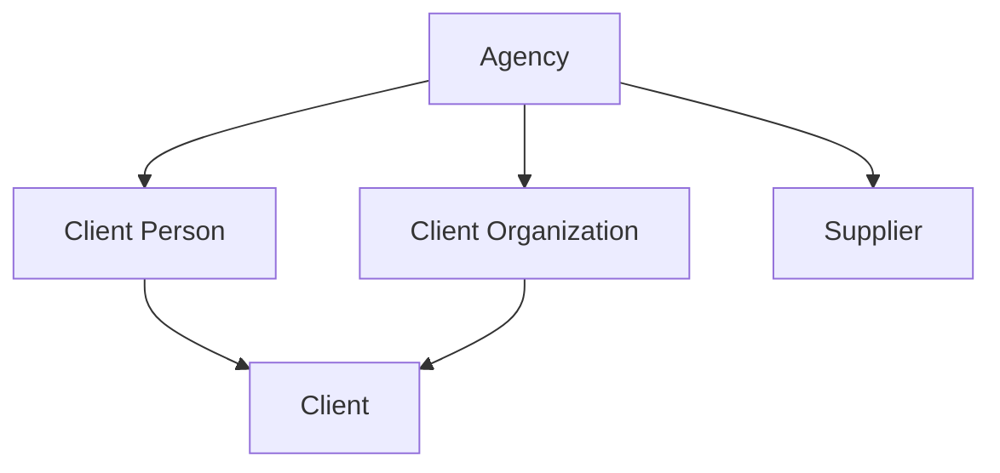

# M1 — Client and Supplier directories

**Status:** Draft planning contract; not implementation authority

**Decision posture:** The choices below are recommended defaults. Change the status to **Accepted** only after product review and the prerequisite documentation amendments listed in the exit gate.

**Prerequisites:** [ADR 0005](../adr/0005-agency-identity.md), [ADR 0006](../adr/0006-separate-identity-domains.md), [MVP requirements](departure-desk-mvp.md), [current architecture](../architecture/current-state.md), and [interface contract](../ui/interface-contract.md)

## Goal

Give an Agency separate, searchable Client and Supplier directories without recreating a universal Party identity, coupling directory records to authentication, or prematurely modeling trip-specific roles.

M1 must leave the application ready to identify:

- the individual or organization that may become responsible for a future Client Trip;
- the consumer-side people who may later be selected as Travelers or contextual contacts;
- the Supplier with whom the Agency contracts or settles; and
- the Suppliers that may later be referenced separately as Service Providers.

M1 does not create a Departure, booking, Traveler, Traveler Assignment, Household, Family, Service Provider, price, capacity position, Charge, Receipt, Supplier Obligation, or payment.

## Outcomes and non-goals

M1 maintains:

- Client People and Client Organizations;
- explicit individual and organization-backed Client responsibility identities;
- Client Organization contact assignments;
- organization and individual Suppliers;
- Supplier Locations and Supplier Contacts;
- aggregate-owned email, phone, and postal contact points;
- fixed Supplier categories;
- Agency-scoped references, search, duplicate review, lifecycle, permissions, and audit history.

The following remain out of scope:

- Party, global person, global Supplier, cross-domain links, matching, synchronization, or merge.
- Household, Family, familial relationships, reusable consumer servicing groups, or shared household contact destinations.
- Standalone Traveler profiles or eligibility records. A later Traveler Assignment will reference a Client Person explicitly.
- Departures, Client Trips, Supplier Arrangements, Reservations, Service Provider assignments, and Traveling Parties.
- Executable record merge, aliases, absorbed-record tombstones, hard deletion, or automatic unmerge.
- Portals, marketing consent, campaigns, bulk export, and support access.
- Passport, birth, medical, accessibility, loyalty, preference, or trip-specific fulfillment facts.
- Client billing/credit settings, Supplier terms/tax/bank data, money, and documents.
- Contact verification, consent processing, suppression, bounce handling, SMS delivery rules, and communication history.
- Executable erasure, anonymization, and legal-hold workflows. M1 only preserves the boundaries later privacy work needs.

## Delivery slices

Each slice includes its migration, schema dump, permissions, commands, audit actions, routes, UI, and tests.

| Slice | Working outcome |
| --- | --- |
| M1A | Individual Client vertical slice: Client Person, explicit Client, contact points, lifecycle, search, and duplicate review. |
| M1B | Client Organization, organization-backed Client, organization contacts, and expanded Client search. |
| M1C | Supplier core: organization/individual Suppliers, fixed categories, lifecycle, search, and duplicate review. |
| M1D | Supplier Locations and Supplier Contacts with contact methods and contextual roles. |
| M1E | Cross-directory hardening, scenario fixtures, accessibility/system proof, performance checks, and documentation acceptance. |

Duplicate and lifecycle protection ship with the first governed record. M1E does not postpone foundational safeguards.

## Locked boundaries

1. Every directory record belongs directly to one Agency and carries immutable `agency_id`.
2. AgencyUser is never the identity root for a Client Person, Client Organization, Supplier Contact, or Supplier.
3. Client Person and Supplier Contact remain separate even when they describe the same physical person.
4. Client Organization and Supplier remain separate even when they describe the same physical organization.
5. `Client` is the stable commercial-responsibility identity based on exactly one Client Person or Client Organization. It is not automatically the Payer of a future Receipt.
6. A Client Person or Client Organization may exist without a Client. Client creation is explicit.
7. M1 introduces no standalone Traveler record. A future Traveler Assignment references an active Client Person; Client Organization can never be a Traveler.
8. M1 introduces no Household, Family, generalized personal relationship, or reusable consumer-group record. Trip participation, communication, payment, occupancy, companionship, and insurance eligibility will remain explicit contextual facts.
9. A Client Organization contact assignment references a Client Person in the same Agency. It grants no Client responsibility, travel status, payment authority, or application access.
10. Supplier is the contracting or settlement counterparty. A later Supplier Arrangement may identify another Supplier through an explicitly named Service Provider reference.
11. Supplier Location is an operational place. It is not a Supplier or Service Provider.
12. Office may provide defaults, attribution, or reporting context only. It grants no directory access.
13. Search and duplicate detection never cross Agency or identity-domain boundaries.
14. M1 exposes no tenant-facing hard delete.

## Aggregate and ownership model

Client Organization references Client People through effective-dated contact assignments. Supplier owns Locations and Supplier Contacts. Contact points belong to one declared aggregate through explicit foreign keys; M1 introduces no polymorphic `contactable` or universal contact owner.

## Client contracts

### Client Person

- Requires first and last name.
- Middle name, suffix, and preferred name are optional. Prefix, pronouns, legal/travel name, date of birth, and identity-document fields are not part of M1.
- Display name may use the preferred name, but the recorded full name remains available.
- A Client Person is an Agency-owned consumer-side identity, not proof that the person is a Client, Traveler, Payer, booking contact, or trip participant.
- Person-only creation is available for organization-contact and future Traveler workflows.
- A future Traveler Assignment may reference any active Client Person after applying its own trip-specific requirements. No permanent Traveler-eligibility flag is inferred or stored in M1.

### Client

- Client is a stable commercial-responsibility identity based on exactly one Client Person or Client Organization.
- Client creation is explicit. “New individual client” may create a Client Person and Client atomically; an eligible existing person or organization may be promoted to Client.
- A source may have at most one Client in an Agency.
- Client stores no balance, billing terms, payment method, credit status, statement preference, trip responsibility, or Payer fact in M1.
- `CL-000001` is issued at successful Client creation, Agency-scoped, non-resetting, immutable, gap-tolerant, and never reused.

### Client Organization

- Requires display name. Legal name and website are optional.
- May have at most one Client responsibility identity.
- An active organization may have effective-dated contact assignments to Client People in the same Agency.
- Each assignment stores start date, optional end date, optional title, and optional contextual role label.
- Zero or one current assignment may be primary. Primary is a servicing default only; it grants no communication authority, application access, payment authority, travel status, or Client responsibility.
- Adding a new organization contact may create a person-only Client Person. It never automatically creates a Client or any trip-specific role.

## Supplier contracts

### Supplier

Supplier uses one table with constrained `kind` values `organization` and `individual`; Rails STI is prohibited.

| Kind | Required names | Optional names |
| --- | --- | --- |
| `organization` | `display_name` | `legal_name`, `doing_business_as` |
| `individual` | `first_name`, `last_name` | `doing_business_as` |

Organization rows must not store individual-name fields. Individual rows must not store organization display/legal-name fields. UI display uses `doing_business_as` when present, otherwise organization `display_name` or the individual's full name. Every stored name is independently searchable where applicable.

Website is optional for either kind. `SUP-000001` is issued at successful Supplier creation under the same rules as Client references. M1 stores no contracts, settlement instructions, tax IDs, credentials, or bank data.

### Categories

M1 uses an application-owned, fixed multi-select catalog, not Agency-configurable category records:

| Code | Label |
| --- | --- |
| `cruise_line` | Cruise line |
| `lodging` | Lodging |
| `air` | Air carrier or consolidator |
| `ground_transportation` | Ground transportation |
| `tour_operator_dmc` | Tour operator or DMC |
| `dining` | Dining |
| `activity_attraction` | Activity or attraction |
| `insurance` | Travel insurance |
| `other` | Other |

`other` requires one concise assignment label. A Supplier may have at most one assignment for each catalog code. Categories support display, search, and filtering only; they determine no price, capacity, contract, or fulfillment behavior. Adding a future system category requires an application change and migration-safe catalog update, not tenant configuration.

### Supplier Location

- Belongs immutably to one Supplier.
- Requires name and stores optional IANA timezone, structured postal address, and one location-level phone number.
- Postal information identifies the operational place; it is not a Supplier remittance or general correspondence address.
- Cannot move between Suppliers and cannot act as a Service Provider.

### Supplier Contact

- Belongs immutably to one Supplier.
- Requires first and last name and stores optional title, department, and contextual role label.
- Owns its own email and phone contact points.
- When a person changes employers, inactivate the old Supplier Contact and create a new one. Never move or synchronize it.
- At most one active preferred Supplier Contact exists per Supplier; zero is allowed. Preferred is a servicing default and grants no authority.

### Contracting Supplier and Service Provider

M1 creates no `ServiceProvider` table or role assignment. Every Supplier is merely available for later selection. M3 must decide the exact Supplier Arrangement schema, but its default direction is:

- the contracting/settlement reference points to one Supplier; and
- an optional, explicitly named Service Provider reference may point to another Supplier.

The reference scenarios retain separate DMC and motorcoach Suppliers so M3 can prove that contracting and performance are not silently treated as identical.

## Contact-point contract

M1 stores destinations, not generalized communication authority or purpose assignments.

### Ownership

- Client Person: email addresses, phone numbers, and postal addresses.
- Client Organization: email addresses, phone numbers, and postal addresses.
- Supplier: general email addresses, phone numbers, and postal addresses used for organization-level contact.
- Supplier Contact: email addresses and phone numbers used to reach that named person.
- Supplier Location: structured place address and one location-level phone stored on the Location itself.

Contact values are deliberately copied when independently supplied to multiple owners. M1 introduces no shared contact row or automatic synchronization.

### Semantics

- Each contact point has a descriptive label of at most 40 characters, such as `personal`, `work`, `reservations`, or `accounting`.
- Label is display metadata, not a permission, verified purpose, consent claim, or routing rule.
- An owner may have zero or one preferred active destination per channel.
- Contextual roles such as booking contact, billing contact, emergency contact, group leader, remittance contact, and Supplier Arrangement contact belong to later records. Those workflows select or snapshot an actual destination explicitly.
- M1 records no verification, consent, suppression, bounce, disconnection, delivery, or marketing state.

## Persistence contract

### Shared columns

Mutable aggregate tables include UUIDv7 `id`, immutable `agency_id`, constrained status (`active` or `inactive`), nonnegative `lock_version`, and UTC `timestamptz` timestamps. Every tenant parent exposes unique `(id, agency_id)` for composite foreign keys.

Effective-dated assignment rows use `starts_on` and optional `ends_on`; `ends_on` cannot precede `starts_on`. They do not use a redundant lifecycle status.

### Tables

| Table | Required business columns | Optional columns and critical constraints |
| --- | --- | --- |
| `client_people` | `first_name`, `last_name` | `middle_name`, `suffix`, `preferred_name`; required names trimmed/nonblank. |
| `client_organizations` | `display_name` | `legal_name`, `website`; display name trimmed/nonblank. |
| `clients` | exactly one source ID; `client_reference` | Same-Agency source FKs; one Client per non-null source; reference unique per Agency. |
| `client_organization_contacts` | organization/person IDs, `starts_on`, `primary` | `ends_on`, title, role label; unique current pair; at most one current primary. |
| `suppliers` | `kind`, `supplier_reference`, kind-appropriate names | `legal_name`, `doing_business_as`, `website`; database name-shape check. |
| `supplier_locations` | `supplier_id`, `name` | IANA timezone, address fields, phone display/search value; same-Agency Supplier FK. |
| `supplier_contacts` | `supplier_id`, first/last name, `preferred` | Title, department, role label; same-Agency Supplier FK; at most one active preferred Contact per Supplier. |
| `supplier_category_assignments` | Supplier ID, category code | Unique pair; `other_label` required only for `other`. |
| `reference_sequences` | namespace, `next_value` | Unique Agency/namespace; positive bigint; namespaces `client`, `supplier`. |

### Contact-point tables

Use aggregate-specific tables, not polymorphic ownership:

- Client Person: `client_person_email_addresses`, `client_person_phone_numbers`, `client_person_postal_addresses`.
- Client Organization: corresponding `client_organization_*` tables.
- Supplier: `supplier_email_addresses`, `supplier_phone_numbers`, `supplier_postal_addresses`.
- Supplier Contact: `supplier_contact_email_addresses`, `supplier_contact_phone_numbers`.

Each row carries direct immutable `agency_id`, immutable owner ID, label, active/inactive status, `preferred`, nonnegative lock version, and timestamps.

- Email stores trimmed display value and lowercase-trimmed normalized address.
- Phone stores trimmed display value and a digits-only search key; the search key is not an E.164 validity claim.
- Postal address stores lines, locality, region, postal code, and uppercase two-character country code.
- Partial unique indexes allow at most one preferred active point per owner/channel. Setting preferred locks the owner/channel set and clears the former preference atomically. Zero preferred points is allowed.

### Normalization and search keys

- Preserve display case and Unicode after trimming and collapsing internal whitespace.
- Define one versioned SQL function, `dd_search_normalize(text)`, for Unicode NFKC normalization, case folding, trim, and whitespace collapse. Verify its PostgreSQL 18 implementation and immutability in the first M1 migration.
- Database-generated stored columns use that function for name and organization search keys so direct writes cannot leave stale keys.
- Email normalized value is `lower(btrim(value))` and enforced by a database check.
- Phone search value removes non-digits in a generated stored column.
- Website host is stored lowercase without scheme, credentials, path, query, fragment, or trailing dot.
- References are uppercase and match `CL-[0-9]{6}` or `SUP-[0-9]{6}`.
- Names and contact values are not Agency-unique.

If PostgreSQL cannot accept `dd_search_normalize` as immutable under the selected implementation, stop the migration and amend this contract. Do not silently substitute database collation or Rails-only normalization with different semantics.

### Immutability

Database triggers reject changes to:

- every directory `agency_id`;
- Client source IDs;
- organization-contact parent IDs;
- Supplier Location and Supplier Contact `supplier_id`;
- contact-point owner IDs;
- Supplier `kind`; and
- issued Client and Supplier references.

Models mirror durable immutability with read-only attributes.

### ADR 0004 reference amendment

| Attribute | Client | Supplier |
| --- | --- | --- |
| Namespace | `client` | `supplier` |
| Format | `CL-000001` | `SUP-000001` |
| Scope/reset | Agency; never Office; never resets | Agency; never Office; never resets |
| Issuance | Successful Client creation | Successful Supplier creation |
| Reuse/gaps | Never reused; gaps accepted | Never reused; gaps accepted |
| Concurrency | Lock Agency/namespace sequence row | Lock Agency/namespace sequence row |
| Retry | Existing reference consumes no number | Existing reference consumes no number |
| Import | Preserve a future legacy value in a separately named external-reference record | Same |

## Same-Agency guarantees

| Child | Composite parent keys |
| --- | --- |
| Client | `(client_person_id, agency_id)` or `(client_organization_id, agency_id)` |
| Organization contact | `(client_organization_id, agency_id)` and `(client_person_id, agency_id)` |
| Client contact point | Its Client Person or Client Organization owner plus Agency |
| Supplier Location/Contact/category | `(supplier_id, agency_id)` |
| Supplier contact point | Its Supplier or Supplier Contact owner plus Agency |
| Reference sequence | `agency_id` |

Cross-Agency combinations fail at the database even if application scoping is bypassed.

## Lifecycle and deactivation dependency catalog

M1 uses reversible active/inactive states only; it introduces no `closed` state or hard deletion.

| Record | Transition contract |
| --- | --- |
| Client Person | Inactivation is blocked by an active Client or current organization-contact assignment. Owned contact points inactivate atomically. Reactivation does not restore contacts or assignments. |
| Client | Source must be active to create or reactivate. Later Client Trips, Charges, and financial records add blockers. |
| Client Organization | Inactivation is blocked by an active Client. Successful inactivation ends current contact assignments and inactivates owned contact points atomically. Reactivation restores neither. |
| Organization contact assignment | Ending is idempotent. Ending the primary assignment leaves the organization with no primary unless another current assignment is explicitly selected in the same command. |
| Supplier | Later Arrangements and Obligations add blockers. In M1, successful inactivation atomically inactivates Locations, Contacts, and Supplier-owned contact points. Reactivation restores none of them. |
| Supplier Location/Contact | Supplier must be active to create or reactivate. Contact inactivation also inactivates its owned contact points. |
| Contact point | Owner must be active to create or reactivate. Inactivation clears preferred atomically. |

Aggregate-root lifecycle audit events list affected child IDs and field names but copy no contact values or free text. Expected failures are not audited; successful transitions are audited in the same transaction.

## Permission catalog

The recommended default treats Viewer as read-only for directory identity but does not expose contact destinations. Product review must confirm this boundary before acceptance.

| Permission | Administrator | Staff | Viewer |
| --- | ---: | ---: | ---: |
| `view_client_directory` | Yes | Yes | Yes |
| `view_client_contact_details` | Yes | Yes | No |
| `manage_client_directory` | Yes | Yes | No |
| `override_client_duplicate` | Yes | Yes | No |
| `view_supplier_directory` | Yes | Yes | Yes |
| `view_supplier_contact_details` | Yes | Yes | No |
| `manage_supplier_directory` | Yes | Yes | No |
| `override_supplier_duplicate` | Yes | Yes | No |

Viewing inactive identities is included through an explicit filter. M1 adds no merge, export, or sensitive-Traveler-data permission. Code checks catalog permissions, never role names. Viewer mutation produces no side effect or audit.

Viewer search never accepts or matches hidden email, phone, postal, website, or named-contact fields. Lists and profiles hide those values rather than rendering masked hints that disclose their existence.

## Commands, locking, and errors

Commands start from `Current.agency`, require an active Agency and named permission, and translate expected database errors. Lock order is Agency, aggregate roots sorted by UUID, then child rows sorted by UUID.

| Command family | Behavior and idempotency |
| --- | --- |
| Create person/organization/Supplier | Normalize and recompute duplicates. Not an automated-retry API; repeated submission re-enters duplicate review. |
| Create Client | Lock active source; an existing Client returns `already_exists` with the Agency-scoped record. |
| Update aggregate | Require `lock_version`; material identity/contact changes recompute duplicates; same values are a no-op; stale returns `conflict`. |
| Change status | Enforce dependency/effect table; already at target is a no-op without another audit. |
| Manage contact point | Lock owner/channel rows; create, update, inactivate, reactivate, or set preferred atomically. |
| Manage organization contacts | Add/end assignment and explicitly select an optional primary. An existing current pair returns `already_exists`. |
| Replace categories | Replace submitted set under Supplier lock; same set is a no-op. |
| Issue reference | Lock namespace sequence and assign in the creation transaction; an existing reference consumes no number. |

Cross-Agency or missing IDs raise not found. Domain error codes are `unauthorized`, `invalid`, `invalid_state`, `dependency_exists`, `duplicate_review_required`, `already_exists`, and `conflict`.

### Command inventory

| Slice | Commands and query objects |
| --- | --- |
| M1A | `CreateClientPerson`, `CreateIndividualClient`, `CreateClientForPerson`, `UpdateClientPerson`, `ChangeClientPersonStatus`, `ChangeClientStatus`, Client Person contact-point commands, `SearchClientDirectory`, `FindClientPersonDuplicates` |
| M1B | `CreateClientOrganization`, `CreateOrganizationClient`, `CreateClientForOrganization`, `UpdateClientOrganization`, `ChangeClientOrganizationStatus`, organization contact-point commands, `AddClientOrganizationContact`, `EndClientOrganizationContact`, `ChangeClientOrganizationPrimaryContact`, expanded Client search/duplicates |
| M1C | `CreateSupplier`, `UpdateSupplier`, `ChangeSupplierStatus`, `ReplaceSupplierCategories`, Supplier contact-point commands, `SearchSupplierDirectory`, `FindSupplierDuplicates` |
| M1D | `CreateSupplierLocation`, `UpdateSupplierLocation`, `ChangeSupplierLocationStatus`, `CreateSupplierContact`, `UpdateSupplierContact`, `ChangeSupplierContactStatus`, `SetPreferredSupplierContact`, Supplier Contact contact-point commands, Location/Contact duplicate queries |
| M1E | Cross-directory scenario builders, performance assertions, accessibility/system coverage, and documentation updates; no new domain aggregate |

Each contact-point family has explicit public create, update, change-status, and set-preferred commands. Shared private implementation is allowed, but public commands remain domain-named and accept only their declared owner types.

## Audit contract

Extend `AuditEvent::SUBJECT_TYPES` only as slices introduce aggregate roots. Child/contact commands use their aggregate owner as subject.

| Subject type | Closed action catalog additions |
| --- | --- |
| `ClientPerson` | `client_person.created`, `.updated`, `.inactivated`, `.reactivated`, `.contact_updated`, `.duplicate_override` |
| `Client` | `client.created`, `.inactivated`, `.reactivated` |
| `ClientOrganization` | `client_organization.created`, `.updated`, `.contact_updated`, `.contact_added`, `.contact_ended`, `.primary_contact_changed`, `.inactivated`, `.reactivated`, `.duplicate_override` |
| `Supplier` | `supplier.created`, `.updated`, `.categories_changed`, `.contact_updated`, `.inactivated`, `.reactivated`, `.duplicate_override` |
| `SupplierLocation` | `supplier_location.created`, `.updated`, `.inactivated`, `.reactivated`, `.duplicate_override` |
| `SupplierContact` | `supplier_contact.created`, `.updated`, `.contact_updated`, `.preferred_changed`, `.inactivated`, `.reactivated`, `.duplicate_override` |

Audit details contain IDs, status transitions, changed field names, candidate IDs, signal names, category codes, and duplicate-override reason codes. They never copy names, email, phone, postal address, websites, unrestricted free text, or future sensitive Traveler facts.

## Search contract

Client and Supplier search are separate, permission-gated query objects scoped from `Current.agency`.

- Normalize text with `dd_search_normalize`; reject blank or over-100-character queries without scanning.
- References and email addresses use exact normalized matching.
- Digit-heavy input uses exact or suffix phone-digit matching only after a minimum of seven digits.
- Name queries require every token to match a normalized word prefix; no trigram or fuzzy matching.
- Default to active; an explicit filter includes inactive.
- Rank exact reference, email, phone, full name, then all-token prefix; break ties by active status, display name, and UUID.
- Cap at 50 results and state when results are truncated.
- Search plans must use indexes for every supported query shape and pass representative `EXPLAIN` assertions before a slice exits.

Client search covers Client reference, Person name/contact, and Organization name/contact/website. Supplier search covers Supplier reference/name/contact/category, Location name/locality/postal code, and Supplier Contact name/contact. Results show record type and lifecycle status; subordinate results link to their owner. Neither directory returns records from the other domain or AgencyUsers.

Search considers only fields the actor may view. Viewer searches therefore exclude all contact destinations and named Supplier Contact fields.

## Duplicate-review contract

Duplicate detection runs on create and material identity/contact changes within the same Agency and record kind. It presents named signals rather than a numerical confidence score.

| Kind | Strong warning | Possible warning |
| --- | --- | --- |
| Client Person | Exact normalized email or phone | Exact normalized full name plus matching postal code; exact full name alone |
| Client Organization | Exact normalized email, phone, or website host | Exact display/legal name; name plus matching locality/postal code |
| Supplier | Exact normalized email, phone, website host, or legal name | Exact display/DBA name; name plus matching locality/postal code |
| Location within one Supplier | Exact normalized postal address | Exact name plus matching locality |
| Contact within one Supplier | Exact normalized email or phone | Exact normalized full name |

Signals are warnings, never identity claims or uniqueness rules. Inactive candidates remain visible and labeled to actors authorized to view them. Duplicate responses expose only fields already authorized for that actor.

When candidates exist, return `duplicate_review_required`. The response includes a short-lived signed acknowledgement token bound to:

- Agency and actor;
- record kind;
- normalized submitted identity fingerprint;
- candidate IDs and named signals; and
- expiration.

The user may select an existing record or resubmit **Create anyway** with the token and one fixed reason code: `confirmed_distinct`, `shared_contact`, `insufficient_match`, or `other_reviewed`. The command recomputes candidates inside its transaction. A changed submission, expired token, or changed candidate/signals set requires a new review. Successful override audits candidate IDs, signals, and reason code without PII or free text.

M1 has no contractually unique external identifiers. Executable merge remains deferred and automatic merge remains prohibited. M8 must either provide domain-safe duplicate resolution before production or explicitly accept warning/prevention without merge as the production policy.

## Privacy and retention hooks

- Inactive records remain historical and are excluded from ordinary search by default.
- No UI or general command performs hard deletion, redaction, anonymization, or bulk export.
- M1 stores no passport, birth, medical, payment, tax, banking, or uploaded-document data.
- Contact points may be inactivated without erasing their historical rows.
- Audit payloads do not duplicate contact values or unrestricted free text.
- Future privacy work must define dependencies across trips, assignments, documents, communications, posted money, Supplier history, and legal holds before any destructive operation exists.
- Fixtures and development seeds contain obviously fictional data only.

## Routes and UI surfaces

Add separate **Clients** and **Suppliers** navigation. Do not restore a Party-oriented Directory route.

| Surface | Contract |
| --- | --- |
| `/clients` | Client-domain landing page with unified search, record-type/status filters, and People/Organizations views. It may include person-only and organization-only identities but labels Client state explicitly. |
| New Client | Primary action asks Individual or Organization, then creates the source and Client atomically or selects an eligible existing source. |
| New person only | Secondary/contextual action for organization contacts and future Traveler use; it clearly states that no Client or trip role is created. |
| `/clients/people/:id` | Display-first person identity, contact points, Client state/reference, and current/historical organization-contact assignments. |
| `/clients/organizations/:id` | Display-first organization identity, contact points, Client state/reference, and current/historical contact assignments. |
| Client state | Managed on its source profile in M1. The Client reference links there; M1 creates no empty standalone Client detail page. |
| `/suppliers` and `/:id` | Category/status filters; contracting identity, categories, organization-level contact points, Locations, Contacts, and lifecycle. |
| Duplicate review | Preserves submission; explains authorized signals; offers View existing, Return to edit, or Create anyway with fixed reason. |
| Lifecycle confirmation | Lists blockers and cascade effects; lifecycle actions stay out of ordinary edit footers. |

Viewer surfaces show identity, reference, kind/category, and lifecycle status but omit contact destinations and named Supplier Contact details under the recommended permission default.

Use desktop tables and accessible narrow stacked rows. Search works without JavaScript. Contact editors use dedicated pages or one open inline form, never many simultaneously expanded forms.

## Accessibility and states

Every surface requires:

- headings, landmarks, and working skip-link behavior;
- visible labels and focus indicators;
- complete logical keyboard order;
- an associated error summary with preserved submitted values;
- actionable first-use and filtered-empty states;
- textual status and no color-only or hover-only meaning;
- explicit unauthorized and not-found handling;
- duplicate-review expiration and changed-candidate states;
- contact-redacted Viewer states; and
- tested reflow at 375px, 768px, reference desktop, and 1280px.

## Test matrix

| Layer | Minimum proof |
| --- | --- |
| Migration/schema | UUIDv7/timestamptz, named constraints, exact-one Client source, conditional Supplier names, assignment dates, partial preferred indexes, references, normalized/generated keys. |
| Database isolation | Composite FKs reject every cross-Agency pairing; triggers reject tenant/source/owner/kind/reference mutation. |
| Model | Supplier name shapes, normalization, assignment dates, lifecycle, contact preference, and no implicit cross-domain association. |
| Command | Success, invalid, unauthorized, inactive Agency, stale, not found, dependency, cascade, no-op, duplicate review/override, and audit atomicity. |
| Concurrency | Parallel Client creation, reference issuance, preferred changes, organization-primary changes, lifecycle conflicts, and duplicate candidate changes. |
| Search | Ranking, supported shapes, index use, truncation, inactive filter, permission-safe fields, domain separation, bounds, and cross-Agency isolation. |
| Request/system | Viewer redaction/mutation rejection, Staff/Admin success, 404 isolation, preserved errors, duplicate-token states, keyboard workflows, and responsive navigation. |
| Regression | Existing authentication, administration, Office, invitation/recovery, audit, and isolation tests remain green. |

Each UI slice runs the Rails suite, CI browser tests, and Tailwind build. Migrations work from an empty primary database and update `db/structure.sql`; queue persistence is unchanged.

## Acceptance scenarios

M1 demonstrates only directory facts; it does not pretend to prove future Client Trip, Payer, Traveler Assignment, occupancy, or insurance behavior.

- Martha Smith has a Client Person and Client responsibility identity. Daniel and Emily are separate Client People available for later trip selection; M1 creates no Household or implied relationship among them.
- Olivia Brown has a Client responsibility identity, while Noah Brown is a separate Client Person. M1 records no responsibility link between them; that is proven when Client Trips arrive.
- Westlake Foods is an organization-backed Client with current and historical Client Person contact assignments. Those contacts receive no Client, travel, payment, or access role automatically.
- An AgencyUser who is also known as a consumer has a separate Client Person record with no linkage or synchronization.
- Celebrity Cruises is a Supplier with categories, Contacts, and operational Locations.
- A Vineyard Tour DMC and motorcoach company remain separate Suppliers so later contracting and Service Provider references can differ.
- A Supplier Contact and Client Person may share an email without linkage or cross-directory warning.
- The same normalized Client Person email may exist in two Agencies without collision or disclosure.
- Likely duplicates require selection of an existing record or an authorized, token-bound, audited create-anyway outcome.
- Forged cross-Agency source, contact, Supplier, or duplicate-candidate identifiers return not found and create no side effect.

## Product-review decisions before acceptance

Confirm or amend these recommended defaults:

1. Household, Family, reusable servicing groups, and generalized personal relationships are deferred.
2. M1 creates no standalone Traveler record; future Traveler Assignment references Client Person directly.
3. Client means stable commercial-responsibility identity, never the universal Payer identity.
4. Client Organization contacts reuse Client Person within the Client domain but create no other role automatically.
5. Viewer may see directory identity but not contact destinations or named Supplier Contact details.
6. Supplier Arrangement will normally reference another Supplier when Service Provider differs; M1 creates no ServiceProvider record.
7. Duplicate review uses named deterministic signals and signed acknowledgement, not weighted scoring.
8. Supplier inactivation cascades to its M1-owned subordinate records rather than requiring manual child-by-child inactivation.
9. Domain-safe merge remains outside M1 and must receive an explicit production-readiness disposition in M8.

## Exit gate

The plan may become **Accepted** only after product review confirms the preceding decisions and the same documentation change:

- adds an ADR amendment that defers Household and standalone Traveler persistence without weakening ADR 0006's identity-domain separation;
- amends MVP uses of “payer identity” to **commercial-responsibility identity**, leaving Payer as the source of a future Receipt;
- removes Household and standalone Traveler from the MVP directory implementation scope and assigns their contextual replacements to later milestones;
- updates terminology, roadmap, and reference-scenario wording consistently; and
- records the production milestone responsible for the deferred merge decision.

M1 implementation is complete only when every slice is accepted and implemented; both scenarios contain enough Client and Supplier directory fixtures for Departure modeling; lifecycle, permission, audit, normalization, duplicate, reference, and tenancy contracts pass; no Party/global User/polymorphic identity/Office authorization/cross-domain sync/automatic merge has returned; shipped documentation is current; and full CI is green.

As each slice ships, update `AGENTS.md`, current architecture, terminology, interface navigation, and the documentation index so implemented scope remains distinguishable from the rest of M1.

## Decisions resolved by this draft

- Explicit Client creation; Client means commercial-responsibility identity, while Payer remains a future Receipt fact.
- Household, Family, and reusable consumer servicing groups deferred.
- Standalone Traveler identity deferred; future Traveler Assignment references Client Person.
- One organization/individual Supplier table without STI and with exact conditional name rules.
- Location is not a Service Provider; a later explicit Service Provider reference points to another Supplier by default.
- Client Organization contacts reuse Client Person within the Client identity domain.
- Fixed Supplier category catalog.
- Aggregate-specific contact tables with destination-only semantics.
- Reversible active/inactive lifecycle with explicit cascade effects and no hard deletion.
- Permission-safe search and duplicate review with deterministic named signals.
- Merge, bulk export, contact verification/consent, and executable erasure deferred.
