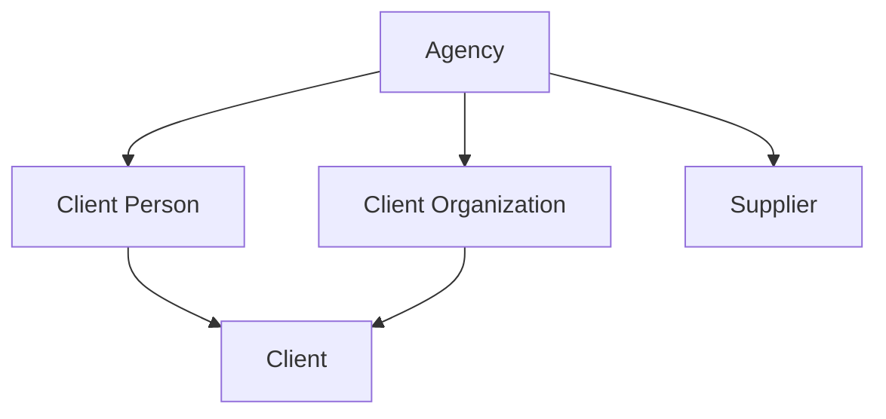

# M1 — Client and Supplier directories

**Status:** Accepted milestone contract. It is not implementation authority for a slice until that slice plan is accepted.

**Decision posture:** Product review confirmed the recommended defaults, including the contract closures in this document, on 2026-09-14. [M1A](m1a-individual-client.md), [M1B](m1b-client-organizations.md), and [M1C](m1c-supplier-core.md) are shipped and merged. [M1D](m1d-supplier-locations-and-contacts.md) is implemented on this branch and ships when merged. M1E remains deferred.

**M1A amendments (2026-09-14):** After M1A acceptance, product review requested two changes. They supersede the original sentences they touch and are recorded as amendments in the slice plan, not as text that was always in this contract. A Client Person phone country is required and must match the selected country. The individual-Client people list may `POST .../set_primary` with `lock_version`; that is not a `/preferred` route.

**M1C amendments (2026-09-14):** After M1C acceptance review, product confirmed: at least one Supplier category is required on create and replacement rejects an empty set; `other_label` is trimmed and at most 80 characters; Supplier `kind` remains permanently immutable; inactive Suppliers may receive identity and category corrections while create/reactivate of contact destinations stays gated on an active Supplier; and Supplier contact-point lists may `POST .../set_primary` with `lock_version`, matching the Client Person and Client Organization list pattern. That action is not a `/preferred` route. Client Organization contact-point lists already ship the same `set_primary` pattern from M1B.

**M1D amendments (2026-09-15):** Supplier Contact email-address and phone-number lists also support `POST .../set_primary` with `lock_version`. This selects the primary destination within that Contact’s channel and remains distinct from `PATCH .../contacts/:supplier_contact_id/preferred`. Parent ranking text is unchanged; M1D extends shipped M1C ranking with a total mixed-result order.

**Prerequisites:** [ADR 0005](../adr/0005-agency-identity.md), [ADR 0006](../adr/0006-separate-identity-domains.md), [MVP requirements](departure-desk-mvp.md), [current architecture](../architecture/current-state.md), and [interface contract](../ui/interface-contract.md)

## Goal

Give an Agency separate, searchable Client and Supplier directories without recreating a universal Party identity, coupling directory records to authentication, or prematurely modeling trip-specific roles.

M1 must leave the application ready to identify:

- the individual or organization that may become responsible for a future Client Trip;
- the consumer-side people who may later be selected as Travelers or contextual contacts;
- the Supplier with whom the Agency contracts or settles; and
- the Suppliers that may later be referenced separately as Service Providers.

M1 does not create a Departure, booking, Traveler, Traveler Assignment, Household, Family, Service Provider, price, capacity position, Charge, Receipt, Supplier Obligation, or payment.

## Outcomes and non-goals

M1 maintains:

- Client People and Client Organizations;
- explicit individual and organization-backed Client responsibility identities;
- Client Organization contact assignments;
- organization and individual Suppliers;
- Supplier Locations and Supplier Contacts;
- aggregate-owned email, phone, postal, and, where the owner stores them, website contact points;
- fixed Supplier categories;
- Agency-scoped references, search, duplicate review, lifecycle, permissions, and audit history.

The following remain out of scope:

- Party, global person, global Supplier, cross-domain links, matching, synchronization, or merge.
- Household, Family, familial relationships, reusable consumer servicing groups, or shared household contact destinations.
- Standalone Traveler profiles or eligibility records. A later Traveler Assignment will reference a Client Person explicitly.
- Departures, Client Trips, Supplier Arrangements, Reservations, Service Provider assignments, and Traveling Parties.
- Executable record merge, aliases, absorbed-record tombstones, hard deletion, or automatic unmerge.
- Portals, marketing consent, campaigns, bulk export, and support access.
- Passport, birth, medical, accessibility, loyalty, preference, or trip-specific fulfillment facts.
- Client billing/credit settings, Supplier terms/tax/bank data, money, and documents.
- Contact verification, consent processing, suppression, bounce handling, SMS delivery rules, and communication history.
- Executable erasure, anonymization, and legal-hold workflows. M1 only preserves the boundaries later privacy work needs.

## Delivery slices

Each slice includes its migration, schema dump, permissions, commands, audit actions, routes, UI, and tests.

| Slice | Working outcome |
| --- | --- |
| M1A | Individual Client vertical slice: Client Person, explicit Client, contact points, lifecycle, search, and duplicate review. |
| M1B | Client Organization, organization-backed Client, organization contacts, and expanded Client search. This is the only slice that enables `btree_gist`, and only for the organization-contact history exclusion constraint. |
| M1C | Supplier core: organization/individual Suppliers, fixed categories, lifecycle, search, and duplicate review. |
| M1D | Supplier Locations and Supplier Contacts with contact methods and contextual roles. |
| M1E | Cross-directory hardening, scenario fixtures, accessibility/system proof, performance checks, and documentation acceptance. |

Duplicate and lifecycle protection ship with the first governed record. M1E does not postpone foundational safeguards. The M1A slice plan is [m1a-individual-client.md](m1a-individual-client.md), accepted 2026-09-14 for the individual-Client slice only.

## Locked boundaries

1. Every directory record belongs directly to one Agency and carries immutable `agency_id`.
2. AgencyUser is never the identity root for a Client Person, Client Organization, Supplier Contact, or Supplier.
3. Client Person and Supplier Contact remain separate even when they describe the same physical person.
4. Client Organization and Supplier remain separate even when they describe the same physical organization.
5. `Client` is the stable commercial-responsibility identity based on exactly one Client Person or Client Organization. It is not automatically the Payer of a future Receipt.
6. A Client Person or Client Organization may exist without a Client. Client creation is explicit.
7. M1 introduces no standalone Traveler record. A future Traveler Assignment references an active Client Person; Client Organization can never be a Traveler.
8. M1 introduces no Household, Family, generalized personal relationship, or reusable consumer-group record. Trip participation, communication, payment, occupancy, companionship, and insurance eligibility will remain explicit contextual facts.
9. A Client Organization contact assignment references a Client Person in the same Agency. It grants no Client responsibility, travel status, payment authority, or application access.
10. Supplier is the contracting or settlement counterparty. A later Supplier Arrangement may identify another Supplier through an explicitly named Service Provider reference.
11. Supplier Location is an operational place. It is not a Supplier or Service Provider.
12. M1 directory tables do not store `office_id`. Directory commands do not accept an Office identifier. `Current.office` does not default, attribute, filter, scope, or authorize directory records. A Supplier Location is not an Agency Office. Inactivating an Office does not affect directory rows. A later milestone may add an explicitly named servicing or responsibility relationship.
13. Search and duplicate detection never cross Agency or identity-domain boundaries.
14. M1 exposes no tenant-facing hard delete.

## Aggregate and ownership model



Client Organization references Client People through effective-dated contact assignments. Supplier owns Locations and Supplier Contacts. Contact points belong to one declared aggregate through explicit foreign keys; M1 introduces no polymorphic `contactable` or universal contact owner.

## Client contracts

### Client Person

- Requires first and last name.
- Middle name, suffix, and preferred name are optional. Prefix, pronouns, legal/travel name, date of birth, and identity-document fields are not part of M1.
- Display name may use the preferred name, but the recorded full name remains available.
- A Client Person is an Agency-owned consumer-side identity, not proof that the person is a Client, Traveler, Payer, booking contact, or trip participant.
- Person-only creation is available for organization-contact and future Traveler workflows.
- A future Traveler Assignment may reference any active Client Person after applying its own trip-specific requirements. No permanent Traveler-eligibility flag is inferred or stored in M1.

### Client

- Client is a stable commercial-responsibility identity based on exactly one Client Person or Client Organization.
- Client creation is explicit. “New individual client” may create a Client Person and Client atomically; an eligible existing person or organization may be promoted to Client.
- A Client Person or Client Organization may have at most one Client across all lifecycle states. Status is not part of that uniqueness. An inactive Client permanently occupies that source slot and retains its reference and history. Creating a Client when an inactive one already exists returns `already_exists` and points to reactivation of that record. Replacement Client creation is prohibited.
- To retire both, inactivate the Client before the source. To restore both, reactivate the source before explicitly reactivating the existing Client. Source reactivation never cascades to the Client. Reactivating a Client whose source is inactive returns `dependency_exists`. Those transitions lock Agency, then the source, then the Client, and recheck the source after locking.
- Client stores no balance, billing terms, payment method, credit status, statement preference, trip responsibility, or Payer fact in M1.
- `CL-000001` is issued at successful Client creation, Agency-scoped, non-resetting, immutable, gap-tolerant, and never reused.

### Client Organization

- Requires display name. Legal name is optional. Websites are optional contact points, not a single column on the organization.
- May have at most one Client responsibility identity.
- An active organization may have effective-dated contact assignments to Client People in the same Agency.
- Each assignment stores `starts_on`, optional `ends_on`, optional title, and optional contextual role label.
- A Client Organization contact assignment is current exactly when `ends_on IS NULL`. M1 does not support future-scheduled assignments. `starts_on` and `ends_on` are inclusive Agency-local business dates, using the Agency’s stored IANA `default_timezone`, and `starts_on` cannot be after that business date when recorded. Ending an assignment sets `ends_on` to that business date immediately; M1 does not permit a future `ends_on`. `ends_on` is null or on/after `starts_on`. Ending never deletes the row.
- Historical periods for the same Agency, Client Organization, and Client Person may not overlap. A previously ended person may later receive a new assignment to the same organization. January 1–January 31 followed by February 1–February 28 is allowed; January 1–January 31 overlapping January 15–February 15 is rejected.
- Partial unique indexes enforce one current row per organization/person pair and at most one current primary per organization:

```sql
UNIQUE (agency_id, client_organization_id, client_person_id) WHERE ends_on IS NULL
UNIQUE (agency_id, client_organization_id) WHERE ends_on IS NULL AND primary
```

A named `btree_gist` exclusion constraint, enabled only for this M1B constraint, enforces nonoverlapping history for the same Agency, organization, and person. It is not a global date exclusion:

```sql
EXCLUDE USING gist (
  agency_id WITH =,
  client_organization_id WITH =,
  client_person_id WITH =,
  daterange(starts_on, COALESCE(ends_on + 1, 'infinity'), '[)') WITH &&
)
```

Zero current primary contacts is valid. Nothing becomes primary automatically. Primary is a servicing default only; it grants no communication authority, application access, payment authority, travel status, or Client responsibility.
- Organization-contact commands lock Agency, then Client Organization, then the relevant assignment rows ordered by UUID. An already-current pair returns `already_exists`. An overlapping historical period returns `invalid`. Selecting a new primary clears the former primary in the same transaction. Ending the primary may leave the organization with no primary unless another current assignment is explicitly selected in the same command.
- Adding a new organization contact may create a person-only Client Person through the same person duplicate-review path. It never automatically creates a Client or any trip-specific role.

## Supplier contracts

### Supplier

Supplier uses one table with constrained `kind` values `organization` and `individual`; Rails STI is prohibited.

| Kind | Required names | Optional names |
| --- | --- | --- |
| `organization` | `display_name` | `legal_name`, `doing_business_as` |
| `individual` | `first_name`, `last_name` | `doing_business_as` |

Organization rows must not store individual-name fields. Individual rows must not store organization display/legal-name fields. Individual Suppliers do not store middle name or suffix. UI display uses `doing_business_as` when present, otherwise organization `display_name` or the individual's first and last name. Every stored name is independently searchable where applicable. Kind is permanently immutable; wrong-kind correction requires a new Supplier.

Websites are optional contact points for either kind, not a column on the Supplier. `SUP-000001` is issued at successful Supplier creation under the same rules as Client references. M1 stores no contracts, settlement instructions, tax IDs, credentials, or bank data. Inactive Suppliers may receive identity and category corrections. Contact destinations may be created or reactivated only while the Supplier is active.

### Categories

M1 uses an application-owned, fixed multi-select catalog, not Agency-configurable category records:

| Code | Label |
| --- | --- |
| `cruise_line` | Cruise line |
| `lodging` | Lodging |
| `air` | Air carrier or consolidator |
| `ground_transportation` | Ground transportation |
| `tour_operator_dmc` | Tour operator or DMC |
| `dining` | Dining |
| `activity_attraction` | Activity or attraction |
| `insurance` | Travel insurance |
| `other` | Other |

`other` requires one concise assignment label: trimmed, nonblank, and at most 80 characters. A Supplier may have at most one assignment for each catalog code. Create requires at least one category; replacing categories rejects an empty set. Categories support display, search, and filtering only; they determine no price, capacity, contract, or fulfillment behavior. Adding a future system category requires an application change and migration-safe catalog update, not tenant configuration. Categories remain assigned when the Supplier is inactive. Category replacement is permitted while inactive and does not trigger duplicate review.

### Supplier Location

- Belongs immutably to one Supplier.
- Requires name and stores optional IANA timezone, a structured postal address, and one location-level phone. The phone uses the same number, E.164, extension, and country fields as a phone contact point, stored on the Location itself.
- Postal information identifies the operational place; it is not a Supplier remittance or general correspondence address.
- Cannot move between Suppliers and cannot act as a Service Provider.

### Supplier Contact

- Belongs immutably to one Supplier.
- Requires first and last name and stores optional title, department, and contextual role label.
- Owns its own email and phone contact points.
- When a person changes employers, inactivate the old Supplier Contact and create a new one. Never move or synchronize it.
- At most one active preferred Supplier Contact exists per Supplier; zero is allowed. Preferred is a servicing default and grants no authority.

### Contracting Supplier and Service Provider

M1 creates no `ServiceProvider` table or role assignment. Every Supplier is merely available for later selection. M3 must decide the exact Supplier Arrangement schema, but its default direction is:

- the contracting/settlement reference points to one Supplier; and
- an optional, explicitly named Service Provider reference may point to another Supplier.

The reference scenarios retain separate DMC and motorcoach Suppliers so M3 can prove that contracting and performance are not silently treated as identical.

## Contact-point contract

M1 stores destinations, not generalized communication authority or purpose assignments.

### Ownership

- Client Person: email addresses, phone numbers, and postal addresses.
- Client Organization: email addresses, phone numbers, postal addresses, and websites.
- Supplier: general email addresses, phone numbers, postal addresses, and websites used for organization-level contact.
- Supplier Contact: email addresses and phone numbers used to reach that named person.
- Supplier Location: structured place address and one location-level phone stored on the Location itself. It has no contact-point collection.

Contact values are deliberately copied when independently supplied to multiple owners. M1 introduces no shared contact row or automatic synchronization.

### Semantics

- Each contact point has a descriptive label of at most 40 characters, such as `personal`, `work`, `reservations`, or `accounting`.
- Label is display metadata, not a permission, verified purpose, consent claim, or routing rule.
- An owner may have zero or one preferred active destination per channel.
- Contextual roles such as booking contact, billing contact, emergency contact, group leader, remittance contact, and Supplier Arrangement contact belong to later records. Those workflows select or snapshot an actual destination explicitly.
- M1 records no verification, consent, suppression, bounce, disconnection, delivery, or marketing state.

## Persistence contract

### Shared columns

Mutable aggregate tables include UUIDv7 `id`, immutable `agency_id`, constrained status (`active` or `inactive`), nonnegative `lock_version`, and UTC `timestamptz` timestamps. Every tenant parent exposes unique `(id, agency_id)` for composite foreign keys. No M1 directory table stores `office_id`.

Effective-dated assignment rows use inclusive Agency-local `starts_on` and optional `ends_on`. An assignment is current exactly when `ends_on IS NULL`. Do not define current relative to `CURRENT_DATE`. `ends_on` is null or on/after `starts_on`. They do not use a redundant lifecycle status.

### Tables

| Table | Required business columns | Optional columns and critical constraints |
| --- | --- | --- |
| `client_people` | `first_name`, `last_name` | `middle_name`, `suffix`, `preferred_name`; required names trimmed/nonblank. |
| `client_organizations` | `display_name` | `legal_name`; display name trimmed/nonblank. No `office_id` or website column. |
| `clients` | exactly one source ID; `client_reference` | Same-Agency source FKs; one Client per non-null source across all statuses; reference unique per Agency. |
| `client_organization_contacts` | organization/person IDs, `starts_on`, `primary` | `ends_on`, title, role label; current means `ends_on IS NULL`; one current pair; at most one current primary; nonoverlapping history. |
| `suppliers` | `kind`, `supplier_reference`, kind-appropriate names | `legal_name`, `doing_business_as`; database name-shape check. No `office_id` or website column. |
| `supplier_locations` | `supplier_id`, `name` | IANA timezone, postal fields, location phone number/E.164/extension/country; same-Agency Supplier FK. No contact-point collection. |
| `supplier_contacts` | `supplier_id`, first/last name, `preferred` | Title, department, role label; same-Agency Supplier FK; at most one active preferred Contact per Supplier. |
| `supplier_category_assignments` | Supplier ID, category code | Unique pair; at least one category required on create/replace; `other_label` required only for `other`, trimmed, max 80 characters. Categories remain assigned when the Supplier is inactivated. |
| `reference_sequences` | namespace, `next_value` | Unique Agency/namespace; `next_value` is the next unissued positive integer, starting at 1; namespaces `client`, `supplier`. |

### Contact-point tables

Use aggregate-specific tables, not polymorphic ownership:

- Client Person: `client_person_email_addresses`, `client_person_phone_numbers`, `client_person_postal_addresses`.
- Client Organization: corresponding `client_organization_*` tables, including `client_organization_websites`.
- Supplier: `supplier_email_addresses`, `supplier_phone_numbers`, `supplier_postal_addresses`, `supplier_websites`.
- Supplier Contact: `supplier_contact_email_addresses`, `supplier_contact_phone_numbers`.

Each row carries direct immutable `agency_id`, immutable owner ID, label, active/inactive status, `preferred`, nonnegative lock version, and timestamps.

- Email stores trimmed display value and lowercase-trimmed normalized address.
- Phone stores E.164 `normalized_number`, a country national display `number`, optional digits-only `extension` of at most 10 digits, and a required uppercase ISO `country_code` (M1A amendment). The Client Person phone form chooses that country from the accepted list and defaults it to the agency country. An entered number must be valid for that country. Always detect a pasted `ext`, `extension`, or `x` suffix: use it when the extension field is blank, accept it when both agree, and reject the number when they differ. Persist the E.164 number independently of display grouping. The normalized base number never contains extension digits. The database checks that `normalized_number` is `+` followed by a digit `1`–`9` and at most 14 further digits. `PhoneNumberNormalizer` remains authoritative for whether that shape is a plausible telephone number.
- Website contact points store a display value and a normalized HTTP(S) URL.
- Postal address stores a required `line_1`, optional additional lines, optional locality, optional region, optional postal code, and a required uppercase ISO 3166-1 alpha-2 country code. A country-only row is invalid.
- Partial unique indexes allow at most one preferred active point per owner/channel. Setting preferred locks the owner/channel set and clears the former preference atomically. Zero preferred points is allowed.

### Normalization and search keys

- Preserve display case and Unicode after trimming and collapsing internal whitespace.
- Define one versioned SQL function, `dd_search_normalize(text)`, for Unicode NFKC normalization, case folding, trim, and whitespace collapse. PostgreSQL 18.6 accepts this body as `IMMUTABLE` and as a stored generated-column expression: NFKC, then `casefold` under the builtin `pg_unicode_fast` collation, then NFKC again, then trim and whitespace collapse. Do not use plain `lower()`. Do not strip accents. Query tokens pass through the same function.
- Database-generated stored columns use that function for name and organization search keys so direct writes cannot leave stale keys.
- Email normalized value is `lower(btrim(value))` and enforced by a database check.
- Telephone extensions are stored separately from E.164-normalized base numbers and never participate in base-number normalization. Use the direct `phonelib` dependency only behind a DepartureDesk normalizer. A Client Person phone requires an accepted country, chosen from a list that defaults to the agency country, and is parsed in that country. Extract an unambiguous pasted `ext`, `extension`, or `x` suffix only when the extension field is blank; a conflict with a separately entered extension is invalid. Invalid or implausible numbers are validation errors. Do not store a digits-only approximation. Display uses the national format for the number’s country when that country matches the viewer’s agency, and the international format otherwise.
- Website input is parsed and validated as HTTP(S). Accept an absolute `http://` or `https://` URL, or a hostname/path without a scheme. Add `https://` when the scheme is omitted. Require a valid hostname. Reject unsupported schemes, embedded credentials, control characters, whitespace inside the URL, and malformed ports. Lowercase the scheme and hostname, convert internationalized hostnames to ASCII, remove default ports, discard fragments, and remove a trailing root slash. Preserve meaningful paths and query strings. Malformed or unsupported URLs are rejected, never saved as unvalidated display text. If implementation calls Addressable directly, add `addressable` to the Gemfile rather than relying on it as a transitive dependency. Hostname comparison is a weak duplicate signal, not a unique constraint, and does not treat `www` and apex as identical.
- Country codes use a pinned ISO 3166-1 alpha-2 set, are persisted uppercase, and are required whenever an address or national-format telephone number needs country context. Include officially assigned territories in that set. Do not accept `XX`, `ZZ`, or another invented placeholder without an explicit contract amendment. The database enforces a nonblank uppercase ASCII shape. Application membership is not implied by `Gemfile.lock` alone: pin the relevant `countries` version in the Gemfile, or define an application-owned accepted-code set with tests. The `countries` gem, if used, is never a currency authority. Do not add a PostgreSQL country enum.
- References are uppercase and match `CL-[0-9]{6}` or `SUP-[0-9]{6}`.
- Names and contact values are not Agency-unique.

That implementation was verified on PostgreSQL 18.6: the function is catalog-compatible with `IMMUTABLE`, and a stored generated column using it succeeds. If a later PostgreSQL version rejects that body as immutable, stop and amend this contract. Do not silently substitute database collation or Rails-only normalization with different semantics.

### Immutability

Database triggers reject changes to:

- every directory `agency_id`;
- Client source IDs;
- organization-contact parent IDs;
- Supplier Location and Supplier Contact `supplier_id`;
- contact-point owner IDs;
- Supplier `kind`; and
- issued Client and Supplier references.

Models mirror durable immutability with read-only attributes.

### ADR 0004 reference amendment

| Attribute | Client | Supplier |
| --- | --- | --- |
| Namespace | `client` | `supplier` |
| Format | `CL-000001` | `SUP-000001` |
| Scope/reset | Agency; never Office; never resets | Agency; never Office; never resets |
| Issuance | Successful Client creation | Successful Supplier creation |
| Reuse/gaps | Never reused; gaps accepted | Never reused; gaps accepted |
| Concurrency | Lock Agency/namespace sequence row | Lock Agency/namespace sequence row |
| Retry | Existing reference consumes no number | Existing reference consumes no number |
| Import | Preserve a future legacy value in a separately named external-reference record | Same |

`reference_sequences.next_value` is the next unissued positive integer, not the last issued value. A new sequence row starts at 1. A sequence row exists before issuance: the slice that adopts a namespace backfills it for every existing Agency and creates it in `ProvisionAgency`. A missing row is an integrity error. Issuance locks the existing `(agency_id, namespace)` row, assigns the formatted reference, and increments `next_value` in the same transaction. It does not create the row. Rollback does not consume a number. Idempotent replay of an already persisted create does not increment the sequence. Inactive records permanently retain their references. Issuing `1000000` fails with `reference_exhausted`. Widening the format or resetting a namespace requires an amendment to ADR 0004.

## Same-Agency guarantees

| Child | Composite parent keys |
| --- | --- |
| Client | `(client_person_id, agency_id)` or `(client_organization_id, agency_id)` |
| Organization contact | `(client_organization_id, agency_id)` and `(client_person_id, agency_id)` |
| Client contact point | Its Client Person or Client Organization owner plus Agency |
| Supplier Location/Contact/category | `(supplier_id, agency_id)` |
| Supplier contact point | Its Supplier or Supplier Contact owner plus Agency |
| Reference sequence | `agency_id` |

Cross-Agency combinations fail at the database even if application scoping is bypassed.

## Lifecycle and deactivation dependency catalog

M1 uses reversible active/inactive states only; it introduces no `closed` state or hard deletion.

Activation proceeds from parent to dependent records. Deactivation either blocks on independently meaningful dependents or cascades through records wholly owned by the parent. Reactivation never cascades silently. Parents must be active before dependents activate. Parent reactivation never revives stale dependents. An independent Client blocks source inactivation. Owned operational records cascade downward during parent deactivation.

| Record | Transition contract |
| --- | --- |
| Client Person | Inactivation is blocked by an active Client or current organization-contact assignment. Owned contact points inactivate atomically. Reactivation does not restore contacts, assignments, or the Client. |
| Client | Source must be active to create or reactivate. An inactive source returns `dependency_exists`. Later Client Trips, Charges, and financial records add blockers. Reactivating the source does not reactivate the Client. |
| Client Organization | Inactivation is blocked by an active Client. Successful inactivation ends current contact assignments and inactivates owned contact points atomically. Reactivation restores neither assignments, contact points, nor the Client. |
| Organization contact assignment | Ending is idempotent and sets `ends_on` to the Agency-local business date. Ending the primary assignment leaves the organization with no primary unless another current assignment is explicitly selected in the same command. |
| Supplier | Later Arrangements and Obligations add blockers. In M1, successful inactivation atomically inactivates Locations, Contacts, Supplier-owned email, phone, postal, and website destinations, and every Contact-owned email and phone destination, and clears all affected preferred flags. Categories remain assigned. Any failure rolls back the entire transition. Reactivation restores only the Supplier. Identity and category corrections are allowed while inactive. |
| Supplier Location/Contact | Supplier must be active to create or reactivate. Contact inactivation also inactivates its owned contact points and clears their preferred flags. Reactivation does not restore those points. |
| Contact point | Owner must be active to create or reactivate. Inactivation clears preferred atomically. |

`ChangeSupplierStatus` to inactive locks Agency, then Supplier, then Locations, Contacts, and affected contact-point rows in UUID order. It inactivates every active descendant, clears affected preferred flags, inactivates the Supplier, and writes one Supplier lifecycle audit event containing affected record IDs and types but no contact values. Commit everything or nothing.

Aggregate-root lifecycle audit events list affected child IDs and field names but copy no contact values or free text. Expected failures are not audited; successful transitions are audited in the same transaction.

## Permission catalog

The recommended default treats Viewer as read-only for directory identity but does not expose contact destinations. Product review must confirm this boundary before acceptance.

| Permission | Administrator | Staff | Viewer |
| --- | ---: | ---: | ---: |
| `view_client_directory` | Yes | Yes | Yes |
| `view_client_contact_details` | Yes | Yes | No |
| `manage_client_directory` | Yes | Yes | No |
| `view_supplier_directory` | Yes | Yes | Yes |
| `view_supplier_contact_details` | Yes | Yes | No |
| `manage_supplier_directory` | Yes | Yes | No |

Acknowledged create-anyway is part of `manage_client_directory` or `manage_supplier_directory`. M1 has no separate override permission. Those three roles do not distinguish “may edit” from “may create through a duplicate warning.” Introduce an `override_*` permission only when a later role can edit but must not create through a warning. A contractually unique external identifier remains a hard conflict no role can override. M1 has no such identifier.

Viewing inactive identities is included through an explicit filter. M1 adds no merge, export, or sensitive-Traveler-data permission. Code checks catalog permissions, never role names. Viewer mutation produces no side effect or audit.

Directory search accepts one normalized free-text query. Searchable fields are permission-dependent. For a Viewer, hidden contact destinations, postal fields, websites, and named Supplier Contact fields are excluded from matching, ranking, result excerpts, and counts. Query text is never rejected merely because it resembles a hidden field. Lists and profiles hide those values rather than rendering masked hints that disclose their existence.

## Commands, locking, and errors

Commands start from `Current.agency`, require an active Agency and named permission, and translate expected database errors. Lock order is Agency, aggregate roots sorted by UUID, then child rows sorted by UUID.

| Command family | Behavior and idempotency |
| --- | --- |
| Create person/organization/Supplier | Normalize and recompute duplicates. An ordinary create with no candidates does not require a duplicate-acknowledgement token. Not an automated-retry API; a changed submission re-enters duplicate review. |
| Create individual/organization Client | Own the whole transaction. Do not call another public create command. Apply the source duplicate-review contract before persisting either the source or the Client. |
| Create Client for an existing source | Lock the active source. Do not repeat source-identity duplicate review. An existing Client, including an inactive one, returns `already_exists` with the Agency-scoped record. |
| Update aggregate | Require `lock_version`; material identity/contact changes recompute duplicates; same values are a no-op; stale returns `conflict`. |
| Change status | Enforce dependency/effect table; already at target is a no-op without another audit. |
| Manage contact point | Lock owner/channel rows; create, update, inactivate, reactivate, or set preferred atomically. |
| Manage organization contacts | Add/end assignment and explicitly select an optional primary. An existing current pair returns `already_exists`. An overlapping historical period returns `invalid`. Creating a person-only contact uses person duplicate review and does not create a Client. |
| Replace categories | Replace submitted set under Supplier lock; empty set is rejected; same set is a no-op. |
| Issue reference | Lock the sequence row and assign in the creation transaction. An existing reference, including an idempotent replay, consumes no number. |

`CreateIndividualClient` and `CreateOrganizationClient` lock the Agency, validate any signed duplicate-acknowledgement token, normalize the proposed source, recompute source duplicates, require a valid acknowledgement when candidates exist, then create the source, create its Client, issue the reference, and write all required audit events. Source creation, Client creation, reference issuance, and audit events commit atomically. The source and Client must not exist before duplicate review succeeds. A duplicate override may record source-created, Client-created, and duplicate-override events.

Cross-Agency or missing IDs raise not found. Domain error codes are `unauthorized`, `invalid`, `invalid_state`, `dependency_exists`, `duplicate_review_required`, `already_exists`, `conflict`, and `reference_exhausted`. `reference_exhausted` remains separate from duplicate-review errors.

### Command inventory

| Slice | Commands and query objects |
| --- | --- |
| M1A | `CreateClientPerson`, `CreateIndividualClient`, `CreateClientForPerson`, `UpdateClientPerson`, `ChangeClientPersonStatus`, `ChangeClientStatus`, Client Person contact-point commands, `SearchClientDirectory`, `FindClientPersonDuplicates` |
| M1B | `CreateClientOrganization`, `CreateOrganizationClient`, `CreateClientForOrganization`, `UpdateClientOrganization`, `ChangeClientOrganizationStatus`, organization contact-point commands, `AddClientOrganizationContact`, `EndClientOrganizationContact`, `ChangeClientOrganizationPrimaryContact`, expanded Client search/duplicates |
| M1C | `CreateSupplier`, `UpdateSupplier`, `ChangeSupplierStatus`, `ReplaceSupplierCategories`, Supplier contact-point commands, `SearchSupplierDirectory`, `FindSupplierDuplicates` |
| M1D | `CreateSupplierLocation`, `UpdateSupplierLocation`, `ChangeSupplierLocationStatus`, `CreateSupplierContact`, `UpdateSupplierContact`, `ChangeSupplierContactStatus`, `SetPreferredSupplierContact`, Supplier Contact contact-point commands, Location/Contact duplicate queries |
| M1E | Cross-directory scenario builders, performance assertions, accessibility/system coverage, and documentation updates; no new domain aggregate |

Each contact-point family has explicit public create, update, change-status, and set-preferred commands. Shared private implementation is allowed, but public commands remain domain-named and accept only their declared owner types.

## Audit contract

Extend `AuditEvent::SUBJECT_TYPES` only as slices introduce aggregate roots. The same change must extend `RecordAdministrativeAudit#ensure_subject_belongs_to_agency!`, which otherwise still accepts only `Agency`, `AgencyUser`, and `Office`. New subject class names stay top-level and match the catalog. Child/contact commands use their aggregate owner as subject.

| Subject type | Closed action catalog additions |
| --- | --- |
| `ClientPerson` | `client_person.created`, `.updated`, `.inactivated`, `.reactivated`, `.contact_updated`, `.duplicate_override` |
| `Client` | `client.created`, `.inactivated`, `.reactivated` |
| `ClientOrganization` | `client_organization.created`, `.updated`, `.contact_updated`, `.contact_added`, `.contact_ended`, `.primary_contact_changed`, `.inactivated`, `.reactivated`, `.duplicate_override` |
| `Supplier` | `supplier.created`, `.updated`, `.categories_changed`, `.contact_updated`, `.inactivated`, `.reactivated`, `.duplicate_override` |
| `SupplierLocation` | `supplier_location.created`, `.updated`, `.inactivated`, `.reactivated`, `.duplicate_override` |
| `SupplierContact` | `supplier_contact.created`, `.updated`, `.contact_updated`, `.preferred_changed`, `.inactivated`, `.reactivated`, `.duplicate_override` |

Audit details contain IDs, status transitions, changed field names, candidate IDs, signal names, category codes, and duplicate-override reason codes. They never copy names, email, phone, postal address, websites, unrestricted free text, or future sensitive Traveler facts.

## Search contract

Client and Supplier search are separate, permission-gated query objects scoped from `Current.agency`.

- Accept one free-text `q`. Normalize it with `dd_search_normalize`; reject blank or over-100-character queries without scanning. Do not reject a query because it looks like an email address or phone number.
- Administrators and staff may match references, names, email addresses, phone numbers, postal fields, websites, and permitted Supplier Contact fields. Viewers may match only fields they may see, such as reference and display name.
- Hidden fields never affect a Viewer's results, ranking, excerpts, counts, or duplicate responses. An email-shaped Viewer query is ordinary text and normally returns no results. A permitted name match must not expose a hidden contact destination.
- References and email addresses use exact normalized matching when the actor may search those fields.
- Digit-heavy input uses exact or suffix matching on the E.164 base number only after a minimum of seven digits, and only when the actor may search phone fields. Extensions do not participate in that match.
- Name queries require every token to match a normalized word prefix; no trigram or fuzzy matching.
- Default to active. Status can be Active, Inactive, or both, without a search string. Reset clears the search and the status filter.
- Rank exact reference, email, phone, full name, then all-token prefix; break ties by active status, display name, and UUID.
- Cap at 50 results and state when results are truncated.
- Search plans must use indexes for every supported query shape and pass representative `EXPLAIN` assertions before a slice exits.

Client search covers Client reference, Person name/contact, and Organization name/contact/website, limited to fields the actor may view. Supplier search covers Supplier reference/name/contact/category, Location name/locality/postal code, and Supplier Contact name/contact, with the same permission limit. Results show record type and lifecycle status; subordinate results link to their owner. Neither directory returns records from the other domain or AgencyUsers. `Current.office` does not filter directory search.

## Duplicate-review contract

Duplicate detection runs on create and material identity/contact changes within the same Agency and record kind. It presents named signals rather than a numerical confidence score.

| Kind | Strong warning | Possible warning |
| --- | --- | --- |
| Client Person | Exact normalized email, or same E.164 base number and extension | Exact normalized full name plus matching postal code; exact full name alone; same base number with a different or blank extension |
| Client Organization | Exact normalized email, or same E.164 base number and extension | Exact display/legal name; name plus matching locality/postal code; same website hostname; same base number with a different or blank extension |
| Supplier | Exact normalized email; same E.164 base number and extension; exact organization legal name (organization kind only) | Exact display name or DBA; exact individual full name as normalized first + last (individual kind only; no middle or suffix); name plus matching locality or postal code (postal alone is never a signal); same website hostname; same base number with a different or blank extension |
| Location within one Supplier | Exact normalized postal address | Exact name plus matching locality |
| Contact within one Supplier | Exact normalized email, or same E.164 base number and extension | Exact normalized full name; same base number with a different or blank extension |

Website hostname matches are weak signals, not unique constraints. `www.example.com` and `example.com` are not treated as identical. Same normalized base number with different extensions, or one blank extension, is a weak signal only.

Signals are warnings, never identity claims or uniqueness rules. Inactive candidates remain visible and labeled to actors authorized to view them. Duplicate responses expose only fields already authorized for that actor.

When candidates exist, return `duplicate_review_required`. The response includes a short-lived signed acknowledgement token. Ordinary creates with no candidates do not require that token. Every duplicate-acknowledgement token contains preassigned UUIDv7 result IDs, and no names or contact values. It is bound to:

- Agency and actor;
- command kind;
- preassigned UUIDv7 result IDs, including the proposed source ID and, for composite creation, the proposed Client ID;
- normalized submitted identity fingerprint;
- ordered candidate IDs and named signals, as a digest;
- issuance, expiration, and a random nonce.

The user may select an existing record or resubmit **Create anyway** to the same POST or PATCH action with the token and one fixed reason code: `confirmed_distinct`, `shared_contact`, `insufficient_match`, or `other_reviewed`. Under the Agency lock, process the token in this order:

1. Verify signature, purpose, Agency, actor, and command kind. A failure returns `invalid` or `unauthorized`. Do not silently issue a fresh token.
2. If the signed proposed result already exists in the same Agency and matches the expected kind, return that result without applying expiration and without another write, reference, or audit event.
3. If it does not exist, enforce expiration, fingerprint, and candidate/signal agreement before creating. A changed submission, expired unused token, or changed candidate/signal set returns `duplicate_review_required` with a fresh review and token.

Check the proposed result ID before ordinary candidate recomputation so the new row does not invalidate its own replay. Two parallel submissions of one token produce one reference and one set of audit events: the first creates the proposed records; the second waits, then returns that result. Successful override audits candidate IDs, signals, and reason code without PII or free text. A composite override may record source-created, Client-created, and duplicate-override events.

M1 has no contractually unique external identifiers. Executable merge remains deferred and automatic merge remains prohibited. M8 must either provide domain-safe duplicate resolution before production or explicitly accept warning/prevention without merge as the production policy.

## Privacy and retention hooks

- Inactive records remain historical and are excluded from ordinary search by default.
- No UI or general command performs hard deletion, redaction, anonymization, or bulk export.
- M1 stores no passport, birth, medical, payment, tax, banking, or uploaded-document data.
- Contact points may be inactivated without erasing their historical rows.
- Audit payloads do not duplicate contact values or unrestricted free text.
- Future privacy work must define dependencies across trips, assignments, documents, communications, posted money, Supplier history, and legal holds before any destructive operation exists.
- Fixtures and development seeds contain obviously fictional data only.

## Routes and UI surfaces

Add separate **Clients** and **Suppliers** navigation. Do not restore a Party-oriented Directory route.

Directory routes live outside `/administration`. Authorize each action with the named directory permission. Directory controllers must not inherit `Administration::BaseController`: that controller requires `manage_agency_profile` and would lock staff out of records they may manage. `new` and `edit` are GET. Creates are POST. Updates and lifecycle changes are PATCH. Lifecycle confirmation is `/status/edit`; the mutation is `/status`. Member parameters are descriptive and never bare `:id`. Contact-point channels exist only under the owner that stores them. Supplier Location stores its postal address and one phone on the Location row and has no contact-point collection routes.

| Surface | Contract |
| --- | --- |
| `GET /clients` | Client-domain landing page with unified search, record-type/status filters, and People/Organizations views. It may include person-only and organization-only identities but labels Client state explicitly. |
| `GET /clients/new` and `POST /clients` | Primary action asks Individual or Organization, then creates the selected source and Client atomically or creates a Client for an eligible existing source. |
| Person or organization without a Client | Secondary/contextual create under `/clients/people` or `/clients/organizations`. It clearly states that no Client or trip role is created. |
| Person and organization profiles | Display-first identity, contact points, Client state/reference, and current/historical organization-contact assignments. M1 creates no standalone Client detail page. Client lifecycle confirmation and mutation live under the source's `/client/status` routes. |
| `GET /suppliers` and `GET /suppliers/:supplier_id` | Category/status filters; contracting identity, categories, organization-level contact points, Locations, Contacts, and lifecycle. |
| Duplicate review | Preserves submission; explains authorized signals; offers View existing, Return to edit, or Create anyway with a fixed reason. |
| Lifecycle confirmation | Lists blockers and cascade effects; lifecycle actions stay out of ordinary edit footers. |

Viewer surfaces show identity, reference, kind/category, and lifecycle status but omit contact destinations and named Supplier Contact details under the recommended permission default.

Use desktop tables and accessible narrow stacked rows. Search works without JavaScript. Contact editors use dedicated pages or one open inline form, never many simultaneously expanded forms.

### Duplicate review

Do not add a generic `/duplicate-review/:token` route. A create or update submission first reaches its ordinary POST or PATCH action. When duplicate review is required, that action renders the form's duplicate-review state with HTTP 422 and a signed hidden acknowledgement token. Create anyway resubmits to the same POST or PATCH action. Duplicate review has no GET route, places no submitted data or token in the URL, and cannot be opened apart from its originating form.

The following paths are the M1 route inventory, not illustrative examples. Do not add member routes, field parameters, or dual URL shapes that are absent from this list.

### Client

- `GET /clients` — landing page and search
- `GET /clients/new` — choose Individual or Organization and enter a new Client
- `POST /clients` — atomically create the selected source and Client, or create a Client for an existing source
- `GET /clients/people/new` — person without a Client
- `POST /clients/people` — create that person
- `GET /clients/people/:client_person_id` — person profile
- `GET /clients/people/:client_person_id/edit` — person identity editor
- `PATCH /clients/people/:client_person_id` — update person identity
- `GET /clients/people/:client_person_id/status/edit` — person lifecycle confirmation
- `PATCH /clients/people/:client_person_id/status` — inactivate or reactivate person
- `POST /clients/people/:client_person_id/client` — add the one permitted Client identity
- `GET /clients/people/:client_person_id/client/status/edit` — Client lifecycle confirmation
- `PATCH /clients/people/:client_person_id/client/status` — inactivate or reactivate Client
- `GET /clients/organizations/new` — organization without a Client
- `POST /clients/organizations` — create that organization
- `GET /clients/organizations/:client_organization_id` — organization profile
- `GET /clients/organizations/:client_organization_id/edit` — organization identity editor
- `PATCH /clients/organizations/:client_organization_id` — update organization identity
- `GET /clients/organizations/:client_organization_id/status/edit` — organization lifecycle confirmation
- `PATCH /clients/organizations/:client_organization_id/status` — inactivate or reactivate organization
- `POST /clients/organizations/:client_organization_id/client` — add the one permitted Client identity
- `GET /clients/organizations/:client_organization_id/client/status/edit` — Client lifecycle confirmation
- `PATCH /clients/organizations/:client_organization_id/client/status` — inactivate or reactivate Client
- `GET /clients/organizations/:client_organization_id/contacts/new` — new organization-contact assignment
- `POST /clients/organizations/:client_organization_id/contacts` — create that assignment
- `GET /clients/organizations/:client_organization_id/contacts/:organization_contact_id/edit` — edit assignment
- `PATCH /clients/organizations/:client_organization_id/contacts/:organization_contact_id` — update assignment
- `GET /clients/organizations/:client_organization_id/contacts/:organization_contact_id/end` — end confirmation
- `PATCH /clients/organizations/:client_organization_id/contacts/:organization_contact_id/end` — end assignment
- `PATCH /clients/organizations/:client_organization_id/contacts/:organization_contact_id/primary` — select current primary

### Supplier

- `GET /suppliers` — landing page and search
- `GET /suppliers/new` — creation form
- `POST /suppliers` — create Supplier
- `GET /suppliers/:supplier_id` — Supplier profile
- `GET /suppliers/:supplier_id/edit` — Supplier editor
- `PATCH /suppliers/:supplier_id` — update Supplier
- `GET /suppliers/:supplier_id/status/edit` — lifecycle confirmation
- `PATCH /suppliers/:supplier_id/status` — inactivate or reactivate Supplier
- `GET /suppliers/:supplier_id/categories/edit` — category editor
- `PATCH /suppliers/:supplier_id/categories` — replace category assignments
- `GET /suppliers/:supplier_id/locations/new` — new Location
- `POST /suppliers/:supplier_id/locations` — create Location
- `GET /suppliers/:supplier_id/locations/:supplier_location_id` — Location profile
- `GET /suppliers/:supplier_id/locations/:supplier_location_id/edit` — Location editor
- `PATCH /suppliers/:supplier_id/locations/:supplier_location_id` — update Location
- `GET /suppliers/:supplier_id/locations/:supplier_location_id/status/edit` — Location lifecycle confirmation
- `PATCH /suppliers/:supplier_id/locations/:supplier_location_id/status` — inactivate or reactivate Location
- `GET /suppliers/:supplier_id/contacts/new` — new Supplier Contact
- `POST /suppliers/:supplier_id/contacts` — create Supplier Contact
- `GET /suppliers/:supplier_id/contacts/:supplier_contact_id` — Contact profile
- `GET /suppliers/:supplier_id/contacts/:supplier_contact_id/edit` — Contact editor
- `PATCH /suppliers/:supplier_id/contacts/:supplier_contact_id` — update Contact
- `GET /suppliers/:supplier_id/contacts/:supplier_contact_id/status/edit` — Contact lifecycle confirmation
- `PATCH /suppliers/:supplier_id/contacts/:supplier_contact_id/status` — inactivate or reactivate Contact
- `PATCH /suppliers/:supplier_id/contacts/:supplier_contact_id/preferred` — set preferred Contact

### Contact points

Use this structure for each supported owner and channel. Do not add a channel the owner does not store.

- `GET <owner-path>/<channel>/new`
- `POST <owner-path>/<channel>`
- `GET <owner-path>/<channel>/:contact_point_id/edit`
- `PATCH <owner-path>/<channel>/:contact_point_id`
- `GET <owner-path>/<channel>/:contact_point_id/status/edit`
- `PATCH <owner-path>/<channel>/:contact_point_id/status`

Channels are `email-addresses`, `phone-numbers`, `postal-addresses`, and `websites` only where that owner stores that destination:

- Client Person: `email-addresses`, `phone-numbers`, and `postal-addresses` under `/clients/people/:client_person_id`
- Client Organization: those three plus `websites` under `/clients/organizations/:client_organization_id`
- Supplier: those three plus `websites` under `/suppliers/:supplier_id`
- Supplier Contact: `email-addresses` and `phone-numbers` under `/suppliers/:supplier_id/contacts/:supplier_contact_id`

Example: `GET /suppliers/:supplier_id/contacts/:supplier_contact_id/phone-numbers/:contact_point_id/edit`. Organization and Supplier website routes replace the single optional website column with this same contact-point lifecycle. Do not add a contact-point `/preferred` route beyond this structure. Amendments authorize `POST .../set_primary` with `lock_version` for Client Person, Client Organization, Supplier, and Supplier Contact contact-point lists. That action is not a `/preferred` route; preferred may also change through the ordinary edit PATCH. Supplier Contact destination `set_primary` remains distinct from `PATCH .../contacts/:supplier_contact_id/preferred`.

## Accessibility and states

Every surface requires:

- headings, landmarks, and working skip-link behavior;
- visible labels and focus indicators;
- complete logical keyboard order;
- an associated error summary with preserved submitted values;
- actionable first-use and filtered-empty states;
- textual status and no color-only or hover-only meaning;
- explicit unauthorized and not-found handling;
- duplicate-review expiration and changed-candidate states;
- contact-redacted Viewer states; and
- tested reflow at 375px, 768px, reference desktop, and 1280px.

## Test matrix

| Layer | Minimum proof |
| --- | --- |
| Migration/schema | UUIDv7/timestamptz, named constraints, exact-one Client source, conditional Supplier names, assignment dates, partial preferred indexes, references, normalized/generated keys, the organization-contact exclusion constraint, sequence start at 1, and absence of `office_id` on directory tables. |
| Database isolation | Composite FKs reject every cross-Agency pairing; triggers reject tenant/source/owner/kind/reference mutation; overlapping organization-contact history is rejected and January 31 followed by February 1 is allowed. |
| Model | Supplier name shapes, website/phone/country rejection, assignment dates, lifecycle, contact preference, and no implicit cross-domain association. |
| Command | Success, invalid, unauthorized, inactive Agency, stale, not found, dependency, cascade including Contact-owned destinations, Client reactivation order, no-op, duplicate review/override, composite create that rolls back both records when review is required, token replay that does not double-issue a reference, sequence exhaustion at `1000000`, and audit atomicity. |
| Concurrency | Parallel Client creation, reference issuance, preferred changes, organization-primary changes, lifecycle conflicts, duplicate candidate changes, and parallel submissions of one acknowledgement token producing one reference and one audit set. |
| Search | Ranking, supported shapes, index use, truncation, inactive filter, permission-safe fields, a Viewer email-shaped query returning no hidden match, domain separation, bounds, and cross-Agency isolation. |
| Request/system | Viewer redaction/mutation rejection, Staff/Admin success, 404 isolation, preserved errors, duplicate-token states, keyboard workflows, and responsive navigation. |
| Regression | Existing authentication, administration, Office, invitation/recovery, audit, and isolation tests remain green. |

Each UI slice runs the Rails suite, CI browser tests, and Tailwind build. Migrations work from an empty primary database and update `db/structure.sql`; queue persistence is unchanged.

## Acceptance scenarios

M1 demonstrates only directory facts; it does not pretend to prove future Client Trip, Payer, Traveler Assignment, occupancy, or insurance behavior. The named illustrations below stay in this planning contract. Do not copy them into the scenario documents.

- Martha Smith has a Client Person and Client responsibility identity. Daniel and Emily are separate Client People available for later trip selection; M1 creates no Household or implied relationship among them.
- Olivia Brown has a Client responsibility identity, while Noah Brown is a separate Client Person. M1 records no responsibility link between them; that is proven when Client Trips arrive.
- Westlake Foods is an organization-backed Client with current and historical Client Person contact assignments. Those contacts receive no Client, travel, payment, or access role automatically.
- An AgencyUser who is also known as a consumer has a separate Client Person record with no linkage or synchronization.
- Celebrity Cruises is a Supplier with categories, Contacts, and operational Locations.
- A Vineyard Tour DMC and motorcoach company remain separate Suppliers so later contracting and Service Provider references can differ.
- A Supplier Contact and Client Person may share an email without linkage or cross-directory warning.
- The same normalized Client Person email may exist in two Agencies without collision or disclosure.
- Likely duplicates require selection of an existing record or an authorized, token-bound, audited create-anyway outcome.
- Forged cross-Agency source, contact, Supplier, or duplicate-candidate identifiers return not found and create no side effect.

## Confirmed defaults

Confirmed on 2026-09-14:

1. Household, Family, reusable servicing groups, and generalized personal relationships are deferred.
2. M1 creates no standalone Traveler record; future Traveler Assignment references Client Person directly.
3. Client means stable commercial-responsibility identity, never the universal Payer identity.
4. Client Organization contacts reuse Client Person within the Client domain but create no other role automatically.
5. Viewer may see directory identity but not contact destinations or named Supplier Contact details.
6. Supplier Arrangement will normally reference another Supplier when Service Provider differs; M1 creates no ServiceProvider record.
7. Duplicate review uses named deterministic signals and signed acknowledgement, not weighted scoring.
8. Supplier inactivation cascades to its M1-owned subordinate records rather than requiring manual child-by-child inactivation.
9. Domain-safe merge remains outside M1 and must receive an explicit production-readiness disposition in M8.
10. The lifecycle, duplicate-token, search, normalization, reference, Office, and route contracts in this document are confirmed. They are not alternative options left open by this contract.

## Exit gate

The ADR 0006, MVP, terminology, roadmap, and M8 merge amendments are completed by this coordinated documentation change and are not outstanding acceptance prerequisites.

Product review confirmed the recommended defaults, including the contract closures in this document, on 2026-09-14. This milestone contract is Accepted. [M1A](m1a-individual-client.md), [M1B](m1b-client-organizations.md), and [M1C](m1c-supplier-core.md) are shipped. [M1D](m1d-supplier-locations-and-contacts.md) is implemented on this branch and ships when merged. M1E remains deferred. Domain code for a slice waits until that slice plan is accepted.

M1 implementation is complete only when every slice is accepted and implemented; an explicit fictional fixture set, mapped to the Celebrity Beyond and Vineyard Tour shapes, satisfies the directory contracts; lifecycle, permission, audit, normalization, duplicate, reference, and tenancy contracts pass; no Party/global User/polymorphic identity/Office authorization/cross-domain sync/automatic merge has returned; shipped documentation is current; and full CI is green. That fixture set is not a requirement to add named people, organizations, a DMC, or a motorcoach company to the scenario documents. Those documents still say unconfirmed hotel and vehicle facts must not be guessed.

As each slice ships, update `AGENTS.md`, current architecture, terminology, interface navigation, and the documentation index so implemented scope remains distinguishable from the rest of M1.

## Decisions resolved by this contract

- Explicit Client creation; Client means commercial-responsibility identity, while Payer remains a future Receipt fact.
- Household, Family, and reusable consumer servicing groups deferred.
- Standalone Traveler identity deferred; future Traveler Assignment references Client Person.
- One organization/individual Supplier table without STI and with exact conditional name rules.
- Location is not a Service Provider; a later explicit Service Provider reference points to another Supplier by default.
- Client Organization contacts reuse Client Person within the Client identity domain.
- Fixed Supplier category catalog.
- Aggregate-specific contact tables with destination-only semantics.
- Reversible active/inactive lifecycle with explicit cascade effects and no hard deletion.
- Permission-safe search and duplicate review with deterministic named signals.
- Merge, bulk export, contact verification/consent, and executable erasure deferred.
