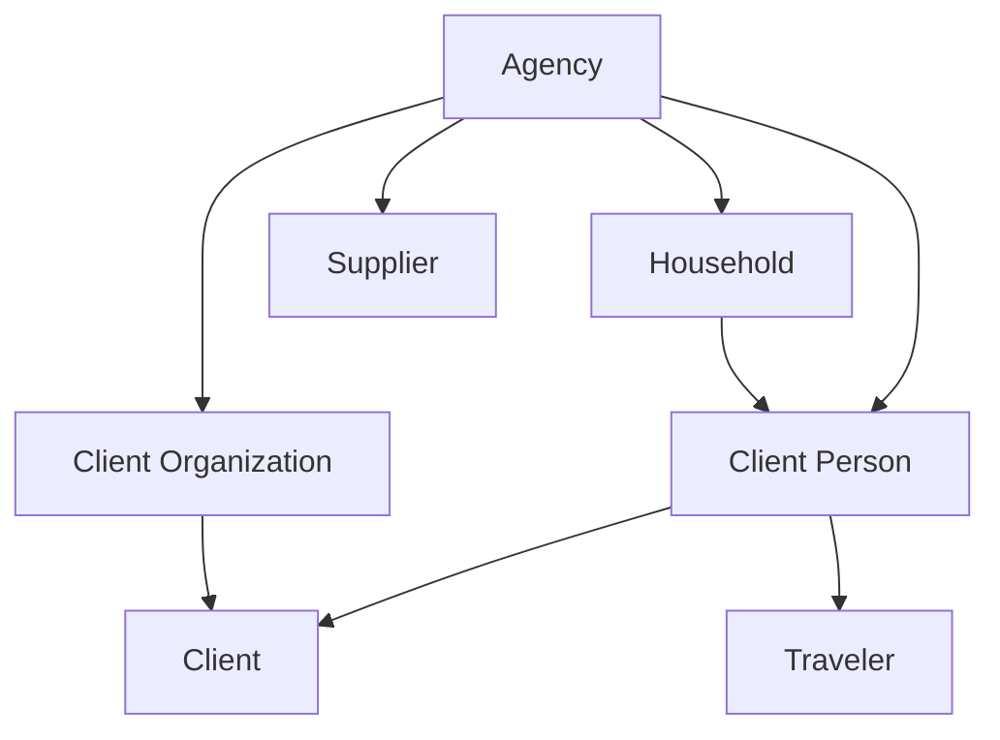

# M1 — Client and Supplier directories

**Status:** Draft planning contract; not implementation authority

**Decision posture:** The choices below are recommended defaults. Change the status to **Accepted** only after product review.

**Prerequisites:** [ADR 0005](../adr/0005-agency-identity.md), [ADR 0006](../adr/0006-separate-identity-domains.md), [MVP requirements](departure-desk-mvp.md), [current architecture](../architecture/current-state.md), and [interface contract](../ui/interface-contract.md)

## Goal

Give an Agency separate, searchable Client and Supplier directories without recreating a universal Party identity, coupling directory records to authentication, or prematurely adding Departures and commercial records.

M1 must leave the application ready to identify who may become responsible for a Client Trip, who may travel, who the Agency contracts with, and who may perform a service. It does not create a Departure, booking, price, capacity position, Charge, Receipt, Supplier Obligation, or payment.

## Outcomes and non-goals

M1 maintains individual and organization-backed Clients, minimal Traveler identity, Households, Client Organization contacts, organization/individual Suppliers, Supplier Locations and Contacts, categories, search, duplicate review, lifecycle, and audit history.

The following remain out of scope:

- Party, global person, global Supplier, and cross-domain links, matching, synchronization, or merge.
- Executable merge, aliases, absorbed-record tombstones, hard deletion, or automatic unmerge.
- Departures, Client Trips, Supplier Arrangements, Reservations, and Service Provider assignments.
- Portals, marketing consent, campaigns, bulk export, and support access.
- Passport, birth, medical, accessibility, loyalty, or trip-specific fulfillment facts.
- Client billing/credit settings, Supplier terms/tax/bank data, money, and documents.
- Contact verification, bounce processing, SMS consent, and delivery history.
- Executable erasure, anonymization, and legal-hold workflows. M1 only preserves the boundaries later privacy work needs.

## Delivery slices

Each slice includes its migration, schema dump, permissions, commands, audit actions, routes, UI, and tests.

| Slice | Working outcome |
| --- | --- |
| M1A | Individual Client vertical slice: Client Person, explicit Client, contact points, lifecycle, search, and duplicate review. |
| M1B | Minimal Traveler identity and Household membership/primary-contact workflows. |
| M1C | Client Organization, organization-backed Client, organization contacts, and expanded Client search. |
| M1D | Supplier core: organization/individual Suppliers, fixed categories, lifecycle, search, and duplicate review. |
| M1E | Supplier Locations and Supplier Contacts with contact methods and contextual roles. |
| M1F | Cross-slice hardening, scenario fixtures, accessibility/system proof, performance checks, and documentation acceptance. |

Duplicate and lifecycle protection ships with the first governed record; M1F does not postpone foundational safeguards.

## Locked boundaries

1. Every directory record carries a direct `agency_id`.
2. AgencyUser is never the root for a Client Person, Traveler, Supplier Contact, or Supplier.
3. Client Person and Supplier Contact remain separate even when they describe the same person.
4. `Client` is the commercial responsibility identity based on exactly one Client Person or Client Organization. It is not automatically the payer of a future Receipt.
5. A Client Person or Client Organization may exist without a Client. Client creation is explicit.
6. Client and Traveler identities are independently optional for a Client Person.
7. Household membership implies no travel, payment, occupancy, insurance, or legal relationship.
8. Supplier is the contracting/settlement counterparty. A later Arrangement identifies a distinct Service Provider explicitly.
9. Supplier Location is an operational place, not a Supplier or Service Provider.
10. Office provides no directory authorization. Records are Agency-wide.
11. Search and duplicate detection never cross Agency or identity-domain boundaries.
12. M1 exposes no tenant-facing hard delete.

## Aggregate and ownership model

Supplier owns Locations and Supplier Contacts. Client Organization references Client People through effective-dated contact assignments. Contact points belong to one aggregate through explicit foreign keys; M1 introduces no polymorphic `contactable` or universal contact owner.

## Client contracts

### Client Person and Client

- Client Person is a consumer-side person and requires first and last name. Middle name, suffix, preferred name, and pronouns are optional.
- Display name may use preferred name, but recorded full name remains available. Legal/travel names are not inferred.
- A person may have at most one Client and one Traveler in an Agency.
- Client creation is explicit. “New individual client” may create a person and Client atomically; person-only creation remains available for Traveler, Household, and organization-contact workflows.
- An active person/organization may be promoted to Client only when no Client exists for that source.
- Client stores no balance, terms, payment method, credit status, or statement configuration in M1.
- `CL-000001` is issued at Client creation, Agency-scoped, non-resetting, immutable, gap-tolerant, and never reused.

### Traveler

Traveler is an optional one-to-one identity based on Client Person. M1 stores identity, lifecycle, and audit history only. It means “available for future Traveler selection,” not booked or traveling. Date of birth, passport, nationality, accessibility, loyalty, preference, and age-at-travel facts remain deferred to the later assignment/profile contract.

### Household

- An active Household has at least one current member and exactly one current primary member.
- Membership is effective-dated; a person may be current in multiple Households.
- Household owns no contact points. Its contact view derives the primary member's preferred active destinations and identifies that source.
- Changing primary does not copy or alter either person's contacts.
- Relationship labels are descriptive free text and establish no legal/familial fact.

### Client Organization

- Requires display name; legal name and website are optional.
- May have one Client responsibility identity.
- Effective-dated contact assignments reference Client People. At most one current assignment is primary, but none is allowed.
- Contact role/title is descriptive and grants no access, payment authority, Traveler status, or Client responsibility.

## Supplier contracts

### Supplier

Supplier uses one table with constrained `kind` values `organization` and `individual`; Rails STI is prohibited. Organization requires display name. Individual requires first and last name. Legal name, DBA, business display name, and website are optional as applicable.

`SUP-000001` is issued at creation under the same rules as Client references. M1 stores no contracts, settlement instructions, tax IDs, credentials, or bank data.

### Categories

M1 uses a fixed multi-select catalog, not Agency-configurable category records:

| Code | Label |
| --- | --- |
| `cruise_line` | Cruise line |
| `lodging` | Lodging |
| `air` | Air carrier or consolidator |
| `ground_transportation` | Ground transportation |
| `tour_operator_dmc` | Tour operator or DMC |
| `dining` | Dining |
| `activity_attraction` | Activity or attraction |
| `insurance` | Travel insurance |
| `other` | Other |

`other` requires a concise assignment label. Categories support search/filter only; they determine no price, capacity, contract, or fulfillment behavior.

### Location and Contact

- Supplier Location belongs immutably to one Supplier and stores name, optional timezone, postal fields, phone, and lifecycle. It cannot move between Suppliers or act as a Service Provider.
- Supplier Contact belongs immutably to one Supplier and stores name, optional title/department, contextual role labels, emails, phones, and lifecycle.
- When a contact changes employer, inactivate the old record and create a new one. Never move or synchronize it.
- At most one active preferred Supplier Contact exists per Supplier; none is allowed.
- M1 scenario data includes a DMC and separate coach company so M3 can later assign contracting Supplier and distinct Service Provider. M1 creates no `ServiceProvider` table or relation.

## Persistence contract

### Shared columns

Mutable aggregate tables include UUIDv7 `id`, immutable `agency_id`, constrained `status` (`active`/`inactive`), nonnegative `lock_version`, and UTC `timestamptz` timestamps. Every tenant parent exposes unique `(id, agency_id)` for composite foreign keys.

### Tables

| Table | Required business columns | Optional columns and critical constraints |
| --- | --- | --- |
| `client_people` | `first_name`, `last_name` | `middle_name`, `suffix`, `preferred_forename`, <del>`pronouns`</del>; required names trimmed/nonblank. |
| `client_organizations` | `display_name` | `legal_name`; display name trimmed/nonblank. |
| `clients` | exactly one source ID; `client_reference` | Same-Agency source FKs; unique non-null source IDs; reference unique per Agency. |
| `travelers` | `client_person_id` | Same-Agency FK; one per person. |
| `households` | `name` | Active membership invariant enforced by deferred constraint trigger. |
| `household_memberships` | Household/person IDs, `starts_on`, `primary` | Optional `ends_on`, relationship label; one current row per pair; valid dates; one current primary. |
| `client_organization_contacts` | Organization/person IDs, `starts_on`, `primary` | Optional `ends_on`, title, role; one current pair; at most one current primary. |
| `suppliers` | `kind`, `supplier_reference` | Conditional name fields, `legal_name`, `doing_business_as`, `website`; database name-shape check. |
| `supplier_locations` | `supplier_id`, `name` | Timezone, address fields, phone; same-Agency Supplier FK. |
| `supplier_contacts` | `supplier_id`, first/last name, `preferred` | Title, department; same-Agency Supplier FK; at most one active preferred Contact per Supplier. |
| `supplier_category_assignments` | Supplier ID, category code | Unique pair; `other_label` required only for `other`. |
| `reference_sequences` | namespace, `next_value` | Unique Agency/namespace; positive bigint; namespaces `client`, `supplier`. |

### Contact-point tables

Use aggregate-specific tables, not polymorphic ownership:

- Client Person: `client_person_email_addresses`, `client_person_phone_numbers`, `client_person_postal_addresses`.
- Client Organization: corresponding `client_organization_*` tables.
- Supplier: `supplier_email_addresses`, `supplier_phone_numbers`, `supplier_postal_addresses`.
- Supplier Contact: `supplier_contact_email_addresses`, `supplier_contact_phone_numbers`.

Each carries direct `agency_id`, immutable owner ID, label (maximum 40), active/inactive status, `preferred`, lock version, and timestamps. Email stores display and lowercase-trimmed normalized address. Phone stores display value and digits-only search key; the search key is not an E.164 validity claim. Postal rows store lines, locality, region, postal code, and uppercase two-character country code.

Partial unique indexes allow at most one preferred active point per owner/channel. Setting preferred locks the owner/channel set and clears the old preference atomically. An owner may have none.

### Normalization and immutability

- Preserve display case/Unicode after trimming and collapsing internal whitespace.
- Search keys use Unicode NFKC, case folding, trim, and whitespace collapse.
- Database-generated/maintained search columns prevent stale keys.
- Normalize email to lowercase trimmed form, phone search to digits, website host to lowercase, and references to uppercase.
- References match `CL-[0-9]{6}` or `SUP-[0-9]{6}`. Names and contacts are not Agency-unique.
- Database triggers reject changes to `agency_id`, owner/source IDs, Supplier kind, and issued references. Models mirror them with read-only attributes.

### ADR 0004 reference amendment

| Attribute | Client | Supplier |
| --- | --- | --- |
| Namespace | `client` | `supplier` |
| Format | `CL-000001` | `SUP-000001` |
| Scope/reset | Agency; never Office; never resets | Agency; never Office; never resets |
| Issuance | Successful Client creation | Successful Supplier creation |
| Reuse/gaps | Never reused; gaps accepted | Never reused; gaps accepted |
| Concurrency | Lock Agency/namespace sequence row | Lock Agency/namespace sequence row |
| Retry | Existing reference consumes no number | Existing reference consumes no number |
| Import | Preserve legacy value in a separately named future external-reference record | Same |

## Same-Agency guarantees

| Child | Composite parent keys |
| --- | --- |
| Client | `(client_person_id, agency_id)` or `(client_organization_id, agency_id)` |
| Traveler | `(client_person_id, agency_id)` |
| Household membership | `(household_id, agency_id)` and `(client_person_id, agency_id)` |
| Organization contact | `(client_organization_id, agency_id)` and `(client_person_id, agency_id)` |
| Client contact point | Its Client Person or Client Organization owner plus Agency |
| Supplier Location/Contact/category | `(supplier_id, agency_id)` |
| Supplier contact point | Its Supplier or Supplier Contact owner plus Agency |
| Reference sequence | `agency_id` |

Cross-Agency combinations fail at the database even if application scoping is bypassed.

## Lifecycle and deactivation dependency catalog

M1 uses reversible active/inactive states only; no `closed` state or hard deletion.

| Record | Transition contract |
| --- | --- |
| Client Person | Inactivation blocked by active Client/Traveler, current Household membership, or current organization assignment; owned contacts inactivate atomically. Reactivation does not restore contacts. |
| Client | Source must be active to activate. Later milestones add trip/financial blockers. |
| Traveler | Person must be active to activate. Later assignments add blockers. |
| Household | Inactivation ends all current memberships on supplied date. Reactivation requires an active person as new primary. |
| Client Organization | Inactivation blocked by active Client and ends current contact assignments. Reactivation does not restore assignments. |
| Supplier | Inactivation blocked until Locations and Contacts are inactive. Later Arrangements/Obligations add blockers. |
| Location/Contact | Supplier must be active to activate. |
| Contact point | Owner must be active to activate; inactivation clears preferred. |

Ending a primary Household membership atomically transfers primary to another current member unless the Household is being inactivated. Removing the last current member from an active Household is rejected. Expected failures are not audited; successful transitions are audited in the same transaction.

## Permission catalog

| Permission | Administrator | Staff | Viewer |
| --- | ---: | ---: | ---: |
| `view_client_directory` | Yes | Yes | Yes |
| `manage_client_directory` | Yes | Yes | No |
| `override_client_duplicate` | Yes | Yes | No |
| `view_supplier_directory` | Yes | Yes | Yes |
| `manage_supplier_directory` | Yes | Yes | No |
| `override_supplier_duplicate` | Yes | Yes | No |

Viewing inactive records is included through an explicit filter. M1 adds no merge, export, or sensitive-data permission. Code checks catalog permissions, never roles. Viewer mutation produces no side effect or audit.

## Commands, locking, and errors

Commands start from `Current.agency`, require an active Agency and named permission, and translate expected database errors. Lock order is Agency, aggregate roots sorted by UUID, then child rows sorted by UUID.

| Command family | Behavior and idempotency |
| --- | --- |
| Create person/organization/Supplier | Normalize and recompute duplicates. Not an automated-retry API; repeat runs duplicate review. |
| Create Client/Traveler | Lock active source; existing one returns `already_exists` with the Agency-scoped record. |
| Update aggregate | Require `lock_version`; duplicate-review material identity/contact changes; same values no-op; stale returns `conflict`. |
| Change status | Enforce dependency table; already at target is no-op without another audit. |
| Manage contact point | Lock owner/channel rows; create, update, inactivate, or set preferred atomically. |
| Manage Household | Create with primary; add/end membership; transfer primary; inactivate/reactivate. |
| Manage organization contacts | Add/end assignment and select optional primary. Existing current pair returns `already_exists`. |
| Replace categories | Replace submitted set under Supplier lock; same set is no-op. |
| Issue reference | Lock namespace sequence and assign in creation transaction; existing reference consumes no number. |

Cross-Agency/missing IDs raise not found. Domain error codes are `unauthorized`, `invalid`, `invalid_state`, `dependency_exists`, `duplicate_review_required`, `already_exists`, and `conflict`.

### Command inventory

| Slice | Commands and query objects |
| --- | --- |
| M1A | `CreateClientPerson`, `CreateIndividualClient`, `CreateClientForPerson`, `UpdateClientPerson`, `ChangeClientPersonStatus`, `ChangeClientStatus`, Client Person contact-point commands, `SearchClientDirectory`, `FindClientPersonDuplicates` |
| M1B | `CreateTraveler`, `ChangeTravelerStatus`, `CreateHousehold`, `UpdateHousehold`, `AddHouseholdMember`, `EndHouseholdMembership`, `ChangeHouseholdPrimary`, `ChangeHouseholdStatus` |
| M1C | `CreateClientOrganization`, `CreateClientForOrganization`, `UpdateClientOrganization`, `ChangeClientOrganizationStatus`, organization contact-point commands, `AddClientOrganizationContact`, `EndClientOrganizationContact`, `ChangeClientOrganizationPrimaryContact`, expanded Client search/duplicates |
| M1D | `CreateSupplier`, `UpdateSupplier`, `ChangeSupplierStatus`, `ReplaceSupplierCategories`, Supplier contact-point commands, `SearchSupplierDirectory`, `FindSupplierDuplicates` |
| M1E | `CreateSupplierLocation`, `UpdateSupplierLocation`, `ChangeSupplierLocationStatus`, `CreateSupplierContact`, `UpdateSupplierContact`, `ChangeSupplierContactStatus`, `SetPreferredSupplierContact`, Supplier Contact contact-point commands, Location/Contact duplicate queries |

Each contact-point family has explicit create, update, change-status, and set-preferred commands. Shared private implementation is allowed, but public commands remain domain-named and accept only their declared owner types.

## Audit contract

Extend `AuditEvent::SUBJECT_TYPES` only as slices introduce aggregate roots. Child/contact commands use their owner as subject.

| Subject type | Closed action catalog additions |
| --- | --- |
| `ClientPerson` | `client_person.created`, `.updated`, `.inactivated`, `.reactivated`, `.contact_updated`, `.duplicate_override` |
| `Client` | `client.created`, `.inactivated`, `.reactivated` |
| `Traveler` | `traveler.created`, `.inactivated`, `.reactivated` |
| `Household` | `household.created`, `.updated`, `.member_added`, `.member_ended`, `.primary_changed`, `.inactivated`, `.reactivated` |
| `ClientOrganization` | `client_organization.created`, `.updated`, `.contact_updated`, `.contact_added`, `.contact_ended`, `.primary_contact_changed`, `.inactivated`, `.reactivated`, `.duplicate_override` |
| `Supplier` | `supplier.created`, `.updated`, `.categories_changed`, `.contact_updated`, `.inactivated`, `.reactivated`, `.duplicate_override` |
| `SupplierLocation` | `supplier_location.created`, `.updated`, `.inactivated`, `.reactivated`, `.duplicate_override` |
| `SupplierContact` | `supplier_contact.created`, `.updated`, `.contact_updated`, `.inactivated`, `.reactivated`, `.duplicate_override` |

Audit details contain IDs, status transitions, changed field names, candidate IDs/signal names, dates, and category codes. They never copy names, email, phone, address, free text, or future sensitive Traveler facts.

## Search contract

Client and Supplier search are separate, permission-gated query objects scoped from `Current.agency`.

- Normalize NFKC/case/whitespace; reject blank or over-100-character queries without scanning.
- References and emails use exact matching; digit-heavy input uses phone digits.
- Name queries require all tokens to match normalized word prefixes; no trigram/fuzzy matching.
- Default to active; explicit filter includes inactive.
- Rank exact reference, email, phone, full name, then all-token prefix; break ties by active status, display name, UUID.
- Cap at 50 and state when truncated.

Client search covers Client reference, Person name/contact, Organization name/contact/website, and Household/primary-member name. Supplier search covers Supplier reference/name/contact/category, Location name/locality/postal code, and Supplier Contact name/contact. Results show type/status and subordinate results link to their owner. Neither directory returns records from the other or AgencyUsers.

## Duplicate contract

Detection runs on create and material identity/contact changes within the same Agency and record kind.

| Kind | Signal weights |
| --- | --- |
| Client Person | email 80; phone 70; exact full name 35; postal code 25 |
| Client Organization | display/legal name 70; email/website host 60; phone 50; postal code 20 |
| Supplier | legal/display/DBA name 70; email/website host 60; phone 50; locality+postal 25 |
| Location within Supplier | postal address 70; exact name 40 |
| Contact within Supplier | email 80; phone 70; exact name 40 |

Count each signal category once. `80+` is strong, `50–79` possible, lower hidden. Inactive candidates remain labeled. Shared contact values are warnings, never uniqueness rules.

When candidates exist, return `duplicate_review_required`. Show only already-authorized fields. The user may choose an existing record or resubmit **Create anyway** with reason. The command recomputes candidates in its transaction and audits candidate IDs/signals without PII. Existing Client/Traveler for a source is a non-overridable `already_exists` outcome. M1 has no contractually unique external identifiers.

## Privacy and retention hooks

- Inactive records remain historical and are excluded from ordinary search by default.
- No UI or general command performs hard deletion, redaction, anonymization, or export.
- M1 stores no passport, birth, medical, payment, tax, banking, or uploaded-document data.
- Contact points may be inactivated without erasing their historical rows.
- Audit payloads do not duplicate contact values or free text.
- Future privacy work must define dependencies across trips, assignments, documents, communications, posted money, Supplier history, and legal holds before any destructive operation exists.
- Fixtures and development seeds contain obviously fictional data only.

## Routes and UI surfaces

Add separate **Clients** and **Suppliers** navigation; do not restore a Party-oriented Directory route.

| Surface | Contract |
| --- | --- |
| `/clients/people` | Client People browse/search with typed results, active default, inactive filter, and one primary create action. |
| `/clients/people/:id` | Display-first identity/contacts with Client, Traveler, Household, and organization-contact panels. |
| Client action | Create from new/eligible existing source; never label Client as payer of every Receipt. |
| `/clients/households` and `/:id` | Current primary/members, ended history, add/end/transfer, and derived contact source. |
| `/clients/organizations` and `/:id` | Identity, Client state, current/historical contacts, and contact methods. |
| `/suppliers` and `/:id` | Category/status filters; contracting identity, categories, contact points, Locations, Contacts, lifecycle. |
| Duplicate review | Preserve submission; explain matches; View existing, Return to edit, or Create anyway with reason. |
| Lifecycle confirmation | List blockers/effects; keep lifecycle actions out of ordinary edit footers. |

Use desktop tables and accessible narrow stacked rows. Search works without JavaScript. Contact editors use dedicated pages or one open inline form, never many expanded forms.

## Accessibility and states

Every surface requires headings/landmarks, skip-link behavior, visible labels/focus, full keyboard order, associated error summary, preserved values after every failure, actionable first-use and filtered-empty states, textual status, no hover-only action, explicit unauthorized/not-found handling, and tested reflow at 375px, 768px, reference desktop, and 1280px.

## Test matrix

| Layer | Minimum proof |
| --- | --- |
| Migration/schema | UUIDv7/timestamptz, named constraints, exact-one Client source, unique roles, partial preferred indexes, references, deferred Household invariant. |
| Database isolation | Composite FKs reject every cross-Agency pairing; triggers reject tenant/source/owner/reference mutation. |
| Model | Supplier name shapes, normalization, dates, lifecycle, contact preference, no implicit cross-domain association. |
| Command | Success, invalid, unauthorized, inactive Agency, stale, not found, dependency, no-op, duplicate override, audit atomicity. |
| Concurrency | Parallel Client/Traveler creation, reference issuance, preferred changes, Household primary transfer, lifecycle conflicts. |
| Search | Ranking, shapes, truncation, inactive filter, domain separation, bounds, cross-Agency isolation. |
| Request/system | Viewer rejection, Staff/Admin success, 404 isolation, preserved errors, keyboard create/search/duplicate/lifecycle, responsive navigation. |
| Regression | Existing authentication, administration, Office, invitation/recovery, and isolation tests remain green. |

Each UI slice runs the Rails suite, CI browser tests, and Tailwind build. Migrations work from an empty primary database and update `db/structure.sql`; queue persistence is unchanged.

## Acceptance scenarios

- Martha Smith has Client and Traveler identities. Daniel and Emily may share her Household without inferred roles.
- Olivia Brown has a Client and may later be responsible for Noah Brown without traveling.
- Westlake Foods is an organization-backed Client with contacts; sponsoring employees does not make it a Traveler.
- An AgencyUser who travels has separate Client Person/Traveler records with no synchronization.
- Celebrity Cruises is a Supplier with categories, Contacts, and operational Locations.
- A Vineyard Tour DMC and motorcoach company remain separate Suppliers so later contracting/performance references can differ.
- A Supplier Contact and Client Person may share email without linkage or cross-directory warning.
- Same-email Client People in two Agencies do not collide or disclose each other.
- Likely duplicates require existing selection or audited override; forged cross-Agency IDs return not found.

## Exit gate

M1 is complete only when every slice is accepted and implemented; both scenarios contain enough directory fixtures for M2; lifecycle, permission, audit, normalization, duplicate, reference, and tenancy contracts pass; no Party/global User/polymorphic identity/Office authorization/cross-domain sync/automatic merge has returned; shipped documentation is current; and full CI is green.

When this plan is accepted, amend MVP uses of “payer identity” to **commercial responsibility identity**; `Payer` remains the actual source of a future Receipt. As each slice ships, update `AGENTS.md`, current architecture, terminology, interface navigation, and the documentation index so implemented scope remains distinguishable from the rest of M1.

## Decisions resolved by this draft

- Explicit Client creation; Client means responsibility identity, while Payer remains a future Receipt fact.
- Minimal Traveler identity, with sensitive/trip facts deferred.
- Household contact derived from its primary member.
- One organization/individual Supplier table without STI.
- Location is not a Service Provider; Contacts never move between Suppliers.
- Fixed Supplier category catalog.
- Aggregate-specific contact tables, reversible active/inactive lifecycle, and no hard deletion.
- Merge, bulk export, contact verification/consent, and executable erasure deferred.
