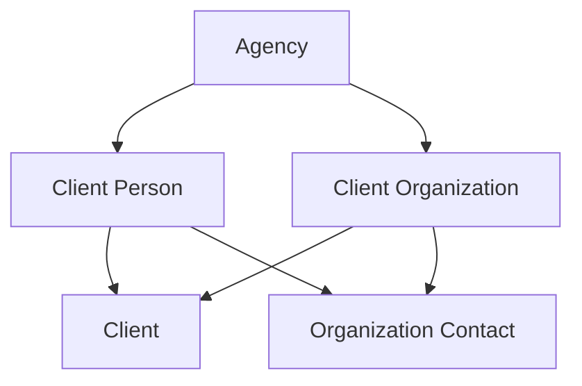

# M1B — Client Organizations

**Status:** Shipped

**UI amendments (2026-09-14):** Organization contact-point lists may `POST .../set_primary` with `lock_version`, matching the individual-Client people list. The organization-contact create form does not collect `starts_on` or `ends_on`; create always starts on the Agency-local business date as a current assignment, and ending uses the End action on the organization profile. Contact-point audits include `contact_point_id`, `contact_point_type`, and `changed_fields`. Postal duplicate review requires a matching Organization name plus locality or postal code. Existing-person assignment uses an Agency-scoped person search with an explicit result cap.

**Parent:** [M1 — Client and Supplier directories](m1-client-and-supplier-directories.md), accepted 2026-09-14

**Prerequisites:** M1A merged into `main`; all M1A tenancy, duplicate-token, audit, normalization, sequence, and search hardening complete; ADR 0004, ADR 0005, ADR 0006, and the current agency-identity implementation.

This slice adds organization identities to the Client domain. It extends the existing Client directory rather than creating a second directory or introducing a universal Party abstraction.

## Goal

Allow an Agency to maintain Client Organizations, give an organization an explicit Client responsibility identity, associate Client People as effective-dated organization contacts, and search People and Organizations through one permission-safe Client directory.

## In scope

M1B ships:

* Client Organization creation, display, editing, and lifecycle;
* organization-backed Client creation;
* conversion of `Client` from a required Person source to exactly one Person or Organization source;
* organization-owned email, phone, postal, and website contact points;
* effective-dated Client Organization contact assignments;
* current and historical organization-contact display;
* explicit optional primary organization contact;
* creation of a person-only Client Person while adding an organization contact;
* expanded Client search across People and Organizations;
* People, Organizations, and combined Client-directory views;
* the sole M1 use of `btree_gist`, for organization-contact history overlap prevention.

## Out of scope

Do not implement:

* Suppliers, Supplier Locations, Supplier Contacts, or Supplier permissions;
* Household, Family, reusable servicing group, or personal relationship records;
* Traveler or Traveler Assignment;
* Payer, billing terms, credit status, statement preferences, or money;
* communication authority or organization-contact purposes such as billing contact or group leader;
* contact verification, consent, suppression, bounce, or communication history;
* organization hierarchy, subsidiaries, departments, or organization merging;
* cross-domain matching or synchronization;
* Office attribution, ownership, filtering, defaults, or authorization;
* Client merge, aliases, tombstones, hard deletion, or anonymization;
* any additional use of `btree_gist`.

No M1B record is a Supplier or Service Provider merely because the same organization exists in another context.

## Locked boundaries

1. `ClientOrganization` belongs directly and immutably to one Agency.
2. A Client Organization may exist without a Client.
3. Client creation remains explicit.
4. A `Client` belongs to exactly one Client Person or one Client Organization, never both and never neither.
5. An inactive Client permanently occupies its source’s one-Client slot.
6. Organization contacts reference existing Client People in the same Agency.
7. An organization-contact assignment creates no Client, Traveler, payment authority, communication authority, application access, or trip role.
8. The same Client Person may be a current contact for multiple organizations.
9. Repeated assignments between the same Organization and Person are separate, nonoverlapping historical rows.
10. “Current” means exactly `ends_on IS NULL`.
11. Office has no M1B persistence or behavioral role.
12. Client Person and Client Organization duplicate detection remain separate record-kind searches.
13. M1B enables `btree_gist` only for the named organization-contact history exclusion constraint.

## Aggregate model



`Client` uses explicit nullable foreign keys plus an exactly-one constraint. It does not use polymorphic associations, STI, or an abstract identity table.

## Persistence

Add one forward M1B migration and regenerate `db/structure.sql`. Do not modify queue persistence. Enable `btree_gist` on the primary database only. Do not add that extension to `db/queue_structure.sql`.

### `client_organizations`

| Attribute      | Contract                       |
| -------------- | ------------------------------ |
| `id`           | UUIDv7                         |
| `agency_id`    | Required and immutable         |
| `display_name` | Required, trimmed and nonblank |
| `legal_name`   | Optional, trimmed              |
| `status`       | `active` or `inactive`         |
| `lock_version` | Required, nonnegative          |
| timestamps     | UTC `timestamptz`              |

Add:

* unique `(id, agency_id)` for composite foreign keys;
* stored `display_name_search_key` and `legal_name_search_key`, each `dd_search_normalize` of that column;
* stored organization-name search vector as `to_tsvector('simple', …)` of those keys combined with `||` and `coalesce`, not `concat_ws`. `concat_ws` is `STABLE` on PostgreSQL 18.6, so a generated column that calls it is rejected;
* Agency-scoped indexes supporting exact and all-token prefix search;
* a table-specific trigger rejecting `agency_id` changes.

Do not add `office_id`, a website column, billing fields, or Supplier fields.

### Widen `clients`

Make `client_person_id` nullable, then add nullable `client_organization_id`. Existing individual Clients retain their current source and reference.

Enforce:

```sql
CHECK (num_nonnulls(client_person_id, client_organization_id) = 1)
```

The current unique index `index_clients_on_client_person_id` stays a null-distinct unique index. Do not recreate it as `NULLS NOT DISTINCT`. PostgreSQL treats nulls as distinct, so organization-only Clients do not collide on that index. Add a separate partial unique index on non-null `client_organization_id`. That is the one-Client-per-Organization rule. One Client per non-null Person source remains the person index, across all statuses.

Add:

* same-Agency composite foreign key for the Organization source;
* `attr_readonly` for both `client_person_id` and `client_organization_id`, not only the trigger;
* an updated identity trigger rejecting changes to either source ID, `agency_id`, or `client_reference`.

A direct write must not move a Client from a Person to an Organization, or clear its only source. The trigger rejects both.

The Rails model has optional `belongs_to` associations to both possible source classes plus an exactly-one validation. A `source` method may return the populated association, but no polymorphic `source_type` column is introduced.

Client status, reference issuance, lifecycle, and reference namespace remain unchanged. M1B creates no new reference sequence.

### Organization contact points

Create aggregate-specific tables:

* `client_organization_email_addresses`
* `client_organization_phone_numbers`
* `client_organization_postal_addresses`
* `client_organization_websites`

Each uses the M1A contact-point contract:

* direct immutable `agency_id`;
* immutable `client_organization_id`;
* label of at most 40 characters;
* `active` or `inactive`;
* optional preferred flag with at most one preferred active row per channel;
* nonnegative `lock_version`;
* same-Agency composite foreign key;
* UUIDv7 and `timestamptz`;
* no polymorphic ownership.

Email, phone, postal, and country behavior inherit M1A’s hardened normalizers and constraints.

### Website normalization

Add `WebsiteNormalizer`. If it calls Addressable directly, declare Addressable as a direct Gemfile dependency.

Store:

* user-facing `url`;
* canonical `normalized_url`;
* lowercase ASCII `normalized_host`.

The normalizer:

* accepts HTTP, HTTPS, or a schemeless hostname/path;
* adds `https://` when omitted;
* rejects unsupported schemes, credentials, control characters, internal whitespace, malformed ports, and missing hosts;
* converts IDNA hostnames to ASCII;
* lowercases scheme and hostname;
* removes default ports, fragments, a hostname trailing dot, and a root-only trailing slash;
* preserves meaningful path and query components.

Website hostname equality is a weak duplicate signal. It is not unique, and `www.example.com` is not automatically equivalent to `example.com`.

### `client_organization_contacts`

| Attribute                | Contract                                |
| ------------------------ | --------------------------------------- |
| `id`                     | UUIDv7                                  |
| `agency_id`              | Required and immutable                  |
| `client_organization_id` | Required and immutable                  |
| `client_person_id`       | Required and immutable                  |
| `starts_on`              | Required inclusive business date        |
| `ends_on`                | Optional inclusive business date        |
| `title`                  | Optional descriptive title              |
| `role_label`             | Optional descriptive relationship label |
| `primary`                | Required boolean, default false         |
| `lock_version`           | Required, nonnegative                   |
| timestamps               | UTC `timestamptz`                       |

The row has no lifecycle status. It is current exactly when `ends_on IS NULL`.

Database constraints require:

* `ends_on IS NULL OR ends_on >= starts_on`;
* same-Agency composite foreign keys to both Organization and Person;
* one current row per Organization/Person pair;
* at most one current primary per Organization;
* no overlapping periods for the same Agency, Organization, and Person.

Enable `btree_gist` immediately before adding this one exclusion constraint:

```sql
EXCLUDE USING gist (
  agency_id WITH =,
  client_organization_id WITH =,
  client_person_id WITH =,
  daterange(
    starts_on,
    COALESCE(ends_on + 1, 'infinity'::date),
    '[)'
  ) WITH &&
)
```

Give the constraint a durable name such as:

```text
client_org_contacts_no_overlapping_history
```

No other M1 table or query may use `btree_gist`. The extension is primary-database only. Record that exception in `AGENTS.md`.

## Assignment date behavior

Calculate the current business date using the Agency’s stored IANA `default_timezone`.

* `starts_on` and `ends_on` are inclusive.
* Neither may be in the future.
* Tenant create always starts on the current Agency-local business date with `ends_on = NULL`. The create form does not collect either date.
* Command-level create may still accept an explicit historical window when both dates are populated; the tenant UI does not.
* A historical assignment cannot be created as primary.
* Ending a current assignment from the organization profile sets `ends_on` to the current Agency-local business date.
* Ending clears its `primary` flag.
* An ended assignment cannot be reopened by clearing `ends_on`; a later relationship creates a new row.
* Editing may correct `starts_on`, title, or role label.
* General editing cannot change parent IDs, `ends_on`, or `primary`.
* Date correction remains subject to the exclusion constraint.
* Adjacent periods are valid; overlapping periods are not.
* Because the exclusion range is `[starts_on, ends_on + 1)`, an assignment ended on today’s Agency-local date cannot be replaced by a new row for the same Person and Organization until the next business date. January 31 followed by February 1 remains valid. A restart on the ending date is not.
* Both current and historical assignment creates require an active Organization and an active Client Person. An inactive Organization cannot receive a new assignment. An inactive Person cannot be assigned, including historically.

## Lifecycle

### Client Organization

Organization inactivation is blocked by an active Client.

When no active Client exists, inactivation atomically:

1. Locks the Agency and Organization.
2. Locks current assignments and owned contact points in deterministic order.
3. Ends every current assignment on the Agency-local business date.
4. Clears affected assignment primary flags.
5. Inactivates every active organization contact point.
6. Clears affected preferred flags.
7. Inactivates the Organization.
8. Writes one root lifecycle audit containing affected IDs and types.

Any failure rolls back the complete transition.

Reactivation restores only the Organization. It does not restore:

* its Client;
* contact destinations;
* organization-contact assignments; or
* primary/preferred selections.

### Client Person

Extend Person inactivation so any current organization-contact assignment returns `dependency_exists`. The Person must first be removed from or ended in every current assignment.

Keep the existing contact-point cascade. Before that decision, lock the Agency, then the relevant Organizations and assignment rows in UUID order, then the Person, then the Person’s contact points. Do not lock the Person first and then look up assignments. That order matches assignment creation and avoids a deadlock with `AddClientOrganizationContact`.

Person reactivation does not recreate those assignments.

### Client

Generalize Client lifecycle commands so they lock and validate whichever source is populated.

* The source must be active to create or reactivate the Client.
* Inactivate Client before its Organization source.
* Reactivate Organization before explicitly reactivating Client.
* An inactive Client continues to occupy the source slot and retain its reference.

### Contact points

Organization must be active to create or reactivate an owned contact point. Inactivation clears preferred. Organization reactivation does not restore contact points.

## Commands

Add these public commands:

### Organization identity

* `CreateClientOrganization` — `POST /clients/organizations`. Creates an Organization and no Client.
* `CreateOrganizationClient` — `POST /clients` when the form chooses Organization. Creates the Organization and its Client atomically. Do not post that choice to `POST /clients/organizations`.
* `CreateClientForOrganization` — `POST /clients/organizations/:client_organization_id/client`. Promotes an existing active Organization. Does not repeat source duplicate review.
* `UpdateClientOrganization`
* `ChangeClientOrganizationStatus`
* `FindClientOrganizationDuplicates`

### Organization contact points

For email, phone, postal, and website:

* `CreateClientOrganization…`
* `UpdateClientOrganization…`
* `ChangeClientOrganization…Status`
* `SetPreferredClientOrganization…`

There is a tenant-facing `POST .../set_primary` row action for these contact points, matching the individual-Client people list. It requires `lock_version`, locks that channel’s rows in UUID order, and writes no second audit when preferred is unchanged. The ordinary edit PATCH may also update preferred state.

### Organization-contact assignments

* `AddClientOrganizationContact`
* `CreateClientPersonAndOrganizationContact`
* `UpdateClientOrganizationContact`
* `EndClientOrganizationContact`
* `ChangeClientOrganizationPrimaryContact`

`AddClientOrganizationContact` selects an existing active Client Person. The Organization must also be active. That applies to current and historical creates.

`CreateClientPersonAndOrganizationContact` owns one transaction:

1. Lock Agency and Organization.
2. Normalize the proposed Person.
3. Run Client Person duplicate review.
4. Create the person-only Client Person when acknowledged.
5. Create its organization-contact assignment.
6. Write `client_person.created` and any `client_person.duplicate_override` on the Person subject, and `client_organization.contact_added` on the Organization subject.
7. Commit everything or nothing.

A person-name review does not write `client_organization.duplicate_override`. It never creates a Client.

If the user selects an existing duplicate candidate, use `AddClientOrganizationContact` with that existing Person instead.

`UpdateClientOrganizationContact` may change only `starts_on`, `title`, and `role_label`. It requires `lock_version`.

`EndClientOrganizationContact` requires the submitted `lock_version` and locks assignment rows in UUID order. It may accept an optional current replacement assignment. If the ended row is primary, the command either leaves no primary or selects that replacement atomically. An already-ended assignment is a no-op without another audit when the submitted version still matches.

`ChangeClientOrganizationPrimaryContact`:

* requires the submitted `lock_version`;
* accepts only a current assignment;
* locks assignment rows in UUID order;
* clears the former current primary;
* sets the selected assignment primary;
* is a no-op without another audit when already selected.

### Existing commands to generalize

Update:

* `ChangeClientStatus`
* Client associations and source helpers
* `SearchClientDirectory`
* duplicate-token result validation
* Client reference creation paths

Do not duplicate the M1A reference issuer or introduce an Organization-specific Client reference namespace.

### Lock order

All commands first verify that the actor is active, belongs to the supplied Agency, and has the named permission. A mismatch is generic `unauthorized`, with no candidates, results, side effects, or audit. Do not return an empty result set for that mismatch.

After locking the Agency:

1. Client Organization
2. Client Person
3. Client
4. Assignment rows by UUID
5. Contact-point rows by UUID

Commands that do not touch a class skip it. The Agency lock continues to serialize competing directory mutations within that Agency.

Cross-Agency identifiers return not found without exposing the foreign record.

## Duplicate review

Organization duplicate detection never compares against Client People, Suppliers, or AgencyUsers. Email, phone, and website signals are included only when the actor has `view_client_contact_details`. A mismatch of actor and Agency is generic `unauthorized` and returns no candidates.

### Signals

| Signal                                            | Strength |
| ------------------------------------------------- | -------- |
| Exact normalized email                            | Strong   |
| Same E.164 base and extension                     | Strong   |
| Exact display or legal name                       | Weak     |
| Name plus matching locality or postal code        | Weak     |
| Same normalized website hostname                  | Weak     |
| Same phone base with differing or blank extension | Weak     |

Creating an Organization or organization-backed Client initially reviews the supplied organization identity fields. Adding or materially changing a contact point reruns Organization duplicate review using that destination.

`CreateOrganizationClient` owns source creation, Client creation, reference issuance, duplicate acknowledgement, and audits in one transaction. It does not compose public create commands.

`CreateClientForOrganization` uses an existing active Organization and does not repeat source duplicate review.

Duplicate tokens inherit the hardened M1A behavior:

* result IDs and context IDs are distinguished; on a contact-point token the Organization ID is owner context and the contact-point ID is the proposed result;
* replay checks only proposed results;
* update tokens bind target ID and expected lock version;
* candidates are recomputed under the Agency lock;
* audit payloads include candidate IDs, named signals, and reason;
* replay writes no second reference or audit;
* partial composite results return `conflict`.

## Search

Extend `SearchClientDirectory`; do not create a separate Organization search endpoint.

The query parameter may stay `kind` for the directory filter:

* `all` — default;
* `people`;
* `organizations`.

Do not reuse the result field `kind`. `SearchClientDirectory::Result` already uses `kind` for the match family (`reference`, `email`, `phone`, `name`, `name_prefix`, `postal`). Add a record-type field, `person` or `organization`. The query param and the result field are different facts.

The record-type filter and the 51-row cap both happen in SQL. Filtering Organizations after the current people-only limit is invalid. A query that should return Organizations must not first fill the cap with People and then discard them.

The `kind` and status filters work with or without `q`. Reset clears all three. The landing list with no `q` — People, Organizations, and All — uses the same 50-plus-lookahead cap and truncation message. Today the no-`q` people list loads 50 rows and sets no truncation flag. That path changes in this slice.

### Searchable fields

Administrators and Staff may match:

* Client reference;
* Organization display and legal names;
* organization email;
* organization phone;
* organization postal code and locality;
* organization website hostname;
* existing permitted Client Person fields.

Viewers may match:

* Client reference;
* Client Person display name;
* Client Organization display and legal names.

Hidden Organization destinations must not influence a Viewer’s results, ranking, excerpts, counts, or truncation state. Phone search still requires at least seven digits. A shorter digit string is not a phone match and does not change ranking or truncation.

### Ranking

1. Exact Client reference
2. Exact email
3. Exact phone
4. Exact Person or Organization name
5. All-token name prefix
6. Postal, locality, or website-host match

Ties among equal ranks break by active status, display name, record type, then UUID. Record type uses a fixed person-before-organization order so tests are deterministic. Do not sort record type by the match-family `kind`.

Search returns at most 50 distinct source identities plus one lookahead row for truncation. Enforce this in SQL, including the no-`q` browse, rather than loading every match before truncating in Ruby.

Add stored generated name keys/vectors and indexed contact search keys equivalent to the hardened M1A implementation, including `||` and `coalesce` rather than `concat_ws`. Search results carry record type `person` or `organization`, show source status and optional Client reference/status, and link to the source profile.

## Permissions

M1B adds no permission names.

Reuse:

| Permission                    | Administrator | Staff | Viewer |
| ----------------------------- | ------------: | ----: | -----: |
| `view_client_directory`       |           Yes |   Yes |    Yes |
| `view_client_contact_details` |           Yes |   Yes |     No |
| `manage_client_directory`     |           Yes |   Yes |     No |

Viewer may see Organization identity, lifecycle, Client state, and named Client People assigned as contacts because those people are visible Client-domain identities. Viewer does not see organization contact destinations.

Office selection changes no permission or search result.

## Routes

Add the parent contract’s exact Organization routes:

```text
GET   /clients/organizations
GET   /clients/organizations/new
POST  /clients/organizations
GET   /clients/organizations/:client_organization_id
GET   /clients/organizations/:client_organization_id/edit
PATCH /clients/organizations/:client_organization_id
GET   /clients/organizations/:client_organization_id/status/edit
PATCH /clients/organizations/:client_organization_id/status

POST  /clients/organizations/:client_organization_id/client
GET   /clients/organizations/:client_organization_id/client/status/edit
PATCH /clients/organizations/:client_organization_id/client/status

GET   /clients/organizations/:client_organization_id/contacts
GET   /clients/organizations/:client_organization_id/contacts/new
POST  /clients/organizations/:client_organization_id/contacts
GET   /clients/organizations/:client_organization_id/contacts/:organization_contact_id
GET   /clients/organizations/:client_organization_id/contacts/:organization_contact_id/edit
PATCH /clients/organizations/:client_organization_id/contacts/:organization_contact_id
GET   /clients/organizations/:client_organization_id/contacts/:organization_contact_id/end
PATCH /clients/organizations/:client_organization_id/contacts/:organization_contact_id/end
PATCH /clients/organizations/:client_organization_id/contacts/:organization_contact_id/primary
```

Add standard contact-point routes beneath the Organization for:

* `email-addresses`
* `phone-numbers`
* `postal-addresses`
* `websites`

Do not add:

* a generic duplicate-review route;
* a standalone Client detail page;
* an organization contact-point `/preferred` route distinct from `set_primary`;
* `/administration` directory routes;
* alternate route shapes.

`GET /clients/new` asks Individual or Organization. Individual still posts to the existing person create path. Organization posts to `POST /clients` and `CreateOrganizationClient` creates the Organization and Client atomically. `POST /clients/organizations` remains organization-without-Client.

New organization controllers inherit `ApplicationController` and include `DirectoryAccess`. They do not inherit `Administration::BaseController`.

## UI

### Client directory

The Clients landing page gains:

* All
* People
* Organizations

Each row identifies record type (`person` or `organization`), source status, Client reference, and Client status without implying that every source is a Client. Do not label that column with the search match-family `kind`.

### Organization profile

Use a display-first page containing:

* Organization identity and lifecycle;
* Client state and reference;
* email, phone, postal, and website panels;
* current organization contacts;
* historical organization contacts;
* explicit primary indicator;
* focused add/edit/end/primary actions.

No contact assignment implies authority or responsibility.

### Person profile

Add current and historical Organization assignments. Do not infer employment, family, Client responsibility, or trip participation from them.

### States

Provide:

* first-use and filtered-empty states;
* duplicate-review state with **View existing**, **Return to edit**, and **Create anyway**;
* invalid and expired-token states;
* lifecycle blocker and cascade confirmation;
* no-current-primary state;
* Viewer contact-redacted state;
* stale assignment conflict;
* responsive tables/stacked rows;
* complete keyboard and focus behavior.

## Audit

Add `ClientOrganization` to both the subject catalog and the subject/Agency guard.

Add the parent actions:

```text
client_organization.created
client_organization.updated
client_organization.contact_updated
client_organization.contact_added
client_organization.contact_ended
client_organization.primary_contact_changed
client_organization.inactivated
client_organization.reactivated
client_organization.duplicate_override
```

Use `client_organization.contact_updated` for both:

* owned contact-point changes; and
* assignment metadata changes.

Details distinguish them using IDs and changed-field names.

Organization inactivation audits affected assignment and contact-point IDs and types. Duplicate overrides audit candidate IDs, signal names, and reason codes. Never copy names, destinations, URLs, titles, role labels, or unrestricted text into audit JSON.

Client creation and lifecycle continue to use the existing Client subject/actions.

## Tests

M1B must add proof for:

### Migration and database

* Migration succeeds over the current M1A schema.
* Existing individual Clients remain valid and unchanged.
* Client with neither source is rejected.
* Client with both sources is rejected.
* `client_person_id` remains null-distinct unique. The index is not `NULLS NOT DISTINCT`. Two organization-only Clients do not collide on it.
* Non-null `client_organization_id` has its own partial unique index.
* A direct write cannot move a Client from Person to Organization or clear its only source.
* Duplicate Client for either source is rejected across all statuses.
* Every cross-Agency Organization, Client, assignment, and contact-point pairing is rejected.
* Organization/source/assignment/contact ownership is immutable.
* `btree_gist` exists and is used only by the named exclusion constraint.
* Overlapping assignment ranges are rejected.
* Adjacent ranges are accepted.
* An assignment ended on today’s Agency-local date cannot be replaced the same day.
* A restart on the next Agency-local business date is accepted.
* Current-pair and current-primary partial uniqueness hold.
* No M1B table has `office_id`.

### Commands and lifecycle

* `POST /clients` with Organization chosen creates a Client. `POST /clients/organizations` does not.
* Organization-only and organization-backed Client creation.
* Composite creation rolls back source, Client, reference, and audits when review is required.
* Existing inactive Client returns `already_exists`.
* Organization-before-Client reactivation order.
* Active Client blocks Organization inactivation.
* Organization inactivation ends assignments and inactivates destinations atomically.
* Reactivation restores no dependent state.
* Current assignment blocks Person inactivation with `dependency_exists`.
* Person inactivation locks Agency, then the relevant Organizations and assignment rows in UUID order, then the Person. Locking the Person first is not an accepted order.
* New-person contact creation is atomic and creates no Client.
* End-primary with and without replacement.
* Ending or changing primary with a stale `lock_version` is rejected and writes no audit.
* Already-ended and already-primary submissions write no second audit when the submitted version matches.
* Assignment update and stale conflict.
* Organization contact points expose `set_primary`, matching the people list. Preferred changes may also use the edit PATCH.
* Website, phone, country, and postal validation.
* No-op commands write no audit.
* Duplicate acknowledgement and replay do not double-create or double-audit.

### Concurrency

* Two Clients cannot be created for the same Organization.
* Overlapping assignments cannot commit concurrently.
* Competing primary changes leave at most one current primary.
* Person inactivation versus assignment creation fails safely.
* Organization inactivation versus contact/assignment creation fails safely.
* Parallel duplicate-token submissions create one result.

### Search and authorization

* Combined, People-only, and Organizations-only views.
* Result `kind` remains the match family. Record type is a separate `person` or `organization` field.
* Organization reference, name, email, phone, postal, locality, and website matching.
* Correct ranking and SQL-level 51-row fetch, returning 50. The record-type filter is inside that SQL, not applied after a people-only limit.
* Browse without `q`, for People, Organizations, and All, uses the same cap and truncation message.
* A phone query shorter than seven digits is not a phone match and does not change ranking or truncation.
* Viewer hidden fields do not affect results, ranking, or truncation.
* Same Organization email in another Agency does not collide or disclose.
* Actor/Agency mismatch on search and duplicate lookup is generic `unauthorized`, with no candidates, results, side effects, or audit.
* Cross-domain records never appear.
* Representative `EXPLAIN` plans use the intended indexes.

### Request and system

* Staff and Administrator create/edit Organization workflows.
* Viewer read-only and redacted behavior.
* Organization-backed Client creation through `POST /clients`, not through `POST /clients/organizations`.
* Select-existing and create-new organization-contact workflows.
* Duplicate review and create-anyway.
* Assignment history, primary change, and ending.
* Lifecycle blockers and cascade confirmation.
* Cross-Agency IDs return 404.
* Keyboard navigation and narrow-screen reflow.

All M1A and identity tests remain green. Run the full CI workflow, including browser system tests and Tailwind compilation.

## Documentation on shipment

When M1B ships, update:

* `AGENTS.md`, including the one `btree_gist` exception;
* current architecture;
* terminology;
* interface contract;
* documentation index;
* roadmap status;
* M1 parent implementation status.

Describe Client Organization and organization-backed Client as shipped. Continue to describe Supplier Locations, Supplier Contacts, and M1D–M1E as deferred.

## Acceptance gate

This slice is **Shipped**. Product review confirmed:

1. Historical assignments may be created directly, but future assignments may not.
2. Ended assignments cannot be reopened; a later relationship creates a new row. A same-day restart is already rejected by the `[starts_on, ends_on + 1)` exclusion; that is specified, not an open question. The next business date may start a new row.
3. Assignment editing is limited to start date, title, and role label.
4. Ending clears the current primary flag.
5. A new Client Person plus organization assignment is one atomic command and creates no Client.
6. Viewer may see assigned Client Person identity and assignment metadata but not destinations.
7. Addressable becomes a direct dependency for website normalization.
8. The Client directory defaults to the combined All view.
9. `btree_gist` is enabled only for `client_org_contacts_no_overlapping_history`.
10. Organization contact points expose `set_primary` with `lock_version`, matching the people list. Preferred may also change through the edit PATCH.

Acceptance authorizes M1B only. It does not authorize Supplier implementation or M1C–M1E.
