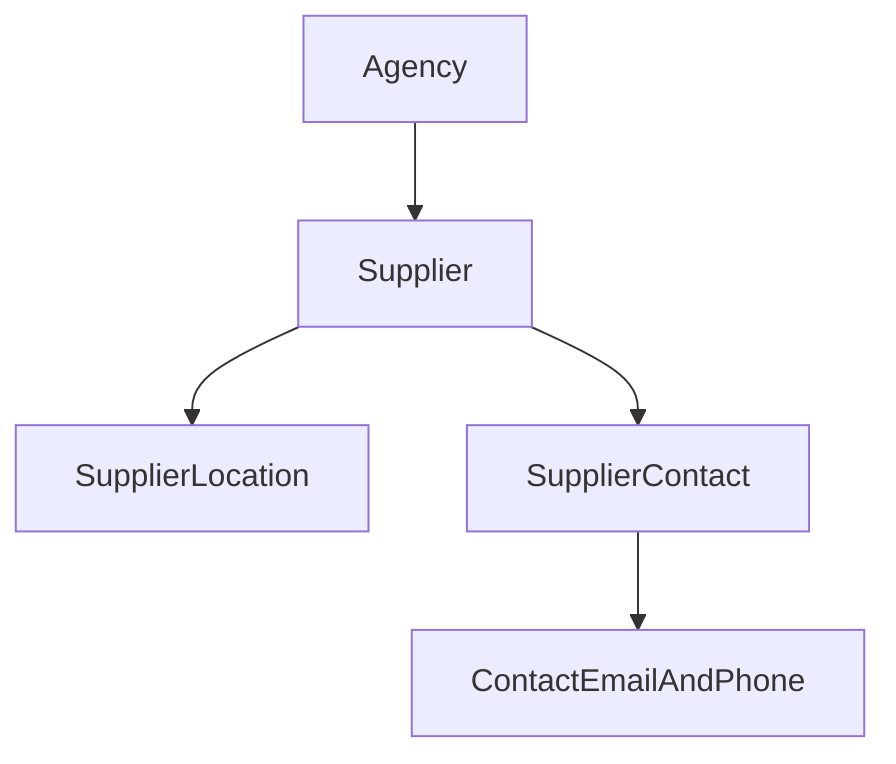

# M1D — Supplier Locations and Contacts

**Status:** Shipped. Merged to main on 2026-09-15 in pull request #40. This document remains the Supplier Locations and Contacts contract. It is not authority to extend into M1E or Supplier Arrangements.

**Parent:** [M1 — Client and Supplier directories](m1-client-and-supplier-directories.md)

**Prerequisites:** M1A, M1B, and M1C shipped and merged; ADR 0005, ADR 0006, current architecture, and interface contract.

**Accepted decisions (2026-09-15):** Product review adopted M1C-integration amendments: preserve shipped M1C search ranking with a total mixed-result order; discriminated search results without route URLs; exact `DirectoryDuplicateGate` proposed IDs and create-only ownership-chain replay; create lock sequences that do not lock a preassigned UUID; unambiguous Location postal-key encoding; narrowed command-specific locks; cascade audit payload shapes; expanded status-confirmation UI; Preferred Contact vs primary destination; and a narrow parent amendment authorizing Supplier Contact destination `POST .../set_primary`. Parent M1 and M1C ranking contracts are not superseded; M1D extends them.

## Goal

Extend each Supplier with operational Locations and named Supplier Contacts without treating either as the contracting Supplier, a Service Provider, a global identity, or an authorization record.

M1D adds:

* Supplier Locations with structured operational address, timezone, and one location-level phone;
* Supplier Contacts with contextual employment information;
* Supplier Contact-owned email and phone destinations;
* Location and Contact lifecycle and duplicate review;
* one optional preferred active Contact per Supplier;
* Location and Contact results in Supplier search; and
* complete downward Supplier-inactivation behavior.

M1D does not add Supplier Arrangements, Service Provider assignments, contracts, financial terms, remittance instructions, departments as records, or relationships between Supplier Contacts and Client People or AgencyUsers.

## Locked boundaries

1. `SupplierLocation` and `SupplierContact` belong directly to an Agency and immutably to one Supplier in that Agency.
2. A Location is an operational place associated with a Supplier. It is not itself a Supplier or Service Provider.
3. A Supplier Contact is a person in one Supplier work context. It is not a Client Person, AgencyUser, Traveler identity, or global person.
4. A person changing employers receives a new Supplier Contact under the new Supplier. The old Contact is inactivated, never moved.
5. Contact values never cause cross-domain or cross-Supplier identity linking.
6. Supplier Contact title, department, role label, and preferred state grant no authority and imply no future Arrangement role.
7. Supplier Location address and phone describe the operational place. They are not Supplier remittance or general correspondence destinations.
8. Supplier Contacts belong to the Supplier, not to a Location. M1D introduces no Location/Contact assignment.
9. Directory tables continue to omit `office_id`.
10. M1D introduces no human-readable Location or Contact reference and no new reference-sequence namespace.
11. M1D adds no PostgreSQL extension or exclusion constraint. Existing `btree_gist` use remains limited to Client Organization contact history.
12. There is no tenant-facing hard delete, merge, automatic synchronization, or cross-directory duplicate warning.

## Naming discipline

* `SupplierContact` always means a person associated with the Supplier.
* `SupplierContactPoint*` remains vocabulary for destination-related concerns, commands, and controllers (as shipped for Supplier-owned destinations).
* Concrete Contact-owned destination records always use their complete names: `SupplierContactEmailAddress` and `SupplierContactPhoneNumber`.
* In gate and command code, keep `supplier_contact` and `contact_point` variables distinct.

## Aggregate and ownership model



Supplier-owned email, phone, postal, and website records introduced in M1C remain separate from Contact-owned destinations.

## Persistence

Use one forward migration after the shipped M1C migration and update `db/structure.sql`.

### `supplier_locations`

| Attribute                 | Contract                                                                              |
| ------------------------- | ------------------------------------------------------------------------------------- |
| `id`                      | UUIDv7                                                                                |
| `agency_id`               | Required and immutable                                                                |
| `supplier_id`             | Required and immutable                                                                |
| `name`                    | Required, trimmed, nonblank; maximum 160 characters                                   |
| `timezone`                | Optional recognized IANA timezone                                                     |
| `address_line_1`          | Required when any postal field is present                                             |
| `address_line_2`          | Optional                                                                              |
| `address_locality`        | Optional                                                                              |
| `address_region`          | Optional                                                                              |
| `address_postal_code`     | Optional                                                                              |
| `address_country_code`    | Required when any postal field is present; accepted uppercase ISO 3166-1 alpha-2 code |
| `phone_number`            | Optional national/display value                                                       |
| `phone_normalized_number` | Required E.164 value when phone is present                                            |
| `phone_extension`         | Optional digits-only value, maximum 10 digits; allowed only with a phone              |
| `phone_country_code`      | Required accepted country when phone is present                                       |
| `status`                  | `active` or `inactive`                                                                |
| `lock_version`            | Required and nonnegative                                                              |
| timestamps                | UTC `timestamptz`                                                                     |

Postal data is either entirely absent or contains at least `address_line_1` and `address_country_code`. A country-only Location address is invalid.

Phone data is either entirely absent or contains the display number, normalized E.164 number, and phone country. Use the shipped `PhoneNumberNormalizer`, including pasted-extension conflict handling.

Location `address_*` and `phone_*` columns intentionally differ from Supplier-owned contact-point columns. Do not reuse the contact-point migration helper blindly.

#### Complete normalized postal key

Composition order:

1. `address_line_1`
2. `address_line_2`
3. `address_locality`
4. `address_region`
5. `address_postal_code`
6. `address_country_code`

Each textual component uses the established directory normalization. Join normalized components with the unit separator `U+001F`, keeping empty slots for absent optionals. Reject that control character in every address text field at write time. Country code is stored uppercase and included in the key.

Blank optional values store `NULL`. The generated complete key is `NULL` when the Location has no postal address. If any address is present, line 1 and country are required.

The strong duplicate signal is equality of this complete key within the same Supplier. Locality and postal-code search use their own generated keys (`locality_search_key`, `postal_code_search_key`).

Add:

* unique `(id, agency_id)`;
* same-Agency composite FK `(supplier_id, agency_id)`;
* immutable Agency/Supplier trigger;
* trimmed/nonblank name check;
* postal and phone completeness checks;
* rejection of `U+001F` in address text fields;
* E.164 and extension-shape checks;
* generated `name_search_key`;
* generated `locality_search_key` and `postal_code_search_key`;
* generated `postal_address_search_key` for the complete key above;
* Agency/Supplier/status and search indexes; and
* matching model read-only declarations.

A Location has no contact-point child table, preferred flag, Office association, Supplier category, or lifecycle for its inline address and phone separate from the Location.

### `supplier_contacts`

| Attribute      | Contract                                              |
| -------------- | ----------------------------------------------------- |
| `id`           | UUIDv7                                                |
| `agency_id`    | Required and immutable                                |
| `supplier_id`  | Required and immutable                                |
| `first_name`   | Required, trimmed, nonblank; maximum 100 characters   |
| `last_name`    | Required, trimmed, nonblank; maximum 100 characters   |
| `title`        | Optional trimmed display text; maximum 120 characters |
| `department`   | Optional trimmed display text; maximum 120 characters |
| `role_label`   | Optional contextual label; maximum 80 characters      |
| `preferred`    | Required boolean, default false                       |
| `status`       | `active` or `inactive`                                |
| `lock_version` | Required and nonnegative                              |
| timestamps     | UTC `timestamptz`                                     |

Add:

* unique `(id, agency_id)`;
* same-Agency composite FK `(supplier_id, agency_id)`;
* immutable Agency/Supplier trigger;
* required-name and metadata-length checks;
* generated first-name, last-name, full-name, and name-vector search columns;
* partial unique index permitting at most one preferred active Contact per Agency/Supplier; and
* Agency/Supplier/status and search indexes.

Zero preferred Contacts is valid. Nothing becomes preferred automatically.

### Supplier Contact contact points

Create:

* `supplier_contact_email_addresses`
* `supplier_contact_phone_numbers`

Each row contains direct immutable `agency_id` and `supplier_contact_id`, label, status, preferred, lock version, and timestamps. Reuse the shipped Supplier email/phone normalization and validation contracts.

Each table requires:

* UUIDv7;
* unique `(id, agency_id)`;
* same-Agency composite FK `(supplier_contact_id, agency_id)`;
* owner-immutability trigger;
* `active`/`inactive` status;
* at most one preferred active destination per Contact/channel;
* E.164 phone and extension separation;
* accepted phone country;
* Agency-scoped normalized search indexes; and
* no redundant `supplier_id`.

Contact email and phone values are not unique. They participate only in warning-based duplicate review within Contacts belonging to the same Supplier.

## Lifecycle

### Create and reactivate

* A Location or Contact may be created or reactivated only while its Supplier is active.
* A Contact-owned destination may be created or reactivated only while both its Supplier and Supplier Contact are active.
* A Location, Contact, or destination may receive factual corrections while inactive.
* Updating an inactive record never implicitly reactivates it.
* Reactivating a Supplier restores no Location, Contact, destination, or preferred state.
* Reactivating a Contact restores no email, phone, or preferred state.

### Location inactivation

`ChangeSupplierLocationStatus` inactivates only the Location. Its inline address and phone remain stored as historical Location facts. It has no child lifecycle cascade.

### Contact inactivation

`ChangeSupplierContactStatus` to inactive atomically:

1. Locks Agency, Supplier, and the selected Contact, then that Contact’s email and phone rows in fixed channel/UUID order.
2. Inactivates all active Contact-owned destinations.
3. Clears every affected destination preference.
4. Clears the Contact’s Supplier-wide preferred flag.
5. Inactivates the Contact.
6. Writes one `supplier_contact.inactivated` audit containing affected child IDs and types.
7. Commits everything or nothing.

Reactivation restores only the Contact.

### Supplier inactivation

Extend the shipped `ChangeSupplierStatus` command in place. Do not compose Location, Contact, or contact-point public commands.

Supplier inactivation atomically:

1. Locks Agency and Supplier.
2. Locks Locations ordered by UUID.
3. Locks Contacts ordered by UUID.
4. Locks Supplier-owned contact points in fixed channel/UUID order.
5. Locks Contact-owned email and phone rows ordered by Contact UUID, channel, and row UUID.
6. Inactivates every active Location and Contact.
7. Inactivates every active Supplier-owned and Contact-owned destination.
8. Clears all Supplier Contact and destination preferred flags.
9. Leaves categories assigned.
10. Inactivates the Supplier.
11. Writes one Supplier lifecycle audit listing every changed descendant ID and type without copying names or destinations.
12. Commits everything or nothing.

Already-inactive descendants are swept for any inconsistent active child or preferred state, but the audit lists only rows actually changed.

Cascade audit detail collections (compatible with shipped Supplier-owned shape):

```text
inactivated_contact_points:
  [{ "type", "id" }]   # Supplier-owned destinations only

inactivated_locations:
  [{ "type": "SupplierLocation", "id" }]

inactivated_contacts:
  [{ "type": "SupplierContact", "id" }]

inactivated_contact_destinations:
  [{ "type", "id" }]   # Contact-owned email/phone only
```

M1D introduces no Supplier inactivation blocker. Future Arrangements and financial records will add blockers.

## Commands

### Locations

* `CreateSupplierLocation`
* `UpdateSupplierLocation`
* `ChangeSupplierLocationStatus`
* `FindSupplierLocationDuplicates`

`CreateSupplierLocation` owns its transaction and duplicate review. It preassigns one Location UUID for token identity (not a lockable row).

`UpdateSupplierLocation` requires `lock_version`. Changes to name or address fields that participate in Location duplicate signals rerun Location duplicate review. Timezone and phone-only corrections do not trigger Location duplicate review because neither is an accepted Location signal.

A no-op validates `lock_version`, writes nothing, and produces no audit.

### Contacts

* `CreateSupplierContact`
* `UpdateSupplierContact`
* `ChangeSupplierContactStatus`
* `SetPreferredSupplierContact`
* `FindSupplierContactDuplicates`

New Contacts begin non-preferred. Preferred selection is explicit after creation.

`UpdateSupplierContact` reruns duplicate review only when first or last name changes. Title, department, and role-label changes do not affect duplicate candidates.

`SetPreferredSupplierContact` accepts the desired boolean state and `lock_version`:

* setting true requires an active Supplier and active Contact and clears the previous preferred Contact atomically;
* setting false clears the selected Contact and may leave zero preferred Contacts;
* submitting the stored state is a no-op after version validation; and
* one successful change produces one `supplier_contact.preferred_changed` audit.

### Contact destinations

For both email and phone:

* `CreateSupplierContactEmailAddress`
* `UpdateSupplierContactEmailAddress`
* `ChangeSupplierContactEmailAddressStatus`
* `SetPreferredSupplierContactEmailAddress`
* corresponding four phone commands

Public commands remain domain-named even if they reuse a private contact-point command concern.

Create and material destination updates run Contact duplicate review within the owning Supplier. Label-only and preferred-only changes do not trigger duplicate review.

### Lock order

A preassigned unsaved UUID is token identity, not a lockable database row. After authorization:

* **Create Location or Contact:** preassign result UUID → Agency → Supplier → replay check → duplicate recomputation/token enforcement → insert → audit.
* **Material Location or Contact update:** Agency → Supplier → selected record → duplicate recomputation/token enforcement → update → audit.
* **Change Location or Contact status:** Agency → Supplier → selected record.
* **Set preferred Contact:** Agency → Supplier → all active Contacts ordered by UUID.
* **Contact destination commands:** Agency → Supplier → owning Contact → rows for the affected channel ordered by UUID.
* **Supplier inactivation:** Agency → Supplier → all Locations → all Contacts → Supplier-owned destinations → Contact-owned destinations, with each collection ordered by UUID.

Destination-only commands do not lock every Contact.

Cross-Agency or missing Supplier, Location, Contact, or destination IDs return not found. Expected constraint and optimistic-lock failures are translated to established domain errors.

## Duplicate review

Duplicate detection never crosses Agency, Supplier, or identity-domain boundaries.

### Location signals

Compare Locations only within the same Supplier.

| Signal                                                | Strength |
| ----------------------------------------------------- | -------- |
| Exact normalized complete postal address              | Strong   |
| Exact normalized Location name plus matching locality | Possible |

Location name alone, locality alone, postal code alone, timezone, and phone are not duplicate signals.

An address is comparable only when the complete stored postal shape is present (complete key not `NULL`). Inactive candidate Locations remain visible and labeled.

### Contact signals

Compare Contacts only within the same Supplier.

| Signal                                            | Strength |
| ------------------------------------------------- | -------- |
| Exact normalized email                            | Strong   |
| Same E.164 base number and extension              | Strong   |
| Exact normalized first-name plus last-name        | Possible |
| Same E.164 base with different or blank extension | Possible |

Do not compare against:

* Supplier-owned general destinations;
* Contacts belonging to another Supplier;
* Client People;
* Client Organization contacts;
* AgencyUsers; or
* Contacts in another Agency.

Creating a Contact initially evaluates its name. Adding or changing a Contact destination evaluates the applicable email or phone signal against other Contacts under that Supplier.

### `DirectoryDuplicateGate` extensions

Extend the shipped gate for M1D creates:

| Create command | Proposed IDs |
| --- | --- |
| `CreateSupplierLocation` | `supplier_location_id` plus owning `supplier_id` as already patterned |
| `CreateSupplierContact` | `supplier_contact_id` plus owning `supplier_id` |
| Contact-owned destination create | Existing `contact_point_id` and `contact_class`, plus `supplier_contact_id` / `supplier_id` as needed for the ownership chain |

Add `SupplierContactEmailAddress` and `SupplierContactPhoneNumber` to `CONTACT_CLASSES`.

Relatedness (Agency-scoped):

* Location belongs to the proposed Supplier.
* Supplier Contact belongs to the proposed Supplier.
* A Contact-owned destination belongs to the proposed Supplier Contact, which belongs to the proposed Supplier.

Contact-owned destinations have no `supplier_id` column and must not be assumed to have one.

**Create replay only:** an exact create replay returns the one proposed result for that command. If some signed records exist but the complete expected ownership chain does not match, return conflict.

Update commands continue using the gate’s existing target / fingerprint / `lock_version` replay behavior.

Duplicate acknowledgement also follows the existing signed-token contract:

* preassigned result UUID;
* Agency, actor, command, owner Supplier, normalized fingerprint, candidate digest, expiration, and nonce;
* proposed-result replay checked before expiration or candidate recomputation;
* parallel submission produces one record and one audit set; and
* fixed reason code with no names or destinations in audit JSON.

There is no separate duplicate-review route.

## Supplier search expansion

Extend `SearchSupplierDirectory`; do not create a parallel search page. M1D extends the shipped M1C ranking ladder; it does not replace it.

### Browse behavior

A blank query continues to return Supplier rows only. It does not flood the directory with every Location and Contact.

### Filters

* Status filters the **result record’s** status.
* Kind and category filter the **owning Supplier**.

Filters apply in SQL before the 51-row lookahead.

### Discriminated result shape

A nonblank query may return Supplier, Location, and Contact rows. Each logical record appears once even when multiple branches match. Different records under the same Supplier may appear separately.

`SearchSupplierDirectory` returns a discriminated result (query-result discrimination, not Active Record polymorphism):

* `result_kind`: `supplier`, `location`, or `contact`
* Result ID, display name, status, rank, and `match_kind`
* Owning Supplier ID, display name, and reference
* Supplier kind and categories where applicable

Do **not** put a nested destination path on the result. Presenters or route helpers construct URLs from kind and IDs.

Index rendering:

* Supplier: kind and categories
* Location: “Location · owning Supplier”
* Contact: “Contact · owning Supplier,” only when the actor may see Contact identity

### Administrator and Staff matching

Add:

* Location exact name and all-token name prefix;
* Location locality and postal code;
* Contact exact full name and all-token name prefix;
* Contact email;
* Contact phone.

Location inline phone is displayed on an authorized Location profile but is **not** an M1D search or duplicate signal.

### Viewer behavior

Viewer may:

* receive Location results based on visible Location name;
* see Location name, timezone, lifecycle status, and owning Supplier; and
* filter by the owning Supplier’s kind/category.

Viewer may not:

* match or see Location address or phone;
* match, receive, count, or see Supplier Contact results;
* match Contact email, phone, title, department, or role label; or
* infer hidden records through ranking, truncation, counts, excerpts, or empty-state wording.

Location-name results must not expose address excerpts or hidden match details. A direct Viewer request for a Supplier Contact route returns not found so the route does not disclose that the Contact exists.

### Ranking

Use the best matching branch for both rank and `match_kind`. Preserve the shipped M1C ladder:

1. Exact Supplier reference
2. Exact permitted email (Supplier-owned and, for authorized actors, Supplier Contact email)
3. Exact permitted phone (Supplier-owned and, for authorized actors, Supplier Contact phone)
4. Exact visible name (Supplier, Location name, or Contact full name as permitted)
5. Visible name prefix
6. Category, permitted Location locality/postal, or Supplier website

Deduplicate each logical record at its best rank **before** the 51-row lookahead / 50-result cap.

### Total sort order

After best-rank selection, apply this deterministic order:

1. Rank
2. Result’s active status (active before inactive)
3. Result display name
4. Owning Supplier kind
5. Result-kind order: Supplier → Location → Contact
6. For Supplier rows, result UUID; for Location/Contact rows, owning Supplier reference
7. Result UUID

That preserves the relative order of two Supplier results under shipped M1C ordering when ranks match. Location/Contact-specific steps must not reorder two Supplier results relative to each other.

## Permissions

M1D adds no permission.

| Capability                                   | Administrator | Staff | Viewer |
| -------------------------------------------- | ------------: | ----: | -----: |
| View Supplier and Location identity          |           Yes |   Yes |    Yes |
| View Location address/phone                  |           Yes |   Yes |     No |
| View named Supplier Contacts                 |           Yes |   Yes |     No |
| View Contact email/phone                     |           Yes |   Yes |     No |
| Manage Locations, Contacts, and destinations |           Yes |   Yes |     No |

Use:

* `view_supplier_directory`
* `view_supplier_contact_details`
* `manage_supplier_directory`

Application code checks permissions, never role names.

## Audit

Add `SupplierLocation` and `SupplierContact` to both the audit subject catalog and the subject-to-Agency validation. The same implementation change updates `AuditEvent`, `RecordAdministrativeAudit`, and the AGENTS audit-subject invariant.

### `SupplierLocation`

* `supplier_location.created`
* `supplier_location.updated`
* `supplier_location.inactivated`
* `supplier_location.reactivated`
* `supplier_location.duplicate_override`

### `SupplierContact`

* `supplier_contact.created`
* `supplier_contact.updated`
* `supplier_contact.contact_updated`
* `supplier_contact.preferred_changed`
* `supplier_contact.inactivated`
* `supplier_contact.reactivated`
* `supplier_contact.duplicate_override`

Contact-owned destination commands use the Supplier Contact as subject.

Audit details may contain record IDs, owner IDs, statuses, changed field names, affected child IDs/types, candidate IDs, signal names, and fixed duplicate reason codes. They never contain names, title, department, role label, address, email, phone, timezone, or unrestricted text.

Supplier cascade continues to use the Supplier as its sole audit subject; it does not emit a separate event for every cascaded descendant.

## Routes

### Locations

```text
GET   /suppliers/:supplier_id/locations/new
POST  /suppliers/:supplier_id/locations
GET   /suppliers/:supplier_id/locations/:supplier_location_id
GET   /suppliers/:supplier_id/locations/:supplier_location_id/edit
PATCH /suppliers/:supplier_id/locations/:supplier_location_id
GET   /suppliers/:supplier_id/locations/:supplier_location_id/status/edit
PATCH /suppliers/:supplier_id/locations/:supplier_location_id/status
```

### Contacts

```text
GET   /suppliers/:supplier_id/contacts/new
POST  /suppliers/:supplier_id/contacts
GET   /suppliers/:supplier_id/contacts/:supplier_contact_id
GET   /suppliers/:supplier_id/contacts/:supplier_contact_id/edit
PATCH /suppliers/:supplier_id/contacts/:supplier_contact_id
GET   /suppliers/:supplier_id/contacts/:supplier_contact_id/status/edit
PATCH /suppliers/:supplier_id/contacts/:supplier_contact_id/status
PATCH /suppliers/:supplier_id/contacts/:supplier_contact_id/preferred
```

### Contact destinations

Add standard nested new/create/edit/update/status routes under:

```text
/suppliers/:supplier_id/contacts/:supplier_contact_id/email-addresses
/suppliers/:supplier_id/contacts/:supplier_contact_id/phone-numbers
```

Parent amendment: Supplier Contact email-address and phone-number lists also support:

```text
POST .../:contact_point_id/set_primary
```

That action requires `lock_version`; it is not a `/preferred` route. It selects the primary destination within that Contact’s channel and remains distinct from `PATCH .../contacts/:supplier_contact_id/preferred`. Ordinary contact-point edit may also change preferred destination state.

Use descriptive route parameters only. Add no Location index outside the Supplier profile, standalone Contact index, generic duplicate-review route, or alternate route shape.

## UI

### Supplier profile

Add separate Locations and Contacts panels.

Locations show:

* name;
* status;
* timezone when present; and
* locality only to users with contact-detail permission.

Contacts are rendered only with `view_supplier_contact_details` and show:

* name;
* title;
* department;
* contextual role label;
* preferred state; and
* lifecycle status.

The Viewer sees no Contact panel, Contact count, named-contact empty state, or link.

### Location profile

Display identity first, followed by timezone, operational address, and phone. Address and phone are omitted for Viewer. Management actions use dedicated edit and lifecycle-confirmation pages.

### Contact profile

Display name, work-context metadata, preferred state, and separate email/phone panels. It grants no authority and should not use language such as “authorized contact.”

Keep two separate concepts:

* **Preferred Contact:** the Supplier-level person selected by `SetPreferredSupplierContact` / `PATCH .../preferred`.
* **Primary email/phone:** the preferred destination within one Contact’s channel via `POST .../set_primary` or ordinary edit.

Selecting one does not select or change the other.

Contact inactivation confirmation lists the destinations that will be inactivated. Supplier inactivation confirmation expands its existing impact inventory to include Locations, Contacts, Supplier-owned destinations, and Contact-owned destinations—not only Supplier-owned destinations.

All forms:

* preserve submitted values;
* render an associated error summary and field errors;
* work without JavaScript;
* maintain keyboard order and visible focus;
* use established `dd-` components; and
* reflow at 375px, 768px, reference desktop, and 1280px.

## Implementation phases

### Phase 1 — Persistence

* Add one forward migration after shipped M1C.
* Create Location, Contact, Contact email, and Contact phone tables with `address_*` / `phone_*` Location columns.
* Add composite FKs, checks, unit-separator postal key, partial preferred indexes, generated search keys, and immutability triggers.
* Update `db/structure.sql`.
* Prove no new extension, Office column, reference namespace, or exclusion constraint.

### Phase 2 — Models, audit, and Supplier lifecycle

* Add four top-level models and associations.
* Extend audit subjects/actions and Agency ownership (`AuditEvent`, `RecordAdministrativeAudit`, AGENTS invariant).
* Extend `ChangeSupplierStatus` with the complete M1D cascade and audit detail collections.
* Add Location and Contact lifecycle commands with command-specific locks.
* Add preferred-Contact selection.

### Phase 3 — Duplicate review and contact commands

* Add Location and Contact duplicate query objects.
* Extend `DirectoryDuplicateGate` for exact proposed IDs, `CONTACT_CLASSES`, and create-only ownership-chain replay.
* Add Contact email/phone command families, including `set_primary`.
* Prove replay, ownership-chain conflict, changed-candidate, expiration, authorization, and concurrency behavior.

### Phase 4 — Search, routes, and UI

* Expand `SearchSupplierDirectory` with discriminated results, preserved M1C ranks, total mixed-result order, and permission-safe branches.
* Redesign the Supplier index for result-kind context (first-class, not a thin add-on).
* Add nested routes and controllers outside Administration.
* Add Supplier profile panels and Location/Contact profiles/editors.
* Expand lifecycle confirmation inventory and Viewer-redacted states.
* Update the interface contract.

### Phase 5 — Tests and shipment documentation

* Complete database, model, command, request, search, concurrency, system, and regression tests.
* Update M1D status, AGENTS.md, README, docs index, current architecture, terminology, roadmap, and interface contract on ship.
* Use “implemented on this branch; shipped when merged” before merge.
* Mark shipped only after merge to `main`.

## Required proof

### Migration and database

* Migration from the shipped M1C schema.
* Clean `structure.sql` load.
* Migration rollback and reapplication.
* UUIDv7 and `timestamptz`.
* Same-Agency composite FKs.
* Owner/Agency immutability through direct SQL.
* Location postal/phone completeness constraints and `U+001F` rejection.
* Complete postal-key equality for strong duplicates.
* Contact required names and metadata limits.
* Preferred Contact and destination partial uniqueness.
* No `office_id`, new sequence, new extension, or new exclusion constraint.

### Commands and lifecycle

* Staff and Administrator success.
* Viewer rejection with no side effect or audit.
* Cross-Agency IDs return not found.
* Missing and stale `lock_version`.
* Stale no-op returns conflict.
* Location and Contact corrections while inactive.
* Create/reactivate dependency checks.
* Contact inactivation cascade.
* Supplier inactivation’s complete nested cascade with the four audit collections.
* Reactivation restores no child or preferred state.
* Cascade failure rolls back every change and audit.
* Actual audit `changed_fields`, with no contact or name values.
* Preferred Contact remains distinct from primary destination.

### Duplicate review and concurrency

* Every strong and possible Location/Contact signal.
* No Location phone-only or postal-only warning.
* No cross-Supplier Contact warning.
* No Client, AgencyUser, or Supplier-general-destination leakage.
* Inactive candidates remain visible to authorized users.
* Exact create replay produces one record and one audit set.
* Partial ownership-chain mismatch returns conflict.
* Update replay continues to use target/fingerprint/`lock_version`.
* Parallel preferred-Contact changes.
* Contact inactivation racing destination reactivation.
* Supplier inactivation racing Contact/Location mutation.
* Narrowed destination-command locks (do not lock every Contact).

### Search and UI

* Discriminated Supplier, Location, and Contact result types without route URLs on the result.
* Logical-record de-duplication before the 51-row lookahead.
* Preserved M1C rank ladder and total mixed-result sort order.
* Blank browse returning Suppliers only.
* Status on result; kind/category on owning Supplier.
* Viewer Location-name search with address/phone redaction and no Contact leakage.
* Location inline phone never searchable.
* Index use for every new supported query branch.
* Expanded Supplier status-confirmation inventory.
* Parent `set_primary` amendment for Contact destinations.
* Duplicate-review browser workflow.
* Keyboard-only Location and Contact workflows.
* Responsive and accessible empty, validation, inactive, unauthorized, and not-found states.

All M1A–M1C, identity, system, Tailwind, security, lint, and CI checks remain green.

## Acceptance scenarios

M1D demonstrates:

* Celebrity Cruises with at least two operational Locations;
* one Location with timezone, address, and phone and another with only the facts actually known;
* multiple named Celebrity Supplier Contacts with separate email/phone destinations;
* explicit preferred Contact selection with zero preferred also valid;
* primary destination selection within a Contact channel without changing Preferred Contact;
* a Contact changing employers by inactivating the old Contact and creating a separate Contact under another Supplier;
* an exact Location-address warning within one Supplier;
* a likely duplicate Contact selected as existing;
* an audited create-anyway Contact;
* the same Contact email under another Supplier without a warning;
* the same email on a Client Person without cross-domain linking or warning;
* a Viewer finding a Location by name without seeing its address, phone, or any named Contact;
* Supplier inactivation cascading through Locations, Contacts, Supplier-owned destinations, and Contact-owned destinations; and
* Supplier reactivation restoring none of those descendants.

## Exit gate

M1D is complete only when:

* Location, Contact, and Contact-destination ownership and lifecycle are database- and command-enforced;
* Supplier inactivation performs the complete M1 descendant cascade atomically;
* search includes permission-safe Location and Contact result kinds under the preserved M1C rank ladder and total mixed-result order;
* cross-Agency reads and mutations fail closed;
* no Party, global person, Service Provider, Location-as-Supplier, Office authorization, or cross-domain synchronization has appeared;
* documentation accurately distinguishes shipped M1D from deferred M1E and M2;
* the complete CI workflow is green; and
* the slice is merged to `main`.

This slice is **Shipped**. The accepted contract authorizes M1D only. It does not authorize M1E, Supplier Arrangements, Service Providers, or later commercial records.
