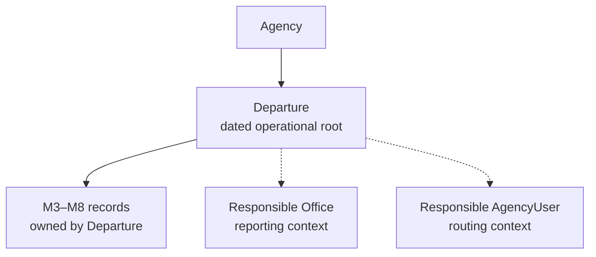
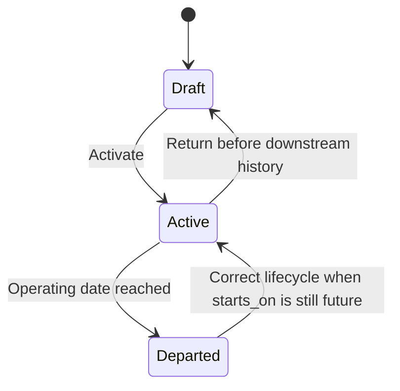

# M2 — Departure core

**Status:** Complete. M2A–M2C are shipped. This contract remains the Departure operational-root model. It is not implementation authority for M3 until an accepted M3 slice plan names that work.

**Prerequisites:** [ADR 0001](../adr/0001-money-and-currency.md), [ADR 0004](../adr/0004-human-readable-references.md), [ADR 0005](../adr/0005-agency-identity.md), [ADR 0006](../adr/0006-separate-identity-domains.md), [ADR 0007](../adr/0007-departure-operational-root.md), [MVP requirements](departure-desk-mvp.md), [commercial decision register](commercial-domain-decision-register.md), [current architecture](../architecture/current-state.md), [interface contract](../ui/interface-contract.md), and completed [M1 directories](m1-client-and-supplier-directories.md)

## Goal

Establish `Departure` as the dated operational root for all later planning, offers, Client Trips, fulfillment, capacity, financial, cancellation, reporting, and closeout records.

M2 gives an Agency the ability to:

* create and maintain draft Departures;
* record operating dates, IANA time zone, and operating currency;
* assign a responsible Office and responsible AgencyUser;
* activate a complete Departure;
* issue its durable Agency-scoped reference;
* return an unused active Departure to draft without losing its reference;
* mark an active Departure departed when its operating date arrives;
* correct an eligible erroneous departed transition;
* search and filter Departures safely within one Agency; and
* provide a stable ownership boundary for M3–M8.

M2 does not implement Travel Program.

## Why Travel Program is deferred

The existing MVP vocabulary describes Travel Program as an optional reusable or recurring concept. Neither accepted reference scenario currently demonstrates a durable shared record above Departure:

* Celebrity Beyond currently represents one dated sailing.
* Vineyard Tour currently represents one dated tour.
* Neither scenario requires shared state across multiple Departures.
* No currently accepted behavior depends on a Travel Program.

“Travel Program” also remains semantically ambiguous. It could mean:

* a recurring client or affinity-group series;
* a reusable itinerary;
* a product or offer template;
* a collection of scheduled departures;
* a reporting category; or
* a continuing initiative such as an annual reunion.

Those concepts do not have the same ownership, inheritance, lifecycle, or change semantics.

Implementing a generic Travel Program now would risk creating a decorative parent or, worse, a live inheritance hierarchy through which later Supplier arrangements, Packages, terms, dates, or prices silently affect several Departures.

M2 therefore adopts these decisions:

1. `Departure` is independently usable and is the only M2 aggregate.
2. No M2 record requires a parent above Departure.
3. M3–M8 operational and commercial records belong directly to Departure.
4. No live inheritance from a reusable concept is authorized.
5. A future accepted slice may introduce a nullable relationship from Departure to a clearly defined series, template, or program record.
6. That future slice must demonstrate at least two real Departures that need the shared identity and must define exactly what is shared, copied, inherited, versioned, and independently mutable.
7. Deferral creates no meaningful migration obstacle because an optional parent association can be added later without changing Departure identity.

The MVP, roadmap, and terminology must be amended so Travel Program is a deferred concept rather than an M2 deliverable.

## Aggregate boundary



Agency owns Departure. Solid arrows are ownership. Dotted arrows are attribution references: Departure points at a responsible Office and responsible AgencyUser. Those records do not own the Departure and do not grant access to it.

A Departure owns its future operational and commercial context.

The commercial register’s Draft → Active “manager” is this responsible AgencyUser. Do not introduce an Advisor, manager role, or Agency Team to satisfy that sentence. “Operational configuration complete” means the M2 activation checklist until a later milestone extends it.

## Proposed slices

| Slice | Working outcome |
| --- | --- |
| **[M2A — Departure core](m2a-departure-core.md)** | Draft creation/editing, responsibility, search/UI, activation, `D-` issuance, return to draft, and activation/reference concurrency. Shipped. |
| **[M2B — Departed lifecycle](m2b-departed-lifecycle.md)** | Manual transition, scheduled sweep and per-Departure job, schedule/currency correction, erroneous-lifecycle correction, and job concurrency. Shipped. |
| **[M2C — Acceptance and hardening](m2c-acceptance-and-hardening.md)** | Celebrity/Vineyard scenario proof, cross-Agency isolation, query/index proof, accessibility/system coverage, regressions, and final documentation. Shipped. |

M2A is a complete vertical outcome: staff can create a Departure, make it operational, receive its durable reference, find it, and safely reverse activation before downstream work exists.

Each slice requires its own accepted implementation contract before domain code begins.

## Required boundaries

1. Every Departure belongs directly to one Agency.
2. Departure is the dated operational ownership root.
3. Departure does not belong to a Travel Program in M2.
4. Office is responsibility, defaulting, filtering, and reporting context only.
5. Responsible AgencyUser is routing and accountability context only.
6. Neither Office nor responsible AgencyUser grants or restricts authorization. A Viewer may be the responsible AgencyUser; assignment grants no authority.
7. Client and Supplier directory records remain Agency-wide and are not attached to a Departure in M2.
8. M2 creates no Supplier, Client, Traveler, Package, service, capacity, deadline, or financial relationship.
9. Operating currency identifies the single currency in which later Departure commercial records normally operate. It is an uppercase ISO code validated like `Agency#default_currency` (`Money::Currency.find`). M2 stores no money amount, `money-rails` column, or FX fact. [ADR 0001](../adr/0001-money-and-currency.md) remains authoritative.
10. Dates are local calendar dates. They are not converted into artificial midnight timestamps.
11. Time zone is an explicit valid IANA identifier copied from a default and stored on the Departure. Validate with `TZInfo` as Agency and Office already do.
12. Changing an Agency, Office, or session default never rewrites an existing Departure.
13. Request parameters never establish Agency tenancy.
14. Cross-Agency identifiers return not found.
15. Departure references never establish tenancy or authorization.
16. M2 has no destroy or archive route. Never-activated drafts are retained. Hard deletion is not permitted.
17. Same name and dates are permitted within one Agency and across Agencies. M2 has no duplicate gate.
18. An Agency may have zero active Offices. Drafts may exist without an Office. Activation may not.
19. Returning to draft may leave fields incomplete while preserving `departure_reference` and `first_activated_at`.
20. Future commercial and operational records must attach to Departure, not to a reusable concept above it.
21. Jobs reload records through the Agency and never depend on `Current`.
22. Lifecycle commands use `POST`. Ordinary record edits use `PATCH`.
23. Reuse the shipped `#form-error-summary` Stimulus controller and the 375px primary-navigation drawer contract. Do not revive `data-turbo-focus`.

## Closed decisions

The following are locked in this parent contract. Slice plans may specify command error codes, lock details, and exact path helpers; they may not reopen these outcomes.

| Decision | Closure |
| --- | --- |
| Name length | Exactly 160 characters after trim. Blank is invalid. |
| Description length | Exactly 2,000 characters. Blank becomes `NULL`. |
| Never-activated drafts | Retained. No destroy or archive route. |
| Duplicate identity | Same name and dates are permitted. No duplicate review token or gate. |
| Active dates and time zone | Editable with audit until `departed`. |
| Operating currency | Staged mutability below. Returning to draft does not itself unlock currency if later currency-dependent history exists. |
| Erroneous `departed` | `CorrectDepartureLifecycle` only, never as a side effect of editing `starts_on`. |
| Lifecycle-correction permission | `manage_departures`. No dedicated correction permission in M2. |
| Index ordering | `starts_on` ascending, null dates last, normalized name, UUID. |
| Date filters | Inclusive comparisons against the stored local date values. |
| Responsible Viewer | Allowed. Assignment grants no authority. |
| Zero-Office agencies | Drafts allowed without an Office; activation requires an active same-Agency Office. |
| Return to draft completeness | Incomplete fields permitted; reference and `first_activated_at` retained. |
| HTTP verbs | `POST` for lifecycle and correction commands; `PATCH` for ordinary field and responsibility updates. |
| Office/user history | Current responsibility is stored on Departure. Prior attribution is preserved through same-transaction audit events. M2 does not add effective-dated assignment tables. |
| Scenario facts | `M2DepartureScenario` supplies labeled fixture-only currency, time-zone, Office, and responsible-user facts. Do not guess those facts into the accepted scenario documents. |

## Departure persistence contract

| Attribute | Nullability | Contract |
| --- | --- | --- |
| `id` | Required | UUIDv7 primary key |
| `agency_id` | Required | Immutable tenant owner |
| `departure_reference` | Draft may be null | Issued on first activation; immutable afterward |
| `name` | Required | Trimmed display name; maximum 160 characters |
| `description` | Optional | Blank normalized to `NULL`; maximum 2,000 characters; descriptive only |
| `starts_on` | Draft may be null | Local calendar date |
| `ends_on` | Draft may be null | Local calendar date; cannot precede `starts_on` |
| `time_zone` | Draft may be null | Valid IANA zone; required for activation. This is the Departure’s governing stored zone, not a live link to Agency or Office. |
| `operating_currency` | Draft may be null | Uppercase ISO currency code; required for activation |
| `responsible_office_id` | Draft may be null | Active same-Agency Office required for activation |
| `responsible_agency_user_id` | Draft may be null | Active same-Agency AgencyUser required for activation |
| `status` | Required | M2 values: `draft`, `active`, `departed` |
| `first_activated_at` | Initially null | Set once on first activation and never cleared |
| `departed_at` | Initially null | Set by the departed transition; cleared by `CorrectDepartureLifecycle` |
| `lock_version` | Required | Optimistic concurrency |
| timestamps | Required | `timestamptz` |

Open-ended or end-date-TBD Departures are out of scope. Activation requires both schedule dates.

The completeness check that activation fields are required whenever status is not `draft` must still allow those fields to become incomplete after return to draft.

### Database constraints

The schema must enforce:

* unique `(id, agency_id)`;
* unique `(agency_id, departure_reference)` where reference is present;
* canonical `D-[0-9]{6}` format where reference is present;
* paired schedule dates: both absent or both present;
* `starts_on <= ends_on`;
* required activation fields whenever status is not `draft`;
* uppercase three-character currency representation;
* same-Agency composite foreign keys for responsible Office and AgencyUser;
* immutable `agency_id`;
* immutable issued `departure_reference`;
* immutable `first_activated_at` after it is initially set; and
* valid status vocabulary.

Application validation must use the supported IANA-zone and ISO-currency catalogs. A three-character database check alone does not establish a valid currency. Do not wrap `operating_currency` in `money-rails`. Do not use the countries gem as a currency authority.

One table-specific trigger function should enforce Departure identity immutability. Do not generalize the existing identity trigger across unrelated tables. Do not add `btree_gist` or other extensions for M2.

## Defaulting rules

`Agency` stores both `default_timezone` and `default_currency`. `Office` stores `default_timezone` only.

Creating a Departure may copy defaults from:

1. the current active Office;
2. the current AgencyUser;
3. the Agency default time zone; and
4. the Agency default currency.

All are copied defaults, never live inheritance.

They must not:

* silently create an Office association when no active Office exists;
* establish authorization;
* remain linked to the source default;
* change when the source default changes; or
* override explicitly submitted values.

## Responsibility contract

A Departure has:

* one current responsible Office; and
* one current responsible AgencyUser.

Use `responsible_agency_user_id`, not `advisor_id`. M2 does not create an Advisor role, Agency Team, commission split, or permission assignment.

For M2, the current responsibility fields are stored directly on Departure. Reassignment history is preserved through same-transaction audit events containing old and new identifiers.

M2 does not introduce effective-dated Office or user assignment tables. A later slice may do so if reporting requires first-class interval history or multiple simultaneous responsibility roles.

Reassignment rules:

* target Office and AgencyUser must belong to the same Agency;
* target records must be active;
* the responsible AgencyUser may be a Viewer;
* reassignment does not change permissions;
* reassignment is permitted on draft, active, and departed Departures;
* inactive historical targets remain visible on existing records;
* a target becoming inactive does not silently remove it from a Departure;
* assigning a replacement is explicit and audited; and
* responsibility updates submit Office and AgencyUser together atomically.

## Lifecycle contract

### Implemented M2 states



### Draft

* Has no reference until first activation.
* May be incomplete, including after return to draft.
* May be corrected through ordinary update commands.
* Cannot own M3–M8 records because those milestones are not yet shipped.
* Cannot be treated as operationally available merely because it exists.
* Cannot be destroyed or archived.

### Draft → Active

Activation requires:

* active Agency;
* valid name;
* complete and valid dates;
* explicit valid time zone;
* explicit valid operating currency;
* active same-Agency responsible Office;
* active same-Agency responsible AgencyUser;
* actor with `manage_departures`;
* current `lock_version`; and
* existing Departure reference-sequence row.

Activation:

* locks and rechecks every prerequisite;
* issues the reference if absent;
* preserves an existing reference on reactivation;
* sets status to `active`;
* sets `first_activated_at` only if absent;
* writes the activation audit event in the same transaction; and
* creates no Supplier, capacity, sales, or financial record.

Activation always enters `active`, even when `starts_on` has already arrived. `MarkDepartureDeparted` then becomes immediately eligible. Activation must not combine unrelated lifecycle transitions implicitly.

### Active → Draft

Returning to draft:

* is allowed only before consequential downstream history exists;
* retains `departure_reference`;
* retains `first_activated_at`;
* may leave operating and responsibility fields incomplete;
* requires current `lock_version`;
* records the reason;
* writes one audit event;
* creates no compensating commercial records; and
* is not available from `departed`.

In M2, activation itself, reference issuance, and audit history do not count as downstream history.

Returning to draft does not itself unlock operating currency if a later milestone has created currency-dependent history. Before M3 ships, M3 must define which Arrangement, capacity, cost, or deadline records block return to draft and which records freeze currency. Each later milestone must extend the dependency catalog for the records it introduces.

### Active → Departed

A Departure becomes eligible when the current local date in its stored time zone is on or after `starts_on`.

The domain command is `MarkDepartureDeparted`. It may be invoked by:

* authorized Staff or Administrator action; or
* `MarkDepartureDepartedJob` after the recurring sweep selects the Departure.

It:

* changes status and records `departed_at`;
* writes an audit event;
* has no financial, capacity, cancellation, fulfillment, or closeout side effects; and
* does not infer that every service was fulfilled.

A retry returns the already-departed result and creates no second transition audit.

### Scheduled transition

This is the first scheduled application lifecycle audit. It is not the first `actor_kind: system` audit: `agency.provisioned` already uses the shipped system-actor path. Reuse that mechanism with the stable identifier `departures.mark_departed`. Do not invent a platform user.

Keep `MarkDepartureDeparted` as the idempotent command. Use explicit job names:

* `MarkEligibleDeparturesDepartedJob` for the recurring sweep; and
* `MarkDepartureDepartedJob` for one Agency/Departure pair.

The sweep:

* skips suspended and closed Agencies;
* selects eligible identifiers only;
* enqueues one per-Departure job; and
* does not call the command itself.

The per-Departure worker:

* reloads the Agency and Departure;
* calls `MarkDepartureDeparted`;
* never depends on `Current`; and
* provides an independent retry boundary for that Departure.

Jobs pass identifiers, not Active Record objects. Solid Queue remains on the separate queue database. Do not put queue tables on the primary database.

### Departed → Active

`CorrectDepartureLifecycle` may return `departed → active` only when the stored, possibly corrected `starts_on` is later than the current local date in the Departure’s time zone. It:

* requires `manage_departures`;
* requires a reason and current `lock_version`;
* clears `departed_at`;
* preserves the reference and `first_activated_at`;
* writes `departure.lifecycle_corrected`; and
* never follows automatically from editing `starts_on`.

If the corrected date has already arrived, returning to active is invalid because the scheduled job would immediately mark it departed again.

Correcting a departed schedule does not change status.

### Future lifecycle states

The accepted product lifecycle also anticipates:

* `closeout_review`;
* `closed`; and
* `reopened`.

M2 does not persist or expose those states. They require blocker evaluation, warning waiver, reconciliation, posting restrictions, immutable snapshots, and reopening history that cannot be implemented honestly before later milestones.

M8 will amend the status catalog and implement those transitions.

### Cancellation is orthogonal

M2 does not add a `cancelled` Departure status.

A future entire-Departure cancellation is a controlled Cancellation Case with independent operational, Client, Supplier, capacity, commission, and payment dispositions. Cancellation must not erase or replace the Departure’s operational lifecycle.

The cancellation and closeout milestones must define how a wholly cancelled Departure progresses to reconciliation and closure.

## Field mutability

| Field family | Draft | Active | Departed |
| --- | --- | --- | --- |
| Name and description | Editable | Editable with audit | Correctable with audit |
| Dates and time zone | Editable | Editable with audit | `CorrectDepartureSchedule` with reason |
| Operating currency | Editable | Editable through the audited update command while no currency-dependent downstream history exists | `CorrectDepartureCurrency` with reason |
| Responsible Office/User | Editable | Reassignable | Reassignable |
| Status | Commands only | Commands only | Commands only |
| Reference | Issuance command only | Immutable | Immutable |
| Agency | Immutable | Immutable | Immutable |

Operating-currency mutability is closed as follows:

* Draft: operating currency is editable.
* Active: Staff may change it through the audited update command while no currency-dependent downstream history exists.
* Departed: correction requires `CorrectDepartureCurrency` and a reason.
* Returning to draft does not itself unlock currency if a later milestone has created currency-dependent history.
* M3 must extend the dependency check before introducing Arrangement costs or other currency-bound records.

This follows the same staged rule as schedule changes without making an activation typo irreparable.

No controller may perform direct multi-field Departure updates outside the applicable command.

## Reference contract

M2 amends ADR 0004 as follows:

| Attribute | Departure |
| --- | --- |
| Namespace | `departure` |
| Canonical format | `D-%06d` |
| Scope | Agency; never Office |
| Reset | Never |
| Issuance | First successful activation |
| Consequential transition | Becoming operationally usable |
| Reuse | Never |
| Gaps | Accepted |
| Return to draft | Reference retained |
| Reactivation | Existing reference reused |
| Concurrency | Lock `(agency_id, namespace)` sequence row |
| `next_value` | Next unissued positive integer |
| Exhaustion | Issuing `1000000` fails with `reference_exhausted` |
| Import | External and legacy identifiers remain separately qualified future facts |

The migration must:

* permit the `departure` namespace;
* create one sequence row for each existing Agency;
* update `ProvisionAgency` to create the row with `next_value: 1`; and
* retain existing Client and Supplier behavior unchanged.

A missing sequence row is an integrity error. Issuance does not create one.

## Permission catalog

| Permission | Administrator | Staff | Viewer |
| --- | ---: | ---: | ---: |
| `view_departures` | Yes | Yes | Yes |
| `manage_departures` | Yes | Yes | No |

`manage_departures` governs ordinary creation, editing, responsibility changes, activation, return to draft, marking departed, schedule correction, currency correction, and lifecycle correction.

M2 does not introduce Administrator-only closeout, reopening, warning-waiver, cancellation, or financial permissions.

Viewer may search and view Departure identity and operational context but causes no mutations.

## Audit catalog

### Subjects

* `Departure`

### Actions

* `departure.created`
* `departure.updated`
* `departure.responsibility_changed`
* `departure.activated`
* `departure.returned_to_draft`
* `departure.departed`
* `departure.schedule_corrected`
* `departure.currency_corrected`
* `departure.lifecycle_corrected`

Audit details must contain identifiers, status changes, changed field names, dates, zone, currency, and supplied reason where applicable. They must not introduce future Client, Supplier, itinerary, or financial facts.

`RecordAdministrativeAudit` must recognize Departure as an Agency-owned subject in its explicit ownership checks. Extending only `AuditEvent::SUBJECT_TYPES` is insufficient. `AuditEvent::ACTIONS` and subject types remain closed catalogs; extend both in the same change that first writes the new action or subject.

Scheduled `departure.departed` events use `actor_kind: system` and `actor_identifier` `departures.mark_departed`.

## Command and job inventory

| Object | Principal responsibility |
| --- | --- |
| `CreateDeparture` | Create an Agency-owned draft using explicit or copied defaults |
| `UpdateDeparture` | Atomically update permitted descriptive and operating fields |
| `UpdateDepartureResponsibility` | Atomically replace responsible Office and AgencyUser |
| `ActivateDeparture` | Validate completeness, issue reference, and activate |
| `ReturnDepartureToDraft` | Return eligible active Departure to draft |
| `MarkDepartureDeparted` | Idempotently perform the date-based lifecycle transition |
| `CorrectDepartureSchedule` | Correct a departed schedule with permission, reason, and audit |
| `CorrectDepartureCurrency` | Correct a departed operating currency with permission, reason, and audit |
| `CorrectDepartureLifecycle` | Return an eligible departed Departure to active |
| `SearchDepartures` | Agency-safe normalized search and filtering |
| `MarkEligibleDeparturesDepartedJob` | Recurring sweep: select identifiers and enqueue per-Departure jobs |
| `MarkDepartureDepartedJob` | Reload one Agency/Departure pair and call `MarkDepartureDeparted` |

Do not create a generic `ChangeDepartureStatus` command that permits arbitrary transitions.

`MarkDepartureDeparted` accepts either an AgencyUser actor or the system actor used by the job. Manual and scheduled paths share the command.

## Lock order

After authorization and Agency-scoped resolution:

1. Agency
2. Departure
3. Referenced Office by UUID
4. Referenced AgencyUser by UUID
5. ReferenceSequence when issuance is required

Commands that do not issue a reference do not lock the sequence. Jobs perform the same Agency-scoped resolution before calling the command.

Every command must define:

* permission;
* allowed starting state;
* active-Agency requirement;
* submitted `lock_version` where a user actor submits one;
* no-op behavior;
* exact validation and error codes;
* transaction boundary;
* audit event;
* idempotency or retry behavior;
* not-found translation; and
* later dependency-extension point where applicable.

## Search contract

Departure search supports:

* exact normalized `departure_reference`;
* exact and prefix normalized name;
* blank-query browse;
* status filter;
* responsible Office filter;
* responsible AgencyUser filter;
* start-date range;
* end-date range; and
* deterministic ordering.

Default index and browse ordering is fully deterministic:

1. `starts_on` ascending;
2. null dates last;
3. normalized name;
4. UUID.

Date filters are inclusive comparisons against the stored local date values. Exact reference matching remains the highest search rank. Ranked query results then use the same deterministic order as a tiebreaker.

Search:

* is always Agency-scoped;
* never accepts `agency_id` as tenancy;
* exposes no cross-Agency candidate or count;
* caps results using the established 50/51 pattern;
* includes inactive Office and user names when historically assigned;
* does not treat Office as authorization;
* does not search future Suppliers, Clients, services, or external references; and
* does not apply a directory duplicate gate.

Search-plan assertions run against the final ranked, filtered, ordered, and capped relation, not isolated scopes.

## Routes and UI

Recommended routes:

```text
GET    /departures
GET    /departures/new
POST   /departures
GET    /departures/:id
GET    /departures/:id/edit
PATCH  /departures/:id
GET    /departures/:id/responsibility/edit
PATCH  /departures/:id/responsibility
GET    /departures/:id/activation
POST   /departures/:id/activate
GET    /departures/:id/return-to-draft
POST   /departures/:id/return-to-draft
POST   /departures/:id/departed
GET    /departures/:id/schedule/correction
POST   /departures/:id/schedule/correction
GET    /departures/:id/currency/correction
POST   /departures/:id/currency/correction
GET    /departures/:id/lifecycle/correction
POST   /departures/:id/lifecycle/correction
```

Final path helpers must be locked in M2 slice plans before implementation. The verbs are closed: lifecycle and correction commands use `POST`; ordinary record and responsibility edits use `PATCH`.

Controllers inherit from `ApplicationController`, not `Administration::BaseController`.

### Navigation

* Add Departures when the actor has `view_departures`.
* Do not add Travel Programs.
* Do not add Packages, Travelers, Accounting, or Supplier Planning navigation.
* Viewer sees Departures but no mutation actions.

### Departure index

Show:

* reference or “Draft”;
* name;
* dates;
* status;
* responsible Office;
* responsible AgencyUser; and
* applicable filters.

### Departure profile

Show only shipped facts:

* identity;
* operating dates;
* time zone;
* currency;
* responsibility;
* lifecycle state;
* reference; and
* permitted next actions.

Do not add empty panels that imply Supplier planning, Packages, Client Trips, capacity, accounting, deadlines, or documents already exist.

### Forms

Creation may propose copied defaults, but the user must be able to change them.

Activation uses a dedicated readiness/confirmation page that clearly identifies missing requirements. It must not be an ordinary edit-form checkbox.

Lifecycle and correction actions use focused confirmation surfaces and preserve submitted values after command errors. Reuse `#form-error-summary` for invalid submissions.

## Test helpers

Add `M2DepartureScenario`. It composes the existing Celebrity and Vineyard results from `M1DirectoryScenario`.

It must not:

* add Departure fields to the M1 result object;
* make M1 tests aware of Departure; or
* add invented people, hotels, Suppliers, or scenario-document claims.

It may supply explicitly labeled fixture-only currency, time-zone, Office, and responsible-user facts required to activate the two shells.

## Explicit non-goals

M2 does not implement:

* Travel Program, Departure Series, reusable itinerary, or product template
* Supplier Arrangement, Supplier Reservation, or Supplier group number
* Supplier selection or service-provider references
* Service Occurrence, Resource, capacity, Hold, Allocation, or Assignment
* Deadline or reminder
* Package, price, required choice, or standalone offer
* Client Trip, Traveler Assignment, booking contact, or traveling party
* Charge, Receipt, Supplier Obligation, Supplier Payment, commission, or FX conversion
* Cancellation Case
* Closeout review, Closeout Snapshot, or reopening
* Document, Communication, itinerary, invoice, or waiver
* Agency Team, Advisor, commission split, or per-Departure authorization
* Office-based visibility
* generic external-reference storage
* automatic inheritance from any reusable parent
* directory-style duplicate review
* destroy, archive, or hard-delete routes

## Acceptance scenarios

M2 demonstrates:

* a Celebrity Beyond Departure dated November 6–13, 2027;
* a Vineyard Tour Departure dated June 5–7, 2027;
* both existing independently without Travel Program;
* no Supplier, Package, Client Trip, service, capacity, or financial records created by M2 itself;
* a draft may remain incomplete and unreferenced;
* activation requires complete operating and responsibility context, including an active Office;
* the first activation issues one durable reference;
* return to draft preserves that reference and may leave fields incomplete;
* reactivation does not consume another reference;
* an active Departure becomes departed only when its local start date is eligible;
* Office reassignment changes reporting context but no permission;
* responsible-user reassignment grants no authority, including when the target is a Viewer;
* inactive Office or AgencyUser blocks a new assignment or activation;
* an already assigned Office or user becoming inactive does not erase history;
* the same Departure name and dates may exist in the same Agency and in another Agency;
* cross-Agency Office, user, and Departure identifiers return not found; and
* Viewer can browse but cannot mutate.

The accepted scenario documents do not currently establish exact operating currency, time zone, responsible Office, or responsible AgencyUser facts. `M2DepartureScenario` provides those as explicitly labeled fixture-only facts. They must not be guessed from the current descriptions or written into the scenario documents as if the scenarios had specified them.

## Required concurrency proof

M2 must test genuine multi-connection races for:

| Race | Required outcome | Slice |
| --- | --- | --- |
| Two different Departures activate concurrently | Distinct references | M2A |
| Same Departure activated twice | One transition, one reference, one activation audit | M2A |
| Activation versus Office inactivation | One serialized valid outcome; no active Departure with invalid activation context | M2A |
| Activation versus AgencyUser suspension | One serialized valid outcome | M2A |
| Activation versus ordinary edit | No lost update | M2A |
| Return to draft versus departed transition | One valid lifecycle outcome | M2B |
| Responsibility reassignment versus target inactivation | One serialized valid outcome | M2A |
| Scheduled job and manual departed transition | One transition and one audit | M2B |
| Two per-Departure jobs for the same Departure | One transition and one audit | M2B |
| Lifecycle correction versus departed job | One valid lifecycle outcome | M2B |

Concurrency helpers must re-raise unexpected exceptions. Tests may accept only documented success, conflict, replay, or lifecycle-error outcomes.

## Required implementation proof

| Family | Minimum proof |
| --- | --- |
| Migration/schema | Empty-database migration, structure load, UUIDv7, `timestamptz`, named constraints, same-Agency FKs, activation completeness checks, immutable Agency/reference, name and description limits |
| Model | Schedule pairing/order, zone, currency catalogs, statuses, display/reference behavior |
| Command | Success, invalid, inactive Agency, unauthorized, stale, not found, no-op, rollback, audit atomicity |
| Reference | Backfill, provisioning, issuance, retry, return-to-draft retention, exhaustion, parallel activation |
| Jobs | Sweep selects identifiers only, per-Departure job reloads through Agency, system actor, skip inactive Agencies, queue database, independent retry |
| Lifecycle | Every permitted and rejected transition, eligibility by local date, correction date rule, system attribution |
| Tenancy | Cross-Agency Office, AgencyUser, Departure, search, route, command, job, and audit isolation |
| Authorization | Administrator/Staff success, Viewer rejection, responsibility not granting permission |
| Search | Rank, filters, 50/51 cap, deterministic ordering, bounded queries, index eligibility of the final composed relation |
| Request/system | Draft creation, preserved validation errors, activation readiness, lifecycle confirmations, Viewer state, cross-Agency 404 |
| Accessibility | Keyboard operation, focus after errors via the shipped summary controller, representative Tab order and visible focus, drawer contract, responsive list/profile/forms, empty and filtered-empty states |
| Regression | M0 and M1 authentication, administration, directory, reference, audit, Tailwind, and system suites remain green |

## Documentation amendments

### When this parent contract is accepted

These amendments landed in the parent-acceptance documentation PR:

1. Index this plan in [`docs/README.md`](../README.md).
2. [ADR 0007](../adr/0007-departure-operational-root.md) establishes Departure as the operational root and explicitly defers Travel Program.
3. ADR 0004 is amended with the Departure reference contract.
4. The MVP’s Travel Program language no longer promises M2 implementation.
5. The roadmap outcome is dated Departures as the operational root.
6. Terminology marks Travel Program as a deferred, not-yet-defined concept.
7. M3–M8 records attach directly to Departure.
8. Entire-Departure cancellation remains orthogonal to operational lifecycle.

Do not invent people, hotels, Suppliers, or operating facts in the accepted Celebrity Beyond or Vineyard Tour scenario documents. Celebrity Beyond sailing dates follow the accepted scenario document (November 6–13, 2027).

### When the applicable code slice ships

Update `AGENTS.md`, [`docs/architecture/current-state.md`](../architecture/current-state.md), [`docs/ui/interface-contract.md`](../ui/interface-contract.md), the permission catalog, terminology’s implementation note, and the roadmap milestone status. Leave those shipped-boundary documents unchanged until that code lands.

M2C updated remaining documentation so M2 is complete and M3 Supplier planning is the next unimplemented milestone. Do not invent `docs/planning/m3-supplier-planning.md`.

## Exit gate

M2 is complete only when:

1. Departure is the only new domain aggregate.
2. Travel Program remains unimplemented and no placeholder table, route, model, or foreign key exists.
3. Draft, activation, return-to-draft, departed, and eligible lifecycle-correction behavior are fully documented and tested.
4. Agency, Office, AgencyUser, currency, time-zone, and reference invariants fail closed.
5. Concurrent activation cannot duplicate or lose a reference.
6. Office and responsible-user attribution affect no authorization.
7. Both reference-scenario shells can be represented without inventing M3–M8 records.
8. Cross-Agency reads, mutations, jobs, and search fail closed.
9. The scheduled sweep and per-Departure job fail closed, skip inactive Agencies, and share `MarkDepartureDeparted`.
10. M0 and M1 remain green.
11. Documentation identifies M3 Supplier planning as the next milestone.

M2 does not authorize implementation of Travel Program, Supplier planning, offers, Client Trips, capacity, financials, cancellation, documents, or closeout.
