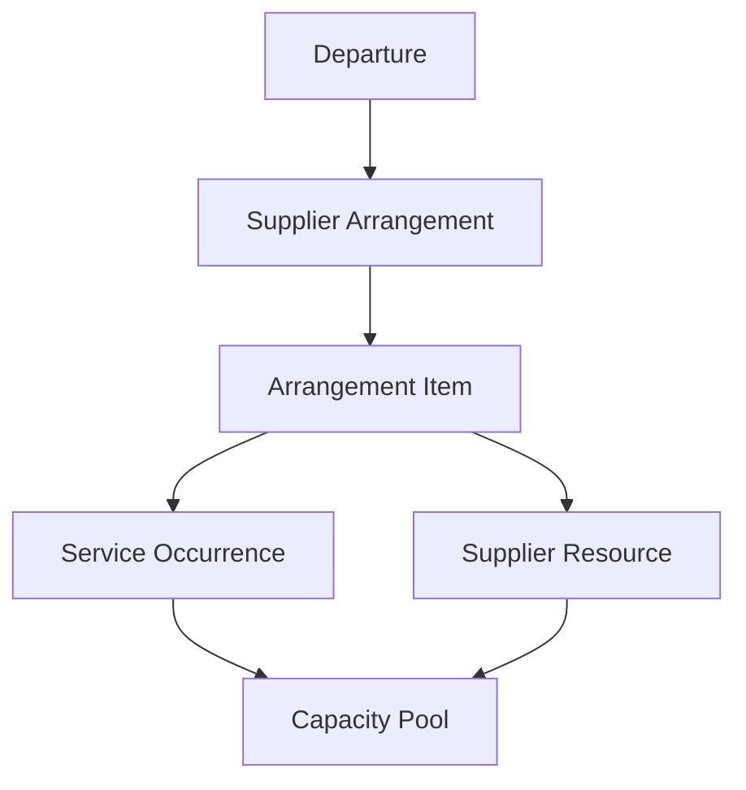

# M3 Supplier planning

**Status:** Accepted 2026-09-16. Amended 2026-09-16. [M3A](m3a-draft-arrangement-structure.md) is shipped. Later M3 slices remain unimplemented.

**Amendment 2026-09-16:** Closed decisions now authorize Arrangement and version `abandoned` (never-activated discard; not Arrangement `cancelled`); departed Departures may not create new tentative Arrangements; ordinary inactivation uses the effective-provider rule and a recovery allow-list; M3A adds only `force_inactivate_supplier_with_dependencies`; Occurrence creation fails `invalid` when no recognized zone can be stored; version `lock_version` owns child-collection concurrency. [ADR 0008](../adr/0008-supplier-arrangement-version-topology.md) and [ADR 0009](../adr/0009-supplier-contracting-and-service-provider-roles.md) lock topology and Supplier roles. Occurrence operational lifecycle (`planned`/`cancelled`) lives on the stable Occurrence identity with `lock_version`; definition rows hold commercial/schedule attributes only. M3A ships the first durable create-command idempotency family and uses an explicit create-command lock-order exception for the idempotency row.

**Prerequisites:** M2 complete and shipped, including [ADR 0007](../adr/0007-departure-operational-root.md), [M2C](m2c-acceptance-and-hardening.md), and final M2 documentation; [ADR 0001](../adr/0001-money-and-currency.md), [ADR 0004](../adr/0004-human-readable-references.md), [ADR 0005](../adr/0005-agency-identity.md), [ADR 0006](../adr/0006-separate-identity-domains.md), [ADR 0008](../adr/0008-supplier-arrangement-version-topology.md), [ADR 0009](../adr/0009-supplier-contracting-and-service-provider-roles.md), [MVP requirements](departure-desk-mvp.md), [commercial decision register](commercial-domain-decision-register.md), [current architecture](../architecture/current-state.md), [interface contract](../ui/interface-contract.md), and completed [M1 directories](m1-client-and-supplier-directories.md).

This parent contract is not implementation authority. Each M3 slice requires its own accepted implementation contract before domain code begins. Archived Phase 3B documents are historical input only; they do not govern M3.

When this parent is accepted, update the documentation index listed in [Acceptance documentation](#acceptance-documentation). That status flip does not authorize domain code. Shipped M2 and M2C plans keep their historical “do not invent an M3 plan” exclusions. `AGENTS.md` may then say this parent is accepted while still treating every M3 slice as unimplemented until that slice’s own accepted plan names the work.

## Goal

Establish the Supplier-side plan for a Departure before the Agency defines Client offers, confirms Client Trips, allocates supply to Clients, or posts Supplier payables.

M3 gives an Agency the ability to explain:

* what it has arranged with each contracting Supplier;
* which separately described services or deliverables the Arrangement contains;
* when each service is expected to occur;
* which Supplier Resources and measured capacity are available;
* what is blocked, allotted, guaranteed, released, or on request;
* which group- or occurrence-level requests and confirmations exist;
* which Supplier cost terms currently govern planning;
* which contractual commitments and deposit requirements exist without treating them as payables or payments;
* which Supplier deadlines are upcoming, due, overdue, completed, rescheduled, or waived; and
* which qualified forecast-cost and exposure measures are supported by the recorded facts.

M3 must represent both accepted scenarios from the Supplier side without cruise-, hotel-, motorcoach-, meal-, excursion-, or insurance-specific subclasses.

## Outcome boundary

M3 represents Supplier planning. It does not yet represent Client selling, Client fulfillment, or Supplier settlement.

| M3 answers | Deferred milestone answers |
| --- | --- |
| What did the Agency arrange or request from a Supplier? | What Package or standalone service will the Agency sell? (M4) |
| What service, occurrence, resource, and Supplier-side capacity exist? | Which Client Trip holds or consumes that capacity? (M5) |
| What Supplier terms, forecast cost, commitment, and deadline govern? | What does the Client owe or pay? (M4/M6A) |
| What group- or occurrence-level Supplier confirmation exists? | Which Traveler occupies a cabin, room, seat, or other resource? (M5) |
| What exposure is indicated before payable posting? | What Supplier Obligation, invoice, Payment, credit, commission settlement, or final cost exists? (M6B) |
| What Supplier planning fact changed? | What amendment, Cancellation Case, Communication, document, or closeout disposition follows? (M7/M8) |

The distinctions among operational truth, commercial truth, Supplier truth, and cash movement remain mandatory. No M3 event implies a Client sale, Client allocation, Supplier Obligation, Supplier Payment, or accounting loss.

Commercial register section 18.5 allows a Supplier confirmation to trigger deterministic commitments or Obligations. M3 implements a staged restriction of the Obligation half only: confirmation never posts a Supplier Obligation. Confirmation never silently opens a commitment. When the governing activated terms define a complete deterministic trigger, the confirmation command may explicitly and atomically open that commitment, provided its command contract, preview, audit, idempotency, and failure behavior name the effect. Otherwise confirmation creates a needs-attention condition for a separate commitment command.

## Aggregate boundary

`Departure` is the dated operational root accepted by ADR 0007. Every M3 record belongs to exactly one Agency and one Departure. No M3 record belongs to a Travel Program or derives ownership or authorization from an Office.

Supporting records include Supplier Arrangement versions, Supplier Reservations, Supplier confirmations, Supplier cost terms and components, commitments, deposit requirements, Deadlines, capacity events, rebuildable capacity projections, and the first durable business-command idempotency-key family.

The diagram describes domain responsibility, not a required table count. Slice plans must define concrete persistence, same-Agency foreign keys, lifecycle columns, and immutable-history topology without weakening these meanings.

## Proposed slices

| Slice | Working outcome |
| --- | --- |
| **[M3A — Draft Arrangement structure](m3a-draft-arrangement-structure.md)** | Stable Arrangement identity, lifecycle catalog including `abandoned`, and draft-version topology; Items, Occurrences, Resources, and optional Arrangement contact; contracting Supplier and Service Provider rules; `view_departures` / `manage_departures` plus `force_inactivate_supplier_with_dependencies`; `override_supplier_planning_terms` remains a named future permission; `ChangeSupplierStatus` ordinary blockers for introduced dependencies; draft UI that amends the Departure interface contract. Supplier Location attachment is deferred. No activation yet. Shipped. |
| **M3B — Supplier capacity** | Draft Capacity Pool *definitions*, inventory modes and measurement bases; immutable Supplier-side capacity-event and projection contracts; evidence, override, concurrency, and reconciliation foundations. Definition rows are not established managed supply. Effective supply still requires later Arrangement activation. |
| **M3C — Cost terms and forecasts** | Draft estimate/contracted-term *definitions*; the first ADR 0001 monetary-table pattern; composable cost components; explicit percentage bases, `numeric` rates, and calculation order; fixed, per-resource, per-person, per-night, minimum, occupancy-position, and zero-cost patterns; forecast precedence and explainability. Effective contracted terms still require later Arrangement activation. |
| **M3D — Activation, Reservations, and confirmations** | Arrangement activation and immutable activated versions after applicable structural, capacity, and cost completeness checks; unmanaged Items may activate without a Capacity Pool; first and successor activation only while the Departure is `active`; permanent Departure return-to-draft boundary; group/occurrence Supplier Reservations; confirmation evidence, including named atomic commitment opening when terms fully determine it; effective capacity and contracted planning; Arrangement search without changing `SearchDepartures`. |
| **M3E — Commitments, deadlines, and exposure** | Explicit commitments and deposit requirements without payable/payment state; Deadline rule resolution and staff workflow; qualified exposure measures; needs-attention catalog; Supplier-inactivation extension for commitment dependencies. |
| **M3F — Acceptance and hardening** | Celebrity Beyond and Vineyard Tour Supplier-side scenario proof; cross-Agency isolation; concurrency, query/index, accessibility, responsive UI, regression, and final milestone documentation. |

Each slice requires an accepted implementation contract. A later slice may depend on a prior slice's shipped records, but an accepted parent contract does not authorize placeholder tables or premature later-slice behavior.

## Closed product decisions

The following decisions are locked in this parent contract. Slice plans may make them more specific but may not reopen them for implementation convenience.

### 1. Draft Departure planning

This decision amends the M2 parent clause that a draft Departure cannot own M3–M8 records because those milestones were not yet shipped. A draft Departure may own tentative Supplier Arrangement drafts and the editable planning structure needed to prepare them.

While the Departure remains draft:

* an Arrangement cannot activate;
* no Supplier confirmation may become effective;
* no managed Supplier capacity may be established;
* no commitment may open;
* no consequential Deadline may be resolved for operational use; and
* no M3 record may represent Supplier-confirmed or operationally available supply.

Draft Capacity Pool rows and draft cost-term rows are definitions only. They are not established supply and not effective contracted terms.

Draft planning is not Supplier truth. Draft Arrangement data remains visibly tentative.

### 2. Return-to-draft boundary

This decision is the M2 downstream-history catalog for M3. The first successful Supplier Arrangement activation permanently prevents `ReturnDepartureToDraft` for that Departure.

* Arrangement activation and the downstream-history check share an atomic lock/recheck boundary with `ReturnDepartureToDraft`, `MarkDepartureDeparted`, and other Departure lifecycle commands.
* Ending or otherwise terminating every Arrangement later does not restore eligibility to return the Departure to draft.
* Mere unactivated Arrangement drafts do not trigger this permanent boundary.
* Confirmation, capacity, commitment, and other consequential M3 history also block return, but they cannot validly precede Arrangement activation.

### 3. Arrangement activation prerequisite

First and successor Supplier Arrangement activation require `Departure.status == active`. A draft or departed Departure cannot activate an Arrangement.

A departed Departure may still record Supplier responses, corrections, Deadline completion, commitment disposition, and other explicitly permitted resolution history. Ordinary activation is not that path. If historical late entry is later required, a separate corrective command must be accepted in its own slice; M3 does not treat post-departure activation as ordinary planning.

A departed Departure may not create a new tentative Arrangement. Existing unactivated drafts allow dependency-reducing cleanup, correction necessary to resolve existing records, or abandonment. Activated Arrangement resolution work remains permitted as defined by later slices. `MarkDepartureDeparted` does not automatically abandon unfinished drafts. Late creation of previously undocumented Supplier work, if ever needed, is a separately defined historical-correction command—not ordinary forward-looking draft editing.

An Arrangement is not activated automatically when the Departure activates or when it is marked departed. Departure activation, marking departed, and Arrangement activation are distinct commands and audit facts.

The race with `MarkDepartureDeparted` has a closed outcome:

* Arrangement activation wins first: activation succeeds, then the Departure may become departed.
* Departed transition wins first: Arrangement activation fails with `invalid_state`.

### 4. Stable identity and immutable versions

Supplier Arrangement is the stable identity for one governing agreement or purchasing relationship. Activated commercial definitions are immutable versions.

* The initial Arrangement version is editable while draft.
* First activation freezes version 1.
* Revised terms create a successor draft version.
* Activating the successor supersedes the prior version for future planning and sales resolution.
* Earlier confirmations, evaluations, commitments, allocations introduced later, and commercial snapshots retain the exact version that governed them.
* A correction never edits an activated version in place.
* Changing the contracting Supplier or representing an independently governed agreement requires a new Supplier Arrangement rather than a new version.
* [ADR 0008](../adr/0008-supplier-arrangement-version-topology.md) locks the topology: Arrangement, Item, Occurrence, and Resource are stable identities; version-specific attributes live in per-version definition rows. Successor drafts copy the current activated graph into independent definition rows, reuse stable child identifiers for copied children, assign new identifiers to new children, and omit removed children. There is no live inheritance. Later defaults must not reinterpret consequential records that already referenced an exact version.

Operational events such as Supplier confirmations, reservation responses, capacity changes, Deadline rescheduling, and commitment disposition remain explicit history rather than edits to an old Arrangement version.

### 5. Supplier Reservations in M3

M3 includes group- and occurrence-level Supplier Reservations that may exist before a Client Trip.

* An Arrangement records the governing agreement or purchasing relationship.
* A Supplier Reservation records a specific group- or occurrence-level request or booking made under that Arrangement.
* One Supplier-facing booking must never be represented simultaneously as both an Arrangement and a Supplier Reservation.
* A Reservation may identify applicable Arrangement Items, Service Occurrences, Supplier Resources, or Capacity Pools as its scope requires.
* Client-specific Supplier bookings and their linkage to Client Trip Services are deferred to M5.
* A standalone Supplier Reservation without a governing M3 Arrangement is not introduced here. The MVP's standalone-reservation shape remains available to a later accepted slice for trip-specific or otherwise demonstrated demand.

### 6. Contracting Supplier and Service Provider

The Arrangement identifies one contracting Supplier. The organization or person actually performing a service may differ. [ADR 0009](../adr/0009-supplier-contracting-and-service-provider-roles.md) locks these role meanings.

* An Arrangement Item may identify a default Service Provider.
* A Service Occurrence may override the Item default.
* The effective provider is the Occurrence override when present, otherwise the Item default, otherwise the contracting Supplier.
* A provider default is a planning convenience, not authorization and not live historical inheritance.
* An unused Item default is not itself an ordinary Supplier-inactivation blocker. Ordinary inactivation uses the effective provider of a current or future `planned` Occurrence, as in closed decision 10.
* A consequential confirmation, commitment, later fulfillment record, or other snapshot preserves the effective provider it used.
* Changing a default affects future resolution only.
* The contracting Supplier and any selected Service Provider must be active same-Agency Supplier records when newly assigned or activated.
* Later inactivation does not invalidate retained history or prevent corrective and resolution commands.

M3 does not create a second Service Provider directory or restore Party. A distinct Service Provider is represented by a Supplier directory identity in its actual operational context.

### 7. Arrangement identification

M3 introduces no DepartureDesk-generated Arrangement reference or new `ReferenceSequence` namespace.

Staff identify and search an Arrangement through:

* its owning Departure and Departure reference;
* contracting Supplier;
* Arrangement name; and
* qualified Supplier-issued confirmations or group identifiers when available.

That Arrangement search is a separate Agency-scoped query in the Departure workspace. `SearchDepartures` remains unchanged: it does not search Clients, Suppliers, or external references.

Supplier confirmation numbers, group numbers, policy numbers, and similar identifiers are externally issued facts. They retain issuer, type, scope, provenance, and normalization appropriate to their domain. They are not rewritten into an internal generated namespace and never establish tenancy or authorization.

### 8. Deadline behavior

M3 introduces the operational portion of the general Deadline concept for Supplier planning.

M3 supports:

* a governing absolute or relative rule and its source;
* a resolved local date or local date/time and explicit IANA zone;
* the resolved instant used for comparison when a time exists;
* upcoming, due, overdue, completed, rescheduled, and waived presentation;
* a Departure-level Deadline list and needs-attention queue;
* explicit completion evidence;
* explicit rescheduling history; and
* authorized waiver with actor, time, and reason.

M3 does not send email, generate Communications, or materialize automatic reminder alerts. Those behaviors remain deferred. Upcoming and overdue state may be calculated from authoritative Deadline facts without a background job.

Completing or waiving a Deadline does not mark a deposit paid, post an Obligation, release capacity, cancel a Reservation, or fabricate Supplier confirmation.

### 9. Supplier-side capacity authority

Staff may record Supplier-side capacity changes supported by Supplier evidence or governing terms. An Administrator with `override_supplier_planning_terms` and a required reason is necessary when the Agency intentionally departs from recorded terms or normally required evidence.

* A Supplier-confirmed exception is Supplier truth, not an Administrator override, even when received after the original cutoff.
* Negative quantities are impossible and never an overrideable state.
* An override cannot fabricate Supplier confirmation or conceal that managed quantity exceeds evidenced Supplier supply.
* Client over-capacity confirmation is an M5 concern.
* Every override remains visible in needs-attention until resolved or explicitly acknowledged under the M3E catalog.

### 10. Supplier inactivation dependencies

Ordinary Supplier inactivation continues to use `ChangeSupplierStatus` and `manage_supplier_directory`. It is blocked by current nonterminal M3 dependencies, including as applicable:

* draft or active Arrangements using the Supplier as contractor;
* planned, requested, or confirmed nonterminal Supplier Reservations;
* current or future `planned` Service Occurrences using the Supplier as effective Service Provider; and
* unresolved open commitments.

Effective provider is computed from the exact Arrangement version: Occurrence override, else Item default, else contracting Supplier. An Item default blocks ordinary inactivation only when it resolves as the effective provider for a current or future `planned` Occurrence. An unused Item default with no applicable Occurrence does not block.

Terminal and historical references do not block inactivation. These include ended Arrangements, abandoned Arrangements, withdrawn/declined/cancelled Reservations, `cancelled` Occurrences, `planned` Occurrences whose service window has already ended, released/superseded/cancelled commitments, superseded terms, and a Supplier retained only as a historical confirmation issuer or provider. A past service window does not assign fulfillment or `completed` status.

An Administrator with `force_inactivate_supplier_with_dependencies` may force inactivation with a required reason when reality requires it, such as a Supplier ceasing operations unexpectedly. Force is an extension of `ChangeSupplierStatus`, not a second Supplier lifecycle path.

Forced inactivation:

* preserves every unresolved Arrangement, Reservation, Occurrence, capacity, commitment, confirmation, and Deadline;
* creates needs-attention for the affected current records;
* does not cascade cancellation, capacity release, commitment release, provider replacement, or Deadline completion;
* prevents the inactive Supplier from being selected for new work; and
* continues to permit explicit corrective or dependency-reducing work on existing records, never selection of the inactive Supplier for new work.

While a Supplier is inactive after force, recovery permits only:

* clearing an Arrangement contact;
* removing or replacing an inactive provider assignment;
* removing unpublished dependent draft structure; and
* abandoning an unactivated draft.

Because the contracting Supplier is immutable, an Arrangement whose contractor becomes inactive may be cleaned up or abandoned but cannot be moved to another contractor.

The command must lock and recheck dependencies so concurrent Arrangement activation, Reservation creation, provider assignment, or commitment opening cannot evade the inactivation decision. Establishment commands and inactivation share the [canonical lock order](#concurrency-and-lock-order-requirements), with affected Suppliers locked before affected Departures and Arrangements.

### 11. Occurrence dates and Departure schedule

A Service Occurrence may start before `Departure.starts_on` or end after `Departure.ends_on`. Pre-stay and post-stay hotel nights, early transfers, and similar Supplier performances are valid without stretching the Departure operating dates.

Occurrence creation stores a recognized IANA zone. The form may default that zone by copying `Departure.time_zone`. If the Departure zone is blank, creation fails `invalid` unless staff submit an explicit recognized IANA zone. A copied zone becomes an independent stored fact.

`UpdateDeparture` and `CorrectDepartureSchedule` must not silently rewrite, move, complete, or reinterpret existing Occurrences or resolved Deadlines. Changing the Departure zone or a copied default never reinterprets a stored Occurrence or Deadline. Schedule correction does not require Occurrences to be brought inside the new Departure window.

The implementation slice must distinguish commercial schedule amendments from operational updates and preserve the before/after evidence for consequential Occurrence changes.

### 12. Currency dependency catalog

The Departure's `operating_currency` remains the single transaction currency for M3. Any persisted currency-bearing M3 fact, including a draft definition, freezes that currency against ordinary change. No command relabels or converts stored amounts.

Shipped command mapping:

| Departure status | Currency mutation | M3 rule |
| --- | --- | --- |
| `draft` | `UpdateDeparture` | Blocked once any currency-bearing M3 fact exists, including a draft definition that stores a currency or amount. Staff must explicitly remove or void those draft definitions first, then change currency. |
| `active` | `UpdateDeparture` | Blocked once any currency-bearing M3 fact exists, including draft definitions. |
| `departed` | `CorrectDepartureCurrency` | Blocked by every currency-bearing M3 fact, including draft, activated, and historical rows. |

Activated or historical currency-bearing facts cannot be removed merely to unlock currency. Returning to draft does not unlock currency after it has been frozen. In practice the return-to-draft latch from first Arrangement activation already prevents that path once activated terms exist.

### 13. Arrangement and version lifecycle

M3A must persist these closed catalogs. Slice plans may add display labels but may not invent extra meaning-changing states.

**Supplier Arrangement**

| Status | Contract |
| --- | --- |
| `draft` | Never successfully activated. Editable where state gates permit. Does not block `ReturnDepartureToDraft`. |
| `active` | Has a current governing activated version. First transition into this status permanently blocks return to draft. |
| `ended` | Ordinary post-activation terminal. No longer available for new planning or sales use. History retained. Does not restore return-to-draft. Records an explicit termination reason. Ending does not automatically release capacity, release commitments, cancel Reservations, complete Deadlines, or create Client or Supplier financial consequences. |
| `abandoned` | Never-activated draft intentionally discarded. Retained read-only. Cannot later activate or be restored. Restarting requires a new Arrangement. Records an explicit abandonment reason. Does not restore return-to-draft because it never activated. |

`ended` and `abandoned` are both terminal for ordinary Supplier-inactivation blockers. `abandoned` applies only to a never-activated Arrangement. M3 does not add a `cancelled` Arrangement status. Supplier cancellation does not change the Arrangement to `cancelled`; entire-agreement Cancellation Cases remain M7.

**Arrangement version**

| Status | Contract |
| --- | --- |
| `draft` | Editable initial or successor definition. |
| `activated` | Immutable. At most one activated version is the current governing version of an `active` Arrangement. |
| `superseded` | Previously activated; retained for provenance. |
| `abandoned` | Retained draft intentionally discarded. |

Initial abandonment changes both the Arrangement and version 1 from `draft` to `abandoned`. Successor abandonment, when later slices introduce successor drafts, changes only that version; the Arrangement continues under its prior activated version. Abandoned version numbers are never reused.

**Service Occurrence**, for inactivation and planning:

| Status | Contract |
| --- | --- |
| `planned` | Nonterminal performance. Blocks ordinary inactivation when the Supplier is the effective provider and the service window has not ended. A past service window is a historical provider reference only; it does not prove delivery and does not become `completed`. |
| `cancelled` | Terminal. Does not block ordinary inactivation. |

M3 does not persist Occurrence fulfillment or `completed`. Actual completion belongs to M5 or M7.

Reservation states remain the baseline in [Supplier Reservations and confirmations](#supplier-reservations-and-confirmations). Commitment terminals are released, superseded, or cancelled.

### 14. Activation completeness and unmanaged items

Arrangement activation runs applicable completeness checks for structure, capacity, and cost. An Item whose inventory mode is unmanaged/no capacity must not be required to have a Resource or Capacity Pool. Insurance and similar informational or non-capacity services may activate without fabricated supply.

Draft Capacity Pool and cost-term *definitions* may exist before activation. Established managed supply and effective contracted terms begin only when the Arrangement activates while the Departure is `active`.

### 15. Permission keys

Ordinary Supplier planning lives in the Departure workspace and reuses the shipped Departure pair:

* `view_departures` — view Supplier planning;
* `manage_departures` — create and edit drafts and perform ordinary evidence-backed M3 transitions.

M3A adds `force_inactivate_supplier_with_dependencies` — force `ChangeSupplierStatus` to inactive over current M3 dependencies, with a required reason.

`override_supplier_planning_terms` is the named future Administrator-only permission for departing from recorded Supplier terms or normally required evidence, with a required reason. It enters `AccessPermission` only when the first command requiring it ships. No command may substitute a role-name check while that permission is deferred.

M3 does not add `view_supplier_planning`, `manage_supplier_planning`, or a parallel planning navigation permission. Assignment as responsible AgencyUser, Arrangement contact, or Service Provider does not grant authority.

### 16. First monetary persistence and rates

M3C ships the first application monetary tables and must establish the reusable ADR 0001 pattern:

* `bigint` `*_minor_units` plus an explicit uppercase currency;
* `monetize` with `with_model_currency`;
* explicit migrations, not `money-rails` migration helpers;
* `Money::Currency.find` at the command boundary, matching Departure;
* strict money parsing only at those boundaries;
* no floating-point columns for amounts, rates that produce money, or allocations;
* `numeric` columns with explicit precision and scale for percentage rates and similar fractional factors;
* persist the calculated minor-unit result together with rate, base, rounding mode, and calculation order.

### 17. Optimistic locking and idempotency keys

User-driven M3 commands use the shipped Departure pattern: pessimistic row locks in canonical order, then a submitted `lock_version` on the mutable aggregate, with stale submissions returning `conflict`. Lifecycle replay and already-applied no-ops follow the existing Departure command rules for when `lock_version` is compared.

Arrangement identity remains lockable because name, contact, and status are mutable. Child create, remove, and reorder submit and bump the Arrangement-version `lock_version`. Editing an existing child definition uses that definition’s `lock_version`.

`ArrangementItem` and `SupplierResource` identity rows hold immutable ownership only and do not need their own optimistic locks. `ServiceOccurrence` identity rows carry the current operational lifecycle (`planned` or `cancelled`) and therefore require `lock_version`. Occurrence commercial and schedule attributes remain on versioned definition rows without a lifecycle status column. Later cancellation updates the stable Occurrence status projection and records command evidence; it must not mutate an activated definition or require a commercial successor version merely to cancel.

M3 introduces the first durable business-command idempotency-key family. M3A ships that family for Arrangement and child create commands. Retry of the same command at the declared business-command scope must not create a second Arrangement, version, child, confirmation, capacity event, commitment, Deadline mutation, or success audit. Same key plus same payload returns the original result without a second success audit. Same key plus different payload returns `conflict`. Idempotency identity is a domain constraint, not JSON inside `AuditEvent#details`.

### 18. Confirmation does not silently open commitments

Confirming an Arrangement or Reservation records Supplier evidence. Confirmation never silently opens a commitment. When the governing activated terms define a complete deterministic trigger, the confirmation command may explicitly and atomically open that commitment, provided its command contract, preview, audit, idempotency, and failure behavior name that effect. Otherwise confirmation creates a needs-attention condition for a separate commitment command. Confirmation never posts a Supplier Obligation.

## Domain concepts

| Concept | Contract |
| --- | --- |
| Supplier Arrangement | Stable governing agreement or planning relationship between the Agency and one contracting Supplier for one Departure. |
| Arrangement version | Immutable activated commercial definition; successor versions govern future resolution without rewriting prior use. |
| Arrangement Item | Separately described Supplier-side service, deliverable, or commercial line within an Arrangement version. It is not a generic substitute for Occurrence, Resource, cost component, or Client Trip Service. |
| Service Occurrence | One dated or otherwise bounded performance of an Arrangement Item. A capacity-bearing Occurrence has an explicit date range. Dates may fall outside the Departure operating window. |
| Supplier Resource | The supplied unit or category relevant to capacity or later placement, such as an O1 cabin category, standard room type, or coach. |
| Capacity Pool | Explicitly measured Supplier-side supply for one Service Occurrence and Supplier Resource, with a declared inventory mode and measurement basis. |
| Supplier Reservation | Specific group- or occurrence-level request or booking made with a Supplier under an M3 Arrangement. |
| Supplier confirmation | Qualified evidence that a Supplier acknowledged an Arrangement or Reservation; it may include an external identifier or a documented confirmed-without-identifier path. |
| Arrangement contact | Optional same-Agency `SupplierContact` used as a communication pointer for the Arrangement. It grants no authority. Consequential events snapshot the contact facts they need. |
| Supplier cost term | Versioned estimate or contracted rule used to calculate forecast Supplier cost for a stable economic source. |
| Cost component | Typed component such as base, tax, fee, discount, or expected commission, with explicit quantity and percentage-base semantics. Occupancy-position tables are Supplier cost facts, not Traveler occupancy records. |
| Commitment | Explicit contractual exposure that may precede and must not be confused with a Supplier Obligation. |
| Deposit requirement | Supplier requirement stating amount or calculation rule, due rule, refundability, final-balance treatment, trigger, and provenance; it is not a Payment. |
| Deadline | Resolved operational due fact linked to its governing source and preserving completion, rescheduling, or waiver history. |
| Exposure | Qualified planning risk derived from recorded terms and commitments; it is not a posted accounting loss. |
| Needs-attention | Staff queue of current Supplier-planning conditions. M3E owns the first catalog. Conditions may be derived from authoritative records; acknowledgment of an override or similar requires a persisted acknowledgment fact. It is not a Cancellation Case or Communication. |

## Arrangement structure

### Flat Arrangements

M3 does not introduce parent/child Supplier Arrangements.

Use one Arrangement for one independently governed Supplier agreement or purchasing relationship, with multiple Arrangement Items inside it. Create a separate Arrangement when the contracting Supplier, agreement, confirmation context, or governing terms are independently controlled.

An Arrangement Item, Supplier Reservation, or separate Arrangement must not represent the same Supplier booking twice.

### Arrangement Items

An Item defines what the Supplier is expected to provide. It may carry descriptive and commercial categorization, a default Service Provider, and links to its versioned terms.

M3 does not decide whether an Item is included, optional, or a required choice for a Client. M4 maps Supplier-side Items into Packages or standalone sellable services and owns Client-facing inclusion and choice rules.

No service-type STI is permitted. Cruise, hotel, transfer, coach, meal, tasting, excursion, insurance, specialty dining, and miscellaneous services compose from common Item, Occurrence, Resource, capacity, and term capabilities. A later service-specific extension requires a fact unique to that service and an accepted slice.

M3A includes optional Arrangement contact. The contact must be a same-Agency `SupplierContact` of the contracting Supplier when assigned. Inactive historical contacts remain displayable. Assignment grants no authority.

M3 defers attaching a `SupplierLocation` to an Item or Occurrence. Neither accepted scenario currently requires that pointer for Supplier-side planning. A later accepted slice may add it as planning metadata only; it would not own the M3 record, authorize, or supply live timezone inheritance.

### Service Occurrences

A Service Occurrence describes when an Item is performed.

* An all-day or multi-day Occurrence stores local date values rather than artificial midnight timestamps.
* A timed Occurrence stores local time and an explicit IANA zone, defaulted by copying the Departure zone unless explicitly overridden.
* If `Departure.time_zone` is blank, Occurrence creation fails `invalid` unless staff submit an explicit recognized IANA zone.
* A spanning engagement with fixed capacity, such as a cruise sailing, uses one Occurrence spanning the engagement.
* Nightly-varying capacity, such as a hotel block, uses one Occurrence per night.
* Segment-specific services, such as transfers, use distinct Occurrences where their schedule, provider, confirmation, capacity, or terms differ.
* Dates may precede or follow the Departure operating dates.
* Changing a default zone later never reinterprets an existing resolved Occurrence.

### Supplier Resources

A Supplier Resource describes the unit or category whose capacity is measured or into which later fulfillment may be placed. It does not store a mutable generic `available` count.

Examples include a cabin category, room type, coach, vehicle class, or another named resource. Individual Traveler placement, named-room assignment, cabin assignment, seat assignment, and occupancy are deferred to M5.

A Resource with managed capacity participates through a Capacity Pool scoped to a Service Occurrence. A non-capacity service need not fabricate a Resource or Capacity Pool.

## Supplier Reservations and confirmations

### Reservation lifecycle baseline

M3 slice plans must implement at least these meanings:

| State or transition | Contract |
| --- | --- |
| Planned | Internal intent; no claim that the Supplier received a request. |
| Requested | Request data and Supplier communication context recorded. |
| Confirmed | Supplier evidence recorded. May atomically open a commitment only under closed decision 18. Otherwise may create needs-attention for a separate commitment command. |
| Declined | Supplier response and reason retained; creates needs-attention where the service is still required. |
| Withdrawn/cancelled | Explicit history; no silent deletion or implied financial consequence. |
| Changed | Later Supplier response or amendment preserved as a new event/version rather than rewriting the prior confirmation. |

Confirming a Reservation requires either:

1. effective Supplier confirmation evidence with issuer, context, actor, time, and optional external identifier; or
2. an explicit confirmed-without-identifier reason with actor, time, Supplier/channel provenance, and optional safe evidence reference.

A confirmation identifier is not assumed globally unique. Uniqueness and duplicate warnings must use the applicable Supplier, issuer, identifier type, and context. Confirmation never fabricates a Client sale or Supplier Obligation.

## Supplier capacity

### Capacity distinctions

M3 preserves the accepted distinctions:

| Concept | Meaning | Must not imply |
| --- | --- | --- |
| Capacity | Maximum supported quantity in a declared basis | Held, sold, guaranteed, or paid |
| Block | Capacity held under Supplier release or guarantee terms | Every blocked unit is guaranteed |
| Allotment | Inventory made available by a Supplier | A payable commitment |
| On request | Availability requires Supplier response | Current numeric availability |
| Guarantee | Quantity or amount payable regardless of use | Sold or assigned units |
| Allocation | Internal confirmed demand against a pool | That Allocation is implemented in M3; Allocations begin in M5 |
| Exposure | Qualified planning risk | Posted loss or payable balance |

### Capacity Pool contract

Every managed Capacity Pool declares:

* owning Agency and Departure;
* Arrangement and governing version provenance;
* Arrangement Item;
* Service Occurrence;
* Supplier Resource;
* inventory mode;
* measurement basis;
* quantity precision and unit label;
* governing Supplier evidence or term source; and
* current stored projection derived from immutable capacity history.

Supported inventory modes must distinguish at least block, allotment, on request, externally managed, and unmanaged/no capacity. Unknown, on-request, or externally managed supply must not be stored as zero or unlimited managed quantity.

Measurement bases must distinguish resource units, Traveler positions, and any later explicitly accepted named quantity. A slice may add a closed catalog only when its measurement and future Hold/Allocation semantics are defined. Traveler-position is a unit label; it does not create Traveler records.

Draft pool *definitions* may exist on a draft Arrangement. Establish-evidenced-supply and later quantity events that create managed supply are forbidden until the Arrangement is activated.

### Capacity history and projection

Supplier-side capacity changes are immutable events. M3 supports at least:

* establish evidenced supply;
* increase;
* Supplier-approved release;
* Supplier-approved reinstatement;
* Supplier withdrawal; and
* explicit compensating correction.

The current position is a rebuildable stored projection. Events record actor, effective time, recorded time, quantity and basis, evidence/provenance, governing Arrangement version, reason where required, and idempotency identity.

M3 capacity events do not represent Client Holds or confirmed Allocations. Supplier Reservations may reference Capacity Pools but do not silently consume them. Any capacity consequence of a Reservation command must be an explicit capacity event.

Capacity changes do not silently create, revise, satisfy, or release commitments. Commitment changes do not silently change capacity.

### Concurrency

Every capacity mutation:

* locks the Agency and rechecks active status and authority;
* loads the Departure through the Agency;
* locks the applicable Capacity Pool in canonical order;
* rechecks Arrangement version, Occurrence, Resource, evidence, and current projection;
* applies one idempotent event and projection update atomically; and
* rejects impossible negative or inconsistent states.

The M3B slice must publish the complete lock order, transition matrix, idempotency behavior, reconciliation command, and projection-rebuild proof before implementation.

## Supplier cost terms and forecasts

### Term stages

Supplier cost terms and commitments are separate authorities.

| Concern | Estimate term | Contracted term | Commitment | Supplier Obligation |
| --- | --- | --- | --- | --- |
| Meaning | Planning assumption | Recorded Supplier terms | Contractual exposure | Posted amount owed |
| M3 | Yes | Yes | Yes | No |
| Mutable after activation/opening | No; supersede | No; supersede | Explicit disposition only | Deferred to M6B |

An estimate becoming contracted creates a new version or superseding term. It does not mutate the estimate in place. `committed` is not a cost-term stage.

Draft term *definitions* may exist before Arrangement activation. Effective contracted terms begin at activation.

### Composable components

M3 models Supplier cost as typed components rather than one formula per service type. Required component capabilities include:

* fixed amount per Arrangement, Item, Resource, or operated Occurrence;
* per resource unit;
* per person or planning quantity;
* per night;
* minimum billed quantity or guarantee;
* occupancy-position or tier selected from a recorded table with no hardcoded position ceiling;
* tax;
* fee;
* discount;
* expected commission;
* percentage applied to explicitly identified base components;
* pass-through classification where applicable; and
* explicit zero-cost or informational fulfillment.

Every percentage component identifies its base source components, inclusive/additive treatment, calculation order, rate precision, rounding method, and calculated minor-unit result. Rates use `numeric` persistence. No floating point is permitted.

The cost system must be extensible without implementing a generic user-programmable formula language or service-specific pricing subclasses.

### Planning quantities

Per-person, per-resource, per-night, minimum, and threshold calculations use explicit planning or guaranteed quantities. M3 must not imply that Client Trips, Travelers, Holds, or Allocations exist.

Threshold-triggered capacity may calculate the number of resource units required from a planning quantity, such as one vehicle per 15 Traveler positions. Crossing a threshold does not automatically create a Resource, Service Occurrence, Reservation, capacity, commitment, or Supplier Obligation. Staff perform and confirm the resulting Supplier planning action.

### Economic-source identity and forecast precedence

Each calculation identifies a stable economic source through its Arrangement, exact Arrangement version, Item, optional Reservation, Occurrence, Resource or Capacity Pool where applicable, cost category, quantity basis, and governing term.

Projected Supplier cost selects one current best expected-final value for each economic source. It never sums estimate, contracted term, commitment, later Obligation, and later invoice as separate costs for the same source.

M3 reporting must explain:

* selected stage;
* governing version and source;
* quantities;
* components and percentage bases;
* rounding; and
* why an earlier stage was superseded.

## Commitments, deposit requirements, and exposure

### Commitments

A commitment is an explicit contractual exposure governed by recorded Supplier terms. It is not capacity, a Deadline, an Obligation, an invoice, or a Payment.

Commitments preserve:

* owning Agency and Departure;
* Arrangement and exact governing version;
* applicable Item, Reservation, Occurrence, Resource, Capacity Pool, or economic source;
* type and description;
* quantity and/or amount basis;
* trigger and effective facts;
* currency and calculation provenance;
* opening evidence;
* lifecycle history; and
* actor and idempotency evidence.

Opening, superseding, releasing, satisfying, or cancelling a commitment is explicit. No capacity event silently changes commitment state. Confirmation may open a commitment only under closed decision 18. M6B later defines when a deterministic commitment milestone posts a Supplier Obligation.

Every minimum-billed-quantity term records whether the Arrangement may be cancelled without cost below the minimum or must operate/pay the minimum regardless. M3 records and reports that rule; it does not execute a future Cancellation Case.

### Deposit requirements

A Supplier deposit in M3 is a requirement, not cash movement.

It records the required amount or calculation rule, explicit percentage base where applicable, due rule, currency, refundability, application to final balance, trigger/commitment condition, and Supplier-term provenance.

It has no `paid`, `refunded`, cash-account, Receipt, Supplier Payment, or settlement state. Deadline completion or waiver does not mark it paid.

### Qualified exposure

M3 never displays one unqualified `Exposure` total. Supported measures must be labeled and explainable, including as applicable:

* forecast Supplier cost;
* gross contractual commitment;
* gross guarantee or minimum exposure;
* expected Supplier cost;
* expected net cost after separately identified expected commission; and
* current unallocated guarantee exposure, explicitly labeled as pre-Client planning until M5 introduces Allocations.

Expected commission is not earned commission. Exposure is not a Supplier balance or posted accounting loss.

Agency cash at risk is unavailable in M3 because Supplier Payments and refunds do not exist. It must render as unavailable or not applicable, never as a fabricated zero.

### Needs-attention catalog

M3E publishes the first needs-attention catalog. It includes at least:

* Administrator term or evidence overrides until resolved or explicitly acknowledged;
* current records affected by forced Supplier inactivation;
* declined Reservations where the service is still required;
* confirmations whose governing terms do not fully determine a commitment, where a separate commitment command is still required; and
* inactive Supplier remaining on current nonterminal planning records.

Derived conditions query authoritative M3 facts. Acknowledgment, where required, is a persisted fact with actor, time, and reason. M3 must not create Cancellation Case, Communication, or reminder rows to represent these conditions.

## Currency and money

The Departure's `operating_currency` is the single transaction currency for M3. Closed decision 12 is the dependency catalog for `UpdateDeparture` and `CorrectDepartureCurrency`.

* Every independently meaningful money fact stores `bigint` `*_minor_units` and an explicit uppercase currency under ADR 0001.
* Each M3 monetary currency must equal the owning Departure's operating currency.
* Agency or Departure defaults may seed entry but never interpret an already stored amount.
* M3 performs no FX conversion and persists no functional-currency translation.
* M3 does not combine values in different currencies because one Departure cannot contain them.
* M3C establishes the reusable `money-rails` model pattern when the first monetary table ships.
* `UpdateDeparture` and `CorrectDepartureCurrency` never clear, void, relabel, or convert M3 monetary rows in order to change currency.

## Deadline contract

A Deadline references the commercial requirement, clause, Reservation, commitment, or other accepted source that governs it. The same due fact must not be independently authoritative on both source and Deadline without an explicit source relationship.

* A relative rule preserves its inputs.
* Resolution records the local due value, governing zone, resolved instant where applicable, and source version.
* A date-only Supplier cutoff resolves to the end of that local calendar day unless Supplier terms state another cutoff.
* Comparison uses the resolved instant while UI displays the governing local date, time, and zone.
* Changing the Departure zone, schedule, or a default does not reinterpret a resolved Deadline.
* Rescheduling creates history and preserves the prior resolution.
* Completion records evidence; it is not inferred from another record's status.
* Waiver requires the authority declared by the M3E slice and always records actor, reason, and time.

M3 date automation is read-only classification. It must not post money, release capacity, cancel a service, complete a Deadline, change a commitment, or fabricate fulfillment. Name-list, option, release, and deposit due facts are Deadlines; M3 does not generate the underlying documents.

## Departure integration

### Lifecycle

* Draft Departure: may contain tentative Arrangement drafts only under closed decision 1. This amends the M2 statement that a draft Departure cannot own M3 records.
* Active Departure: may create and edit tentative Arrangements, activate Arrangements, and perform ordinary M3 planning.
* Departed Departure: remains available for recording Supplier responses, corrections, Deadline completion, commitment disposition, and other explicitly permitted resolution work. It cannot create a new tentative Arrangement or activate an Arrangement or successor version. Existing unactivated drafts allow dependency-reducing cleanup, correction necessary to resolve existing records, or abandonment. `MarkDepartureDeparted` does not automatically abandon unfinished drafts. M3 does not infer that every service was fulfilled merely because the Departure departed.
* Closed Departure does not yet exist in shipped M2 and is outside M3.

M3 does not extend Departure activation to require Supplier Arrangements. A Departure may activate before Supplier planning is complete. Supplier-planning readiness is shown separately.

`ReturnDepartureToDraft` currently has no downstream-history check. M3D extends that command, sharing the Departure lock with Arrangement activation, so the first successful activation cannot race a return to draft. The same lock/recheck boundary covers `MarkDepartureDeparted` versus Arrangement activation: departed wins with `invalid_state` for activation; activation winning first still allows the Departure to depart afterward.

### Responsibility and Office attribution

M3 records belong to the Agency and Departure, not to the responsible Office or AgencyUser.

* Current Office is not authorization.
* M3 does not copy `office_id` down every child or freeze Departure responsibility changes.
* Consequential M3 events snapshot the applicable responsible Office and responsible AgencyUser attribution where required for historical reporting.
* Later responsibility reassignment does not rewrite historical attribution.
* An inactive historical Office or AgencyUser remains displayable.

## Supplier lifecycle integration

New Supplier, contracting-Supplier, and Service-Provider assignments require active same-Agency Supplier records. Existing historical associations remain valid after inactivation.

M3A must extend `ChangeSupplierStatus` for the Arrangement, Item-provider, and Occurrence-provider dependencies it introduces rather than creating a separate incompatible Supplier lifecycle path. Ordinary inactivation keeps `manage_supplier_directory`. Force inactivation adds the Administrator permission, required reason, and dependency recheck. M3D extends the same dependency contract for Supplier Reservations, and M3E extends it for commitments. Together, the slice contracts must define:

* dependency query and terminal-state catalog from closed decision 13, using the effective-provider rule in closed decision 10;
* the canonical lock order, with affected Suppliers before affected Departures and Arrangements;
* ordinary blocked result;
* Administrator force-inactivation permission and required reason;
* needs-attention creation or query semantics;
* audit evidence; and
* recovery-mode allow-list from closed decision 10 while the Supplier is inactive.

Supplier inactivation continues to apply the shipped M1 descendant cascade to Locations, Contacts, and contact destinations. M3 dependencies themselves are retained and are never cascade-mutated.

Reactivating a Supplier does not reactivate, reopen, reconfirm, or resolve any M3 record automatically.

## Authorization

M3 retains the fixed Administrator, Staff, and Viewer access roles and checks the named catalog rather than role-name conditionals.

| Capability | Permission | Administrator | Staff | Viewer |
| --- | --- | --- | --- | --- |
| View Supplier planning | `view_departures` | Yes | Yes | Yes |
| Create and edit tentative drafts | `manage_departures` | Yes | Yes | No |
| Perform ordinary evidence-backed M3 transitions | `manage_departures` | Yes | Yes | No |
| Depart from Supplier terms or required evidence | `override_supplier_planning_terms` | Yes, with reason | No | No |
| Ordinary Supplier inactivation | `manage_supplier_directory` | Yes | Yes | No |
| Force Supplier inactivation over current dependencies | `force_inactivate_supplier_with_dependencies` | Yes, with reason | No | No |
| Cause any mutation through viewing, filtering, or export | none | No implicit side effect | No implicit side effect | Never |

`override_supplier_planning_terms` remains in this catalog as the named future key. M3A does not add it to `AccessPermission`. The first command that requires it ships the catalog entry. No command may check a role name in its place.

M3A maps every command to this catalog. Viewer has no mutations except the existing `view_workspace` and `select_office_context` grants.

## Audit and operational history

Every consequential M3 command must define actor, named permission, transaction boundary, lock order, `lock_version` rule, idempotency behavior, records created or superseded, needs-attention effects, audit event, and compensating path.

* Successful consequential commands write audit evidence in the same transaction.
* Expected validation, conflict, stale, and authorization failures do not write success audit events.
* Activated versions, confirmation events, capacity events, commitment history, Deadline history, and idempotency keys are domain records, not JSON hidden inside `AuditEvent#details`.
* Audit subject and action catalogs remain closed. The slice that first writes an Arrangement-consequential event adds `SupplierArrangement` to `AuditEvent::SUBJECT_TYPES`, `RecordAdministrativeAudit`, and the `AGENTS.md` subject invariant in the same change. Later subjects such as Reservation or Deadline are added only by the slice that first writes them.
* The same underlying fact should not be redundantly persisted as competing histories.
* Historical evidence uses safe references. M3 does not add Active Storage or store Supplier credentials or sensitive documents.

## UI and reporting contract

M3 extends the Departure workspace with Supplier planning. It does not create a separate tenant or Office navigation hierarchy. [M3A](m3a-draft-arrangement-structure.md) ships the Departure Supplier-planning panel and Arrangement profile amendments in [the interface contract](../ui/interface-contract.md). Later M3 slices extend those surfaces for capacity, costs, Reservations, commitments, and Deadlines.

The milestone must provide, at minimum:

* an Arrangement list grouped or filterable by Supplier and status;
* Arrangement detail showing current version and retained version history;
* clear separation among Items, Occurrences, Resources, Reservations, capacity, cost terms, commitments, and Deadlines;
* Supplier confirmation provenance without ambiguous generic `number` labels;
* capacity views that label inventory mode and measurement basis;
* forecast and exposure views that label selected stage and never mix incompatible measures;
* upcoming/overdue Deadline and Supplier-needs-attention surfaces;
* visible inactive-Supplier and override warnings;
* empty and filtered-empty states;
* keyboard-complete workflows and visible focus; and
* responsive behavior at the established M1E/M2C proof widths: 375, 768, 1280, and 1400 pixels, where 1400 is the reference desktop.

The UI must not display invented Client sales, Traveler occupancy, Supplier balances, Payments, accounting status, or actual margin. Amber indicates deadlines, focus, waypoints, and guarantee exposure; red remains destructive, invalid, cancelled, or overdue. Status never relies on color alone.

## Scenario gates

### Celebrity Beyond

M3 must be able to represent, without service-type subclasses:

* the Celebrity group cruise Arrangement and qualified Supplier group confirmation;
* a cruise Item and one sailing-spanning Service Occurrence;
* cabin-category Resources and cabin-unit Capacity Pools;
* blocked, guaranteed, released, and on-request distinctions without Client Holds or Allocations;
* occupancy-position Supplier cost terms with separate base, tax/fee, discount, and expected-commission treatment where the accepted fixture supplies them;
* the pre-stay hotel as independently governed Supplier planning with one Occurrence per night when capacity varies nightly, including nights that precede `starts_on`;
* hotel blocked versus guaranteed rooms and deposit/option requirements without payment state;
* transfer segments as separate Occurrences with Traveler-position capacity and fixed operated-vehicle cost;
* threshold calculation showing when another operated transfer is needed, without automatically creating it;
* optional specialty dining as a dated Occurrence using the same Item, Occurrence, and cost primitives;
* the excursion's per-person cost, minimum-billed quantity, Deadline, and no invented maximum;
* name-list, option, release, and deposit Deadlines as Deadline facts without generating those documents; and
* insurance Supplier planning without fabricated capacity or Agency cash.

M3 does not assign a cabin, room, seat, transfer, excursion, dining, or insurance policy to a Client Trip or Traveler.

### Vineyard Tour

M3 must be able to represent:

* one 30-seat motorcoach Resource and Traveler-position Capacity Pool;
* fixed operated-vehicle cost without inventing a posted per-person allocation;
* a calculation showing when a second vehicle would be required, without automatically creating it;
* hotel Resources and capacity per night when supported by confirmed source facts;
* per-person meal, tasting, and other Supplier cost patterns;
* separate Supplier Items for the Standard Dinner and Deluxe Wine Dinner; and
* minimum-enrollment, guarantee, Deadline, and exposure shapes when the accepted source facts are available.

The rule that every Client Trip must choose exactly one dinner option belongs to M4. M3 represents the two Supplier-side Items but does not create Client-facing choice logic.

Unresolved Vineyard source facts must not be guessed into fixtures. M3F must identify which acceptance assertions use confirmed facts and which model only the general shape.

## Concurrency and lock-order requirements

Every slice must publish its command lock order. The parent canonical order, shared by M3 establishment commands and `ChangeSupplierStatus` when a Supplier is involved, is:

1. Agency;
2. actor reloaded through the locked Agency for user-driven commands;
3. affected Suppliers in UUID order;
4. affected Departures in UUID order;
5. stable Supplier Arrangement or Arrangements in UUID order;
6. exact Arrangement version or other governing definition;
7. Supplier Reservations, Occurrences, Resources, Capacity Pools, commitments, or Deadlines in stable UUID order as required; and
8. projections or idempotency rows after their owning record.

Create-command exception: when the command creates a new Arrangement or a new child and therefore has no owning Arrangement or child row yet, after Agency → actor → affected Suppliers (when assigning) → Departure (and the parent Item for Occurrence or Resource creates), lock or insert the idempotency row before creating the new aggregate, using uniqueness as the serialization point. For child creates under an existing Arrangement, lock the Arrangement and version first, then the idempotency row, then create. Do not invent a different Agency or Departure order.

Commands that do not involve a Supplier retain the shipped M2 order: Agency, actor, then Departure. Nested commands must not reacquire earlier locks or invent a different order. System-invoked Departure jobs continue to skip actor and `lock_version` while still pessimistic-locking Agency then Departure; those jobs perform no M3 work.

User-driven commands then compare submitted `lock_version` on the mutable aggregate.

At minimum, the slice plans must prove:

* Departure return-to-draft versus first Arrangement activation;
* `MarkDepartureDeparted` versus first Arrangement activation and versus successor activation, with departed-first producing `invalid_state` for activation;
* `MarkDepartureDeparted` versus ordinary draft Arrangement creation and child expansion, with departed-first producing `invalid_state` for new or expanded tentative planning;
* `UpdateDeparture` / `CorrectDepartureCurrency` versus any currency-bearing M3 fact;
* Arrangement successor activation versus concurrent use of the prior version;
* Supplier inactivation versus Arrangement activation, Reservation creation, provider assignment, and commitment opening;
* capacity increase/release/reinstatement/correction races;
* Reservation confirmation replay, conflicting Supplier response, and confirmation that atomically opens a deterministic commitment;
* Deadline reschedule/completion/waiver races; and
* idempotent command replay without duplicate versions, confirmations, events, commitments, or audit records.

## Required database and application invariants

Every M3 tenant row carries direct `agency_id`. Cross-Agency references fail at the database boundary as well as in application validation. Command failures reuse the shipped `AgencyCommand` codes (`invalid`, `invalid_state`, `conflict`, `not_found`, `unauthorized`, `dependency_exists`) rather than inventing a parallel error vocabulary.

Slice plans must provide, as applicable:

* UUIDv7 primary keys and UUID foreign keys;
* same-Agency composite foreign keys;
* direct Departure ownership;
* immutable tenant identity;
* valid closed state catalogs from decision 13;
* exact version uniqueness and supersession constraints;
* one active governing version per Arrangement where applicable;
* date/range and local-time consistency, including Occurrences outside the Departure window;
* nonnegative quantities and amounts;
* explicit quantity precision and bases;
* `numeric` rates with explicit precision and scale;
* currency equality with the Departure;
* immutable activated terms and append-only event histories;
* `lock_version` on mutable operational aggregates;
* idempotency uniqueness at the appropriate business-command scope;
* qualified external-identifier normalization and uniqueness rules; and
* indexes supporting Departure workspace, Supplier dependency, Deadline queue, capacity projection, and scenario-scale queries.

No M3 slice may add `citext`, `pg_trgm`, another `btree_gist` use, tables to the queue database, or a generic polymorphic financial transaction table merely for implementation convenience.

## Explicit exclusions

M3 does not implement:

* Travel Program;
* parent/child Supplier Arrangements;
* cruise-, hotel-, coach-, meal-, excursion-, or insurance-specific subclasses;
* Packages, standalone Client offers, Client prices, choice groups, or sales capacity;
* Client Trips, Traveling Parties, Traveler Assignments, or responsibility for Charges;
* standalone Supplier Reservations without a governing M3 Arrangement; the later trip-specific shape remains deferred;
* Client Holds, confirmed Allocations, Resource Assignments, occupancy, rooming lists, or fulfillment;
* Occurrence `completed` or any other fulfillment status;
* ordinary first or successor Arrangement activation after the Departure has departed; historical late entry requires a later accepted corrective command;
* creating a new tentative Arrangement after the Departure has departed; late undocumented Supplier work requires a later accepted historical-correction command;
* Supplier Location attachment to Items or Occurrences;
* Client Charges, Receipts, Applications, Credits, refunds, or Supplier-collected Client value;
* Supplier Obligations, invoices, Payments, Payment Applications, Credits, refunds, commission earning/settlement/receipt, or final reconciled cost;
* Agency Cost;
* posted loss, actual margin, operational cash position, or accounting export;
* Cancellation Cases, automatic cancellation interpretation, or Client/Supplier financial dispositions;
* automatic creation of Resources, Occurrences, Reservations, commitments, or Obligations from a threshold;
* automatic reminder alerts, email, Communications, or document issuance;
* functional-currency translation or FX;
* a generated Arrangement reference namespace;
* a new `SearchDepartures` ranking kind for Supplier or confirmation identifiers;
* Office ownership or Office-based authorization for M3 records;
* Supplier credential storage or general document uploads;
* Supplier merge; or
* placeholders for later milestone tables, statuses, routes, navigation, or counts.

## Required proof

Each implementation slice must define focused database, model, command, request, and system tests. M3F composes them and proves at least:

* both accepted scenario shapes without Travel Program or service-specific subclasses;
* draft-only planning under draft Departures, including draft definitions that are not established supply or effective contracted terms;
* first Arrangement activation permanently blocking return to draft;
* first and successor Arrangement activation only while the Departure is `active`, and `invalid_state` when the Departure is `draft` or `departed`;
* no new tentative Arrangement after the Departure is `departed`; existing unactivated drafts allow cleanup or abandonment only;
* Occurrences that precede or follow Departure operating dates, including Celebrity pre-stay nights, without assigning Occurrence `completed`;
* unmanaged Items activating without a Resource or Capacity Pool;
* `UpdateDeparture` and `CorrectDepartureCurrency` blocked by every currency-bearing M3 fact according to closed decision 12, including that `UpdateDeparture` does not clear or rewrite those facts;
* stable Arrangement identity and immutable activated versions;
* exact version provenance through confirmations, capacity, cost evaluation, commitments, and Deadlines;
* Arrangement versus Supplier Reservation distinction;
* contracting Supplier, Item provider default, and Occurrence override behavior;
* no generated Arrangement reference and unchanged `SearchDepartures` ranking;
* Supplier confirmation evidence and confirmed-without-identifier path;
* Capacity Pool basis/mode distinctions and immutable event reconciliation;
* no Client Hold or Allocation records;
* cost-component calculation, `numeric` percentage bases, rounding, and selected-stage forecast precedence;
* commitment/capacity independence and confirmation that either atomically opens a named deterministic commitment or creates needs-attention instead;
* deposit requirement without payment state;
* qualified exposure and unavailable Agency-cash-at-risk behavior;
* Deadline local-time comparison, completion, rescheduling, waiver, and no automatic side effects;
* Staff evidence-backed capacity changes and Administrator-only term departures;
* ordinary Supplier-inactivation blockers, forced Administrator path, preserved dependencies, and needs-attention;
* unused Item default that is not the effective provider of a current or future `planned` Occurrence and does not block ordinary inactivation;
* past-window `planned` Occurrences and `cancelled` Occurrences that do not block ordinary inactivation;
* inactive-Supplier corrective/resolution paths without selection for new work;
* cross-Agency isolation for every new identifier, command, query, route, and job;
* Viewer read-only behavior;
* concurrency and idempotency races named above, including `MarkDepartureDeparted` versus Arrangement activation;
* bounded query counts and appropriate `EXPLAIN` proof for operational lists and dependency queries;
* accessible keyboard, error-summary, focus, empty-state, and responsive behavior;
* M0-M2 regression; and
* full CI, Tailwind, lint, and security checks.

## M3 exit gate

M3 is complete only when:

1. M3A-M3F are accepted, implemented, merged, and documented as shipped.
2. Departure remains the direct operational root and no Travel Program appears.
3. Draft planning, Arrangement activation only while the Departure is `active`, permanent return-to-draft blocking, and immutable version behavior match this contract.
4. Arrangements, Items, Occurrences, Resources, Capacity Pools, Reservations, confirmations, terms, commitments, deposit requirements, and Deadlines retain distinct meanings.
5. Contracting Supplier and Service Provider default/override behavior preserve exact historical provenance.
6. Supplier-side capacity is explicit, basis-labeled, event-backed, rebuildable, race-safe, and independent from commitments.
7. No Client Holds, Allocations, occupancy, or fulfillment are implemented.
8. Forecast Supplier cost selects one supported stage per economic source and is fully explainable.
9. Commitments and deposit requirements exist without Supplier payable or payment state.
10. Deadline workflow is operational without automatic reminders, Communications, or unrelated side effects.
11. Exposure is always qualified; Agency cash at risk is not fabricated.
12. Supplier inactivation blockers and forced Administrator handling preserve reality without cascading M3 consequences.
13. Celebrity Beyond and Vineyard Tour Supplier-side shapes pass without service-specific subclasses or guessed unresolved facts.
14. Tenancy, authorization, audit, idempotency, concurrency, performance, accessibility, and regression proof are green.
15. Documentation marks M3 complete and M4 as next and unimplemented.

Only after this gate may M4 treat M3 Supplier planning as the source foundation for Packages, standalone services, required choices, pricing, and supply-feasibility explanations.

## Acceptance documentation

This parent is Accepted. Accepting or amending it is a documentation status change, not implementation authority.

On parent acceptance, update:

* [`docs/README.md`](../README.md) current map to list this parent as Accepted, not implementation authority;
* [`docs/planning/roadmap.md`](roadmap.md) immediate-work section so M3 is the next unimplemented milestone, still requiring an accepted *slice* plan before domain code;
* [`docs/terminology.md`](../terminology.md) so Supplier Arrangement, Arrangement Item, Service Occurrence, Supplier Resource, Capacity Pool, Supplier Reservation, Deadline, Commitment, deposit requirement, cost term, and exposure are listed as planned M3 vocabulary, and Capacity Pool is no longer defined only as the object of Holds and Allocations;
* optionally [`AGENTS.md`](../../AGENTS.md) to say this parent is accepted while no M3 slice is implementation authority.

Leave shipped [M2](m2-departure-core.md) and [M2C](m2c-acceptance-and-hardening.md) historical “do not invent an M3 plan” exclusions intact; they describe what was out of scope while those slices were implemented. Leave [`docs/architecture/current-state.md`](../architecture/current-state.md), the permission catalog, and the interface contract's shipped Departure profile rule unchanged until the applicable slice ships. M3A is the first slice that may add `force_inactivate_supplier_with_dependencies`, Arrangement audit subjects, and Departure Supplier-planning panels. `override_supplier_planning_terms` enters the permission catalog only with the first command that requires it.
