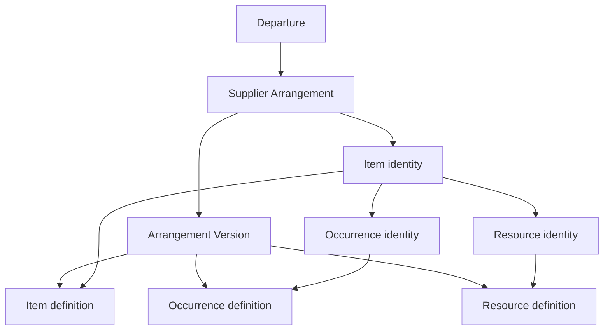

# M3A — Draft Arrangement structure

**Status:** Shipped. Merged to `main` on 2026-09-16 in pull requests #59 and #60. This document remains the draft Arrangement-structure contract. It is not authority to start Arrangement activation, costs, Reservations, commitments, Deadlines, exposure, or later M3 slices. Capacity is governed by shipped [M3B](m3b-supplier-capacity.md).

**Parent:** [M3 — Supplier planning](m3-supplier-planning.md). The parent is Accepted, including the 2026-09-16 amendment and the Occurrence-lifecycle / create-idempotency corrections. This slice remains the shipped contract for draft Arrangement structure only.

**Prerequisites:** M2 complete and shipped; [ADR 0007](../adr/0007-departure-operational-root.md), [ADR 0008](../adr/0008-supplier-arrangement-version-topology.md), and [ADR 0009](../adr/0009-supplier-contracting-and-service-provider-roles.md) accepted; parent M3 accepted as amended; current architecture and interface contract reviewed.

This slice implements tentative Supplier Arrangement structure only. It narrows the parent contract without reopening it. No Arrangement may activate in M3A.

## Goal

Let Staff and Administrators build a tentative Supplier Arrangement under a Departure by saving a minimal shell and incrementally adding Items, Service Occurrences, and Supplier Resources.

M3A establishes stable Arrangement and child identity, draft-version topology, Supplier role resolution, abandonment, Supplier-inactivation integration, and the first Supplier-planning UI. Draft planning remains visibly tentative and creates no effective Supplier supply or commercial commitment.

## In scope

- Stable `SupplierArrangement` identity and version-1 draft.
- Stable `ArrangementItem`, `ServiceOccurrence`, and `SupplierResource` identities with exact-version definition rows.
- Complete Arrangement and version lifecycle catalogs, while M3A writes only `draft` and `abandoned`.
- Occurrence `planned` / `cancelled` catalog on the **stable Occurrence identity**. M3A writes `planned` on create and does not expose a cancel command.
- Durable create-command idempotency keys for Arrangement and child creates.
- One editable draft version per Arrangement.
- Permanent version number assigned when the draft is created.
- Initial-draft abandonment with a required reason and retained read-only history.
- Immutable contracting Supplier.
- Item default and Occurrence override Service Providers.
- Optional current Arrangement contact.
- Fixed Item category catalog with labeled `other`.
- Local Occurrence date ranges, optional local times, and explicit stored IANA zones.
- Item-scoped Resources representing contracted categories, classes, or planned units.
- Manual Item and Resource ordering and chronological Occurrence ordering.
- `view_departures` and `manage_departures` authorization.
- `force_inactivate_supplier_with_dependencies`, introduced with its first command use.
- `ChangeSupplierStatus` blockers and recovery behavior for dependencies introduced by M3A.
- `SupplierArrangement` audit subject and M3A audit actions.
- Departure-workspace Arrangement list, profile, and incremental draft editors.
- Optimistic locking, pessimistic lock order, tenant isolation, bounded queries, accessibility, and concurrency proof.

## Out of scope

- Arrangement activation, successor-draft creation, graph copying, supersession, or normal ending.
- Arrangement `cancelled`. M7 Cancellation Cases own cancellation consequences.
- The permanent Departure return-to-draft latch created by first Arrangement activation.
- `CancelServiceOccurrence` or any Occurrence fulfillment/`completed` command. Unpublished Occurrences may still be removed under the draft-only deletion rule.
- Capacity Pools, capacity events, available quantities, allocation, or inventory modes.
- Cost terms, money, currency conversion, forecasts, or margins.
- Supplier Reservations, confirmations, external confirmation identifiers, Deadlines, commitments, deposit requirements, or exposure.
- Persisted needs-attention and acknowledgment records; M3A uses derived inactive-Supplier warnings.
- Supplier Location attachment.
- Client offers, Client Trips, Travelers, assignments, Charges, Supplier Obligations, or Payments.
- Generated Arrangement references or another `ReferenceSequence` namespace.
- A top-level Supplier Planning navigation section.
- Changes to `SearchDepartures` ranking or filters.
- `override_supplier_planning_terms`; add it only when its first authorized command ships.

## Locked boundaries

1. Departure is the operational root. Every M3A row belongs directly and immutably to one Agency and one Departure.
2. No M3A record belongs to a Travel Program or derives ownership or authorization from an Office.
3. Arrangement and child identities are stable; version-specific attributes live in exact-version definition rows.
4. M3A creates version 1 only. M3D later creates and copies successor drafts.
5. At most one draft version may exist for one Arrangement.
6. Version numbers are assigned at draft creation, increase monotonically, and are never reused.
7. Contracting Supplier is immutable. A different contractor requires a new Arrangement.
8. The staff-facing Arrangement name is audited operational identity metadata on the stable Arrangement, not versioned commercial content.
9. Effective provider is computed from the exact version: Occurrence override, then Item default, then contracting Supplier.
10. Only explicit provider choices are persisted.
11. The optional contact is current operational metadata on the stable Arrangement, not versioned commercial content.
12. Items use a fixed service-facing category catalog. Categories do not select subclasses, formulas, or specialized forms.
13. Occurrences may fall outside the Departure date range for pre-stays, post-stays, and other legitimate services.
14. A copied Departure zone becomes an independent stored Occurrence fact. Later Departure changes never rewrite it. If `Departure.time_zone` is blank, Occurrence creation fails `invalid` unless staff submit an explicit recognized IANA zone.
15. Resources belong to Items and may support multiple Occurrences of that Item in later capacity planning.
16. Duplicate sibling display names are allowed. Identity comes from UUIDs; UI supplies disambiguating context.
17. No generated Arrangement reference is issued.
18. Cross-Agency identifiers return not found. Request parameters never establish Agency scope.
19. M3A does not add `btree_gist`, `citext`, or `pg_trgm` and does not touch `db/queue_structure.sql`.
20. An unactivated Arrangement draft does not block `ReturnDepartureToDraft` and does not create the permanent downstream-history latch. The retained draft remains tentative after the Departure returns to draft.
21. A departed Departure may not create a new tentative Arrangement. Existing unactivated drafts allow dependency-reducing cleanup, correction necessary to resolve existing records, or abandonment.

## Topology



The diagram expresses domain ownership, not permission to weaken database provenance. Every definition must prove that its version and stable identity belong to the same Arrangement, Departure, and Agency. Occurrence and Resource identities must also prove their immutable Item ownership.

M3D later copies the current activated graph into an independent successor draft. It reuses stable child IDs for copied children, assigns new IDs to new children, and omits removed children. There is no live inheritance.

## Lifecycle

### Arrangement catalog

| Status | Meaning | M3A writes it? |
| --- | --- | --- |
| `draft` | Never activated and editable where state gates permit | Yes |
| `active` | Governed by a current activated version | No; M3D |
| `ended` | Ordinary post-activation terminal | No; later slice |
| `abandoned` | Never activated and intentionally discarded | Yes |

Do not persist Arrangement `cancelled`.

### Version catalog

| Status | Meaning | M3A writes it? |
| --- | --- | --- |
| `draft` | Editable unpublished version | Yes |
| `activated` | Immutable version that became effective | No; M3D |
| `superseded` | Immutable prior version replaced for future resolution | No; M3D |
| `abandoned` | Retained draft intentionally discarded | Yes |

M3A supports only initial-draft abandonment. `AbandonSupplierArrangement` atomically changes both the Arrangement and version 1 from `draft` to `abandoned`, records the reason and time, retains the full graph, and makes it read-only.

Abandonment cannot be reversed. A new attempt creates a new Arrangement.

The schema and ADR establish future successor behavior: abandoning a successor draft changes only that version, and the Arrangement continues under its prior activated version. M3A does not implement that command path.

### Occurrence catalog

| Status | Meaning | M3A writes it? |
| --- | --- | --- |
| `planned` | Nonterminal performance | Yes; new Occurrences start `planned` on the identity |
| `cancelled` | Terminal; does not block ordinary inactivation | Catalog only on the identity; no M3A cancel command |

M3A does not persist Occurrence `completed`. Unpublished Occurrences may be removed under the draft-only deletion rule.

## Persistence contract

Add one forward migration and update `db/structure.sql` through the migration. Do not edit structure SQL manually.

Application-owned IDs are UUIDv7 with database defaults. UUID foreign keys declare `type: :uuid`. Domain timestamps use `timestamptz` and Rails operates in UTC.

Every M3A table carries direct `agency_id` and `departure_id`. Composite foreign keys prove same-Agency ownership. Table-specific triggers reject changes to immutable ownership columns.

Use `lock_version` on mutable Arrangements, versions, definition rows, and `service_occurrences`. Arrangement identity remains lockable because name, contact, and status are mutable. Child create, remove, and reorder submit and bump the Arrangement-version `lock_version`. Editing an existing child definition uses that definition’s `lock_version`. `arrangement_items` and `supplier_resources` contain immutable ownership only and do not require optimistic-lock columns. `service_occurrences` also carry current operational lifecycle status and therefore require `lock_version`.

### `supplier_arrangements`

| Attribute | Contract |
| --- | --- |
| `id` | UUIDv7 |
| `agency_id` | Required and immutable |
| `departure_id` | Required and immutable |
| `contracting_supplier_id` | Required and immutable |
| `supplier_contact_id` | Optional current operational contact |
| `name` | Required, trimmed, 1–160 characters |
| `status` | Complete Arrangement lifecycle catalog: `draft`, `active`, `ended`, `abandoned` |
| `abandoned_at` | Required exactly when status is `abandoned` |
| `lock_version` | Required nonnegative integer |
| timestamps | UTC `timestamptz` |

Required constraints and indexes include:

- unique `(id, agency_id)`;
- unique `(id, departure_id, agency_id)`;
- unique shape needed to prove the contact belongs to the contracting Supplier;
- composite FK to the Departure;
- composite FK to the contracting Supplier;
- composite FK from contact, contractor, and Agency to `supplier_contacts` when contact is present;
- lifecycle and abandonment-time checks;
- `(agency_id, departure_id, status, name, id)` for Departure lists; and
- `(agency_id, contracting_supplier_id, status, id)` for Supplier dependency checks.

Changing `agency_id`, `departure_id`, or `contracting_supplier_id` is impossible in the application and database.

### `supplier_arrangement_versions`

| Attribute | Contract |
| --- | --- |
| `id` | UUIDv7 |
| `agency_id`, `departure_id` | Required and immutable |
| `supplier_arrangement_id` | Required and immutable |
| `version_number` | Positive integer; M3A creates `1` |
| `status` | Complete version lifecycle catalog: `draft`, `activated`, `superseded`, `abandoned` |
| `abandoned_at` | Required exactly when status is `abandoned` |
| `abandoned_reason` | Trimmed 1–500 characters exactly when abandoned |
| `lock_version` | Required nonnegative integer |
| timestamps | UTC `timestamptz` |

Required constraints include:

- unique `(supplier_arrangement_id, version_number)`;
- a partial unique constraint allowing at most one `draft` version per Arrangement;
- a partial unique constraint allowing at most one current `activated` version per Arrangement;
- positive version number;
- lifecycle/abandonment consistency; and
- composite ownership FKs proving the same Arrangement, Departure, and Agency.

Version number is immutable and is never reassigned after abandonment.

### Stable child identities

`arrangement_items` and `supplier_resources` contain only stable identity, immutable ownership, and timestamps.

`service_occurrences` contain stable identity, immutable ownership, timestamps, current operational `status` (`planned` or `cancelled`), and `lock_version`. M3A writes `planned` only. Later cancellation updates this identity row and records command evidence; it must not mutate an activated definition.

- Item belongs to one Arrangement.
- Occurrence belongs to one Item and repeats Arrangement ownership for enforceable composite FKs.
- Resource belongs to one Item and repeats Arrangement ownership for enforceable composite FKs.
- Every identity carries direct Agency and Departure ownership.

The database must make it impossible to pair a child from Arrangement A with a version of Arrangement B, even when both belong to the same Departure.

### `arrangement_item_definitions`

| Attribute | Contract |
| --- | --- |
| ownership | Agency, Departure, Arrangement version, and stable Item |
| `name` | Required, trimmed, 1–160 characters |
| `description` | Optional; blank becomes `NULL`; maximum 2,000 characters |
| `category` | Required fixed catalog value |
| `other_category_label` | Required only for `other`; otherwise `NULL`; 1–80 characters |
| `default_service_provider_id` | Optional same-Agency Supplier |
| `position` | Required positive version-specific manual order |
| `lock_version` | Required nonnegative integer |
| timestamps | UTC `timestamptz` |

Item categories are:

```text
cruise
lodging
air
ground_transportation
dining
activity_attraction
insurance
other
```

Category is descriptive and supports filtering and later offer mapping. It does not choose STI, subtype tables, capacity behavior, formulas, or presentation variants.

Item positions are unique within the version. Reorder commands lock sibling definitions and leave a complete deterministic order.

### `service_occurrence_definitions`

| Attribute | Contract |
| --- | --- |
| ownership | Agency, Departure, Arrangement version, Item, and stable Occurrence |
| `name` | Required, trimmed, 1–160 characters |
| `description` | Optional; blank becomes `NULL`; maximum 2,000 characters |
| `starts_on`, `ends_on` | Required local dates; `starts_on <= ends_on` |
| `starts_at_local`, `ends_at_local` | Either both absent or both present |
| `time_zone` | Required recognized IANA name, copied from the Departure by default |
| `service_provider_id` | Optional same-Agency Supplier override |
| `lock_version` | Required nonnegative integer |
| timestamps | UTC `timestamptz` |

A single-day Occurrence uses the same start and end date. The UI should default `ends_on` from `starts_on` without weakening the stored range contract.

Date-only Occurrences remain date-only. The stored zone records their local-calendar context and does not manufacture midnight timestamps. Timed Occurrences store local times plus the same explicit zone. Changing the Departure zone never rewrites an existing Occurrence.

If the form omits `time_zone`, copy `Departure.time_zone` when that value is present. If the Departure zone is blank, creation fails `invalid` unless staff submit an explicit recognized IANA zone. Application validation uses `TZInfo::Timezone.get`.

Occurrence lifecycle status is **not** stored on the definition. M3A creates the stable Occurrence with `status = planned` and implements no Occurrence cancel or complete command. Before activation, staff remove unwanted unpublished draft structure under the deletion rules below. The `cancelled` catalog value on the identity exists so later slices do not retrofit the lifecycle column onto an activated definition.

Occurrence display order is computed:

1. `starts_on`;
2. date-only before timed on the same date;
3. `starts_at_local` for timed rows;
4. normalized display name; and
5. UUID.

### `supplier_resource_definitions`

| Attribute | Contract |
| --- | --- |
| ownership | Agency, Departure, Arrangement version, Item, and stable Resource |
| `name` | Required, trimmed, 1–160 characters |
| `description` | Optional; blank becomes `NULL`; maximum 2,000 characters |
| `position` | Required positive version-specific order within the Item |
| `lock_version` | Required nonnegative integer |
| timestamps | UTC `timestamptz` |

A Resource describes a contracted category, class, or planned unit such as an O1 cabin category, standard room type, coach, or vehicle class. It carries no available quantity, measurement basis, inventory mode, allocation, or individual placement.

An Item may have no Resources. The presence of a Resource alone does not establish managed capacity; M3B Capacity Pools connect Occurrences and Resources.

Resource positions are unique within the Item and version.

## Draft removal

M3A children exist only in version 1 and are unpublished. Staff may remove a child identity and its definition when no retained version or downstream record depends on it.

Removing an Item may remove its draft-only Occurrence and Resource subtree in the same transaction when every removed record satisfies that rule. The confirmation identifies the affected child counts. Audit details include every removed stable identity and definition ID.

The future rule is already fixed: after a child appears in any activated or abandoned retained version, its stable identity is never deleted. A successor omits the definition instead.

Abandoning the Arrangement never deletes its child graph.

## Supplier and contact rules

### Contractor

The initial shell requires an active same-Agency contracting Supplier. The contractor cannot change later. A mistaken contractor requires abandonment and a new Arrangement.

### Provider resolution

The effective Service Provider for an Occurrence is:

```text
Occurrence override
else Item default
else Arrangement contracting Supplier
```

Only explicit overrides are stored. New Item defaults and Occurrence overrides require active same-Agency Suppliers.

An Item default is not itself an ordinary inactivation blocker. Ordinary inactivation uses the effective provider of a current or future `planned` Occurrence.

### Contact

The optional contact must be an active same-Agency Supplier Contact of the contracting Supplier when assigned. It may be cleared or replaced. Later inactivation does not erase it; the profile continues to identify it as inactive until staff clear or replace it.

The contact grants no application permission and is not copied into Arrangement versions.

## State-dependent editing

| Departure and dependency state | Allowed M3A behavior |
| --- | --- |
| Departure `draft` or `active`; required Suppliers active | Ordinary draft creation and editing |
| Departure `departed` | View, dependency-reducing cleanup, correction necessary to resolve existing records, or abandonment. No new Arrangement. |
| Contracting Supplier inactive after force | View, clear contact, remove dependent draft structure, or abandon |
| Item/Occurrence provider inactive after force | View, replace or remove that explicit provider, remove dependent draft structure, or abandon |
| Arrangement/version `abandoned` | Read-only |

Cleanup commands may reduce or remove a dependency. They may not create another dependency on an inactive Supplier or expand planned services while the Departure is departed. They may not select an inactive Supplier for new work.

Because the contracting Supplier is immutable, it cannot be replaced in recovery mode.

Commands lock the Departure and recheck its lifecycle. This serializes ordinary planning against `MarkDepartureDeparted`; the race is not deferred to M3D. `MarkDepartureDeparted` does not automatically abandon unfinished drafts.

`ReturnDepartureToDraft` continues to permit an otherwise eligible active Departure that owns only unactivated Arrangement drafts. Both command paths lock the Departure, so returning and editing serialize into one valid state rather than creating the M3D activation latch prematurely.

## Authorization and permissions

Ordinary M3A behavior reuses the shipped Departure permissions:

| Capability | Permission | Administrator | Staff | Viewer |
| --- | --- | ---: | ---: | ---: |
| View Arrangement planning | `view_departures` | Yes | Yes | Yes |
| Create or edit tentative planning | `manage_departures` | Yes | Yes | No |
| Abandon a tentative Arrangement | `manage_departures` | Yes | Yes | No |
| Force Supplier inactivation over dependencies | `force_inactivate_supplier_with_dependencies` | Yes | No | No |

Add `force_inactivate_supplier_with_dependencies` to `AccessPermission` with the first M3A force command use. Do not add `view_supplier_planning`, `manage_supplier_planning`, or `override_supplier_planning_terms`. No command may substitute a role-name check for the deferred override permission.

Assignment as responsible AgencyUser, contact, contractor, or Service Provider grants no authority.

Viewer requests perform no mutation and write no audit event.

## Domain errors

M3A uses the existing command error shape and only these codes:

| Code | Use |
| --- | --- |
| `unauthorized` | Missing permission, inactive actor, actor/Agency mismatch, or Viewer mutation |
| `invalid` | Missing, malformed, oversized, unpaired, or inconsistent submitted values, including a missing Occurrence zone when the Departure zone is blank |
| `invalid_state` | Inactive Agency; command forbidden by Departure, Arrangement, version, or Supplier state |
| `conflict` | Stale optimistic lock or translated uniqueness race |
| `not_found` | Identifier not found through the current Agency and owning aggregate |
| `dependency_exists` | Ordinary Supplier inactivation blocked by current M3A dependencies |

Do not introduce duplicate review for Arrangements. Duplicate names are valid.

## Command contract

Public mutations use commands under `app/services`, inherit `AgencyCommand`, and audit successful consequential changes in the same transaction. Expected failures do not write success audits.

### Lock order

After the pre-transaction authorization check:

1. Agency; recheck active.
2. Actor reloaded through that Agency; recheck active status and permission.
3. Affected Suppliers in UUID order when the command assigns, inactivates, or races on Supplier identity.
4. Departure; recheck lifecycle.
5. Arrangement.
6. Arrangement version.
7. Child identities and definitions in parent order and UUID order where several peers are affected.
8. Idempotency row after its owning record, except for create commands under the create-command exception below.

Commands with no Supplier-sensitive input omit step 3 and preserve Agency → actor → Departure before Arrangement and child rows.

Create-command exception: for `CreateSupplierArrangement`, after Agency → actor → contractor Supplier → Departure, lock or insert the idempotency row before creating the Arrangement and version. For child creates, lock Arrangement and version first, then the idempotency row, then create the child. Uniqueness on the idempotency key serializes concurrent same-key creates.

### Create-command idempotency

M3A introduces the first durable business-command idempotency table, `agency_command_idempotency_keys` (or equivalent), unique on `(agency_id, command_name, idempotency_key)`.

- Required for `CreateSupplierArrangement`, `CreateArrangementItem`, `CreateServiceOccurrence`, and `CreateSupplierResource`.
- Stores a payload fingerprint/digest of the consequential create inputs.
- Same key + same payload → replay the original result with no second success audit.
- Same key + different payload → `conflict`.
- Keys are durable for the life of the Agency unless a later slice defines purge. M3A does not expire them.
- Updates, removes, reorders, abandon, and list do not require idempotency keys; they use `lock_version` or lifecycle replay.

### Replay, no-op, and optimistic locking

- User-driven updates submit the `lock_version` of the mutable Arrangement, version, definition, or Occurrence identity they change.
- Creating, removing, or reordering children changes the version's collection shape, requires the submitted version `lock_version`, and bumps it in the same transaction.
- Editing one existing child definition requires that definition's `lock_version`; it does not manufacture another version.
- Ordinary updates compare `lock_version` even when submitted values equal stored values.
- A same-value update is a successful no-op and writes no audit event.
- A real `AbandonSupplierArrangement` transition requires both Arrangement and version `lock_version`. If abandonment finds both the Arrangement and initial version already abandoned, it returns replay success before stale-lock comparison and writes no second audit event.
- Database uniqueness and foreign-key errors caused by supported races are translated to the declared domain error rather than leaked.
- Item and Resource positions use `DEFERRABLE INITIALLY DEFERRED` unique constraints so atomic reorder can swap without transient unique violations. Reorder commands validate that the submitted ID list contains every current sibling exactly once.

### `CreateSupplierArrangement`

Permission: `manage_departures`.

Accepts required `name`, `contracting_supplier_id`, and `idempotency_key`, plus optional `supplier_contact_id`.

Requires an active Agency, active actor, Departure in `draft` or `active`, and active same-Agency contractor. The optional contact must be active and belong to that contractor. A `departed` Departure returns `invalid_state`.

Atomically creates:

- stable Arrangement in `draft`;
- version 1 in `draft`; and
- `supplier_arrangement.created` audit evidence.

It creates no Item, reference, Supplier confirmation, capacity, or commercial consequence. Idempotent replay returns the original Arrangement without a second audit.

### `UpdateSupplierArrangement`

Permission: `manage_departures`.

Editable stable fields are `name` and `supplier_contact_id`. Contractor and ownership never change. Contact may be cleared. Submit the Arrangement `lock_version`.

Ordinary editing requires an editable initial draft and Departure `draft` or `active`. On a departed Departure, recovery-state calls may clear an inactive contact or otherwise reduce a dependency but may not expand planning. Recovery-state calls after forced contractor inactivation may clear an inactive contact but may not expand planning.

Successful changes write `supplier_arrangement.updated` with changed field names. Same-value updates are no-ops after stale-lock checking.

### `AbandonSupplierArrangement`

Permission: `manage_departures`.

M3A accepts only a never-activated Arrangement whose Arrangement and version 1 are both `draft`. It requires a trimmed reason of 1–500 characters and both Arrangement and version `lock_version` for a real transition.

Atomically:

- marks the Arrangement `abandoned`;
- marks version 1 `abandoned`;
- records time and reason;
- retains every child identity and definition;
- writes `supplier_arrangement.abandoned`; and
- makes the graph read-only.

Already-abandoned is replay success before stale-lock comparison and writes no second audit. No automatic restore exists.

### Item commands

Permission: `manage_departures`.

- `CreateArrangementItem` creates identity plus version-1 definition and appends it to manual order.
- `UpdateArrangementItem` changes only the draft definition.
- `ReorderArrangementItems` locks sibling definitions, persists one complete order, and writes one `supplier_arrangement.items_reordered` event.
- `RemoveArrangementItem` deletes an eligible unpublished subtree under the draft-removal rule.

Create and reorder require the version `lock_version`. Update requires the definition `lock_version`. Create/update validates category and `other_category_label`. New default provider selection requires an active same-Agency Supplier. These commands are ordinary editing on Departure `draft` or `active` only, except that recovery-mode removal of unpublished dependent structure remains allowed.

### Occurrence commands

Permission: `manage_departures`.

- `CreateServiceOccurrence` creates identity plus version-1 definition under one Item with `status = planned`.
- `UpdateServiceOccurrence` changes only that definition.
- `RemoveServiceOccurrence` deletes an eligible unpublished Occurrence identity and definition.

Create requires the version `lock_version`. Update requires the definition `lock_version`. Create/update requires a valid date range, paired optional times, and a recognized stored IANA zone. The form defaults the zone by copying the Departure zone. If that copy is blank, the command fails `invalid` unless an explicit recognized IANA zone is submitted. New provider override selection requires an active same-Agency Supplier.

M3A has no cancel or complete command.

### Resource commands

Permission: `manage_departures`.

- `CreateSupplierResource` creates identity plus definition and appends it to the Item's Resource order.
- `UpdateSupplierResource` changes only that definition.
- `ReorderSupplierResources` locks siblings, persists one complete order, and writes one `supplier_arrangement.resources_reordered` event.
- `RemoveSupplierResource` deletes an eligible unpublished Resource identity and definition.

Create and reorder require the version `lock_version`. Update requires the definition `lock_version`. Resources have no provider column and no capacity quantity.

### `ChangeSupplierStatus`

Extend the shipped command rather than creating another Supplier lifecycle path. The M1 descendant cascade remains unchanged.

Ordinary inactivation retains `manage_supplier_directory` and is blocked when the Supplier is referenced by any current nonterminal M3A dependency:

- a draft or active Arrangement as contracting Supplier; or
- a current or future `planned` Occurrence using the Supplier as effective provider (Occurrence override, else inherited Item default, else contracting Supplier).

An Item default blocks only when it resolves as the effective provider for a current or future `planned` Occurrence. An unused Item default with no applicable Occurrence does not block.

A `planned` Occurrence whose `ends_on` is before the current date in that definition’s stored `time_zone` does not block. A `cancelled` Occurrence does not block. Abandoned Arrangements and their retained definitions do not block. A past window does not assign `completed`.

Force inactivation requires:

- `force: true`;
- `force_inactivate_supplier_with_dependencies`;
- Administrator grant through the permission catalog; and
- a trimmed reason of 1–500 characters.

Force preserves every M3A row, performs the shipped M1 descendant cascade, writes `supplier.inactivated` on the Supplier subject with the reason and affected Arrangement IDs, and leaves derived inactive-Supplier warnings. It does not cancel, delete, or replace Supplier planning.

Recovery after force permits only: clear a contact, remove or replace an inactive provider assignment, remove unpublished dependent draft structure, or abandon the unactivated draft. It never permits selection of the inactive Supplier for new work. The immutable contractor cannot be replaced.

Reactivation restores only the Supplier.

### `ListDepartureArrangements`

Permission: `view_departures`. Read-only and not audited.

Scoped to one Departure loaded through the current Agency. Supports:

- optional name-prefix `q`, maximum 100 characters, through one declared normalization path;
- status filter from the complete Arrangement catalog plus `all`; and
- contracting Supplier filter.

Filters fail closed. Another Agency's Supplier ID is not found. Fetch 51, return at most 50, and expose truncation. Default order is contracting-Supplier display name, Arrangement name, then UUID.

Inactive Supplier and contact identities remain displayable.

## Audit

Add `SupplierArrangement` to the closed audit subject catalog and teach `RecordAdministrativeAudit` to prove the subject belongs to the event Agency.

Add these actions:

```text
supplier_arrangement.created
supplier_arrangement.updated
supplier_arrangement.abandoned
supplier_arrangement.item_created
supplier_arrangement.item_updated
supplier_arrangement.item_removed
supplier_arrangement.items_reordered
supplier_arrangement.occurrence_created
supplier_arrangement.occurrence_updated
supplier_arrangement.occurrence_removed
supplier_arrangement.resource_created
supplier_arrangement.resource_updated
supplier_arrangement.resource_removed
supplier_arrangement.resources_reordered
```

Each reorder command writes one Arrangement-subject event containing the complete ordered stable-ID list and old/new positions. It does not write one event per shifted sibling.

Child-event details include:

- child type;
- stable child ID;
- definition ID;
- Arrangement version ID;
- action and changed field names;
- relevant provider IDs, schedule, or position facts; and
- every removed descendant ID for subtree removal.

Details are command evidence, not version snapshots. Items, Occurrences, Resources, and definitions are not separate M3A audit subjects.

Forced Supplier inactivation continues to use `supplier.inactivated` on the Supplier subject.

## Routes and HTTP semantics

Routes remain nested under Departure and Arrangement. Use `PATCH` for field updates and reorder commands, `POST` for abandonment, and `DELETE` for eligible unpublished child removal.

Required route families:

```text
/departures/:departure_id/arrangements
/departures/:departure_id/arrangements/:id
/departures/:departure_id/arrangements/:id/abandon
/departures/:departure_id/arrangements/:arrangement_id/items
/departures/:departure_id/arrangements/:arrangement_id/items/reorder
/departures/:departure_id/arrangements/:arrangement_id/items/:item_id/occurrences
/departures/:departure_id/arrangements/:arrangement_id/items/:item_id/resources
/departures/:departure_id/arrangements/:arrangement_id/items/:item_id/resources/reorder
```

Named routes may follow Rails conventions, but controllers must load Departure through `Current.agency`, Arrangement through that Departure, and children through their owning aggregate. They inherit `ApplicationController`, not `Administration::BaseController`.

Preserve submitted values after command errors and use the shipped `#form-error-summary` behavior.

## Interface contract

M3A amends the Departure workspace; it does not add top-level navigation.

### Departure profile

Add a **Supplier planning** panel labeled **Tentative** while it contains draft-only structure.

- Show Arrangement name, contractor, lifecycle status, and inactive-dependency warning when applicable.
- Provide empty and filtered-empty states.
- Show **Add arrangement** only with `manage_departures` and an eligible Departure state (`draft` or `active`).
- Viewer sees the same planning facts without mutation actions.

### Shell-first workflow

The create form requires only Arrangement name and contracting Supplier. Contact is optional.

After save, navigate to the Arrangement profile. Staff add Items incrementally rather than completing a wizard or one giant nested form.

### Arrangement profile

Use display-first Item cards in manual order.

Each Item shows:

- name and category;
- default provider when explicitly different or useful;
- Occurrences in chronological order, including schedule and effective provider; and
- Resources in manual order.

Add and edit one child through a small independent form. Duplicate names are disambiguated by category, schedule, provider, parent Item, and stable ordering.

Show draft completeness guidance without an activation action or activation checklist. Examples include no Items, missing expected Resources, inactive dependencies, or other visible tentative-state concerns. Do not claim that Supplier supply is confirmed or operationally available.

Abandonment uses a focused destructive confirmation that names the retained outcome and collects the reason. Abandoned Arrangements remain readable and expose no mutation controls.

Inactive Suppliers and contacts remain identified with text, not color alone.

Follow `docs/ui/interface-contract.md`, reuse `dd-` classes and the shipped drawer/page patterns, and prove 375, 768, 1280, and 1400 pixel widths.

Do not display invented Client sales, occupancy, capacity, balances, Payments, or accounting state.

## Required proof

### Persistence and model proof

- UUIDv7 defaults, `timestamptz`, named constraints, indexes, and immutable-ownership triggers.
- Same-Agency, same-Departure, same-Arrangement, and Item-parent composite FK failures.
- Contact must belong to the contractor.
- One draft version per Arrangement and permanent version number 1.
- Complete Arrangement and version lifecycle catalogs, including `abandoned` and excluding Arrangement `cancelled`.
- Occurrence identity `status` constrained to `planned` or `cancelled`; definition has no status column.
- Item category and `other` label constraints.
- Occurrence range, paired-time, and IANA-zone constraints.
- Unique/manual Item and Resource ordering with deferrable unique position constraints.
- Duplicate sibling names accepted.
- Item and Resource identity tables have no `lock_version`; Occurrence identity has `lock_version`.
- Create-command idempotency uniqueness and payload-fingerprint storage.

### Command proof

- Minimal shell creates Arrangement and version 1 atomically.
- Create idempotency replay, conflicting-payload reuse, and concurrent same-key requests.
- Contractor cannot change.
- Contact assignment, clearing, later inactivity display, and cross-Supplier rejection.
- Provider fallback at all three levels.
- Item, Occurrence, and Resource create/update/remove.
- New Occurrences persist `planned` on the identity.
- Item subtree removal retains audit IDs and is rejected when any dependency is not draft-only.
- Manual reorder set validation and deterministic Occurrence order.
- Occurrence create copies a present Departure zone and fails `invalid` when that zone is blank unless an explicit recognized IANA zone is submitted.
- Abandonment requires both Arrangement and version `lock_version`, retains the graph, requires a reason, is read-only afterward, and replays without another audit.
- No activation, confirmation, capacity, money, Reservation, commitment, Deadline, or reference is produced.
- No Occurrence cancel or complete command exists.
- All fourteen Arrangement audit actions write with `SupplierArrangement` subject; expected failures write no success audit; reorder writes one event; create replay writes no second audit.

### State and authorization proof

- Ordinary editing on draft and active Departures.
- An unactivated Arrangement draft does not block an otherwise eligible `ReturnDepartureToDraft`.
- Departed Departure rejects new Arrangement creation with `invalid_state`.
- Departed Departure permits cleanup, correction necessary to resolve existing records, or abandonment only.
- Forced-inactive contractor/provider permits only the declared recovery actions and never selection of the inactive Supplier for new work.
- Viewer reads and cannot mutate.
- Staff cannot force Supplier inactivation.
- Another Agency's identifiers return not found for every route and command.

### Supplier lifecycle and concurrency proof

- Ordinary block for contractor on draft or active Arrangements.
- Ordinary block for current or future `planned` Occurrences using the Supplier as effective provider (status on identity).
- An unused Item default with no applicable current or future `planned` Occurrence does not block.
- A past-window `planned` Occurrence does not block and does not become `completed`.
- A `cancelled` Occurrence does not block, even though M3A does not write that status.
- Abandoned graphs do not block.
- Force requires permission and reason, preserves rows and inactive historical pointers, applies the M1 descendant cascade, and writes one audit event.
- Force controls are absent for Staff and Viewer in the Supplier status UI.
- Genuine multi-connection races serialize Supplier inactivation against Arrangement creation, provider assignment, and provider replacement.
- Arrangement and child mutations serialize against `MarkDepartureDeparted` through the locked Departure. Departed-first rejects new or expanded tentative planning with `invalid_state`.
- Arrangement and child mutations serialize against `ReturnDepartureToDraft` without treating the draft as consequential downstream history.
- Abandonment versus child create, remove, reorder, and definition update; a definition update that wins first may be retained by the subsequent abandonment.
- Two concurrent child creates for next position; reorder versus create; reorder versus removal; two reorders from the same version.
- Child collection changes conflict on a stale version `lock_version`. In-place definition edits conflict on a stale definition `lock_version`.
- Cross-Arrangement definition attachment is rejected.
- Race harnesses re-raise unexpected exceptions.

### Query and interface proof

- Arrangement list filters fail closed, cap at 50/51, remain deterministic, and do not alter `SearchDepartures` ranking.
- List and profile query counts remain bounded as unrelated directory and child volume grows.
- Tentative panel, shell-first flow, Item-centered profile, small child editors, reorder controls, inactive warnings, abandonment, empty states, and preserved error input.
- Keyboard operation, complete labels, visible focus, `#form-error-summary`, and responsive proof at all four widths.
- System tests remain required in GitHub CI; the local Docker image need not add Chrome.

Existing M0–M2 tests remain green. Do not weaken them.

## Documentation after merge

M3A **Shipped** status flips belong in this post-merge documentation PR. Retain the statement that activation, capacity, costs, Reservations, commitments, Deadlines, and exposure remain unimplemented. Do not rewrite historical M2 scope documents to imply that M3A was part of M2. Do not invent an accepted M3B–M3F slice plan here.

## Exit gate

M3A is complete only when:

1. The parent M3 contract and ADRs 0008–0009 are accepted.
2. This slice contract is accepted.
3. Draft Arrangement and stable-child topology is implemented under the declared constraints.
4. Abandonment, ordering, provider resolution, contact behavior, and Supplier-inactivation recovery match this contract.
5. No Arrangement can activate and no later-slice commercial fact is created.
6. Cross-Agency isolation, optimistic locking, lock order, and genuine races pass.
7. The draft UI is accessible, responsive, bounded, and visibly tentative.
8. M0–M2 regressions and full CI remain green.
9. The slice is merged to `main` and its shipped documentation update follows.

This slice authorizes M3A only. It does not authorize M3B–M3F.
