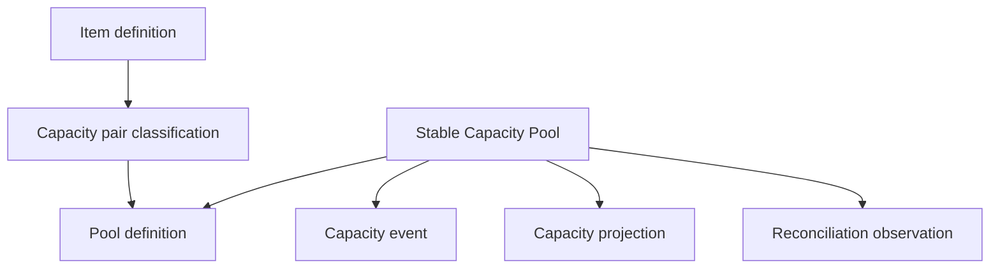

# M3B — Supplier capacity

**Status:** Shipped. Merged to `main` on 2026-09-17 in pull request #64. This document remains the Supplier capacity contract. It is not authority to start Arrangement activation, user-accessible effective-capacity or event controls, costs, Reservations, commitments, Deadlines, exposure, or later M3 slices.

**Parent:** [M3 — Supplier planning](m3-supplier-planning.md), Accepted and amended for M3B.

**Prerequisites:** [M3A](m3a-draft-arrangement-structure.md) shipped; the M3B parent amendment Accepted and incorporated into the canonical M3 parent; [ADR 0010](../adr/0010-supplier-capacity-ledger-and-projection.md) Accepted; [ADR 0008](../adr/0008-supplier-arrangement-version-topology.md) and [ADR 0009](../adr/0009-supplier-contracting-and-service-provider-roles.md) remain authoritative; current architecture and interface contract reviewed.

This slice narrows M3 to Supplier-side capacity only. M3B exposes tentative capacity configuration on draft Arrangement versions. It implements and proves the immutable event, projection, scheduling, and reconciliation engine for use by M3D, but no effective Supplier capacity may exist before Arrangement activation.

## Goal

Let Staff and Administrators describe whether an Arrangement Item has Supplier-managed capacity and, when it does, configure exact Occurrence–Resource coverage and distinct Supplier supply tranches.

Establish the durable capacity ledger so later activation can turn a proposed opening quantity into evidenced Supplier supply without confusing supply with Client Holds, Allocations, occupancy, fulfillment, commitments, costs, payables, or cash.

## In scope

- Explicit `managed` / `unmanaged` capacity applicability on versioned Item definitions, with undecided allowed only during draft preparation.
- Exact-version Occurrence–Resource pair classification as `pooled` or `not_applicable`.
- Stable Capacity Pool identity and independent per-version Pool definitions.
- Multiple labeled, manually ordered supply tranches for one Occurrence–Resource pair.
- Inventory modes `block`, `allotment`, `on_request`, and `externally_managed`.
- Whole-number measurement bases `resource_units` and `traveler_positions`.
- Proposed opening quantity and structured draft evidence for numeric Pools.
- Immutable supplying-Supplier provenance.
- Immutable capacity-event catalog and deterministic full-timeline replay.
- Past, current, and future effective dates; explicit same-date sequence; local end-of-day scheduled effectiveness.
- Rebuildable stored projection labeled **Current Supplier capacity**.
- Idempotent scheduled projection refresh and locked read/mutation catch-up.
- Durable matched and discrepant reconciliation observations with append-only resolution.
- Evidence-backed ordinary commands and Administrator override behavior.
- Dependency-reducing recovery after forced Supplier inactivation.
- `override_supplier_planning_terms`, introduced with its first capacity override path.
- Durable idempotency for Pool creation, capacity events, and reconciliations.
- Arrangement-subject audit evidence for M3B commands.
- Item-centered draft capacity UI.
- Database, tenancy, lifecycle, concurrency, query, accessibility, and rebuild proof.

## Out of scope

- Arrangement activation, successor-draft creation/copying, supersession, or normal ending. M3D owns these commands and consumes M3B completeness rules.
- User-accessible establishment or post-activation event controls. M3B implements the engine; M3D exposes it after activation exists.
- Supplier Reservations and confirmations.
- Client Holds, Allocations, Trips, Travelers, occupancy, named-room/cabin/seat assignment, fulfillment, or sales availability.
- Automatic conversion between resource units and Traveler positions.
- Threshold calculations that infer additional Resources or Pools.
- Cost terms, prices, guarantees, commitments, deposits, Deadlines, Supplier Obligations, invoices, Payments, commissions, exposure, or margin.
- A persisted needs-attention catalog or override acknowledgment. M3E owns those records; M3B renders derived warnings.
- File upload, Active Storage, or a general document model. Evidence remains attachment-ready.
- Occurrence cancellation commands or Cancellation Cases. M3B only defines how capacity behaves when a later command cancels an Occurrence.
- Automatic capacity events from dates, Deadlines, Reservation state, confirmation, cancellation, or fulfillment.
- A top-level inventory or Supplier Planning navigation section.
- Changes to `SearchDepartures`.
- `btree_gist`, `citext`, `pg_trgm`, or queue-database domain tables.
- Decimal capacity, configurable capacity precision, or an arbitrary named measurement basis.
- Expanding `UpdateArrangementItem` to own `capacity_management`.
- Production activation commands, bypass flags, controllers, routes, tasks, seeds, or console-oriented activation services.
- Staff UI, navigation, forms, or HTTP exposure for event, reconciliation, override, projection, or inactive-Supplier recovery commands (M3D exposes those after real activation).

## Locked boundaries

1. Capacity is Supplier-side supply, not Client demand or fulfillment.
2. Capacity applicability belongs to the exact Item definition. `unmanaged` is not a Pool mode.
3. A managed Item is incomplete until every non-cancelled Occurrence–Resource pair is explicitly `pooled` or `not_applicable`.
4. A `pooled` pair has at least one Pool definition. A `not_applicable` pair has none.
5. Multiple Pools for one pair represent distinct supply tranches; a Pool never combines firm and conditional supply.
6. A Pool belongs to exactly one Arrangement, Item, Occurrence, Resource, and immutable supplying Supplier.
7. The supplying Supplier equals the exact-version effective provider when the Pool is created and when later activated.
8. Inventory mode, measurement basis, Occurrence, Resource, supplying Supplier, and governing zone are semantic identity. After first activation they cannot change on the same stable Pool.
9. Pool creation copies `effective_time_zone` from the exact-version Service Occurrence definition. There is no staff-selectable Pool zone and no Departure fallback at Pool creation.
10. Draft-only definitions may be edited. Activated definitions are immutable.
11. Draft-only Pool semantics may be corrected only while the Pool has no retained-version or downstream dependency. Otherwise create a new Pool.
12. Only `block` and `allotment` carry authoritative quantity. `on_request` and `externally_managed` are nonnumeric but still require measurement basis and presentation `unit_label`.
13. `block` and `allotment` use identical ledger mechanics and imply no guarantee, commitment, cost, confirmation, or cancellation result.
14. Quantities are nonnegative whole numbers. Each Pool has exactly one basis: `resource_units` or `traveler_positions`.
15. M3B never converts one basis into another. No later M3 slice may add fractional precision or another basis without amending the M3 parent and ADR 0010.
16. A proposed opening quantity is tentative definition data, not supply. Only M3D activation may create the first `established` event.
17. Capacity events are append-only. Corrections compensate; nothing edits or deletes history.
18. Every event uses a positive magnitude. Event type determines direction.
19. The complete ordered timeline must remain nonnegative after every event, including future events.
20. Future events become applicable at local end of day without a second capacity event.
21. The immutable ledger is authoritative. Projections and derived summaries are rebuildable.
22. Projection drift and Supplier discrepancy are different conditions with different remedies.
23. An Occurrence becoming cancelled or elapsed changes no capacity automatically.
24. Every numeric Pool must reach zero before its Arrangement can end or its Departure can eventually close out.
25. No M3B record belongs to a Travel Program or derives authority from Office context.
26. Cross-Agency identifiers return not found. Request parameters never establish Agency scope.
27. No capacity command creates or changes a commitment, money record, Reservation, confirmation, Hold, Allocation, assignment, or fulfillment record.

## Topology



Each pair classification belongs to one exact Arrangement version, Item, Occurrence, and Resource. Each Pool definition must prove that its stable Pool, pair, and Arrangement version belong to the same Agency, Departure, Arrangement, Item, Occurrence, and Resource.

Every event and reconciliation repeats sufficient immutable ownership and provenance keys for database enforcement. Same-Agency alone is insufficient; cross-Arrangement, cross-version, cross-Item, cross-Occurrence, and cross-Resource combinations must fail at the database boundary.

## Capacity applicability and completeness

Add `capacity_management` to `arrangement_item_definitions`:

| Value | Meaning |
| --- | --- |
| `NULL` | Undecided while the version remains an editable draft |
| `managed` | Supplier capacity applies and pair coverage is required |
| `unmanaged` | Capacity is intentionally not tracked for this Item |

The domain catalog contains only `managed` and `unmanaged`; `NULL` is draft incompleteness, not a third business mode.

Changing an Item to `unmanaged` requires that it have no pair classifications or Pool definitions in that version. Changing it to `managed` does not create pairs or Pools automatically.

A managed Item is activation-ready only when:

- it has at least one non-cancelled Occurrence;
- it has at least one Resource;
- every non-cancelled Occurrence–Resource pair in the version has exactly one classification;
- every `pooled` pair has at least one valid Pool definition;
- every `not_applicable` pair has no Pool definition; and
- every numeric Pool has a positive proposed opening quantity and complete ordinary evidence or a valid Administrator override.

Cancelled Occurrences do not require pair coverage. Their retained pair and Pool history is not deleted.

M3B computes draft completeness for display. It exposes no activation action.

## Pool modes and measurement

### Inventory modes

| Mode | Numeric ledger? | Meaning |
| --- | ---: | --- |
| `block` | Yes | Units specifically set aside for the Departure or group |
| `allotment` | Yes | Units the Agency is authorized to use from a Supplier allocation |
| `on_request` | No | Availability requires a Supplier response |
| `externally_managed` | No | The supply exists outside DepartureDesk's authoritative quantity control |

An on-request or externally managed Pool has no proposed opening quantity, capacity events, projection, reconciliation quantity, zero placeholder, infinity sentinel, or informational managed count. It still requires a measurement basis and a presentation-only `unit_label` so staff can describe what kind of supply is requested or managed externally. The label does not imply that DepartureDesk knows the quantity.

### Measurement bases

| Basis | Meaning |
| --- | --- |
| `resource_units` | Whole supplied units such as cabins, rooms, or vehicles |
| `traveler_positions` | Whole Supplier-side positions such as seats |

`unit_label` is required presentation context for every Pool mode, not a measurement extension. It is trimmed, 1–40 characters, and must not change the basis. Examples include `cabins`, `rooms`, `vehicles`, and `seats`.

Eight cabin units do not imply 24 Traveler positions. Thirty Traveler positions do not imply one coach. If a Supplier independently controls both measures, staff create separate Pools. No decimal capacity, configurable precision, or arbitrary named basis is permitted without amending the M3 parent and ADR 0010.

## Evidence contract

Ordinary Supplier evidence uses this closed kind catalog:

```text
contract
supplier_confirmation
supplier_message
supplier_portal
verbal_confirmation
other
```

Required evidence facts are:

- evidence kind;
- evidence date;
- trimmed reference note, 1–500 characters; and
- optional trimmed external reference, maximum 160 characters.

The schema must permit a later attachment relationship without changing the event, reconciliation, or draft evidence identity. M3B does not add uploads or Active Storage.

An Administrator override stores:

- `override: true`;
- required `override_supplier_planning_terms` permission;
- trimmed reason, 1–500 characters; and
- actor/time evidence.

Override is mutually exclusive with pretending ordinary evidence exists. Supplier evidence received outside original terms remains ordinary Supplier evidence, not override.

## Persistence contract

Use forward migrations and update `db/structure.sql` through migrations only. Application-owned IDs are UUIDv7 with database defaults. UUID foreign keys declare `type: :uuid`; timestamps are `timestamptz`; quantities use `bigint` with named nonnegative/positive checks.

Every new domain table carries direct `agency_id` and `departure_id`. Composite foreign keys prove complete ownership. Triggers reject changes to immutable ownership, semantic identity, event, evidence-observation, and lineage columns.

### `arrangement_item_definitions` amendment

Add nullable `capacity_management`, constrained to `managed` or `unmanaged` when present. Existing draft rows remain undecided; migration must not infer capacity intent from category or existing Resources.

The column lives on the M3A Item definition row. It is mutated only through `SetItemCapacityManagement`. `UpdateArrangementItem` remains unchanged and does not accept, validate, or audit `capacity_management`. Optimistic locking still uses the definition `lock_version`.

### `capacity_pair_definitions`

| Attribute | Contract |
| --- | --- |
| `id` | UUIDv7 |
| ownership | Required Agency, Departure, Arrangement, exact version, Item, Occurrence, and Resource |
| `classification` | `pooled` or `not_applicable` |
| `lock_version` | Required nonnegative integer |
| timestamps | UTC `timestamptz` |

Required constraints include:

- unique pair per `(arrangement_version_id, service_occurrence_id, supplier_resource_id)`;
- Occurrence and Resource belong to the same Item;
- the Item definition exists in the same version;
- cancelled-Occurrence retained rows are permitted but no new classification may be created for a cancelled Occurrence; and
- same Agency, Departure, Arrangement, version, and Item provenance throughout.

Pair classifications are version-specific definitions, not stable cross-version identities. M3D copies them into a successor draft as independent rows.

### `capacity_pools`

| Attribute | Contract |
| --- | --- |
| `id` | UUIDv7 stable identity |
| ownership | Required immutable Agency, Departure, Arrangement, Item, Occurrence, and Resource |
| `supplying_supplier_id` | Required immutable same-Agency Supplier |
| `inventory_mode` | `block`, `allotment`, `on_request`, or `externally_managed` |
| `measurement_basis` | `resource_units` or `traveler_positions` |
| `effective_time_zone` | Required recognized IANA zone copied from the exact-version Service Occurrence definition at Pool creation; immutable after first retained activation |
| timestamps | UTC `timestamptz` |

The Pool repeats semantic ownership instead of deriving it through a loose chain. It has no generic mutable `available`, `remaining`, or quantity column.

Supplying Supplier must equal the effective provider in the exact draft definition used to create the Pool. Pool creation copies `effective_time_zone` from the Occurrence definition; there is no staff-selectable Pool zone and no Departure fallback. A later draft provider or Occurrence-zone change makes the Pool incomplete for that draft until staff remove/recreate the Pool or restore the matching definition; no callback silently retargets it. After retained activated history, Pool zone cannot change.

### `capacity_pool_definitions`

| Attribute | Contract |
| --- | --- |
| ownership | Agency, Departure, Arrangement, exact version, pair classification, and stable Pool |
| `label` | Required stored display label, trimmed 1–120 characters |
| `normalized_label` | Required lowercase-trimmed form used for local uniqueness |
| `notes` | Optional; blank becomes `NULL`; maximum 2,000 characters |
| `unit_label` | Required, trimmed 1–40 characters |
| `proposed_opening_quantity` | Numeric modes only; nullable while incomplete; otherwise positive whole number |
| draft evidence | Kind, date, reference note, optional external reference, or explicit override fields |
| `position` | Positive manual order within the exact-version pair |
| `lock_version` | Required nonnegative integer |
| timestamps | UTC `timestamptz` |

If staff omit a label, create stores a deterministic generated label using inventory mode, proposed quantity when present, unit label, and the smallest local ordinal needed for uniqueness. The label is stored and never recomputed when quantity changes.

`normalized_label` must equal the declared normalization of `label` and is unique within the same pair and Arrangement version. Position is unique within that pair and uses a deferrable constraint or another documented atomic reorder strategy.

Draft-only definitions may be edited. Activated definitions are immutable. A successor may revise label, notes, and presentation facts but may not alter stable Pool semantics.

### `capacity_events`

| Attribute | Contract |
| --- | --- |
| `id` | UUIDv7 |
| ownership | Agency, Departure, Arrangement, exact governing version, stable Pool |
| `supplying_supplier_id` | Required; equals immutable Pool Supplier |
| `event_type` | `established`, `increased`, `released`, `reinstated`, `withdrawn`, `corrected_up`, or `corrected_down` |
| `quantity` | Positive whole-number magnitude |
| `measurement_basis` | Equals Pool basis |
| `effective_on` | Required business-effective local date |
| `effective_time_zone` | Required; equals Pool governing zone |
| `applies_at` | Immutable resolved UTC instant |
| `effective_sequence` | Positive immutable sequence unique within Pool/date |
| `recorded_at` | Required UTC `timestamptz` |
| evidence/override | Exactly one valid authority path |
| `reinstates_event_id` | Required only for `reinstated`; references a release in the same Pool |
| `corrects_event_id` | Optional only for correction; same Pool |
| `capacity_reconciliation_id` | Optional only for correction; same Pool |
| actor attribution | Required user actor for business commands; no invented user |
| idempotency identity | Required durable command result association |

Exactly one `established` event exists per numeric Pool. It is first in effective order and only M3D activation may create it from a complete proposed opening quantity.

All event rows are append-only in Rails and PostgreSQL. Evidence, lineage, ownership, quantity, ordering, and timestamps cannot be updated or deleted.

For an event whose `effective_on` is in the future when recorded, `applies_at` is the start of the following local calendar date in `effective_time_zone`. For a current event intended to apply immediately, `applies_at` is its recorded instant while `effective_on` retains the local business date. A backdated event applies when recorded but participates in business-effective replay on its stated date and sequence. Reports must distinguish business-effective and known-at/recorded views.

Full business-effective order is `effective_on`, `effective_sequence`, `recorded_at`, UUID. Commands lock the Pool before assigning the next default sequence. An explicit sequence must be unused and immutable.

### `capacity_projections`

One numeric Pool has exactly one projection row.

| Attribute | Contract |
| --- | --- |
| ownership | Agency, Departure, Arrangement, Pool |
| `current_supplier_capacity` | Nonnegative whole number |
| replay cursor | Last applied event identity/order facts |
| `next_applies_at` | Next unapplied scheduled boundary, nullable |
| `next_event_id` | Next scheduled event, nullable |
| `rebuilt_at` | Last verified/rebuilt time |
| `lock_version` | Required nonnegative integer |
| timestamps | UTC `timestamptz` |

The projection is command-maintained and rebuildable. Application code cannot write it except through the shared replay/refresh service. Nonnumeric Pools have no projection row.

### `capacity_reconciliations`

| Attribute | Contract |
| --- | --- |
| ownership | Agency, Departure, Arrangement, exact governing version, numeric Pool |
| `observed_quantity` | Nonnegative whole-number Supplier observation |
| `observed_at` | Required immutable UTC instant for the Supplier observation |
| `observed_time_zone` | Required Pool zone retained for local display |
| `ledger_quantity` | Persisted replay result for the same business-effective point |
| `variance` | Persisted signed difference, `observed - ledger` |
| evidence/override | Exactly one valid authority path |
| actor/recorded time | Required immutable observation provenance |
| idempotency identity | Required |

Every reconciliation observation is immutable and retained, including a zero-variance match.

### `capacity_reconciliation_resolutions`

Resolution history is append-only and links one reconciliation to one or more correction events. It records actor, time, and explanatory note. Current reconciliation state is derived:

- `matched`: original variance is zero;
- `open_discrepancy`: nonzero variance not fully resolved by linked corrections; or
- `resolved`: linked effective corrections fully account for the variance.

Do not overwrite the original observed or ledger quantities to mark resolution.

### Existing idempotency family

Reuse `agency_command_idempotency_keys`; do not create a second capacity-specific key table.

Require durable keys for:

- `CreateCapacityPool`;
- every capacity-event command, including multi-event reinstatement;
- `ReconcileCapacityPool`; and
- any explicit reconciliation-resolution command.

Scope remains `(agency_id, command_name, idempotency_key)`. Store a fingerprint of all consequential inputs, including Pool, event type, quantity, effective date/sequence, evidence or override, lineage, and governing version.

Same key and payload returns the original result before stale-lock comparison and writes no second event, projection change, reconciliation, resolution, or success audit. Same key and different payload returns `conflict`.

## Event transition contract

| Command/event | Preconditions | Projection effect | Additional rule |
| --- | --- | ---: | --- |
| `EstablishCapacity` / `established` | Activated version; numeric Pool; no earlier event; complete opening evidence | Set opening total when applicable | M3D-internal only |
| `IncreaseCapacity` / `increased` | Established numeric Pool; active Supplier unless historical correction path applies | Add quantity | New Supplier grant |
| `ReleaseCapacity` / `released` | Established Pool; Supplier-approved evidence or override | Subtract quantity | Agency returns supply with Supplier approval |
| `ReinstateCapacity` / `reinstated` | References same-Pool release with unreinstated quantity | Add quantity | Cannot exceed referenced release remainder |
| `WithdrawCapacity` / `withdrawn` | Established Pool; Supplier evidence or override | Subtract quantity | Supplier removes supply |
| `CorrectCapacityUp` / `corrected_up` | Event mistake or open reconciliation discrepancy | Add quantity | Reason and source reference required |
| `CorrectCapacityDown` / `corrected_down` | Event mistake or open reconciliation discrepancy | Subtract quantity | Reason and source reference required |

Every command validates the entire business-effective timeline after inserting the proposed event. No prefix may become negative. A later increase cannot rescue an earlier invalid negative interval.

One Supplier action that reinstates several releases creates one event per referenced release in one transaction, under one idempotency key and one Arrangement-subject audit event.

Corrections that target an event must name it. Aggregate corrections require an open reconciliation discrepancy. A correction may not reference both sources or neither.

## Projection refresh and rebuild

`RefreshDueCapacityProjection` is an idempotent system command used by the scheduled job and read/mutation catch-up.

- Lock and reload the Pool and projection.
- Apply every event with `applies_at <= now` after the replay cursor.
- Validate the cursor and resulting nonnegative quantity.
- Update the next scheduled boundary.
- Write no capacity event, `AuditEvent`, reconciliation, or user actor.
- Replaying an already-applied boundary is a no-op.

`RebuildCapacityProjection` replays the entire immutable event ledger into a candidate projection and compares it with the stored row.

- If equal, record verification time only.
- If drifted, repair the projection from events and record technical diagnostics outside business audit details.
- Never create a correction event for cache-only drift.
- Never overwrite an event to match the projection.
- Serialize with event insertion so rebuild cannot omit a concurrently committed event.

The scheduled sweep reads the primary database and enqueues work on the separate Solid Queue database. Delivery is at least once. Jobs pass Agency and Pool IDs, reload scope, perform locked catch-up, and use intentional retry/discard behavior consistent with M2B. Queue infrastructure failures do not create domain audit events.

## Reconciliation command

`ReconcileCapacityPool` requires `manage_departures`, a durable idempotency key, Pool/Projection `lock_version`, observed quantity/date, and ordinary evidence or Administrator override.

It:

1. Locks and catches up the projection.
2. Replays the ledger at `observed_at` using the Pool zone and deterministic ordering.
3. Persists the immutable observation, ledger quantity, and variance.
4. Returns `matched` or `open_discrepancy`.
5. Writes one Arrangement-subject success audit.

It does not change the projection or create a correction automatically.

A later correction command may link to the discrepancy. Resolution history links the correction events and derives `resolved` only when their net effect accounts for the variance. Projection repair cannot resolve a Supplier discrepancy.

## Draft commands

All ordinary draft commands require `manage_departures`, the exact owning records loaded through `Current.agency`, and the submitted optimistic lock named below.

### `SetItemCapacityManagement`

- Exclusively owns `capacity_management`. `UpdateArrangementItem` does not mutate this field.
- Requires Item-definition `lock_version`.
- In ordinary editable states (editable draft Arrangement/version; Departure `draft` or `active`; active contracting Supplier), may set `managed`, `unmanaged`, or clear to undecided.
- In departed Departure or inactive-Supplier recovery mode, may only reduce dependency: `managed → unmanaged` after all pair and Pool structure for that Item version is removed. It may not set or restore `managed`, and it may not clear to undecided from `unmanaged` when that would expand planning.
- Setting `unmanaged` fails while any pair or Pool definition exists.
- No category default or inference is permitted.
- Writes `supplier_arrangement.capacity_applicability_updated`.

### `ClassifyCapacityPair`

- Requires Arrangement-version `lock_version` and durable set validation of exact-version Item, non-cancelled Occurrence, and Resource ownership.
- Creates or updates one `pooled` / `not_applicable` classification.
- `not_applicable` fails while a Pool definition exists.
- Creation and removal bump the version collection lock.
- Writes `supplier_arrangement.capacity_pair_classified`.

### `CreateCapacityPool`

- Requires Arrangement-version `lock_version` and a durable idempotency key.
- Requires a managed Item and `pooled` pair.
- Locks/rechecks the effective provider Supplier and snapshots it as supplying Supplier.
- Copies `effective_time_zone` from the exact-version Service Occurrence definition. Rejects create when that Occurrence zone is blank (M3A already forbids blank Occurrence zones).
- Creates stable Pool plus exact-version definition atomically.
- Numeric mode accepts optional incomplete draft quantity/evidence; activation readiness remains false until complete.
- Nonnumeric mode rejects all quantity fields but still requires measurement basis and `unit_label`.
- Appends manual position and stores a user or generated unique label.
- Writes `supplier_arrangement.capacity_pool_created` once.

### `UpdateCapacityPool`

- Requires Pool-definition `lock_version`.
- Updates label, notes, unit label, proposed opening quantity, and draft evidence only.
- Stable semantic fields are not edited through this command.
- Same-value update is a no-op after lock validation and writes no audit.
- Writes `supplier_arrangement.capacity_pool_updated` for a real change.

### `ReorderCapacityPools`

- Requires Arrangement-version `lock_version`.
- Locks all Pool definitions in the pair.
- Submitted IDs contain every current sibling exactly once, with no duplicate, omission, or foreign ID.
- Applies one atomic order and writes one `supplier_arrangement.capacity_pools_reordered` event containing old/new positions.

### `RemoveCapacityPool`

- Requires Arrangement-version and Pool-definition `lock_version`.
- Deletes stable identity only when the Pool exists solely in the current unpublished draft, has no event/projection/reconciliation/downstream dependency, and has never appeared in retained history.
- Otherwise a later successor omits the definition under the zero/pending/discrepancy rules; M3B does not implement successor omission.
- Writes `supplier_arrangement.capacity_pool_removed` with stable and definition IDs.

### `RemoveCapacityPairClassification`

- Requires Arrangement-version and pair `lock_version`.
- Fails while Pool definitions exist.
- Bumps version collection lock and writes `supplier_arrangement.capacity_pair_removed`.

## State-dependent behavior

| State | Allowed behavior |
| --- | --- |
| Draft/active Departure; editable draft version; active required Suppliers | Ordinary draft configuration, including `SetItemCapacityManagement` to managed/unmanaged/undecided |
| Departed Departure with unactivated draft | View; remove draft-only Pool/pair structure; `SetItemCapacityManagement` only `managed → unmanaged` after structure is gone; reduce dependencies; or abandon through M3A. No new/expanded capacity configuration |
| Arrangement/version abandoned | Read-only |
| Supplying Supplier inactive after force | View and dependency-reducing recovery only; `SetItemCapacityManagement` only `managed → unmanaged` after structure is gone; may not set or restore managed |
| Cancelled Occurrence | No new pair or Pool; retained capacity remains resolvable |
| Elapsed Occurrence | No automatic change; capacity remains unresolved until explicit zero |
| Activated version | Definitions immutable; event engine only, exposed later by M3D |

## Engine without routes

M3B implements and proves the capacity event, projection, reconciliation, override, and inactive-Supplier recovery engine for later M3D use. It does not expose that engine to Staff.

- Activated test graphs are created only by static fixtures or helpers under `test/`. Those helpers may directly persist a constraint-valid activated Arrangement/version and established Pool graph.
- No production activation command, bypass flag, controller, route, task, seed, or console-oriented service is added.
- Request and system tests cover draft configuration only.
- Event, reconciliation, override, projection, and inactive-Supplier recovery behavior is proven through model/service tests using those fixtures.
- None of those production commands is reachable from HTTP, navigation, forms, or Staff UI during M3B.
- M3D must explicitly expose each appropriate command after implementing real activation.

Draft configuration serializes with `MarkDepartureDeparted` and `ReturnDepartureToDraft` through the locked Departure. M3B definitions alone do not create the permanent return-to-draft latch.

M3D activation must eventually lock and recheck every applicable M3B definition, create establishment events/projections atomically, and create the permanent latch. M3B does not implement that transition.

## Supplier inactivation integration

Do not create another Supplier lifecycle command.

Ordinary inactivation remains governed by M3A's effective-provider rule. A Pool's supplying Supplier must equal that provider; an unused draft Pool does not add a broader independent blocker.

After forced inactivation:

- prohibit new Pools, establishment, increases, and reinstatements;
- permit release, withdrawal, downward correction, reconciliation, and projection repair;
- permit upward correction only with `override_supplier_planning_terms` to preserve historical truth;
- retain and apply already-recorded future events;
- require an evidenced compensating event to countermand scheduled history; and
- keep inactive Supplier identity and warning visible.

No inactivation path deletes capacity, changes a Pool Supplier, zeroes a projection, or writes a release/withdrawal event automatically.

## Lifecycle integration

Occurrence cancellation creates no capacity event. It may leave a nonzero Pool in unresolved recovery mode. Only explicit release, withdrawal, correction, reconciliation, and projection repair remain available until zero.

A numeric Pool with any of the following blocks Arrangement ending and eventual Departure closeout:

- nonzero effective quantity;
- pending scheduled event; or
- open reconciliation discrepancy.

There is no direct Administrator bypass. An Administrator without ordinary evidence uses the approved override event path to resolve the ledger explicitly.

A successor version may omit a numeric Pool only when the same three conditions are clear. A future event retains its original governing version and prevents omission until it applies or is countermanded. M3D implements and proves these activation/omission rules.

## Authorization

| Capability | Permission | Administrator | Staff | Viewer |
| --- | --- | ---: | ---: | ---: |
| View draft capacity and retained history | `view_departures` | Yes | Yes | Yes |
| Configure draft capacity | `manage_departures` | Yes | Yes | No |
| Record ordinary evidence-backed events/reconciliation | `manage_departures` | Yes | Yes | No |
| Override normally required Supplier evidence | `override_supplier_planning_terms` | Yes | No | No |

Add `override_supplier_planning_terms` to `AccessPermission` with the M3B event/reconciliation engine. Check the permission key, never the role name.

Assignment as responsible AgencyUser, Arrangement contact, contractor, effective provider, or supplying Supplier grants no application authority.

## Domain errors

Use the established command error shape and closed codes:

| Code | Use |
| --- | --- |
| `unauthorized` | Missing permission, inactive actor, actor/Agency mismatch, or Viewer mutation |
| `invalid` | Malformed fields, invalid evidence, invalid mode/basis combination, invalid pair coverage, or negative/zero-disallowed quantity |
| `invalid_state` | Command forbidden by Departure, Arrangement, version, Occurrence, Supplier, Pool, or activation state |
| `conflict` | Stale lock, idempotency payload mismatch, used same-date sequence, or translated uniqueness race |
| `not_found` | Identifier not found through current Agency and complete owning aggregate |
| `dependency_exists` | Removal, omission, ending, closeout, or inactivation blocked by retained capacity dependency |

No duplicate-review workflow applies. Duplicate Pool labels within different pairs are valid.

## Lock order and concurrency

After pre-transaction authorization:

1. Agency; recheck active.
2. Actor reloaded through Agency; recheck active and permission for user commands.
3. Affected Suppliers in UUID order when creation, activation, override, or inactivation races on Supplier state.
4. Departure; recheck lifecycle.
5. Supplier Arrangement.
6. Exact Arrangement version.
7. Item, Occurrence, and Resource identities/definitions in parent then UUID order.
8. Capacity Pools in UUID order.
9. Projection and reconciliation rows in stable order.
10. Idempotency row after its owning Pool, except Pool create locks/inserts it after version/pair and before creating the Pool.
11. New event, definition, or audit rows are inserted after existing rows are locked.

Do not reacquire an earlier lock in a nested service. `ChangeSupplierStatus`, activation, event commands, successor copying, scheduled refresh, reconciliation, and rebuild must share this order.

For idempotent event/reconciliation replay, after owning locks and the idempotency slot are obtained:

1. same key + same fingerprint returns the original result before optimistic-lock comparison;
2. same key + different fingerprint returns `conflict`; and
3. only a new operation checks the submitted projection/definition lock and mutates.

Required genuine multi-connection race outcomes include:

- two Pool creates choosing the same next position;
- Pool create versus pair reclassification/removal;
- reorder versus create/remove and two reorders from one version lock;
- capacity event versus another event on the same Pool;
- same-key replay versus concurrent first execution;
- same-date sequence assignment;
- release versus reinstatement of the same release remainder;
- event versus Supplier inactivation;
- event versus Occurrence cancellation;
- scheduled refresh versus read/mutation catch-up;
- rebuild versus event insertion;
- reconciliation versus correction/resolution;
- future event versus successor activation/omission; and
- nonzero Pool versus Arrangement ending/Departure closeout.

## Audit

Continue using `SupplierArrangement` as the audit subject. Capacity Pool, event, projection, and reconciliation domain rows remain authoritative and are not replaced by audit JSON.

Add these actions:

```text
supplier_arrangement.capacity_applicability_updated
supplier_arrangement.capacity_pair_classified
supplier_arrangement.capacity_pair_removed
supplier_arrangement.capacity_pool_created
supplier_arrangement.capacity_pool_updated
supplier_arrangement.capacity_pool_removed
supplier_arrangement.capacity_pools_reordered
supplier_arrangement.capacity_event_recorded
supplier_arrangement.capacity_reconciled
supplier_arrangement.capacity_reconciliation_resolved
```

Every success audit includes relevant stable IDs, exact version, action, changed fields, supplying Supplier, mode/basis, evidence or override identity, and old/new ordering or quantities where applicable.

An event audit includes event ID/type, Pool ID, positive magnitude, effective date/zone/sequence, governing version, and lineage IDs. A reconciliation audit includes observation ID, observed and ledger quantities, variance, and outcome. Details do not duplicate the full domain record.

Expected failures, idempotent replay, no-op update, projection refresh, and cache-only rebuild write no success audit. One multi-release reinstatement command writes one audit event listing all created event IDs.

## Routes and HTTP semantics

M3B adds only draft-configuration routes under the existing Departure/Arrangement/Item hierarchy:

```text
/departures/:departure_id/arrangements/:arrangement_id/items/:item_id/capacity
/departures/:departure_id/arrangements/:arrangement_id/items/:item_id/capacity/pairs/:occurrence_id/:resource_id
/departures/:departure_id/arrangements/:arrangement_id/items/:item_id/capacity/pairs/:pair_id/pools
/departures/:departure_id/arrangements/:arrangement_id/items/:item_id/capacity/pairs/:pair_id/pools/reorder
/departures/:departure_id/arrangements/:arrangement_id/items/:item_id/capacity/pairs/:pair_id/pools/:id
```

Named routes may follow Rails conventions. Use `PATCH` for applicability, classification, definition updates, and reorder; `POST` for Pool creation; `DELETE` for eligible draft-only removal.

Do not expose event, reconciliation, rebuild, or override routes in M3B. M3D must explicitly authorize and add staff-facing post-activation surfaces.

Controllers load every level through `Current.agency` and its owning aggregate. Preserve submitted values and use the shipped error-summary/focus behavior.

## Interface contract

Capacity remains inside each display-first Item card.

- Show a required draft choice: **Managed capacity**, **No managed capacity**, or **Not decided**.
- For managed Items, group by Occurrence in chronological order.
- Under each Occurrence, show Resources in manual order.
- Each pair displays `Pooled`, `Not applicable`, or `Needs decision`.
- Nested Pool rows show label, mode, basis/unit label, supplying Supplier, proposed opening quantity where numeric, evidence completeness, and tentative status.
- Multiple Pools use manual order and small one-Pool forms.
- A blank label is filled with the stored generated fallback; generated and staff labels are editable while draft.
- On-request and externally managed rows show **Quantity not tracked**, never zero or unlimited.
- Use **Proposed opening quantity** in draft UI, never current or available capacity.
- Show inactive-Supplier, provider mismatch, missing evidence, undecided pair, and other completeness warnings with text and not color alone.
- Viewer sees the same facts without controls.

At 375 and 768 pixel widths, stack Occurrence → Resource → Pool instead of horizontally scrolling a matrix. At 1280 and 1400 pixels, preserve the same hierarchy; compact rows may be used without detaching Pools from their pair.

Reuse `dd-` components and Harbor & Waypoint semantics. Amber communicates attention/deadline/focus, red destructive or invalid state, teal active interaction, and navy structure. Maintain keyboard order, visible focus, disclosure state, form error focus, and accessible labels.

## Query and performance contract

Arrangement detail must load Item capacity without per-row queries. Preload exact-version pairs, Pools, definitions, Suppliers, and derived completeness in bounded queries.

Draft lists are bounded by the owning Arrangement graph; do not add a global Pool search. Event/reconciliation history queries introduced for engine proof use cursor or fixed caps and deterministic order.

Indexes must support:

- exact-version pair coverage by Item/Occurrence/Resource;
- Pool definitions by version/pair/position;
- Supplier dependency/recovery by Agency, supplying Supplier, and Pool;
- events by Pool effective order and by next `applies_at`;
- projection refresh by `next_applies_at`;
- open reconciliation discrepancy by Pool; and
- complete ownership foreign keys.

Scenario-scale `EXPLAIN` proof belongs in M3B for these queries; M3F repeats end-to-end scale proof.

## Required proof

### Persistence and database proof

- UUIDv7 defaults, direct Agency/Departure ownership, `timestamptz`, named checks/indexes, and immutable-column triggers.
- Same-Agency, same-Departure, same-Arrangement, same-version, same-Item, same-Occurrence, same-Resource, and same-Pool composite FK rejection.
- Item applicability permits only `managed`, `unmanaged`, or draft `NULL`.
- One exact-version classification per pair.
- `pooled`/Pool and `not_applicable`/no-Pool consistency at command and activation-validation boundaries.
- Four-mode catalog and two-basis catalog.
- Nonnumeric modes reject quantity, events, projections, and reconciliations.
- Numeric quantities are whole, positive where events/opening require, and never negative in projections.
- Pool semantic ownership and supplying Supplier are immutable.
- Unique normalized stored label and manual position within version/pair.
- Append-only event, reconciliation observation, and resolution evidence in Rails and PostgreSQL.
- One establishment event and one projection per numeric Pool.
- Same-date event sequence uniqueness.
- Same-Pool lineage for release/reinstatement and correction sources.
- Existing durable idempotency family reused with declared command scopes.

### Draft command proof

- Capacity intent is never inferred from Item category or Resource presence.
- Managed/unmanaged/undecided transitions and blockers.
- Every pair classification path, including cancelled-Occurrence exclusion.
- Pool create replay, payload conflict, and concurrent same-key execution.
- Multiple Pools allowed for one pair; labels unique only locally.
- Generated fallback label is stored, unique, deterministic, and not recomputed after quantity changes.
- Numeric and nonnumeric mode validation.
- Effective provider snapshots supplying Supplier; mismatch after provider edit is visible and blocks readiness.
- Update/no-op/remove/reorder semantics and complete audit details.
- Draft-only deletion versus retained-identity preservation.
- Departed and inactive-Supplier recovery restrictions.
- No event or effective capacity can be created against a draft version.

### Event and projection engine proof

- Establishment exactly once and only for an activated fixture.
- Every event type and positive-magnitude direction.
- Full-timeline nonnegative validation for past/current/future insertion.
- Exact local-end-of-day resolution across daylight-saving transitions.
- Immutable same-date ordering and concurrent sequence assignment.
- Specific-release reinstatement cap, partial/multiple reinstatement, and multi-release atomic command.
- Event correction and reconciliation correction provenance.
- Future event keeps original governing version.
- Idempotent replay before stale-lock comparison and no duplicate audit.
- Current projection, next scheduled boundary, scheduled refresh, read catch-up, and mutation catch-up agree.
- Duplicate/out-of-order job delivery is harmless.
- Full rebuild equals command-maintained projection.
- Drift repair changes no event and writes no business audit.
- Rebuild/event and refresh/event races serialize.
- UI/report language never calls the Supplier projection available/remaining/held/allocated/sold.

### Reconciliation proof

- Matching observations are retained.
- Discrepancies are retained open and do not alter projection automatically.
- Supplier evidence and Administrator override paths.
- One or more linked corrections resolve exactly the persisted variance.
- Original observed/ledger facts remain immutable after resolution.
- Projection drift is repaired separately and cannot create/resolve a Supplier discrepancy.
- Staff and Administrator ordinary permission; Viewer denial; Staff override denial.

### Lifecycle and Supplier proof

- Occurrence cancellation changes no capacity.
- Cancelled or elapsed Occurrence with nonzero capacity remains unresolved.
- Nonzero, pending, or discrepant Pool blocks Arrangement ending and eventual closeout contract.
- No direct Administrator bypass; override event path can resolve explicitly.
- Successor-omission rules are represented and tested at the service boundary for M3D consumption.
- Forced-inactive Supplier permits only the declared recovery actions.
- Administrator-only upward correction for inactive Supplier preserves historical truth.
- Already-recorded future events survive inactivation and require compensation to countermand.
- Ordinary Supplier inactivation continues to use M3A effective-provider blockers without a broader unused-Pool blocker.

### Authorization, tenancy, and audit proof

- Every identifier is loaded through current Agency and complete ownership chain.
- Other-Agency IDs return `not_found` in commands and 404 in requests without disclosure.
- `view_departures`, `manage_departures`, and `override_supplier_planning_terms` map exactly as specified.
- UI override controls absent for Staff and Viewer.
- All ten audit actions use `SupplierArrangement` subject with exact evidence payloads.
- Expected failures, replay, no-op, refresh, and cache rebuild create no success audit.
- No Office authorization or copied Office ownership.

### Interface, accessibility, and regression proof

- Occurrence-grouped, Resource-nested, Pool-row hierarchy at 375, 768, 1280, and 1400 pixels.
- Keyboard-only create/edit/classify/reorder/remove flows.
- Focus containment and return for drawer/dialog patterns.
- Error summary links/focus and submitted-value preservation.
- Text/icon status beyond color alone; contrast follows the palette contract.
- Viewer-safe rendering and mutation absence.
- Empty, unmanaged, undecided, filtered, inactive-Supplier, and incomplete-evidence states.
- Bounded query assertions and scenario-scale query plans.
- Full M0–M3A regression, Tailwind build, lint, security scans, and system CI.

## Scenario gates

### Celebrity Beyond cruise

Represent one cruise Item and sailing Occurrence with O1 Resource, including:

- managed capacity;
- pooled O1 Occurrence–Resource pair;
- one `block` Pool labeled for eight cabin units;
- optional second `on_request` Pool for overflow with no numeric quantity;
- Celebrity Cruises snapshotted as supplying Supplier;
- proposed opening quantity `8`, structured contract/confirmation evidence, and no Client availability;
- future Supplier-approved release behavior without automatic event creation from the option Deadline.

No cabin occupancy or conversion to Traveler positions is inferred.

### Pre-stay hotel

Represent one Occurrence per night when capacity varies nightly and each room-type Resource pair as pooled or not applicable. Blocked and on-request tranches remain separate. Guaranteed rooms, deposits, commission, and cancellation costs remain later capacity-independent terms.

### Transfers

Represent each segment as its own Occurrence and a Traveler-position Pool of 15 seats where Supplier evidence supports it. Additional operated vehicles are separate Supplier planning actions; crossing 15 Travelers does not create a vehicle, Pool, cost, or commitment automatically.

### Vineyard Tour motorcoach

Represent one coach Resource and one Traveler-position Pool of 30 seats without converting that Pool into one resource unit or posting per-person cost. A later calculation may explain when another vehicle is required but cannot mutate capacity automatically.

### Unmanaged service

Represent Supplier-collected insurance or another demonstrated non-capacity Item as explicitly `unmanaged`, with no Resource, pair classification, Pool, zero quantity, or invented availability.

## Documentation when this slice ships

Completed after merge of pull request #64 to `main`:

- Marked M3B Shipped in this plan, `AGENTS.md`, `README.md`, `docs/README.md`, ADR index, current architecture, terminology, interface contract, and roadmap.
- Confirmed the parent already records the M3B amendment and ADR 0010 Accepted status.
- Recorded the shipped `override_supplier_planning_terms` permission in architecture/current-state.
- Kept M3C–M3F unimplemented.
- Stated explicitly that effective capacity and user-accessible event controls still require M3D activation.

## Exit gate

M3B is complete only when:

1. The parent amendment and ADR 0010 are Accepted and consistent.
2. Item applicability, pair coverage, Pool identity, modes, bases, evidence, and draft UI match this contract.
3. `SetItemCapacityManagement` exclusively owns `capacity_management`; `UpdateArrangementItem` is unchanged.
4. Draft definitions create no effective supply.
5. Activated fixtures exist only under `test/`; no production activation or Staff event UI ships in M3B.
6. The event engine is immutable, idempotent, version-provenanced, Supplier-provenanced, and timeline-safe.
7. Future effective events, scheduled refresh, and read/mutation catch-up are deterministic and rebuildable.
8. Reconciliation distinguishes projection drift from Supplier discrepancy and retains every observation.
9. Supplier inactivation and lifecycle blockers preserve unresolved capacity without destructive cascade or bypass.
10. No Holds, Allocations, occupancy, fulfillment, costs, commitments, Reservations, confirmations, money, or file storage appear.
11. Pool zone is copied from Occurrence and does not silently retarget.
12. M0–M3A regressions and full CI remain green.
13. The slice is merged to `main` and its shipped documentation update follows.

This slice authorizes M3B only. It does not authorize M3C–M3F.
9. Tenancy, database constraints, authorization, audit, concurrency, query, accessibility, scenario, regression, and CI proof are green.
10. Documentation accurately marks M3B shipped and M3C as next and unimplemented.

This slice authorized M3B only. It does not authorize M3C–M3F.
