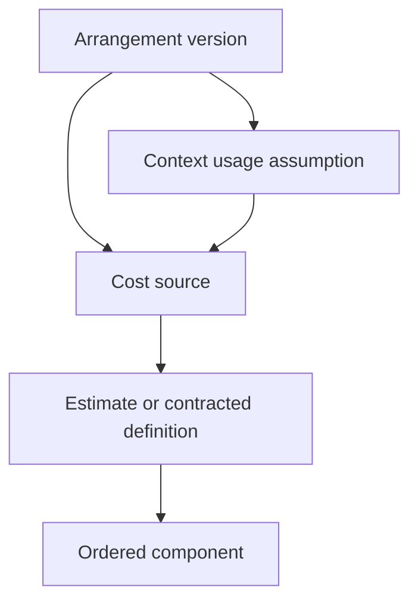

# M3C — Supplier cost terms and forecasts

**Status:** Shipped. Merged to `main` on 2026-09-17 in pull request #66. This document remains the Supplier cost-terms and draft-forecasts contract. It is not authority to start Arrangement activation, effective contracted terms, persisted forecast results, Reservations, commitments, Deadlines, exposure, remittance, FX, or later M3 slices. Workflow compression is Accepted [M3D.0](m3d0-planning-workspace-compression.md). Activation and effective contracted terms are Accepted [M3D](m3d-activation-reservations-confirmations.md) after shipped M3D.0.

**Parent:** [M3 — Supplier planning](m3-supplier-planning.md), Accepted and amended through M3D. M3A, M3B, and M3C are shipped.

**Architecture:** [ADR 0001](../adr/0001-money-and-currency.md), [ADR 0008](../adr/0008-supplier-arrangement-version-topology.md), [ADR 0009](../adr/0009-supplier-contracting-and-service-provider-roles.md), and [ADR 0011](../adr/0011-supplier-cost-definitions-and-forecast-evaluation.md).

**Prerequisites before implementation:** M3A shipped; M3B shipped; M3 parent amended for M3C; ADR 0011 Accepted; this slice Accepted.

This slice implements editable Supplier cost-term definitions and deterministic draft forecasts. It does not activate an Arrangement, create effective contracted terms, persist forecast results, or post money.

## Goal

Let Staff and Administrators describe what one Supplier-side economic source is expected to cost, preserve estimate and contracted definitions without double counting, and evaluate those definitions against explicit planning assumptions.

The result must explain, in the Departure operating currency:

- which stage was selected;
- which Supplier is expected to charge the Agency;
- whether the cost is Arrangement-wide or applies to an Item, Occurrence, and/or Resource;
- which anonymous planning quantities were used;
- how each component was calculated and rounded;
- which components affect Supplier cost, Supplier credit, expected commission, or information only;
- expected commission and expected net cost after commission;
- why a source or Arrangement forecast is incomplete; and
- that every definition currency equals the Departure operating currency.

M3C must prove the Celebrity Beyond, pre-stay hotel, transfer, excursion, and Vineyard Tour cost shapes without cruise-, hotel-, coach-, meal-, excursion-, or insurance-specific tables or code paths.

## In scope

- Exact-version stable Supplier cost sources.
- Arrangement-wide sources with no Item, Occurrence, or Resource, plus Item sources that may narrow to at most one Occurrence and at most one Resource.
- One explicit charging Supplier selected from eligible exact-version Supplier roles.
- One editable `estimate` and one editable `contracted` definition per source on the same draft Arrangement version.
- Definition states `working` and `forecast_ready`.
- One forecast-readiness command; contracted readiness uses Staff attestation rather than required Supplier evidence. Attestation is a planning claim, not confirmation or effective contracted terms.
- One explicit definition currency that must equal the Departure `operating_currency`; estimate and contracted stages share that currency.
- Definition modes `calculated` and `zero_cost`.
- One constrained cost-component table with economic role separate from calculation kind.
- Closed fixed, unit-rate, percentage, minimum-amount-shortfall, and minimum-quantity-shortfall calculation kinds.
- Closed quantity bases for resource, person, night, occupancy-position, and single-occupancy calculations.
- Explicit ordered percentage and minimum base links to earlier components.
- `numeric(20,10)` fractional rates and `bigint` minor-unit amounts.
- Component-level rounding using the definition currency minor unit.
- Item-scoped participant-category labels with no age rules.
- One lightweight usage-assumption record per exact Item context tuple, required only when a formula needs it.
- Anonymous resource-unit occupancy profiles, required only when a formula needs them.
- Per-source whole-stage forecast precedence.
- Deterministic, derived-on-read forecast explanations and single-currency known subtotals.
- Item-level cost-completeness evaluation for later M3D activation, with explicit incompleteness for declared sources.
- Supplier-inactivation dependency and recovery integration for the charging Supplier.
- Draft cost UI on the Arrangement forecast surface for Arrangement-wide sources and inside each Arrangement Item card for Item-scoped sources.
- Tenancy, persistence, command, concurrency, query, accessibility, and scenario proof.

## Out of scope

- Arrangement activation, successor creation/copying, supersession, or ending. M3D consumes M3C readiness and copying contracts.
- Effective contracted terms. Every M3C definition remains tentative until later activation.
- Supplier Reservations, confirmations, commitments, deposit requirements, Deadlines, guarantees, cancellation terms, or exposure.
- Client Packages, Client prices, Client Trips, Travelers, households, Holds, Allocations, assignments, or fulfillment.
- Actual demand precedence over planning assumptions.
- Named forecast scenarios, baselines, alternatives, or saved forecast snapshots.
- Structured participant age rules or automatic Traveler classification.
- Supplier evidence files, Active Storage, or document upload.
- Supplier Obligations, invoices, Payments, Supplier Credits, Commission Receipts, earned commission, settlement, or final cost.
- Commission settlement method and expected remittance (deferred; later commission/payment work such as M6B).
- Client Charges, Supplier-collected value, receipts, refunds, margin, accounting export, or cash position.
- FX rates, currency conversion, functional-currency persistence, mixed-currency grand totals, or foreign-currency Supplier cost definitions.
- Persisted forecast results, projections, ledgers, or calculation events.
- A generic expression language, executable formulas, STI, or service-specific pricing subclasses.
- Arbitrary sets of Occurrences or Resources on one source.
- A full Occurrence/Resource applicability matrix that infers omitted cost sources beyond Item-level coverage and declared-source completeness.
- Cost sources scoped to Capacity Pools or Supplier Reservations; later slices may add demonstrated downstream provenance without changing M3C source meaning.
- New permissions, generated human references, top-level navigation, or `SearchDepartures` changes.
- Changes to M3B capacity quantities, modes, bases, events, or projections.
- `citext`, `pg_trgm`, another `btree_gist` use, or queue-database domain tables.

## Locked boundaries

1. A Supplier cost source is one economic identity within one exact Arrangement version.
2. A source is either Arrangement-wide (no Item, Occurrence, or Resource) or Item-scoped (exactly one Item, optionally narrowed by at most one Occurrence and at most one Resource).
3. A source never spans arbitrary context sets and never spans Arrangement versions. Arrangement-wide and Item-scoped shapes are distinct; correcting shape requires eligible draft removal and recreation.
4. The charging Supplier is explicit and separate from the Service Provider that performs the service.
5. The charging Supplier must occupy an eligible contractor or provider role in the exact version when the source is created and marked ready. Arrangement-wide sources may select only the Arrangement contractor.
6. Source context and charging Supplier are semantic identity. Correcting either requires eligible draft removal and recreation.
7. One source has at most one estimate definition and one contracted definition.
8. Definitions are editable only while the governing Arrangement version is an eligible draft.
9. `forecast_ready` is explicit. Database validity alone never promotes a definition.
10. One readiness command records actor/time; contracted readiness additionally records Staff attestation and provenance statement. Attestation is a planning claim only; it is not confirmation, effective contracted terms, or Arrangement activation.
11. Supporting Supplier evidence is optional for contracted readiness in M3C.
12. A consequential term edit returns the definition to `working` and clears readiness evidence.
13. A readiness fingerprint covers all consequential definition facts and fails closed if current facts no longer match.
14. Forecast selection uses the complete contracted stage when ready, otherwise the complete estimate stage. It never merges stages. Forecast-ready contracted terms supersede the estimate for forecasting without mutating the estimate or requiring a new Arrangement version.
15. A selected stage that later lacks a usage input remains selected but incomplete. Evaluation never silently falls back.
16. Each definition stores one explicit uppercase currency that must equal the Departure `operating_currency`. All fixed money in that definition inherits it.
17. Estimate and contracted definitions for one source use the same currency. Agency or Departure defaults may seed entry but never reinterpret an existing definition. M3C never converts currencies and does not authorize foreign-currency definitions.
18. The first retained currency-bearing cost definition freezes ordinary Departure currency change under the existing currency-bearing M3 fact rule. Commands never rewrite, relabel, or convert stored cost amounts.
19. Stored amounts and rates are nonnegative magnitudes. Economic role and base-link direction determine effect.
20. Zero cost requires `zero_cost` mode and a reason. Missing, empty, or invalid definitions are not zero.
21. A zero-cost definition contains no components. A calculated definition contains at least one component before readiness.
22. Economic role and calculation kind are independent closed catalogs.
23. Components are evaluated in explicit order. Percentage and minimum bases reference earlier components only.
24. Cross-definition, forward, cyclic, and self-referential bases are invalid.
25. Every component result is rounded before later components consume it.
26. Minimum guarantees render as explicit shortfall components rather than hidden total clamps. Monetary minima use `minimum_amount_shortfall`; quantity minima such as “minimum five people” use `minimum_quantity_shortfall`.
27. Expected commission never reduces forecast Supplier cost. Commission settlement method and expected remittance are out of scope.
28. M3C participant categories are labels, not people, age rules, or automatic classifications. They exist only on Item-scoped sources.
29. Usage assumptions are planning demand, not Supplier capacity, Client demand, Holds, Allocations, occupancy truth, or fulfillment. They are required only when a formula needs them and exist only for Item context tuples.
30. One exact Item context tuple has at most one current usage assumption shared by matching Item-scoped sources.
31. Occupancy profiles are anonymous patterns. They contain no Client, Traveler, payer, household, or assignment identity. They are required only when a formula needs them.
32. When occupancy profiles exist, overlapping scalar totals are derived rather than stored independently.
33. Forecasts are deterministic read models. M3C persists no calculated result, source total, or forecast snapshot. Explanations always return rounded component minor-unit results.
34. An incomplete forecast may show a labeled known subtotal but never treats missing facts as zero.
35. Arrangement and Departure totals aggregate in the one Departure operating currency.
36. M3C cost completeness proves Item-level coverage and completeness of every declared cost source. Every retained Item must have at least one Item-scoped source. Arrangement-wide sources are additional declared costs and do not satisfy Item coverage. Completeness cannot infer that Staff omitted an additional real-world cost source for another Occurrence, Resource, or Arrangement-wide charge. M3D activation must present the complete source list for Staff coverage attestation.
37. Cost readiness is independent from M3B capacity applicability. Neither implies the other.
38. No cost command creates capacity, commitment, Reservation, confirmation, Deadline, Obligation, Payment, Client record, or accounting fact.
39. No M3C record belongs to a Travel Program or derives authority from Office context.
40. Cross-Agency identifiers return not found. Request parameters never establish Agency scope.

## Topology



The final arrow denotes exact context matching, not ownership by a source. Multiple Item-scoped sources with the same Item/Occurrence/Resource tuple reuse one assumption. Arrangement-wide sources do not use Item usage assumptions.

Every row repeats the ownership and provenance columns applicable to that row so its complete relationship chain can be enforced at the database boundary. Same Agency alone is insufficient. Not every row carries every possible parent identifier.

## Cost-source applicability

Every source has one of these exact shapes:

| Shape | Item | Occurrence | Resource | Example |
| --- | --- | --- | --- | --- |
| Arrangement-wide | absent | absent | absent | Fixed Arrangement charge such as a group amenity fee |
| Item-wide | required | absent | absent | Item-wide fixed or formula charge |
| Occurrence | required | required | absent | Segment or dated-event cost |
| Resource | required | absent | required | Category cost across the Item |
| Occurrence–Resource | required | required | required | Cabin category on one sailing or room type on one night |

When present, Occurrence and Resource must belong to the source Item and exact version. Arrangement-wide sources carry no Item, Occurrence, or Resource. The source does not imply that every matching context is cost-covered; M3C completeness is Item-level plus declared-source completeness only.

`charging_supplier_id` defaults in the form to the Arrangement contractor. Staff may choose only:

- the Arrangement contractor (required choice for Arrangement-wide sources);
- the exact Item default provider, for Item-scoped sources; or
- an exact Occurrence override applicable to the source context, for Occurrence-bearing Item-scoped sources.

An Item-wide or Resource-only source cannot select an Occurrence-only provider that does not govern its whole context. A provider assignment change never retargets a source. A mismatch is visible and blocks forecast readiness until the source is removed/recreated or the governing role is restored.

## Stages, modes, and readiness

### Stage catalog

| Stage | Meaning |
| --- | --- |
| `estimate` | Agency planning assumption for expected Supplier cost |
| `contracted` | Staff-attested transcription of Supplier-agreed cost terms |

Both stages may exist on the same draft Arrangement version. Forecast-ready contracted terms supersede the estimate for forecasting without mutating the estimate. Arrangement-version supersession remains M3D.

`committed`, `confirmed`, `final`, `invoiced`, and `actual` are not M3C stages.

### State catalog

| State | Meaning |
| --- | --- |
| `working` | Editable but not eligible to govern forecast precedence |
| `forecast_ready` | Explicitly validated and approved to govern draft forecasting |

### Mode catalog

| Mode | Components | Required readiness facts |
| --- | --- | --- |
| `calculated` | One or more | Valid ordered calculation and referenced inputs |
| `zero_cost` | None | Trimmed reason explaining the known zero |

`MarkCostDefinitionForecastReady` is the only transition to `forecast_ready`. It validates the current definition, components, bases, category references, context, charging Supplier, currency, and currently required usage inputs.

Estimate readiness records actor/time and an optional provenance note. Contracted readiness records actor/time and a required trimmed attestation/provenance statement of 1–500 characters. It does not require Administrator authority or Supplier evidence. Attestation is a planning claim that the entered terms reflect the Supplier agreement; it is not confirmation, effective contracted terms, or Arrangement activation.

Any consequential update to definition mode, currency, zero reason, rounding policy, components, component order, base links, or referenced participant-category semantics clears readiness in the same transaction. Source label/notes and usage-assumption changes do not rewrite term readiness, but forecast evaluation still fails incomplete when current inputs cannot evaluate the selected stage.

## Economic roles and calculations

### Economic-role catalog

| Role | Cost effect | Separate reporting |
| --- | ---: | --- |
| `supplier_charge` | Add rounded result | Supplier charges |
| `supplier_credit` | Subtract rounded result | Supplier credits/discounts |
| `expected_commission` | No cost effect | Expected commission |
| `informational_allocation` | No cost effect | Included tax/fee or another explanatory allocation |

`supplier_credit` is not Supplier Credit value and `expected_commission` is not earned commission. Both are planning terms only.

`pass_through` is a separate boolean classification on charge, credit, or informational components. It preserves planning provenance for later Client-price mapping but has no M3C Client-revenue effect.

### Calculation-kind catalog

| Kind | Required fields | Forbidden fields |
| --- | --- | --- |
| `fixed` | positive-ready `amount_minor_units` | quantity basis, rate, threshold, quantity minimum, base links |
| `unit_rate` | positive-ready `amount_minor_units`, quantity basis | rate, threshold, quantity minimum, base links |
| `percentage` | positive-ready `rate`, treatment, one or more base links | amount, threshold, quantity minimum, quantity basis |
| `minimum_amount_shortfall` | positive-ready `minimum_minor_units`, one or more earlier monetary base links | amount, rate, quantity basis, quantity minimum |
| `minimum_quantity_shortfall` | positive whole `minimum_quantity`, compatible quantity basis and selectors, exactly one earlier compatible `unit_rate` base link | amount, rate, monetary threshold |

Working definitions may temporarily contain zero or incomplete values where database shape remains unambiguous. Forecast readiness requires the positive and complete form above.

Arrangement-wide definitions may use `fixed`, `percentage`, and `minimum_amount_shortfall`. They may not use quantity bases, occupancy selectors, participant categories, or `minimum_quantity_shortfall`.

### Quantity-basis catalog

```text
resource_units
persons
nights
resource_nights
person_nights
occupancy_positions
occupancy_position_nights
single_occupancy_units
single_occupancy_nights
```

`unit_rate` and `minimum_quantity_shortfall` each have exactly one basis. Optional participant-category and occupancy-position selectors are valid only for compatible person/position bases. Position bounds are positive integers; an absent upper bound means that position and later positions.

This catalog belongs to cost evaluation only. It neither extends nor converts M3B capacity bases.

### Ordered bases

Percentage and minimum components own explicit base links. Each link:

- references one earlier component in the same definition;
- declares `add` or `subtract` treatment for monetary bases;
- participates in one deterministic link order for explanation; and
- consumes that component's already-rounded magnitude for monetary bases, or the earlier `unit_rate` amount for quantity shortfalls.

The resulting monetary base must be nonnegative. Existing component positions are never implicitly shifted by inserting an out-of-order dependency. Reorder validates the complete permutation and every dependency.

Percentage treatment is:

| Treatment | Formula | Cost behavior |
| --- | --- | --- |
| `additive` | rounded `base × rate` | Economic role applies normally |
| `included` | rounded `base × rate ÷ (1 + rate)` | Must use `informational_allocation`; does not affect cost again |

Rate persistence is `numeric(20,10)`, where `1.0` means 100%. No float enters the calculation path.

A `minimum_amount_shortfall` component calculates rounded `max(0, threshold - monetary_base)` and must use `supplier_charge`. It shows zero when the base meets the monetary minimum and the shortfall when it does not.

A `minimum_quantity_shortfall` component:

1. evaluates the planned quantity from the matching usage assumption using its own quantity basis and selectors;
2. calculates `missing_billed_quantity = max(0, minimum_quantity − evaluated_quantity)`;
3. multiplies that whole-number shortfall by the linked earlier `unit_rate` component's unit amount; and
4. rounds the monetary shortfall as a `supplier_charge`.

The explanation must retain planned quantity, minimum billed quantity, missing billed quantity, unit rate, and rounded shortfall. The linked `unit_rate` must use a compatible quantity basis; selectors on the shortfall must not invent a different quantity meaning from the rate they multiply.

### Rounding

Each definition stores rounding mode `half_up`; no other M3C mode is initially accepted. Calculations use `BigDecimal` and the currency exponent supplied by `Money::Currency`.

For every component:

1. resolve the exact quantity and selectors;
2. calculate in decimal precision;
3. round to the definition currency minor unit;
4. expose the rounded magnitude to later base links; and
5. apply the economic role to reporting totals.

The component explanation retains formula inputs and rounded minor units. No result is persisted.

## Usage assumptions and occupancy profiles

One usage assumption is unique on the exact context tuple using `NULLS NOT DISTINCT` semantics for optional Occurrence and Resource IDs.

Scalar inputs are nullable nonnegative whole numbers:

- expected resource units;
- expected persons; and
- expected billable nights.

`NULL` means unknown. Zero is an explicit expected quantity and remains distinct from missing.

An occupancy profile contains:

- a required label;
- a positive count of like resource units;
- ordered anonymous participant positions; and
- one Item-scoped participant category for each position.

When profiles exist, resource units, persons, occupancy positions, and single-occupancy quantities are derived from them. The same scalar fields may not compete as editable authority. Nights remain an explicit assumption when required.

Participant categories contain only stable identity, exact-version Item ownership, required label, and manual order. Examples may include `Adult`, `Child`, `Lap infant`, or `Full-tariff traveler`, but the label has no global meaning and no age rule.

Usage assumptions may be edited while the version is an eligible draft. Their audit preserves before/after planning values. M3C does not retain historical assumption versions or named alternatives.

## Forecast evaluation

`EvaluateSupplierCostForecast` is read-only and not audited.

For each source:

1. verify source ownership, exact context, charging-Supplier eligibility, and active/current warnings;
2. choose forecast-ready contracted, else forecast-ready estimate, else incomplete;
3. verify the readiness fingerprint against current term facts;
4. load the exact matching usage assumption when required;
5. derive occupancy quantities;
6. evaluate components in order with component-level rounding;
7. calculate Supplier charges, Supplier credits, forecast Supplier cost, expected commission, and expected net cost after commission; and
8. return complete explanation and warnings.

For one evaluated source in the Departure operating currency:

```text
supplier charges = sum(supplier_charge results)
supplier credits = sum(supplier_credit results)
forecast Supplier cost = supplier charges - supplier credits
expected commission = sum(expected_commission results)
expected net cost after commission = forecast Supplier cost - expected commission
```

Informational allocations affect none of these totals. Expected commission never reduces forecast Supplier cost. A complete evaluation requires forecast Supplier cost and expected net cost after commission to remain nonnegative. Commission settlement method and expected remittance are not calculated in M3C.

At Arrangement and Departure levels:

- aggregate totals in the one Departure operating currency;
- label a partial amount **Known forecast subtotal**;
- list Items with no Item-scoped cost source;
- list incomplete Arrangement-wide or Item-scoped sources;
- list sources with no selected stage, invalid readiness, missing inputs, or mismatched/inactive Supplier;
- identify the selected stage and why the earlier stage was not used; and
- never display actual margin, Supplier balance, payable, remittance, or cash at risk.

A version is cost-complete for later activation only when:

- every retained Item has at least one Item-scoped source, including a zero-cost source when appropriate;
- every declared source—Arrangement-wide and Item-scoped—selects a forecast-ready stage;
- every selected definition evaluates with current inputs;
- every source context remains valid;
- every charging Supplier remains active and eligible in the exact version;
- every readiness fingerprint matches; and
- no definition or source is otherwise incomplete.

M3C cost completeness proves Item-level coverage and completeness of every declared cost source. It cannot infer that Staff omitted an additional real-world cost source for another Occurrence, Resource, or Arrangement-wide charge. M3D activation must present the complete source list for Staff coverage attestation.

M3C renders this readiness result but provides no activation control.

`EvaluateSupplierCostForecast` must observe a consistent snapshot of the Arrangement cost graph. Under PostgreSQL, implement that as one read-only `REPEATABLE READ` transaction for the evaluation preload and calculation. Do not issue a multi-query forecast under default `READ COMMITTED` without a compensating version-lock/fingerprint protocol that detects any relevant mutation and retries evaluation. The read-only `REPEATABLE READ` transaction is the preferred M3C rule.

## Persistence contract

Use forward migrations and update `db/structure.sql` through migrations only. Application-owned IDs are UUIDv7 with database defaults. UUID foreign keys declare `type: :uuid`; domain timestamps use `timestamptz`; rates use `numeric(20,10)`; money uses `bigint` minor units.

Every new tenant row carries direct `agency_id` and `departure_id`. Composite foreign keys prove full ownership. Triggers reject immutable ownership changes and cross-definition or cross-context relationships.

Commands resolve definition currency through `Money::Currency.find`, parse money strictly at the boundary, and reject ambiguous input rather than coercing it to zero. Definition currency must equal the Departure `operating_currency` at create, update, and readiness. Models expose fixed amounts and minimums through `monetize` with `with_model_currency`; the component obtains that currency only from its immutable owning definition. Do not use a process-wide default currency or `money-rails` migration helpers.

### `supplier_cost_sources`

| Attribute | Contract |
| --- | --- |
| ownership | Agency, Departure, Arrangement, exact version; Item required only for Item-scoped sources |
| context | Optional exact-version Occurrence and optional exact-version Resource when Item-scoped; both absent when Arrangement-wide |
| `charging_supplier_id` | Required eligible same-Agency Supplier; semantic identity |
| `label` | Required trimmed 1–160 characters |
| `notes` | Optional, maximum 2,000 characters |
| `position` | Positive manual order within the Arrangement-wide collection or within the Item/version collection |
| `lock_version` | Required nonnegative integer |
| timestamps | UTC `timestamptz` |

Source ownership, context, and charging Supplier are immutable. Arrangement-wide rows store null Item, Occurrence, and Resource. Position is unique within exact version among Arrangement-wide sources, or within exact version/Item among Item-scoped sources, using a deferrable constraint or another documented atomic reorder strategy. Duplicate labels are allowed and disambiguated by context, Supplier, and order.

### `supplier_cost_definitions`

| Attribute | Contract |
| --- | --- |
| ownership | Agency, Departure, Arrangement, exact version, source |
| `stage` | `estimate` or `contracted` |
| `status` | `working` or `forecast_ready` |
| `mode` | `calculated` or `zero_cost` |
| `currency` | Required uppercase three-character recognized code equal to Departure `operating_currency` |
| `rounding_mode` | `half_up` |
| `zero_cost_reason` | Required only for `zero_cost`, 1–500 characters |
| readiness | Optional actor, time, provenance/attestation, and fingerprint; complete exactly when ready |
| `lock_version` | Required nonnegative integer |
| timestamps | UTC `timestamptz` |

Unique `(supplier_cost_source_id, stage)`. Currency must equal the Departure operating currency and cannot change after any component exists; staff remove components or recreate the working definition rather than relabel stored amounts. The first retained currency-bearing cost definition freezes ordinary Departure currency change.

### `supplier_cost_components`

| Attribute | Contract |
| --- | --- |
| ownership | Agency, Departure, Arrangement, exact version, definition |
| `label` | Required trimmed 1–160 characters |
| `economic_role` | Closed role catalog |
| `calculation_kind` | Closed kind catalog |
| `amount_minor_units` | Kind-specific nonnegative magnitude |
| `rate` | Kind-specific nonnegative `numeric(20,10)` |
| `minimum_minor_units` | Required for `minimum_amount_shortfall` |
| `minimum_quantity` | Required positive whole number for `minimum_quantity_shortfall` |
| `quantity_basis` | Kind-specific closed basis |
| selectors | Optional participant category and occupancy-position bounds |
| `percentage_treatment` | `additive` or `included` for percentage only |
| `pass_through` | Required boolean, default false |
| `position` | Positive order unique within definition |
| `lock_version` | Required nonnegative integer |
| timestamps | UTC `timestamptz` |

Named database checks enforce every kind/role field shape. Component money inherits definition currency and has no competing currency column. There is no `commission_settlement_method` column. `minimum_quantity_shortfall` stores the contractual quantity and links exactly one earlier compatible `unit_rate` component; it does not store a second monetary rate.

### `supplier_cost_component_bases`

| Attribute | Contract |
| --- | --- |
| ownership | Agency, Departure, Arrangement, exact version, definition, component |
| `base_component_id` | Required earlier component in the same definition |
| `direction` | `add` or `subtract` |
| `position` | Positive explanation order within the component |
| timestamps | UTC `timestamptz` |

Unique component/base pair. Database triggers reject self, cross-definition, forward, and duplicate relationships.

### `supplier_cost_participant_categories`

| Attribute | Contract |
| --- | --- |
| ownership | Agency, Departure, Arrangement, exact version, Item |
| `label` | Required trimmed 1–80 characters |
| `position` | Positive manual Item/version order |
| `lock_version` | Required nonnegative integer |
| timestamps | UTC `timestamptz` |

Categories store no age, birth date, capacity behavior, or Traveler pointer.

### `supplier_cost_usage_assumptions`

| Attribute | Contract |
| --- | --- |
| ownership | Agency, Departure, Arrangement, exact version, Item |
| context | Optional exact-version Occurrence and Resource |
| scalar inputs | Nullable nonnegative resource units, persons, and nights |
| `lock_version` | Required nonnegative integer |
| timestamps | UTC `timestamptz` |

One row per exact context tuple using a database uniqueness strategy that treats absent Occurrence/Resource as equal. A row is not required until a formula needs it.

### `supplier_cost_occupancy_profiles`

| Attribute | Contract |
| --- | --- |
| ownership | Agency, Departure, Arrangement, version, Item, usage assumption |
| `label` | Required trimmed 1–120 characters |
| `resource_unit_count` | Positive whole number |
| `position` | Positive manual order within the assumption |
| `lock_version` | Required nonnegative integer |
| timestamps | UTC `timestamptz` |

### `supplier_cost_occupancy_profile_positions`

| Attribute | Contract |
| --- | --- |
| ownership | Agency, Departure, Arrangement, version, Item, assumption, profile |
| `participant_category_id` | Required category from the same version and Item |
| `occupancy_position` | Positive integer unique within profile |
| timestamps | UTC `timestamptz` |

Profile positions are anonymous calculation inputs, not people or assignments.

### Existing idempotency family

Reuse `AgencyCommandIdempotencyKey` for source, definition, component, participant-category, usage-assumption, and occupancy-profile create commands. Scope by Agency, command name, and caller key. Fingerprints contain submitted consequential inputs, not server-generated timestamps.

Same key plus same fingerprint returns the original result before stale-lock comparison and writes no second audit. Same key plus different fingerprint returns `conflict`.

### Optimistic locking and collection ownership

- Source create, remove, and reorder change the version's cost-source collection and submit/bump the Arrangement-version `lock_version`.
- Source label/notes update submits the source `lock_version`.
- Definition create/remove changes the source's stage collection and submits/bumps the source `lock_version`.
- Definition field update and forecast-ready transition submit the definition `lock_version`.
- Component create, remove, reorder, and base-set replacement change the definition calculation and submit/bump the definition `lock_version`.
- Updating one component's own non-base fields also submits its component `lock_version`; when base links change, both component and definition locks participate so the calculation collection has one concurrency owner.
- Participant-category create/remove/reorder submits the version `lock_version`. A label update submits the category `lock_version` and locks every dependent ready definition before returning it to `working`.
- Usage-assumption scalar update submits the assumption `lock_version`.
- Occupancy-profile create/remove/reorder submits/bumps the assumption `lock_version`; profile field/complete-position-set update submits the profile `lock_version` and bumps the assumption lock.

Create-command replay checks the idempotency slot before comparing the caller's original stale lock value. A successful first request may bump the owner lock; an identical retry with the original submitted value must still replay the original result.

## Command contract

All user commands require `manage_departures`. Reads require `view_departures`. No M3C command uses `override_supplier_planning_terms`.

### Cost-source commands

- `CreateSupplierCostSource` creates one exact-context source with immutable charging Supplier and appends it to Arrangement-wide order or Item order. Idempotent; submits version `lock_version`.
- `UpdateSupplierCostSource` edits label and notes only; same-value is a no-op after lock comparison.
- `ReorderSupplierCostSources` accepts one complete Arrangement-wide sibling permutation or one complete Item/version sibling permutation.
- `RemoveSupplierCostSource` removes an eligible draft-only source, its definitions/components/bases, and no shared usage assumption unless that assumption is separately unused and explicitly removed.

Removal never cascades into M3A Item, Occurrence, or Resource identity. M3A removal commands must return `dependency_exists` while M3C dependencies remain rather than leak a database exception.

### Definition commands

- `CreateSupplierCostDefinition` creates the unique source/stage definition in `working`. Idempotent.
- `UpdateSupplierCostDefinition` edits mode, zero reason, and rounding policy; currency must remain equal to Departure `operating_currency`; consequential change clears readiness.
- `RemoveSupplierCostDefinition` removes an eligible draft definition and its components/bases.
- `MarkCostDefinitionForecastReady` validates and stores readiness evidence/fingerprint.

There is no separate attestation record or readiness lifecycle. Editing returns the definition to `working`. Already-ready with the same current fingerprint and same readiness payload is replay success before stale-lock comparison and writes no second audit.

### Component commands

- `CreateSupplierCostComponent` creates one typed component at the end of order. Idempotent.
- `UpdateSupplierCostComponent` validates the complete kind/role field shape and atomically replaces its explicit base-link set where applicable.
- `ReorderSupplierCostComponents` accepts one complete permutation and rejects every forward dependency.
- `RemoveSupplierCostComponent` fails while a later component references it unless the same atomic command also removes those base links.

Create/update/remove/reorder clears definition readiness when it changes consequential facts.

### Participant-category commands

- `CreateSupplierCostParticipantCategory`
- `UpdateSupplierCostParticipantCategory`
- `ReorderSupplierCostParticipantCategories`
- `RemoveSupplierCostParticipantCategory`

Removal fails while a component selector or occupancy-profile position references the category. A semantic label change invalidates readiness fingerprints of dependent definitions.

The category-update transaction locks dependent definitions and returns each ready dependent definition to `working`; it does not leave a row labeled ready with a known-stale fingerprint.

### Usage-assumption commands

- `CreateSupplierCostUsageAssumption` creates the unique exact-context row. Idempotent.
- `UpdateSupplierCostUsageAssumption` edits scalar planning inputs.
- `RemoveSupplierCostUsageAssumption` fails while profiles exist and makes dependent forecasts incomplete.
- `CreateSupplierCostOccupancyProfile`, `UpdateSupplierCostOccupancyProfile`, `RemoveSupplierCostOccupancyProfile`, and `ReorderSupplierCostOccupancyProfiles` manage anonymous patterns.

Profile create/update accepts the complete ordered participant-position set atomically. When profiles exist, commands reject independently authoritative resource/person scalar totals that would compete with derived counts.

Usage changes do not alter term readiness or create audit pretending Supplier terms changed. They do change the derived forecast immediately.

### Forecast query

`EvaluateSupplierCostForecast` is a read service, not a command. It mutates nothing, writes no audit, and returns structured per-source explanations in the Departure operating currency.

## State-dependent behavior

| State | Allowed M3C behavior |
| --- | --- |
| Departure `draft` or `active`; Arrangement/version editable; Suppliers active | Ordinary draft configuration and evaluation |
| Departure `departed` | View/evaluate retained facts, remove unpublished dependent draft structure, or abandon. No new/expanded cost planning or ready transition. |
| Arrangement/version `abandoned` | Read-only evaluation/history |
| Charging Supplier inactive after force | View/evaluate with warning; remove dependent draft source or abandon. No new source, new definition/component, or ready transition for that Supplier. |
| Provider-role mismatch | View/evaluate as incomplete; restore role or remove/recreate source |

M3C has no activated version in ordinary production flow. Model/service tests may use M3D-style fixtures only if needed to prove immutability; M3C adds no production activation helper, bypass, route, task, seed, or service.

`AbandonSupplierArrangement` retains every M3C source, definition, component, base link, category, assumption, and occupancy profile and makes them read-only with the rest of the graph. It never deletes cost planning as a side effect.

## Supplier-inactivation integration

Extend `ChangeSupplierStatus` only for dependencies introduced by M3C.

Ordinary inactivation is blocked when a Supplier is the charging Supplier of a retained cost source on a draft or active Arrangement. This dependency is independent from effective Service Provider because economic counterparty and fulfillment may differ.

Terminal abandoned Arrangements and sources retained only through later superseded/ended history do not block. M3C itself creates only draft sources.

Force inactivation:

- preserves every source, definition, component, base link, assumption, category, and profile;
- writes no cost mutation and recalculates no stored total because none exists;
- leaves visible inactive-Supplier warnings;
- allows only dependency-reducing removal or Arrangement abandonment; and
- never retargets the immutable charging Supplier.

Reactivation changes only Supplier status. It does not restore readiness, alter a forecast, or reclassify a source automatically.

## Authorization and domain errors

| Capability | Permission | Administrator | Staff | Viewer |
| --- | --- | ---: | ---: | ---: |
| View cost definitions and forecasts | `view_departures` | Yes | Yes | Yes |
| Configure draft sources, definitions, components, and assumptions | `manage_departures` | Yes | Yes | No |
| Attest contracted terms as forecast-ready | `manage_departures` | Yes | Yes | No |

Assignment as manager, Arrangement contact, contractor, provider, or charging Supplier grants no authority.

Use existing domain error codes:

| Code | Use |
| --- | --- |
| `unauthorized` | Missing permission or inactive/mismatched actor |
| `invalid` | Malformed currency, amount, rate, formula, selector, base, assumption, profile, attestation, or field shape |
| `invalid_state` | Ineligible Departure, Arrangement, version, Supplier, source, or readiness state |
| `conflict` | Stale lock, idempotency mismatch, uniqueness race, or reorder conflict |
| `not_found` | Identifier not loaded through current Agency and complete owner chain |
| `dependency_exists` | Removal, M3A child deletion, or Supplier inactivation blocked by retained M3C dependencies |

## Lock order and concurrency

After pre-transaction authorization:

1. Agency; recheck active.
2. Actor reloaded through Agency; recheck active and permission.
3. Affected charging/provider/contracting Suppliers in UUID order.
4. Departure; recheck lifecycle.
5. Supplier Arrangement.
6. Exact Arrangement version.
7. Item, Occurrence, and Resource identities/definitions in parent then UUID order.
8. Cost sources in UUID order.
9. Cost definitions, components, base links, participant categories, usage assumptions, and occupancy profiles in stable parent/UUID order.
10. Idempotency row after its owning source/definition, except create commands follow the shipped M3A create exception.
11. Audit rows after domain mutation.

Forecast reads take a consistent database snapshot and verify readiness fingerprints. Prefer one read-only `REPEATABLE READ` transaction for the evaluation preload and calculation. Do not acquire write locks merely to calculate a draft. A mutating command never relies on a previously rendered forecast result.

Required genuine multi-connection races include:

- source create versus Supplier inactivation;
- source create versus M3A Item/Occurrence/Resource removal;
- two source or component creates choosing the same next position;
- same-key replay versus concurrent first execution for every create scope;
- definition edit versus forecast-ready transition;
- component update/reorder/remove versus forecast-ready transition;
- component reorder versus base-link update;
- participant-category update/remove versus component/profile use;
- assumption update versus profile create/remove;
- evaluation concurrent with term or assumption edit, producing one internally consistent before-or-after explanation; and
- source removal versus M3D activation fixture in service proof, with activation outside M3C production scope.

## Audit

Continue using `SupplierArrangement` as audit subject. Domain rows remain authoritative; audit JSON is not a formula snapshot.

Add actions:

```text
supplier_arrangement.cost_source_created
supplier_arrangement.cost_source_updated
supplier_arrangement.cost_source_removed
supplier_arrangement.cost_sources_reordered
supplier_arrangement.cost_definition_created
supplier_arrangement.cost_definition_updated
supplier_arrangement.cost_definition_removed
supplier_arrangement.cost_definition_forecast_ready
supplier_arrangement.cost_component_created
supplier_arrangement.cost_component_updated
supplier_arrangement.cost_component_removed
supplier_arrangement.cost_components_reordered
supplier_arrangement.cost_participant_category_created
supplier_arrangement.cost_participant_category_updated
supplier_arrangement.cost_participant_category_removed
supplier_arrangement.cost_participant_categories_reordered
supplier_arrangement.cost_usage_assumption_created
supplier_arrangement.cost_usage_assumption_updated
supplier_arrangement.cost_usage_assumption_removed
supplier_arrangement.cost_occupancy_profile_created
supplier_arrangement.cost_occupancy_profile_updated
supplier_arrangement.cost_occupancy_profile_removed
supplier_arrangement.cost_occupancy_profiles_reordered
```

Audit details include exact version and stable IDs, changed fields, context tuple, charging Supplier, stage/mode/status, component role/kind, old/new order, assumption changes, and readiness evidence/fingerprint as applicable. They never include a fabricated persisted forecast total.

Expected failures, no-op updates, idempotent replay, and forecast evaluation write no success audit. One command writes one audit even when readiness is cleared as part of the same mutation.

## Routes and HTTP semantics

Nest Item-scoped M3C under existing Arrangement Item routes, and Arrangement-wide costs under the Arrangement:

```text
/departures/:departure_id/arrangements/:arrangement_id/costs
/departures/:departure_id/arrangements/:arrangement_id/costs/reorder
/departures/:departure_id/arrangements/:arrangement_id/costs/:id
/departures/:departure_id/arrangements/:arrangement_id/costs/:cost_source_id/definitions
/departures/:departure_id/arrangements/:arrangement_id/costs/:cost_source_id/definitions/:id/forecast-ready
/departures/:departure_id/arrangements/:arrangement_id/costs/:cost_source_id/definitions/:definition_id/components
/departures/:departure_id/arrangements/:arrangement_id/items/:item_id/costs
/departures/:departure_id/arrangements/:arrangement_id/items/:item_id/costs/reorder
/departures/:departure_id/arrangements/:arrangement_id/items/:item_id/costs/:id
/departures/:departure_id/arrangements/:arrangement_id/items/:item_id/costs/:cost_source_id/definitions
/departures/:departure_id/arrangements/:arrangement_id/items/:item_id/costs/:cost_source_id/definitions/:id/forecast-ready
/departures/:departure_id/arrangements/:arrangement_id/items/:item_id/costs/:cost_source_id/definitions/:definition_id/components
/departures/:departure_id/arrangements/:arrangement_id/items/:item_id/participant-categories
/departures/:departure_id/arrangements/:arrangement_id/items/:item_id/participant-categories/reorder
/departures/:departure_id/arrangements/:arrangement_id/items/:item_id/participant-categories/:id
/departures/:departure_id/arrangements/:arrangement_id/items/:item_id/cost-assumptions
/departures/:departure_id/arrangements/:arrangement_id/items/:item_id/cost-assumptions/:assumption_id/occupancy-profiles
/departures/:departure_id/arrangements/:arrangement_id/items/:item_id/cost-assumptions/:assumption_id/occupancy-profiles/reorder
/departures/:departure_id/arrangements/:arrangement_id/items/:item_id/cost-assumptions/:assumption_id/occupancy-profiles/:id
/departures/:departure_id/arrangements/:arrangement_id/cost-forecast
```

Named routes may follow Rails conventions. Use `POST` for create and readiness, `PATCH` for update/reorder, and `DELETE` for eligible draft removal.

Participant categories have dedicated nested endpoints. Occupancy profiles are nested under the owning cost-assumption endpoint and are not managed only as opaque assumption payload fields; create/update still accepts the complete ordered participant-position set atomically.

Controllers load every parent through `Current.agency`. Another Agency's identifier returns 404 without disclosure. Preserve submitted values and use the existing error-summary and focus behavior.

M3C adds no activation, successor, commitment, posting, FX, settlement, or remittance route.

## Interface contract

Cost terms appear on the Arrangement forecast surface for Arrangement-wide sources and inside each display-first Item card for Item-scoped sources.

Each Item shows:

- cost coverage status: complete, incomplete, or known zero for that Item;
- context-grouped Item-scoped cost sources in manual order;
- charging Supplier when different from contractor/provider or otherwise useful;
- estimate and contracted stage status without merging their components;
- selected forecast stage;
- definition currency equal to the Departure operating currency;
- component calculation rows and expandable explanation;
- incomplete-input, inactive-Supplier, role-mismatch, and stale-readiness warnings; and
- usage assumptions and anonymous occupancy profiles separately from Supplier terms.

The Arrangement forecast shows:

- Arrangement-wide cost sources with the same stage/component editing anatomy as Item cards;
- complete single-currency totals or **Known forecast subtotal**;
- source-level Supplier charges, credits, forecast cost, expected commission, and expected net cost after commission;
- every uncovered Item and every incomplete declared source/input;
- selected-stage and supersession explanation;
- the explicit incompleteness limit: Item-level coverage plus declared-source completeness, not an inferred full applicability matrix; and
- tentative wording with no payable, remittance, cash, actual-margin, or accounting label.

The primary actions are small independent forms: add Arrangement-wide or Item source, edit one definition, add/edit one component, mark ready, and edit usage assumptions. Do not create one giant nested pricing form or a formula-code editor.

Viewer sees all facts and explanations without controls. Working and ready states use text and icons, not color alone.

At 375 and 768 pixels, stack source → stage → component rows and keep formula details in disclosures. At 1280 and 1400 pixels, compact columns may align role, formula, quantity, rate, and result without horizontal scrolling or detaching components from their source.

Reuse `dd-` classes and Harbor & Waypoint semantics. Amber is attention/focus, red invalid/destructive, teal active interaction, and navy structure. Maintain keyboard order, visible focus, disclosure state, error focus, and accessible labels.

## Query and performance contract

Arrangement detail and forecast must preload exact-version sources, selected definitions, ordered components, base links, charging Suppliers, participant categories, matching assumptions, profiles, and positions in bounded queries.

Do not add a global cost-source search. Arrangement forecast is bounded by one Departure/Arrangement graph. Component explanation must not issue queries per row.

Indexes must support:

- sources by exact version for Arrangement-wide position and by exact version/Item/position for Item-scoped sources, plus charging Supplier dependency;
- unique source/stage definition;
- components by definition/position;
- base links by component and base component;
- categories by version/Item/position;
- unique exact-context usage assumptions;
- profiles and positions by assumption/order; and
- complete composite foreign keys.

Scenario-scale query assertions and representative `EXPLAIN` proof are required. Evaluation must be deterministic under unrelated directory and Arrangement growth.

## Required proof

### Persistence and database proof

- UUIDv7 defaults, direct Agency/Departure ownership, `timestamptz`, named constraints/indexes, and immutable-column triggers.
- Same-Agency, same-Departure, same-Arrangement, same-version, same-Item when present, same-Occurrence, same-Resource, same-Supplier, same-definition, and same-category composite FK rejection.
- Five exact source-context shapes, including Arrangement-wide, and rejection of cross-Item context.
- Eligible charging-Supplier role at command/readiness boundaries; Arrangement-wide limited to Arrangement contractor.
- Unique source/stage definition and closed stage/state/mode catalogs.
- One uppercase recognized currency per definition equal to Departure `operating_currency`; components have no competing currency.
- Estimate and contracted definitions for one source use the same currency; mismatch with Departure operating currency is rejected.
- `bigint` minor units, `numeric(20,10)` rates, no float columns, and nonnegative magnitudes.
- Kind/role field-shape checks, included-percentage restrictions, monetary and quantity minimum shapes, and minimum-role restriction.
- Complete manual-order uniqueness and atomic reorder.
- Same-definition earlier-component base links; cross-definition/self/forward links rejected.
- One exact-context assumption with null-safe uniqueness.
- Whole-number nonnegative scalar assumptions and positive profile/unit/position values.
- Participant categories contain no age or Traveler attributes.
- No calculated forecast amount or total column exists.
- Existing idempotency family reused with declared scopes.

### Source and definition command proof

- Source creation for every context shape, active eligible charging Supplier, and immutable semantic identity.
- Create replay with original stale lock value, concurrent same-key execution, and changed-payload conflict.
- Source update/no-op/remove/reorder and complete audit payloads.
- M3A Item/Occurrence/Resource removal returns `dependency_exists` while cost dependencies remain.
- One definition per stage; stages remain separate.
- Calculated versus zero-cost mode and explicit zero reason.
- Currency change rejected when components exist; no amount is relabeled.
- Readiness is explicit and database validity alone does not promote.
- Contracted readiness succeeds with Staff attestation and without required Supplier evidence.
- Consequential edits clear readiness; no-op updates do not.
- Fingerprint mismatch fails closed.
- Contracted whole-stage precedence over estimate; no component blending.
- Missing selected-stage input does not fall back to estimate.

### Calculation proof

- Fixed, resource-unit, person, night, resource-night, person-night, occupancy-position, occupancy-position-night, single-occupancy-unit, and single-occupancy-night evaluation.
- Participant-category and occupancy-position selectors.
- Explicit add/subtract base links and nonnegative base validation.
- Additive and included percentage formulas.
- `numeric` rate precision where `1.0` is 100%.
- Component-level half-up rounding at the currency exponent and later-component consumption of rounded results.
- Supplier charge, Supplier credit, expected commission, and informational allocation totals remain distinct.
- Minimum amount shortfall is explicit and zero when the monetary threshold is met.
- Minimum quantity shortfall retains contractual quantity, evaluated quantity, missing billed quantity, unit rate, and monetary shortfall; for example planned people 3, minimum billed people 5, missing 2, unit rate $50, shortfall $100.
- Expected commission never reduces Supplier cost.
- Expected net cost after commission remains nonnegative and separate from remittance.
- Pass-through classification preserved without Client-revenue effects.
- No arbitrary expression or service-specific evaluator exists.

### Assumption and occupancy proof

- One assumption shared by all sources with the same exact tuple.
- Missing versus explicit zero quantities remain distinct.
- Anonymous occupancy profiles derive resource units, persons, positions, and single-occupancy quantities.
- Profile positions use Item-scoped category labels and contain no person identity.
- Scalar authority cannot compete with derived profile totals.
- Billable nights are explicit and not silently inferred from Occurrence dates.
- Category/profile dependency removal and reorder races.
- Usage edits recalculate forecast without mutating term readiness or writing term audit.

### Forecast and currency proof

- Deterministic per-source explanation contains stage, version, context, Supplier, currency, inputs, formulas, bases, rounding, and rounded component results.
- Complete forecast versus known subtotal and exact missing-reason catalog.
- Every retained Item requires at least one Item-scoped cost source, including explicit zero where appropriate; Arrangement-wide sources do not satisfy Item coverage.
- Cost-complete status does not claim Occurrence/Resource coverage beyond declared sources; omitted Occurrence sources remain a Staff/M3D attestation concern.
- Evaluation uses one read-only `REPEATABLE READ` transaction (or an equivalent mutation-detecting retry protocol).
- Sources aggregate in the Departure operating currency.
- Currency mismatch with Departure operating currency is rejected at create, update, and readiness.
- No conversion, functional amount, foreign-currency definition, remittance, persisted result, or forecast audit is created.
- The first retained currency-bearing cost definition freezes ordinary Departure currency change; blocked currency-change commands never rewrite, relabel, or convert stored amounts.
- Draft definition remains tentative and creates no effective contracted term.

### Lifecycle, Supplier, and concurrency proof

- Ordinary Supplier inactivation blocks current M3C charging-Supplier dependencies.
- Force preserves all rows and creates no cost mutation.
- Inactive-Supplier recovery allows only removal/abandonment and no new dependency or ready transition.
- Departed Departure allows view/evaluation and dependency reduction only.
- Abandoned Arrangement is read-only.
- Every genuine race listed in the concurrency section uses separate database connections and re-raises unexpected exceptions.
- No M3C command creates or changes capacity, Reservations, commitments, Deadlines, money postings, or Client records.

### Authorization, tenancy, audit, UI, and regression proof

- `view_departures` and `manage_departures` map exactly; no new permission or role-name check.
- Viewer reads and never mutates; Staff may attest contracted readiness.
- Every identifier is loaded through current Agency and full owner chain.
- Other-Agency command identifiers return `not_found`; requests return 404 without disclosure.
- All M3C audit actions use `SupplierArrangement`; failures, replay, no-op, and evaluation write no success audit.
- Item-card and Arrangement-wide cost hierarchy plus Arrangement forecast at 375, 768, 1280, and 1400 pixels.
- Keyboard-only source/definition/component/assumption/profile workflows.
- Error summary focus, submitted-value preservation, disclosure focus, visible focus, status text/icons, and contrast.
- Working, ready, zero, incomplete, inactive-Supplier, role-mismatch, Viewer, empty, and filtered-empty states.
- Bounded query counts, scenario-scale query plans, full M0–M3B regression, Tailwind build, lint, security, and system CI.

## Scenario gates

Authoritative scenario narrative remains in [`docs/scenarios/celebrity-beyond-2027.md`](../../scenarios/celebrity-beyond-2027.md) and [`docs/scenarios/vineyard-tour-2027.md`](../../scenarios/vineyard-tour-2027.md). Where those documents leave commercial figures unresolved, the amounts listed below are the M3C acceptance authority for fixtures and assertions. Do not invent additional unresolved scenario facts.

### Celebrity Beyond cruise

Represent the O1 cabin-category source on the sailing/Resource context with anonymous single, double, and triple occupancy profiles and these accepted per-person component amounts in the Departure operating currency (USD):

| Component | Amount | Notes |
| --- | ---: | --- |
| First/second-position cruise fare | $1,624.00 | Occupancy positions 1–2 |
| Additional-position fare | $406.00 | Occupancy position 3+ |
| NCCF | $320.00 | Per person |
| First/second-position discount | −$150.00 | `supplier_credit` for positions 1–2 |
| Additional-position discount | −$37.50 | `supplier_credit` for position 3+ |
| Taxes/fees/port charges | $137.00 | Per person |

Fixture construction must also include:

- single-occupancy supplement using the same constrained primitives;
- expected commission with explicit bases, reported separately from Supplier cost; and
- an explainable selected stage.

The fixture must reproduce these O1 component amounts and their resulting source subtotals without assigning a cabin or creating Travelers.

### Hilton pre-stay hotel

Represent room rate per resource-night, two included adults, additional-adult per person-night, and additional-adult hotel tax. Participant categories are labels only; the planning profile supplies anonymous adult/child positions. M3C does not classify actual children or create guaranteed-room commitments, deposits, or cancellation exposure. Exact hotel commercial figures remain unresolved in the Celebrity scenario document; the gate proves formula shape with fixture amounts that are labeled as M3C test values, not as confirmed Supplier terms.

### Port transfers

Represent each transfer Occurrence with its own source context, fixed operated-vehicle cost, and explicit planned resource units/persons as applicable. Crossing 15 Traveler positions may produce a calculation warning later but creates no vehicle, capacity event, commitment, or Reservation. Exact transfer amounts remain unresolved in the scenario document; fixtures use labeled M3C test values.

### Optional excursion

Represent a $50.00 per-person `unit_rate` and an explicit `minimum_quantity_shortfall` of five people. With three planned people the explanation must show:

- planned people: 3;
- minimum billed people: 5;
- missing billed people: 2;
- unit rate: $50.00;
- explicit shortfall: $100.00.

No maximum, Client selection, Charge, or cancellation consequence is invented.

### Vineyard Tour

Represent fixed coach cost as an Arrangement-wide or Item-wide source as appropriate to truthful provenance, per-person fees, hotel resource-night costs, and a 100% single supplement using occupancy-derived quantities and explicit percentage bases or an equivalent constrained unit-rate component. Standard and Deluxe Dinner remain separate Supplier Items; M3C does not implement the Client required-choice rule. Exact Vineyard commercial figures remain unresolved in the scenario document; fixtures use labeled M3C test values and must not guess unresolved worksheet amounts into acceptance authority.

### Known-zero service

Represent a genuinely complimentary or Supplier-collected service with a zero-cost definition and reason. No empty definition or missing source may satisfy the scenario.

## Documentation when this slice ships

Completed after merge of pull request #66 to `main`:

- Marked M3C Shipped in this plan, `AGENTS.md`, `README.md`, `docs/README.md`, ADR index, current architecture, terminology, interface contract, and roadmap.
- Recorded the first shipped monetary-table pattern (`*_minor_units` plus definition currency) and M3C Arrangement cost audit actions.
- Stated that Arrangement activation and effective contracted terms remain M3D.
- Retained M3B capacity and M3C cost distinctions.
- Kept M3D–M3F unimplemented.

## Exit gate

M3C is complete only when:

1. The M3 parent is amended for M3C and any optional ADR 0001 / commercial-register clarifications are incorporated.
2. ADR 0011 and this slice are Accepted.
3. M3A and M3B remain shipped on the implementation base branch.
4. Exact-version source identity, Arrangement-wide and Item-scoped shapes, stages, readiness, currency equal to Departure operating currency, zero-cost mode, and charging Supplier match this contract.
5. Components, bases, quantities, monetary and quantity shortfalls, occupancy assumptions, rounding, and roles are deterministic and explainable.
6. Forecasts are derived, single-currency, consistently snapshotted, and visibly incomplete when facts are missing; explanations return rounded component results without persisted forecast rows.
7. No activation, effective contracted term, persisted forecast, FX, remittance, commitment, Obligation, Payment, Client demand, or later-slice record appears.
8. Supplier inactivation and M3A removal commands handle M3C dependencies without destructive cascade or database exceptions.
9. Both scenario families pass without service-specific subclasses or guessed unresolved facts; Celebrity O1 and excursion quantity-minimum fixtures match the amounts in this contract.
10. Tenancy, authorization, audit, idempotency, concurrency, query, accessibility, regression, and full CI proof are green.
11. The implementation merges to `main` and a separate shipped-documentation PR follows.

This slice authorizes M3C only after acceptance. It does not authorize M3D–M3F.
