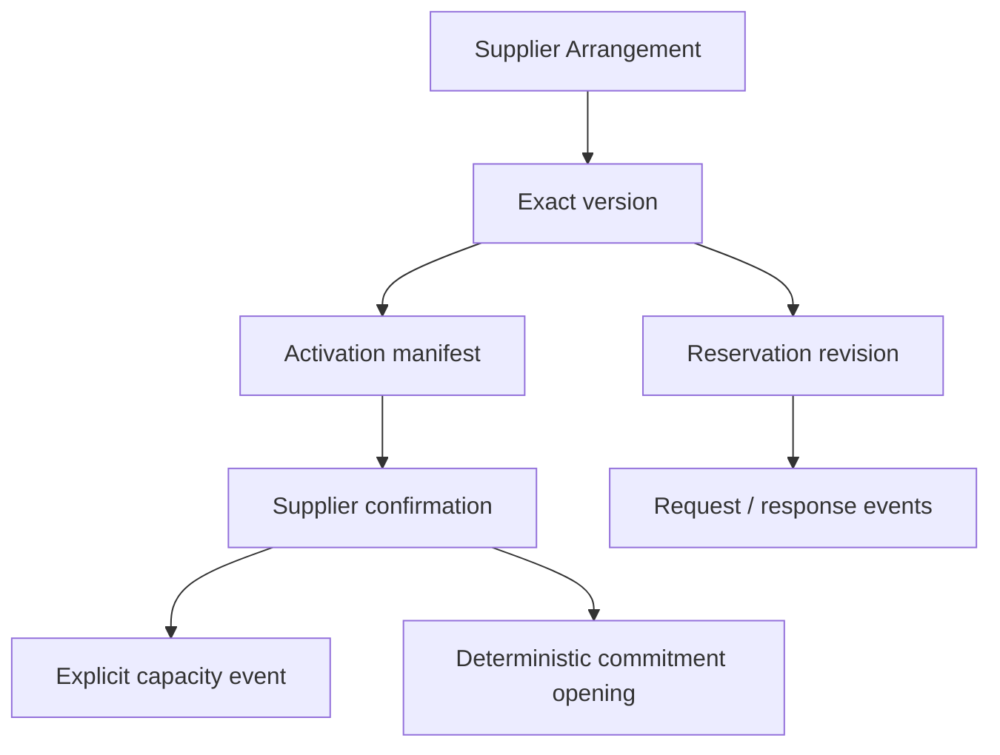

# M3D — Arrangement activation, Reservations, and confirmations

**Status:** Shipped. Merged to `main` on 2026-09-17 through M3D.1–M3D.6 implementation PRs (#73–#82). Remediation PRs closed the post-ship review findings. [M3D.7](m3d7-activated-definition-immutability.md) ships the activated exact-version definition immutability remediation in Rails and PostgreSQL. [M3D.8](m3d8-activation-reservation-product-quality.md) ships activation and Reservation product-quality remediation. [M3D.9](m3d9-reservation-integrity.md) ships Reservation integrity remediation (confirmed quantity basis, successor revision/request revalidation, and event↔outcome compatibility). This document remains the M3D contract. It is not authority for M3E Arrangement ending, full commitment disposition, Deadlines, exposure, or later commercial records.

**Parent:** [M3 — Supplier planning](m3-supplier-planning.md), Accepted and amended for shipped M3B and M3C and Accepted M3D authority.

**Architecture:** [ADR 0008](../adr/0008-supplier-arrangement-version-topology.md), [ADR 0009](../adr/0009-supplier-contracting-and-service-provider-roles.md), [ADR 0010](../adr/0010-supplier-capacity-ledger-and-projection.md), and [ADR 0011](../adr/0011-supplier-cost-definitions-and-forecast-evaluation.md) remain authoritative. Accepted [ADR 0012](../adr/0012-arrangement-activation-reservations-and-confirmations.md) governs this slice.

**Prerequisites:** M3A, M3B, and M3C are shipped on `main`. [M3D.0](m3d0-planning-workspace-compression.md) must be Accepted and shipped before any production activation, Reservation, confirmation, effective-capacity, or commitment-opening implementation begins; there is no waiver. Current migrations, `db/structure.sql`, models, services, routes, tests, and interface contract must then be reviewed, and no unresolved M3C remediation may make activation readiness unreliable.

## Goal

Let Staff turn one complete draft Supplier Arrangement version into the governing immutable version without confusing Agency activation, Supplier confirmation, capacity, cost forecasts, commitments, Supplier Obligations, or Client demand.

Let Staff prepare and operate group- and occurrence-level Supplier Reservations under an Arrangement, preserve partial Supplier responses and exact governing-version history, and record explicit capacity or deterministic commitment consequences without duplicate entry or hidden inference.

The common experience must remain operationally calm. The domain creates several durable records, but Staff work through four coherent workflows rather than managing persistence artifacts individually:

1. activate an Arrangement;
2. create and activate a successor;
3. request a Supplier booking; and
4. record a Supplier response.

## In scope

- First Arrangement activation and atomic permanent Departure return-to-draft latch.
- Immediate successor-draft creation from the current activated version.
- Successor activation and atomic predecessor supersession.
- Immutable activation manifest with exact cost selections and capacity entries.
- Supplier confirmation evidence recorded distinctly but atomically with activation.
- Confirmed-without-identifier activation path.
- Explicit Staff coverage attestation and conditional provisional-estimate acknowledgment.
- First establishment event/projection for each newly activated numeric Capacity Pool.
- Staff-facing post-activation M3B event, reconciliation, and permitted override workflows.
- Stable Supplier Reservation identity, exact-version revisions, ordered scope rows, request events, scope-level response events, and derived current state.
- Planned Reservations against an eligible draft version; Supplier-facing request only after that exact version activates.
- Explicit Reservation revision onto a successor; no automatic retargeting.
- Immutable Supplier confirmation evidence reusable through explicit coverage links.
- Qualified Supplier-issued identifiers, Arrangement search, duplicate warnings, and explicit create-anyway/reuse behavior.
- Optional explicit atomic capacity event from a Reservation confirmation.
- Version-owned deterministic commitment-trigger definitions.
- First-class commitment openings created only as explicit deterministic confirmation consequences.
- Derived unresolved-trigger condition for later M3E needs-attention handling.
- Minimal ordinary Supplier-inactivation blockers for every unresolved commitment M3D can open, plus recovery extensions for Reservations and confirmations.
- M3D.3 remediation of shipped M3A–M3C draft commands for successor-compatible exact-version selection before successor editing is exposed.
- HTTP, UI, authorization, tenancy, audit, idempotency, concurrency, query, accessibility, responsive, scenario, and regression proof.

## Out of scope

- Normal Arrangement ending; M3E owns it after the complete commitment blocker catalog exists.
- Arrangement `cancelled`; entire-agreement cancellation remains M7 Cancellation Case work.
- Definition-driven commitment opening beyond M3D confirmation triggers, release, satisfaction, supersession, cancellation, or other post-opening disposition.
- Deposit requirements, Deadline rules/workflow, qualified exposure reporting, or the formal needs-attention catalog.
- Supplier Obligations, invoices, Payments, commission settlement/receipt, accounting posting, or cash state.
- Client Trips, Travelers, Holds, Allocations, Assignments, occupancy, sales availability, or fulfillment.
- Reservation consumption of capacity or automatic conversion between Reservation quantity and supply.
- Client-specific Supplier bookings or standalone Reservations without an M3 Arrangement.
- Ordinary Arrangement or Reservation creation after the Departure is departed.
- Historical late-entry activation or previously undocumented booking correction after departure.
- Scheduled, future-effective, or backdated Arrangement activation.
- File uploads, Active Storage, Communications, email delivery, Supplier portal/API integration, or credential storage.
- Supplier Location attachment.
- Foreign-currency terms, FX, or functional-currency conversion.
- A formula/expression language for commitment triggers.
- A generated Arrangement or Reservation reference namespace.
- Changes to `SearchDepartures`.
- Normalized generic evidence, generic event, generic identifier, or polymorphic ownership frameworks for unrelated domains.

## Locked boundaries

1. First and successor activation require `Departure.status == active`.
2. Activation is one atomic command; no partial manifest, confirmation, establishment event, commitment, or lifecycle transition may survive failure.
3. Agency activation and Supplier confirmation are distinct facts recorded atomically.
4. Supplier confirmation is required for ordinary activation. Administrator override cannot fabricate confirmation.
5. Activation becomes governing immediately when the transaction succeeds. M3D does not schedule or backdate it.
6. First activation permanently prevents `ReturnDepartureToDraft`, even if every Arrangement later becomes terminal.
7. An activated version is immutable. Corrections require a successor.
8. At most one editable draft and one current activated version exist per Arrangement under ADR 0008.
9. The activation manifest references the exact version graph; it does not duplicate formulas or definitions.
10. Each cost source selects one complete ready contracted definition, otherwise one complete ready estimate. Stages never blend.
11. Ready estimates may support activation only after explicit Staff acknowledgment and remain visibly provisional.
12. First activation of each numeric Pool creates exactly one `established` event. Carried Pools never receive another establishment event.
13. Activation creates no Client Hold, Allocation, Assignment, sale, Supplier Obligation, Payment, or fulfillment fact.
14. A Reservation is a specific Supplier-facing booking under an Arrangement, never another representation of the Arrangement itself.
15. One Reservation may contain multiple precise scope rows. Each row targets one exact-version context.
16. A planned Reservation is internal intent. It may not be requested until its exact Arrangement version activates.
17. Supplier responses may resolve Reservation scopes independently. Immutable events are authoritative; header state is derived.
18. Successor activation never silently retargets a Reservation, confirmation, capacity event, commitment, or identifier.
19. A confirmed quantity never changes capacity implicitly. Any capacity consequence is an explicit named M3B event.
20. A confirmation opens a commitment only through a complete activated trigger definition and a previewed atomic effect.
21. Estimated cost is never authoritative for a monetary commitment.
22. Confirmation never posts a Supplier Obligation.
23. Supplier-issued identifiers are qualified facts and are not globally unique by default.
24. Internal manifest, linkage, lineage, and projection records do not become separate routine Staff chores.
25. M3D introduces no new permission key.
26. Accepted-and-shipped M3D.0 is an unconditional gate before any production activation, Reservation, confirmation, effective-capacity, or commitment-opening implementation.

## Topology



The diagram shows provenance, not a required generic polymorphic association. Database relationships remain explicit and same-owner constrained.

## Activation readiness

Activation operates over one consistent, locked exact-version graph. It fails closed unless every applicable check succeeds.

### Departure and Arrangement

- Agency and actor remain active and authorized.
- Departure is `active`, not `draft` or `departed`.
- Arrangement is either never-activated `draft` for first activation or `active` with the target as its sole successor draft.
- Contracting Supplier is active.
- Every newly selected explicit Service Provider, charging Supplier, and supplying Supplier is active and same-Agency.
- No forced-inactive Supplier remains on a dependency that activation would make current.
- Submitted Arrangement/version optimistic locks match after pessimistic locks and rechecks.

### Structure

- The version contains at least one retained Item.
- Required Item, Occurrence, Resource, provider, schedule, and time-zone facts satisfy M3A.
- Each current or future non-cancelled Occurrence resolves one effective Provider under ADR 0009.
- Draft-only removal and retained-identity rules remain valid.

### Capacity readiness

- Every Item explicitly declares `managed` or `unmanaged`.
- Every managed Item satisfies M3B pair-classification and Pool completeness.
- Every newly activated numeric Pool has a positive proposed opening quantity and complete Supplier evidence or valid M3B Administrator override.
- The Pool supplying Supplier still equals the target version's effective Provider.
- A carried Pool preserves semantic identity and its existing ledger.
- An omitted numeric Pool has zero effective quantity, no pending event, and clean reconciliation.
- No activation action infers a quantity for `on_request` or `externally_managed` Pools.

### Cost

- M3C reports the target version cost-complete from a consistent graph snapshot.
- Every retained Item has Item-level cost coverage.
- Every declared source selects a valid complete ready stage.
- Charging Suppliers remain active and eligible.
- Selected definitions equal the Departure operating currency.
- Staff see and attest to the complete source list because M3C cannot infer an omitted real-world source.
- If any source selects an estimate, Staff explicitly acknowledge the listed provisional sources.

### Commitment-trigger readiness

- Every declared trigger definition has an allowed trigger, exact scope, explicit `committed_supplier_id`, closed authority shape, and complete provenance.
- The committed Supplier is the contracting Supplier, an applicable effective Provider, or a charging Supplier named by the contracted monetary authority.
- Monetary fixed/derived authority uses a ready contracted definition/component or explicitly requires a Supplier-confirmed amount.
- A trigger never references an estimate as monetary authority.
- Staff attest that the trigger list covers known confirmation-triggered guarantees/commitments and that omission is not represented as zero exposure.
- Every `arrangement_confirmation` trigger fully resolves during activation or activation fails. Coverage attestation cannot coexist with an unresolved activation trigger.

### Confirmation readiness

- Evidence kind/date, Supplier/channel provenance, and safe reference note are complete.
- Arrangement activation confirmation is issued only by the Arrangement contracting Supplier.
- Reservation response confirmation is issued only by the Reservation's immutable booking Supplier.
- A capacity consequence additionally requires compatibility with the supplying Supplier of its Pool.
- A commitment opening additionally requires compatibility with the trigger's explicit committed Supplier.
- No delegated issuer or generic eligible-Supplier exception exists; any delegation requires a later explicit contract.
- An external identifier is qualified by issuer/type/context, or a confirmed-without-identifier reason is present.
- Cross-owner identifier matches complete the duplicate-warning workflow before mutation.
- A command may create new immutable confirmation evidence or explicitly link existing immutable evidence only after full ownership, exact-version, Supplier, issuer, and coverage checks. Identifier or timestamp equality alone never permits reuse.

## Activation transaction

`ActivateSupplierArrangementVersion` performs one transaction:

1. acquire the durable idempotency slot under the declared lock order;
2. lock/recheck Agency, actor, affected Suppliers, Departure, Arrangement, target version, predecessor version when any, and the complete applicable graph;
3. for successor activation, lock and validate both predecessor and target versions against their lifecycle constraints and uniqueness invariants;
4. run readiness against the locked rows rather than trusting a prior GET preview;
5. create or link the immutable Supplier confirmation under the evidence-reuse checks and create any new/reused identifier links;
6. create the activation manifest and exact cost/capacity entries;
7. use already-locked internal M3B operations to append one `established` event and create/catch up the projection for every newly activated numeric Pool;
8. explicitly evaluate every activation-confirmation trigger and, through an already-locked internal opening operation, create every required commitment opening;
9. on successor activation, mark the predecessor version `superseded`;
10. mark the target version `activated`;
11. set the Arrangement `active` and point it to the current governing version;
12. persist the permanent Departure downstream-history latch in the same lock boundary used by `ReturnDepartureToDraft`;
13. write one Arrangement-subject success audit event with safe identifiers and consequence counts; and
14. finalize the durable idempotency result.

The activation transaction must not invoke public M3B or commitment commands that reacquire locks or emit independent success audits. Capacity establishment and commitment opening use already-locked internal operations under this one transaction. The predecessor-superseded, target-activated, and governing-pointer changes roll back if any later consequence fails. Activate-then-supersede is forbidden. A single-statement transition is permitted only when the one-current-activated unique index observes a valid final state.

Same-key/same-payload retry returns the original activation and all original result references without a second event, commitment, transition, or audit. Same key with a different payload returns `conflict`.

The confirmation and activation timestamps are recorded separately but may share the same application instant. Neither timestamp is staff-editable in the ordinary path.

## Activation manifest

The manifest is append-only and belongs directly to Agency, Departure, Arrangement, and exact version.

It records:

- first versus successor activation;
- predecessor version and activation where applicable;
- actor and activated instant;
- Supplier confirmation;
- coverage-attestation version/fingerprint;
- provisional-cost acknowledgment when required;
- cost-selection entries;
- capacity entries; and
- created commitment openings.

One cost-selection entry references the exact source and selected definition and stores only selection meaning (`contracted` or `provisional_estimate`), not copied component data or derived totals.

One capacity entry references each included Pool definition. For a numeric Pool newly established by this activation it also references the created establishment event. Carried numeric and nonnumeric Pools retain a manifest entry without a duplicate event.

Every manifest table is immutable in Rails and PostgreSQL.

## Successor drafts

### `CreateSupplierArrangementSuccessor`

- Requires an active Arrangement with one current activated version, an active Departure, and no existing draft version.
- Allocates the next positive monotonic version number under the Arrangement lock.
- Copies the current version graph transactionally into independent draft definitions.
- Reuses stable Item, Occurrence, Resource, and Pool identities for continued concepts.
- Copies Item, Occurrence, Resource, pair, Pool, cost source/definition/component/base, participant-category, usage-assumption, occupancy-profile, and commitment-trigger definitions with explicit predecessor lineage.
- Copies no activation, confirmation, capacity event/projection, reconciliation, Reservation event, commitment, or audit history.
- Carries cost readiness only when the copied fingerprint and all referenced semantics remain equivalent.
- Writes `supplier_arrangement.successor_created` once.

The command does not copy or retarget Reservations. The UI lists current Reservations separately and offers explicit revision commands.

### Successor edits and activation

Shipped M3A–M3C commands currently assume `version_number == 1`; they are not successor-compatible. M3D.3 must remediate every affected command before successor editing is exposed:

- resolve the Arrangement's sole editable draft instead of selecting `version_number == 1`;
- distinguish an initial-draft Arrangement from an active Arrangement with a successor draft;
- route every M3A–M3C mutation through the exact selected draft version;
- evaluate forecasts and readiness against that exact version;
- preserve shipped version-1 behavior before a successor exists; and
- prove activated and superseded definitions remain immutable.

After that remediation, a consequential copied-cost edit invalidates affected readiness. Removing a carried Pool uses ADR 0010 omission blockers. Activation requires fresh coverage attestation and a new contracting-Supplier confirmation even when all definitions remain unmodified.

Abandoning a successor retains the version and leaves the predecessor activated. Existing M3A abandonment semantics remain authoritative.

## Supplier Reservations

### Stable identity and revision

`SupplierReservation` is the stable identity for one Supplier-facing booking. It belongs immutably to one Agency, Departure, Arrangement, and booking Supplier. At creation, the booking Supplier must be the contracting Supplier or an applicable effective Provider within the exact version and is immutable; a different counterparty requires another Reservation.

`SupplierReservationRevision` is the exact Supplier-facing definition under one Arrangement version. At most one editable planned revision exists at a time. Revision numbers are positive, monotonic, and never reused.

A revision is:

- `planned` while editable and not sent;
- `requested` after its first immutable request event;
- `superseded` when an explicit later revision is requested; or
- `abandoned` when unpublished preparation is intentionally discarded.

Requested revisions are immutable. Supplier responses append events; they do not edit the revision.

### Scope rows

Each revision has one or more ordered scope rows. A row declares one target kind:

- `arrangement`;
- `item`;
- `occurrence`;
- `resource`; or
- `capacity_pool`.

Explicit nullable FKs plus named check constraints enforce the target shape. Every target repeats applicable Agency, Departure, Arrangement, version, and Item/Occurrence/Resource provenance so the relationship chain is enforceable at the database boundary.

A scope may store:

- a short label/description;
- optional positive whole requested quantity;
- optional `resource_units` or `traveler_positions` basis compatible with a referenced Pool; and
- manual order.

Quantity is Supplier-request context, not supply consumption or Client demand.

### Request

`RecordSupplierReservationRequest` requires the governing version to be currently activated. It records:

- exact revision and scope fingerprint;
- occurred/sent time and recorded time;
- channel;
- Supplier contact identity and safe contact snapshot when used;
- concise request reference/context note;
- actor; and
- durable idempotency identity.

No email or Communication is created. The command records that an external request occurred.

### Response and partial outcomes

`RecordSupplierReservationResponse` appends one immutable response event and one or more scope outcomes. Outcomes are:

- `confirmed`, which may carry a compatible quantity different from the requested quantity;
- `declined`; or
- `counterproposed`, which retains response provenance but does not confirm scope, change capacity, open a commitment, or constitute confirmation evidence. Acceptance requires an explicit Reservation revision followed by a later confirmation.

Each outcome may include a concise Supplier note. Decline requires a reason. Every confirmed outcome requires immutable Supplier confirmation evidence created by the command or an explicit link to existing evidence after full ownership, exact-version, immutable booking-Supplier issuer, and scope-coverage checks. A counterproposal carries no confirmation-evidence link.

The form defaults to all pending scopes. Staff expose per-scope controls only when the Supplier response differs by scope.

### Revision onto a successor

`CreateSupplierReservationRevision` explicitly copies selected current scope rows into the Arrangement's current activated or sole successor draft version. Staff adjust the draft revision before requesting it. Requesting the new revision marks the prior requested revision `superseded`; it does not rewrite prior events.

An unpublished planned revision may be updated or abandoned. It may not silently follow a newly activated successor.

### Withdrawal and cancellation

- `WithdrawSupplierReservation` retracts pending requested scopes before Supplier confirmation.
- `CancelSupplierReservationScopes` records Agency cancellation of previously confirmed scopes.

Both require affected scope rows, actor, time, reason, and idempotency. Neither creates a capacity release, commitment disposition, refund, Obligation, or Cancellation Case. M3E/M7 later govern those independent consequences.

### Derived current state

The current Reservation state is a rebuildable projection from the current revision and latest scope outcomes. Presentation may be:

- `planned`;
- `requested`;
- `partially_confirmed`;
- `confirmed`;
- `declined`;
- `withdrawn`; or
- `cancelled`.

Mixed fully resolved confirmed/declined outcomes remain `partially_confirmed` with explicit counts; the UI must not imply unresolved scopes merely from that label. Counterproposed scopes are exposed distinctly and never forced into `partially_confirmed`. Lists show confirmed, counterproposed, declined/cancelled, and pending scope counts.

Projection repair never writes a business event or success audit. Mutation commands lock and catch up the projection before relying on it.

## Supplier confirmation evidence and identifiers

### Confirmation persistence

One immutable confirmation row stores applicable ownership, confirming Supplier, evidence kind/date, channel, reference note, optional confirmed-without-identifier reason, actor, and recorded time. Activation evidence permits only the Arrangement contracting Supplier as issuer. Reservation response evidence permits only the immutable booking Supplier as issuer.

The initial evidence-kind catalog reuses compatible M3B meanings where possible and adds only demonstrated confirmation channels. Free-form `other` requires a short label. File attachment is not implemented.

Explicit link tables connect a confirmation to:

- one Arrangement activation or one Reservation response origin;
- covered Reservation scopes;
- capacity events; and
- commitment openings.

The database rejects cross-Agency, cross-Departure, cross-Arrangement, cross-version, or incompatible Supplier coverage. Capacity links additionally require the Pool supplying Supplier; commitment links require the opening's explicit committed Supplier. There is no delegated-issuer escape.

A confirmation command may create new evidence or link existing immutable evidence only after full ownership, exact-version, Supplier, issuer, and coverage checks. Activation, Reservation responses, and every coverage-link path apply the same checks. Matching identifiers or timestamps alone never establish reusable evidence.

### Supplier-issued identifier

An immutable identifier fact belongs to one stable Arrangement or Reservation and records:

- Supplier and issuer context;
- type (`group_number`, `reservation_number`, `confirmation_number`, `policy_number`, or `other`);
- display and normalized values;
- other-type label when needed; and
- first evidence provenance.

Correction appends a replacement/supersession fact rather than rewriting evidence. The replacement row sets `supersedes_id` to the prior current row; the prior row is stamped `superseded_at` by a database trigger on successor insert, not by application UPDATE. Current lookups use `superseded_at IS NULL` (equivalently: no successor references the row). Search uses current and retained aliases where safe and labels superseded values.

Duplicate candidate lookup is Agency-scoped and access-safe. A strong match on another owner requires a short-lived create-anyway token bound to normalized fields and candidate fingerprint. Same-key replay is idempotent. Candidate-set change returns `conflict` and requires review again.

No database constraint assumes global uniqueness across owners. Within one stable owner, identical active type/context/value is idempotent reuse rather than a second row.

## Explicit capacity controls

M3D exposes the shipped M3B engine only after real activation exists.

Staff-facing ordinary commands include:

- increase;
- Supplier-approved release;
- reinstatement;
- Supplier withdrawal;
- upward/downward compensating correction;
- reconciliation observation and resolution; and
- projection repair/rebuild where operationally appropriate.

Evidence-backed actions use `manage_departures`. M3B override paths use `override_supplier_planning_terms` and a required reason. Projection repair/rebuild is presented as recovery/maintenance, not ordinary inventory editing.

Every form labels the measure **Current Supplier capacity**, never available, remaining, held, allocated, or sold. Reservation confirmations may propose a capacity event, but Staff must explicitly select and preview that consequence.

## Commitment trigger definitions

Trigger definitions are exact-version draft configuration and become immutable at activation.

### Trigger catalog

- `arrangement_confirmation`
- `reservation_confirmation`

### Authority-shape catalog

- `fixed_quantity`
- `confirmed_quantity`
- `fixed_contracted_amount`
- `confirmed_amount`
- `contracted_unit_rate_times_confirmed_quantity`

Each trigger repeats direct ownership and exact applicable scope. Quantity bases are whole-number and closed to the M3 capacity basis catalog where applicable. Money uses `bigint` minor units and the Departure operating currency. Contracted monetary references point to named `supplier_charge` amount or unit-rate components in exact ready contracted definitions. Expected commission and informational allocation are never commitment authority.

Each trigger has an explicit `committed_supplier_id`. That Supplier must be the Arrangement contracting Supplier, an applicable effective Provider, or the charging Supplier named by the trigger's contracted monetary authority. Eligibility, confirmation compatibility, and cost authority are checked together when opening a commitment.

The trigger editor uses guided presets. It is not an expression builder. If no trigger applies, Staff do not create one; activation's coverage attestation confirms that known confirmation-triggered commitments were considered.

Any trigger edit invalidates activation readiness for the version. Copied unmodified triggers retain predecessor lineage but require fresh overall coverage attestation.

## Confirmation-triggered commitment core

`SupplierCommitment` in M3D is an immutable opening fact created only by an activation or Reservation confirmation command.

It records:

- direct Agency, Departure, Arrangement, and exact version ownership;
- applicable Item, Reservation, revision/scope, Occurrence, Resource, Pool, or cost source where relevant;
- commitment type and description;
- authoritative quantity and basis and/or amount/currency;
- calculation/input snapshot;
- trigger definition;
- immutable committed Supplier snapshot copied from the trigger;
- Supplier confirmation;
- actor, opened time, and idempotency result.

An M3D commitment has no Staff-editable status or disposition route. It is open by virtue of the opening fact. M3E must add explicit lifecycle history and current-state projection without rewriting the opening.

Every `arrangement_confirmation` trigger must fully resolve during activation. An unresolved activation trigger fails activation, and coverage attestation cannot claim completeness beside one.

A `reservation_confirmation` may preserve a truthful Supplier confirmation when the response omits an externally authoritative input. It creates no placeholder or zero commitment and exposes a derived unresolved-trigger condition for M3E. Failure to create a commitment when all required inputs are complete fails the enclosing transaction. Estimates never provide monetary commitment authority.

## Persistence contract

Names may be refined during implementation only when semantics and constraints are preserved.

### Existing-table amendments

`supplier_arrangements` adds a nullable current governing version FK. It is required when status is `active`; M3E decides whether ended Arrangements retain it. Same Arrangement/Departure/Agency provenance is database-enforced.

`supplier_arrangement_versions` adds activation/supersession timestamps and predecessor-copy lineage as needed. Lifecycle timestamp pairs and immutable activated/superseded ownership are database-enforced.

`departures` adds or derives one permanent Arrangement-activation latch used by `ReturnDepartureToDraft`. If derived from immutable activation rows, the command must use an indexed existence query under the same locked Departure boundary; no mutable boolean may drift.

Existing definition tables add `copied_from_id` only where necessary to preserve exact successor lineage and readiness carry-forward. Do not add live-inheritance FKs.

### New record families

| Record | Purpose |
| --- | --- |
| `supplier_arrangement_activations` | Immutable activation manifest header. |
| `supplier_arrangement_activation_cost_selections` | Exact source/definition selected at activation. |
| `supplier_arrangement_activation_capacity_entries` | Exact Pool definition included and optional establishment event. |
| `supplier_confirmations` | One immutable Supplier evidence fact. |
| `supplier_confirmation_*_links` | Explicit compatible coverage for identifiers, scopes, capacity events, and commitments. |
| `supplier_issued_identifiers` | Qualified stable-owner Supplier identifier facts and supersession lineage. |
| `supplier_reservations` | Stable booking identity. |
| `supplier_reservation_revisions` | Exact-version editable-then-frozen booking definition. |
| `supplier_reservation_scopes` | Ordered precise targets and optional requested quantity. |
| `supplier_reservation_events` | Immutable request, response, withdrawal, cancellation, and revision history. |
| `supplier_reservation_event_scope_outcomes` | Scope-level outcome/quantity for one event. |
| `supplier_reservation_projections` | Rebuildable derived current state and counts. |
| `supplier_commitment_trigger_definitions` | Exact-version deterministic trigger configuration. |
| `supplier_commitments` | Immutable confirmation-triggered opening facts only. |

Every tenant row carries direct `agency_id`. Operational rows also carry direct `departure_id`, `supplier_arrangement_id`, and exact version where applicable. Composite FKs prove the complete owner chain. Request parameters never establish tenancy.

Application-owned primary keys are UUIDv7 with Rails preassignment and PostgreSQL `uuidv7()` defaults. Timestamps are `timestamptz`. Money and rates follow ADR 0001/M3C. No float, JSON document store, generic polymorphic target, `citext`, `pg_trgm`, or new `btree_gist` use is introduced.

Immutable history rejects update/delete in Rails and PostgreSQL. Mutable drafts and rebuildable projections use optimistic locking where concurrent edits matter.

## Commands

### Activation and successor commands

- `ActivateSupplierArrangementVersion`
- `CreateSupplierArrangementSuccessor`
- existing `AbandonSupplierArrangement` extended for successor-planned Reservation cleanup under the accepted topology

### Reservation

- `CreateSupplierReservation`
- `UpdatePlannedSupplierReservation`
- `AbandonPlannedSupplierReservation`
- `RecordSupplierReservationRequest`
- `RecordSupplierReservationResponse`
- `CreateSupplierReservationRevision`
- `WithdrawSupplierReservation`
- `CancelSupplierReservationScopes`
- `RecordExistingConfirmedSupplierReservation` as a compressed active-Arrangement path
- `RebuildSupplierReservationProjection`

### Confirmation and identifiers

Confirmation creation is internal to activation/response commands; there is no detached create route. Identifier reuse/create and duplicate confirmation occur inside those previewed commands.

### Capacity commands

Expose the existing M3B event/reconciliation/rebuild commands through accepted routes and forms without changing their domain semantics.

### Commitment-trigger commands

- `CreateSupplierCommitmentTriggerDefinition`
- `UpdateSupplierCommitmentTriggerDefinition`
- `RemoveSupplierCommitmentTriggerDefinition`

There is no public `CreateSupplierCommitment` command in M3D. Activation and Reservation confirmation invoke the shared deterministic opening service inside their transaction after all owning locks are held.

## State-dependent behavior

| Departure / Arrangement state | Allowed M3D behavior |
| --- | --- |
| Draft Departure | Prepare existing allowed draft Arrangement/Reservation facts only under prior contracts; no activation, request, confirmation, effective capacity, or commitment. |
| Active Departure + initial draft Arrangement | Edit planning, prepare planned Reservations, activate or abandon. |
| Active Departure + active Arrangement | Operate Reservations/capacity, create one successor, record Supplier responses. |
| Active Departure + successor draft | Continue current-version operations; edit/activate/abandon successor; explicitly prepare Reservation revisions. |
| Departed Departure | No new Arrangement, successor, or Reservation. Existing requested Reservations may record Supplier responses/corrections and dependency-reducing resolution; no activation. |
| Abandoned Arrangement/version | Read-only retained history. |
| Superseded version | Read-only retained definitions and events; no new ordinary request under that version. |
| Forced-inactive Supplier dependency | Only the accepted corrective, historical-response, or dependency-reducing allow-list. |

## Supplier lifecycle integration

M3D extends the shipped `ChangeSupplierStatus` command; it does not create another Supplier lifecycle path.

Ordinary inactivation is blocked by current nonterminal Reservations where the Supplier is booking/confirming counterparty, by activation races that would make the Supplier current, and by every unresolved commitment M3D can open, keyed by the immutable committed Supplier snapshot. Scope-level terminal outcomes determine whether a partially resolved Reservation remains a blocker.

Historical confirmations and terminal withdrawn/declined/cancelled Reservation scopes do not block. A confirmed future service and every unresolved M3D commitment remain current blockers until later accepted disposition makes them terminal. M3D does not infer fulfillment.

Forced inactivation preserves every activation, Reservation, confirmation, identifier, capacity event, and commitment opening. It creates no cancellation, release, withdrawal, reassignment, or disposition. Existing requested Reservations may record truthful Supplier responses; new/expanded requests and new Supplier selection are prohibited. Existing M3B recovery commands remain available under their exact allow-list. M3E owns definition-driven / source-shaped commitment opening and the disposition and terminal rules that cease commitment blocking.

Reactivation restores only the Supplier and no M3D state.

## Authorization

| Capability | Permission | Administrator | Staff | Viewer |
| --- | --- | --- | --- | --- |
| View Arrangements, manifests, Reservations, confirmations, capacity, commitments | `view_departures` | Yes | Yes | Yes |
| Ordinary activation, successor, Reservation, confirmation, trigger-definition work | `manage_departures` | Yes | Yes | No |
| Evidence-backed capacity events/reconciliation | `manage_departures` | Yes | Yes | No |
| M3B evidence override | `override_supplier_planning_terms` + reason | Yes | No | No |
| Force Supplier inactivation | `force_inactivate_supplier_with_dependencies` + reason | Yes | No | No |

Activation with provisional estimates is not an override and does not require Administrator authority.

## Domain errors

Reuse `AgencyCommand` codes:

| Code | Use |
| --- | --- |
| `unauthorized` | Missing permission, inactive actor/Agency, or forbidden Viewer mutation. |
| `not_found` | Identifier unavailable through Current Agency and complete owner chain. |
| `invalid` | Malformed evidence/scope/quantity/trigger fields or failed completeness. |
| `invalid_state` | Departure/Arrangement/version/Reservation/Supplier state forbids the command. |
| `conflict` | Stale lock, same-key different payload, a differing duplicate-candidate set, or conflicting Supplier response. |
| `dependency_exists` | Pool omission, draft removal, or Supplier transition blocked by retained/current facts. |

Activation readiness returns structured blocker codes and safe paths, not only a generic base error. GET previews are advisory; POST commands re-evaluate under lock.

## Lock order and concurrency

After pre-transaction authorization:

1. Agency; recheck active.
2. Actor reloaded through Agency; recheck active and permission.
3. Affected Suppliers in UUID order.
4. Departure; recheck lifecycle and return-to-draft/departed boundary.
5. Supplier Arrangement.
6. Predecessor/current version, then target draft version in version-number/UUID order.
7. Stable Item, Occurrence, Resource identities and exact definitions in parent/UUID order.
8. Cost sources, definitions, components, bases, assumptions, and profiles in stable order.
9. Capacity pairs, Pools, Pool definitions, events, projections, and reconciliations in stable order.
10. Reservation, revision, scopes, projection, then existing events in stable order.
11. Trigger definitions and existing commitments in stable order.
12. Command idempotency row after its owning aggregate, except declared create-command slot exceptions.
13. Insert confirmation, manifest, events, commitments, links, audit, and result rows after existing locks.

Nested services receive already-locked records and may not reacquire an earlier lock.

Required genuine multi-connection races include:

- first activation versus `ReturnDepartureToDraft`;
- first/successor activation versus `MarkDepartureDeparted`;
- activation versus Supplier inactivation;
- two first activations and two successor activations;
- successor creation versus successor creation/abandonment;
- successor activation versus new use of predecessor version;
- cost readiness/assumption mutation versus activation;
- capacity definition/event/reconciliation mutation versus activation;
- new Pool establishment versus same-Pool event insertion;
- Pool omission versus future event/projection catch-up/reconciliation;
- Reservation request versus successor activation;
- Reservation revision versus response to predecessor revision;
- two responses affecting the same scope;
- partial response versus withdrawal/cancellation;
- confirmation replay versus conflicting evidence/outcomes;
- confirmation capacity event versus direct capacity event;
- confirmation commitment opening versus same confirmation replay;
- identifier duplicate candidate change versus confirmation;
- Supplier inactivation versus Reservation create/request/response;
- projection rebuild versus Reservation event insertion; and
- same-key retry versus first execution for every durable create/consequence command.

## Idempotency

Reuse `AgencyCommandIdempotencyKey` with command-specific scopes. Payload fingerprints include every consequential target, evidence fact, acknowledged warning, selected scope, proposed capacity event, and commitment consequence.

Multi-result commands associate the key with a durable command-result/manifest root from which every created record is recoverable. Do not store a JSON list as the only authoritative result.

## Audit

Continue using `SupplierArrangement` as audit subject for activation, successor, trigger-definition, and capacity actions. The slice that first writes Reservation-consequential audit adds `SupplierReservation` to the closed audit subject catalogs in the same change.

Proposed actions include:

- `supplier_arrangement.activated`
- `supplier_arrangement.successor_created`
- `supplier_arrangement.successor_activated`
- `supplier_arrangement.commitment_trigger_created`
- `supplier_arrangement.commitment_trigger_updated`
- `supplier_arrangement.commitment_trigger_removed`
- `supplier_reservation.created`
- `supplier_reservation.updated`
- `supplier_reservation.abandoned`
- `supplier_reservation.requested`
- `supplier_reservation.response_recorded`
- `supplier_reservation.revised`
- `supplier_reservation.withdrawn`
- `supplier_reservation.scopes_cancelled`

Capacity commands retain their shipped M3B action meanings. Audit payloads use stable safe identifiers, before/after summaries where applicable, consequence IDs/counts, acknowledgment flags, and no sensitive contact value or document content. Immutable domain records remain authoritative; `AuditEvent#details` is not the manifest or response history.

## Routes and HTTP semantics

Names may follow Rails conventions, but the route topology must preserve complete ownership. Proposed surfaces:

```text
GET  /departures/:departure_id/arrangements/:arrangement_id/activation
POST /departures/:departure_id/arrangements/:arrangement_id/activation
POST /departures/:departure_id/arrangements/:arrangement_id/successor

GET  /departures/:departure_id/arrangements/:arrangement_id/reservations
GET  /departures/:departure_id/arrangements/:arrangement_id/reservations/new
POST /departures/:departure_id/arrangements/:arrangement_id/reservations
GET  /departures/:departure_id/arrangements/:arrangement_id/reservations/:id
GET/PATCH planned reservation edit
POST reservation request
POST reservation response
POST reservation revision
POST reservation withdrawal
POST reservation scope cancellation

GET/POST/PATCH/DELETE commitment-trigger definitions under exact draft version context
GET/POST capacity event and reconciliation actions under the owning Pool
GET  /departures/:departure_id/arrangements/search
```

Use GET for previews/forms, POST for consequential events, PATCH for mutable planned definitions/projections only, and DELETE only for eligible unpublished draft removal. Cross-Agency IDs return 404. Expected command failures preserve submitted values, warnings, and error-summary focus.

## Interface contract

### Interaction compression invariant

Domain records and transitions remain explicit, but the interface combines related commands into previewed workflows. Staff never manually manage activation manifests, evidence-coverage rows, readiness lineage, idempotency records, or derived Reservation projection rows.

### Activate Arrangement

One page shows:

- blocker summary first;
- structure and provider summary;
- managed/unmanaged capacity summary and establishment consequences;
- complete cost-source list and selected stages;
- conditional provisional-estimate acknowledgment;
- commitment-trigger summary and predicted openings/unresolved inputs;
- Supplier confirmation evidence and identifier duplicate warnings; and
- one final **Activate arrangement** action.

Do not make Staff visit separate manifest, confirmation, capacity, and commitment forms to activate.

### Create successor

One action copies the current version. The successor workspace emphasizes modified/incomplete facts and readiness invalidated by edits. Unmodified copied facts remain collapsed but inspectable. Current Reservations remain listed under the predecessor with an explicit **Revise onto version N** action.

### Request Supplier booking

Default to one whole-Arrangement, Item, or Occurrence scope based on entry point. Additional scope rows use progressive disclosure. Common single-scope requests do not require interacting with a table builder.

Provide **Create planned reservation** and **Create and record request sent** paths. Recording a request captures external communication context; it does not send email.

### Record Supplier response

Default all pending scopes to the selected response. Reveal per-scope outcomes/quantities for partial responses. Show conditional, prefilled-but-uncommitted capacity event suggestions only where a compatible Pool exists. Show deterministic commitment consequences and unresolved authoritative inputs. One final action records the response and selected explicit consequences.

Provide **Record existing confirmed booking** only for active Arrangements and label it as recording an external fact, not sending or creating a Supplier booking.

### Presentation and accessibility

- Use existing `dd-` components and Harbor & Waypoint semantics.
- Amber marks attention/provisional/guaranteed exposure, not destructive state.
- Red marks invalid, declined, cancelled, or destructive actions.
- Status always has text, never color alone.
- Tables retain visible row separators and bounded actions.
- Scope/outcome editors have explicit labels and error association.
- Confirmation dialogs move focus to the heading/error summary and restore it on cancel.
- All workflows are keyboard complete at 375, 768, 1280, and 1400 px.
- Viewer surfaces render no mutation controls or hidden form data.

## Arrangement search

Add one Agency-scoped Arrangement search/list query; do not change `SearchDepartures`.

Searchable fields include:

- exact/prefix Supplier-issued identifier;
- Arrangement name;
- contracting Supplier display name/reference;
- Departure reference/name; and
- current Reservation identifier where it resolves to the owning Arrangement.

Suggested deterministic ranking:

1. exact normalized Supplier identifier;
2. Supplier reference;
3. exact Arrangement name;
4. Arrangement-name prefix;
5. Supplier-name prefix;
6. Departure reference/name;
7. retained identifier alias.

Ties prefer current active Arrangements, display name, Supplier name, Departure start date, then UUID. Filters include status, Supplier, Departure, and identifier type. Blank query provides bounded browse. Viewer sees the same permitted facts and no mutation capability.

## Query and performance contract

- Arrangement list/search, activation preview, Reservation list/show, and response preview use bounded eager loading.
- No operational page issues one query per Item, Pool, source, scope, outcome, or identifier.
- Activation readiness loads/evaluates one consistent graph inside its transaction; GET previews use a consistent read and disclose that POST rechecks.
- Reservation current-state projection is indexed by Agency/Arrangement/state and rebuildable.
- Identifier normalization and candidate lookup use ordinary B-tree indexes and bounded prefix search; no fuzzy extension.
- Supplier dependency queries are indexed for current nonterminal Reservation states/scopes.
- Representative scenario pages and dependency queries receive query-count assertions and `EXPLAIN` proof.

## Required proof

### Persistence and database

- UUIDv7, direct ownership, composite same-owner FKs, named checks/indexes.
- One current activated and at most one draft version per Arrangement.
- Governing-version pointer is required when active; ended-state retention remains deferred to M3E.
- Activation/confirmation/manifests/events/commitments immutable in Rails and PostgreSQL.
- Manifest selection/entry compatibility and exact-version enforcement.
- One establishment event per numeric Pool and no event for nonnumeric Pools.
- Reservation revision/scope target XOR and complete provenance.
- Confirmed/declined/counterproposed event/outcome compatibility, positive whole confirmed quantities, matching basis, and no confirmation link for counterproposals.
- Identifier same-owner reuse and cross-owner non-uniqueness.
- Trigger authority-shape, explicit committed-Supplier eligibility, and no estimate monetary reference.
- Commitment authoritative-input, committed-Supplier snapshot, confirmation compatibility, and currency constraints.
- Projection is rebuildable and not authoritative history.

### Activation and successor proof

- Complete first activation, permanent return-to-draft blocker, and no partial results on failure.
- Draft/departed activation rejection.
- Cost selection precedence, provisional acknowledgment, and no stage blending.
- Unmanaged Item activation without Pool.
- Numeric establishment and nonnumeric inclusion.
- Successor copy completeness across M3A–M3C and trigger families.
- M3D.3 exact-selected-draft remediation across every shipped M3A–M3C mutation and forecast/readiness path before successor editing.
- Readiness carry only for equivalent fingerprints.
- Locked predecessor/target validation, supersede-then-activate ordering, unique-index-safe current pointer atomicity, and rollback after any later failure.
- Already-locked capacity/commitment operations, one durable activation result, and no nested success audits.
- Carried Pool no duplicate establishment; new successor Pool establishment.
- Pool omission blockers.
- No Reservation/history retargeting.

### Reservations and confirmations

- Planned-on-draft allowed; request-before-activation rejected.
- Whole-Arrangement and precise scoped Reservations.
- Multi-scope request and partial response.
- Confirmed quantity differing from requested quantity without implicit capacity.
- Declined and counterproposed outcomes; counterproposal has provenance but no confirmation/capacity/commitment effect and remains distinct in projections.
- Explicit response capacity event and rollback on invalid event.
- Capacity consequence evidence compatible with both immutable booking Supplier issuer and Pool supplying Supplier.
- Explicit Reservation revision onto successor.
- Withdrawal/cancellation with no automatic financial/capacity effects.
- Confirmed-without-identifier path.
- New-evidence and existing-evidence-link paths with full ownership, exact-version, Supplier, issuer, and coverage checks; identifier/timestamp matches alone rejected.
- Identifier duplicate warning, candidate change, create-anyway replay, and same-owner reuse.
- Derived state rebuild from events.
- Record-existing-confirmed-booking compressed command with complete history and no fake clicks.

### Commitments

- Activation-confirmation and Reservation-confirmation triggers.
- Quantity-only commitment while cost remains estimated.
- Contracted fixed/unit-rate monetary commitment.
- Explicit Supplier-confirmed monetary amount.
- Estimate rejected as monetary authority.
- Activation trigger with missing authoritative input rejects activation and cannot coexist with coverage attestation.
- Reservation trigger with omitted externally authoritative input preserves truthful confirmation, produces no placeholder/zero commitment, and exposes derived unresolved state.
- Complete authoritative inputs with failed opening roll back the enclosing command.
- Explicit committed Supplier is eligible at trigger definition, copied onto the opening, and compatible with confirmation and monetary authority at open.
- Same confirmation cannot duplicate a commitment.
- No manual commitment route or disposition in M3D.
- No Supplier Obligation or posting side effect.

### Capacity UI and recovery

- All accepted M3B event/reconciliation paths reachable only under activated context.
- Evidence and Administrator override permissions.
- Current Supplier capacity terminology.
- Projection catch-up/rebuild and reconciliation remain deterministic.
- Inactive-Supplier recovery allow-list and no destructive cascade.
- Ordinary inactivation blocks every unresolved M3D commitment by committed Supplier snapshot; force preserves every opening; M3E terminal disposition is the only later unblocker.

### Authorization, tenancy, audit, interface, and regression

- Cross-Agency isolation for every identifier, route, query, command, event, and link.
- Viewer read-only proof with no mutation controls or hidden data.
- Closed permission/audit catalogs extended in the same change.
- Idempotent replay and all named multi-connection races.
- Query bounds and `EXPLAIN` evidence.
- Keyboard-only activation, successor, request, and response workflows.
- Responsive proof at required viewports.
- Error-summary/focus, warning, empty, and filtered-empty states.
- M0–M3C regression, Tailwind build, lint, security, and full CI.

## Scenario gates

### Celebrity Beyond group cruise

- Activate the Celebrity Cruises Arrangement for Celebrity Beyond, November 6–13, 2027.
- Record Supplier group number `1119999` as a qualified Arrangement identifier.
- Activate O1 Prime Oceanview as a managed cabin-unit Pool with eight evidenced cabin units and one establishment event.
- Select the accepted O1 contracted definition when ready or explicitly acknowledge a provisional estimate.
- Preserve separate cost, expected commission, and capacity meanings.
- Create a multi-category or whole-sailing Reservation without Client cabin assignments.
- A successor cost change retains prior confirmation/capacity/Reservation provenance.

### Hilton pre-stay

- Activate room-type/night structure with managed room-unit Pools where represented.
- Preserve guaranteed-room commitment rules explicitly rather than inferring them from Pool quantity.
- Arrangement confirmation may open an authoritative quantity/amount commitment only from a complete trigger.
- Extra nights or revised block terms use a successor; existing Supplier responses remain on their governing version.

### Port transfers

- Represent hotel-to-port, airport-to-port, and port-to-airport as distinct precise scopes under one Supplier Reservation when they share one Supplier-facing booking.
- Allow a partial response by segment.
- A confirmed operated-transfer quantity may explicitly append a compatible capacity event; it never changes capacity automatically.

### Optional excursion

- Confirm an excursion Reservation with a minimum-five term preserved in cost planning.
- Do not infer a monetary commitment from the estimate or minimum component alone.
- Open a commitment only when an activated trigger and Supplier-confirmed/contracted authority fully determine it.

### Vineyard Tour

- Activate one coach Resource/Pool and fixed/per-person costs without a service-specific subtype.
- Preserve quantity capacity, fixed coach cost, and passenger pricing as distinct facts.
- Confirmed coach capacity and any guarantee commitment remain explicit independent consequences.

## Implementation slices

After M3D.0 is Accepted and shipped, implement this Accepted contract and ADR 0012 in reviewable order:

1. **M3D.1 — Activation persistence and trigger definitions:** parent/ADR incorporation, manifest/evidence/identifier persistence, draft trigger definitions, deterministic commitment-opening service, and readiness queries; no production activation route yet.
2. **M3D.2 — First activation:** atomic Agency activation plus Supplier confirmation, manifest selections, capacity establishment, confirmation-triggered commitments, permanent return-to-draft boundary, and the compressed activation UI.
3. **M3D.3 — Successor topology and compatibility remediation:** replace shipped version-1 assumptions with sole-editable-draft resolution, route all M3A–M3C mutations and forecast/readiness evaluation through the exact selected draft, preserve initial version-1 behavior, prove immutable activated/superseded definitions, then expose transactional graph copy, editing, readiness lineage, omission blockers, and successor activation/supersession.
4. **M3D.4 — Effective capacity surfaces:** expose M3B event/reconciliation/recovery workflows after activation.
5. **M3D.5 — Reservations and confirmations:** revisions, scopes, events, partial outcomes, evidence/identifiers, search, compressed common workflows, explicit confirmation capacity events, and Reservation-confirmation-triggered commitments.
6. **M3D.6 — M3D acceptance and hardening:** prove this M3D slice through scenarios, concurrency, query/index, accessibility, responsive, documentation, and full regression proof. It does not claim the M3 parent exit gate; M3F owns milestone-wide M3A–M3E acceptance.

M3D.0 must be Accepted and shipped before M3D.1 or any other production M3D implementation begins; there is no waiver. Each PR must leave the application in a coherent state and may not expose a control before its command and invariants exist. Successor editing may not be exposed before M3D.3 compatibility remediation lands. Do not create placeholder later-slice tables.

## Documentation when this slice ships

Only after all M3D exit criteria pass:

- mark this plan Shipped and ADR 0012 implemented;
- incorporate/archive the authority amendment as repository convention requires;
- update the M3 parent slice table and closed boundaries;
- update `AGENTS.md`, root `README.md`, `docs/README.md`, ADR index, roadmap, current architecture, terminology, interface contract, and permission/audit catalogs;
- describe activation, successor, effective capacity, Reservations, confirmations, and the narrow commitment core as shipped;
- continue to describe normal Arrangement ending, full commitment workflow, deposits, Deadlines, exposure, and needs-attention as M3E; and
- keep Client demand, Supplier Obligations, Payments, Cancellation Cases, Communications, file upload, remittance, and FX unimplemented.

## Exit gate

M3D is complete only when:

1. M3D.0 is Accepted and shipped before any production activation, Reservation, confirmation, effective-capacity, or commitment-opening implementation begins, with no waiver; ADR 0012 and this slice are Accepted.
2. First and successor activation are atomic, immediate, version-exact, race-safe, and permanently block Departure return to draft.
3. Activation records distinct Agency activation and Supplier confirmation facts plus an immutable manifest.
4. Structural, capacity, cost, trigger, Supplier, evidence, and coverage readiness fail closed under lock.
5. Ready estimates require explicit acknowledgment and never become contracted or monetary commitment authority.
6. Numeric Pools establish exactly once; carried and nonnumeric Pools behave correctly; Staff-facing M3B controls preserve the shipped ledger contract.
7. Successor compatibility remediation removes version-1 assumptions before editing is exposed; copying is independent, complete, lineage-preserving, and free of live inheritance or history retargeting; predecessor supersession precedes target activation and the governing-pointer update atomically.
8. Reservations preserve stable identity, exact-version revisions, precise scopes, immutable events, confirmed/declined/counterproposed outcomes, distinct counterproposal projection, and derived rebuildable state.
9. Confirmation evidence is immutable, reusable only after full ownership/exact-version/Supplier/issuer/coverage checks, obeys the split issuer rules without delegation, and supports confirmed-without-identifier.
10. Supplier identifiers search correctly, warn on cross-owner matches, and never assume global uniqueness without contract authority.
11. Confirmation capacity consequences are explicit M3B events, never inferred.
12. Confirmation-triggered commitments use explicit eligible committed Suppliers, compatible evidence, complete activated rules, and authoritative quantity/contracted/confirmed money only; activation triggers cannot remain unresolved, while Reservation omissions expose the derived unresolved condition without placeholders.
13. Ordinary Supplier inactivation blocks on every unresolved M3D commitment by committed Supplier snapshot; forced inactivation preserves openings; M3E owns definition-driven / source-shaped opening and terminal disposition rules.
14. No normal Arrangement ending, full commitment lifecycle, needs-attention catalog, Supplier Obligation, Payment, Client demand, fulfillment, or later-slice placeholder appears.
15. The four primary workflows compress internal records into accessible, responsive, keyboard-complete Staff interactions.
16. M3D.6 proves M3D only; M3F remains responsible for the milestone-wide M3A–M3E exit gate.
17. Tenancy, authorization, audit, idempotency, concurrency, query/index, scenario, regression, Tailwind, lint, security, and full CI proof are green.
