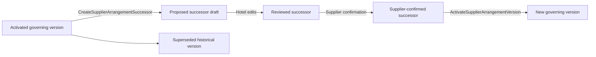

# Hotel Lifecycle

**Status:** Shipped 2026-10-02
**Location:** `docs/planning/m4-offers-and-pricing/hotel-lifecycle.md`
**Parent:** [Hotel Agreement](hotel-agreement.md)
**Authority:** [ADR 0015](../../adr/0015-supplier-agreement-operational-boundary.md) — Supplier agreement operational modeling boundary
**Prerequisites:** Hotel Agreement shipped; Hotel Review and Activation shipped
**Baseline:** `main` at or after `f87fb0bc918e40989b2cf148783292e1d5319a30`
**Does not authorize:** Transportation, Client Service connection, Offer Design, M4E, document storage, attrition/refund calculation, a second Hotel lifecycle model, or changes to generic Supplier Arrangement version semantics

---

## 1. Purpose

Hotel Agreement now supports an exact Hotel Item/version through:

- Stay;
- nightly room inventory;
- contracted Supplier rates;
- Deposit Requirements;
- Deadlines;
- agreement-reference review;
- Supplier confirmation;
- activation;
- correction of a confirmed draft before first activation.

After activation, the governing Supplier Arrangement Version is immutable. The existing generic Supplier lifecycle already supports creating a successor draft from the governing activated version.

This plan closes the remaining Hotel boundary:

- present the activated governing Hotel agreement clearly;
- let Staff intentionally create and enter a successor draft;
- present governing and proposed successor states without merging them;
- carry the existing Hotel editors, confirmation, and activation workflow onto that successor;
- prove the complete Hilton Staff browser journey through activation and successor proposal.

This plan does **not** create a Hotel-specific versioning engine.

---

## 2. Product outcome

For one activated Hotel Supplier Arrangement, Staff can:

1. open the current governing Hotel Agreement;
2. see clearly that it is activated, Supplier-confirmed, and read-only;
3. create a successor draft through the existing `CreateSupplierArrangementSuccessor`;
4. land directly on the Hotel Agreement for that successor;
5. see that the successor is proposed and based on the current governing version;
6. edit only the successor using the existing Hotel editors;
7. review and Supplier-confirm the successor using the shipped Hotel Review workflow;
8. activate the successor using the existing `ActivateSupplierArrangementVersion`;
9. return to Hotel Agreement and see the newly activated version as governing while the predecessor remains readable historical agreement state.

A Viewer can read governing and proposed versions but cannot create, mutate, confirm, or activate a successor.

---

## 3. Core lifecycle rule

Hotel Lifecycle is presentation and orchestration over the existing Supplier Arrangement lifecycle.

It does not introduce:

- `HotelAgreementVersion`;
- `HotelAmendment`;
- `HotelLifecycle`;
- Hotel-specific successor persistence;
- a second copy engine;
- a second activation command.

The authoritative topology remains:



`CopySupplierArrangementVersionGraph` remains the copy authority.

---

## 4. Lifecycle states in Hotel language

For one exact Hotel version, Hotel Agreement exposes these factual states.

The shipped Hotel Agreement words stay in the header: **Draft**, **Proposed successor draft**, **Current governing agreement**, **Superseded agreement**, **Not Supplier confirmed**, **Supplier confirmed**, **Not yet activated**, and **Activated**. **Not yet activated** is this plan's "Not activated". **Proposed successor vN** is that version number together with **Proposed successor draft**. The added lineage line is **Based on current vN-1**.

## Draft before first activation

> **Draft**

The Arrangement has never been activated.

Existing Hotel Review & Activation owns this path.

## Governing activated agreement

> **Current governing agreement**
> Supplier confirmed
> Activated

This version is read-only.

If no successor exists, Staff with `manage_departures` may create one.

## Proposed successor

> **Proposed successor draft**
> Based on current vN-1
> Not Supplier confirmed
> Not yet activated

This exact version is editable.

The governing version remains separately readable.

## Supplier-confirmed successor

> **Proposed successor draft**
> Based on current vN-1
> Supplier confirmed
> Not yet activated

The version is frozen under the shipped Hotel confirmation rules.

Staff may activate it or use the already-shipped pre-activation correction/revision behavior where applicable to the supported topology.

## Newly activated successor

After activation:

- the successor becomes **Current governing agreement**;
- the predecessor is displayed as a historical/superseded exact version;
- there is no longer a proposed successor unless Staff explicitly create another.

Do not merge facts from those versions.

---

## 5. Governing Hotel Agreement

When Staff open an activated Hotel Item with no successor draft, Hotel Agreement defaults to the governing activated version.

The header clearly shows:

- Supplier;
- Arrangement;
- Hotel Item;
- exact version;
- **Current governing agreement**;
- **Supplier confirmed**;
- **Activated**.

All agreement-defining sections remain read-only.

Existing specialist edit actions must not imply that the governing definitions can still be edited.

Instead Staff see one primary lifecycle action when permitted:

> **Create successor draft**

This action uses the existing generic successor command.

---

## 6. Create successor

Do not create a Hotel successor command.

Post the existing:

```text
CreateSupplierArrangementSuccessor
```

with:

- current Agency;
- actor;
- Arrangement;
- Arrangement lock version;
- governing Version lock version;
- idempotency key.

The existing command remains responsible for:

- active Departure requirement;
- active Arrangement requirement;
- governing predecessor requirement;
- no-existing-draft invariant;
- exact graph copying;
- lineage;
- audit;
- one-draft uniqueness.

Hotel Lifecycle adds no new copy behavior.

The shipped copier already includes the Hotel definition graph and reviewed-none facts.

`SupplierConfirmation` is not copied.

---

## 7. Successor landing behavior

After successful successor creation, redirect directly to:

```text
Hotel Agreement
exact version = new successor
same stable Hotel Item ID
```

Do not return Staff to generic Supplier Arrangement planning as the normal path.

The Hotel Agreement header says:

> **Proposed successor draft**
> Based on current vN-1

Provide an obvious secondary action:

> **View current agreement**

The current governing agreement likewise provides:

> **View proposed successor**

when one exists.

The existing exact-version switcher remains authoritative.

Do not create a merged governing-versus-successor page.

---

## 8. Editing the successor

All existing Hotel editing surfaces work against the exact successor draft:

- Stay;
- room inventory;
- room categories;
- Supplier rates;
- Deposits;
- Deadlines;
- Agreement Terms.

They continue to mutate the generic copied definitions through their shipped commands.

The successor may differ from the governing version in any supported Hotel agreement-defining fact.

The governing version remains immutable.

No editor silently modifies both versions.

---

## 9. No semantic diff engine

This plan does not implement a generalized semantic agreement diff.

Staff may switch between:

- current governing agreement;
- proposed successor.

The header may display factual lineage:

> Based on current v3

but does not calculate statements such as:

> Rate increased 4.2%

or:

> Material terms changed

unless an existing exact fact already provides that information.

A future semantic comparison requires separate authority.

---

## 10. Supplier confirmation on a successor

The shipped Hotel Review & Activation contract applies unchanged to the successor.

Before Supplier confirmation:

- every lodging Item on that exact successor version must pass typed Hotel confirmation review;
- generic activation readiness does not become the confirmation gate;
- all seven Hotel terms have explicit review outcomes;
- unsupported Hotel shapes remain Advanced.

Supplier confirmation:

- belongs to the successor exact version;
- does not copy from the governing version;
- freezes the successor's Hotel agreement definitions;
- does not activate it.

The predecessor's confirmation remains historical evidence for that predecessor only.

---

## 11. Successor activation

Hotel Lifecycle does not create another activation path.

The Hotel Review page posts:

```text
ActivateSupplierArrangementVersion
```

with the successor's existing `SupplierConfirmation`.

All existing generic successor readiness remains authoritative, including:

- copied-lineage requirements;
- required copied references and absences;
- retained-capacity dependencies;
- Supplier cost readiness;
- capacity readiness;
- commitment rules.

After successful activation:

```text
old governing version → superseded/history
successor version → governing activated version
```

Hotel Agreement then defaults to the new governing version.

---

## 12. What constitutes a Hotel amendment

A change to confirmed contractual Hotel definitions after activation requires a successor draft.

Examples include changes to:

- Stay dates/times;
- room categories;
- contracted room-block definitions;
- contracted Supplier rates;
- Deposit Requirements;
- Hotel Deadlines;
- agreement-reference wording or Reviewed — none outcomes.

This plan does **not** decide that every operational Hotel event after activation requires a successor.

Existing generic operational mechanisms such as:

- capacity events;
- deadline completion/reschedule/waiver;
- Deposit occurrence handling;
- commitments and dispositions

retain their existing semantics.

Hotel Lifecycle does not create a typed "same terms capacity increase" workflow analogous to Cruise.

If a later Hotel workflow needs to distinguish a same-terms operational inventory adjustment from a contractual amendment, that requires its own accepted plan rather than inference here.

---

## 13. No Client Service handoff

The Accepted Hotel Staff walkthrough already settles this boundary.

After Hotel activation, the normal Hotel Supplier journey offers:

> **Return to Departure Composition**

It does **not** offer:

- Create Client Service;
- Connect Client Service;
- Create Client pricing;
- Package inclusion;
- publish;
- sell.

No Supplier Item automatically becomes a Client Service.

Offer Design requires separate authority.

---

## 14. Second Hotel Item isolation

Lifecycle must preserve the existing stable-Item boundary.

If one Supplier Arrangement contains two Hotel Items:

- each Hotel Agreement opens by stable Item ID;
- each page shows only facts relevant to that Item;
- an Item's room block/rates do not contaminate the other Item's totals;
- version-wide facts appear only according to existing scope;
- successor creation copies the exact version graph once, not once per Hotel Item.

After successor creation, both Hotel Items resolve to their corresponding stable Items on the successor version.

Do not create duplicate Arrangement Items.

---

## 15. Advanced shapes

Unsupported but valid generic Supplier configurations remain intact.

Hotel Lifecycle must not repair them while creating or presenting a successor.

When the Hotel adapter cannot represent an exact successor state:

> **Advanced Supplier planning**

remains available.

The governing version stays readable even when a successor contains an Advanced Hotel shape.

One unsupported section does not erase or merge the rest of the Agreement.

---

## 16. Access and tenancy

### Read

A user with `view_departures` may:

- read governing Hotel agreements;
- read historical versions;
- read proposed successor drafts.

### Mutation

`manage_departures` is required to:

- create a successor;
- mutate the successor;
- confirm it;
- activate it.

Use existing Composition denial behavior.

Cross-Agency:

- Departure;
- Arrangement;
- Item;
- version

identifiers return not found.

Do not create a Hotel-specific permission.

---

## 17. Complete Hilton browser proof

Hotel Lifecycle owns the complete browser journey deferred from Hotel Review & Activation.

The system test begins from Composition and proves the Staff path without using generic Supplier planning for the ordinary Hotel shape.

## Setup

1. Open Composition → Suppliers.
2. Create/open Hilton Fort Lauderdale Marina Hotel Agreement.
3. Record the November 4–6 Stay.
4. Record Standard and Deluxe categories.
5. Record nightly inventory:
   - Nov 4: 5 Standard / 2 Deluxe;
   - Nov 5: 10 Standard / 5 Deluxe.
6. Record supported Supplier rates:
   - Standard $173 / $173 / $193 / $213;
   - Deluxe $223 / $223 / $243 / $263;
   - noncommissionable.
7. Confirm the base block preview remains:
   - Nov 4 $1,311;
   - Nov 5 $2,845;
   - $4,156 base contracted-room preview.
8. Record the three Deposit Requirements:
   - $415.60 due Oct 1, 2026;
   - $1,870.20 due May 7, 2027;
   - $1,870.20 due Oct 4, 2027.
9. Record the Oct 3, 2027 5:00 p.m. Eastern rooming-list Deadline.
10. Review all seven agreement-reference kinds, including:
    - governing deposit-refund clarification;
    - original nonrefundable wording retained;
    - cancellation Reviewed — none.

## First activation

11. Open Hotel Review.
12. Record Supplier confirmation with no Supplier identifier and an explicit reason.
13. Prove post-confirmation Hotel edits are rejected.
14. Activate through the typed Hotel path.
15. Return to Hotel Agreement.
16. Prove:
    - Current governing agreement;
    - Supplier confirmed;
    - Activated;
    - read-only Hotel definitions.

## Successor

17. Click **Create successor draft**.
18. Land directly on the proposed successor Hotel Agreement.
19. Prove:
    - Proposed successor draft;
    - Based on current vN-1;
    - Not Supplier confirmed;
    - current governing agreement remains separately readable.
20. Change one supported Hotel fact on the successor, for example a contracted rate, without mutating the governing version.
21. Return to the governing version and prove its original fact remains unchanged.
22. Return to the successor by stable Item ID.
23. Complete Hotel review and Supplier confirmation for the successor.
24. Activate the successor.
25. Prove the successor is now governing and the former governing version remains exact historical state.

---

## 18. Additional focused proof

Separate focused tests cover:

### Version selection

- no successor → default governing version;
- successor exists → default editable successor;
- explicit version ID → exact requested version;
- version from another Arrangement → not found.

### One-successor rule

A second successor cannot be created while one draft already exists.

### Stable Item identity

The same `ArrangementItem` identity survives the version copy.

### Viewer

Viewer:

- sees version state and links;
- cannot create successor;
- cannot edit;
- cannot confirm;
- cannot activate.

### Second Hotel Item

Two Hotel Items on one Arrangement remain isolated through successor creation.

### Advanced successor

Unsupported generic facts remain unchanged and route to Advanced Supplier planning.

### Concurrency

Two concurrent successor-create attempts yield one successor draft.

Reuse the existing generic command's concurrency guarantees; add Hotel request coverage rather than another lifecycle lock.

---

## 19. Documentation standing

When all exit proofs pass:

- mark Hotel Lifecycle **Shipped** in `docs/planning/README.md`;
- update Hotel standing sentences in the Composition parent, Hotel walkthrough, Hotel Agreement, and Hotel Review & Activation;
- remove "Hotel Lifecycle not authorized" only where the standing is actually superseded;
- keep Transportation **Not authorized**;
- keep M4E **Not authorized**.

Do not modify the old `m4d1-slice3-hotel-transport-activity` prototype branch or treat it as implementation authority.

---

## 20. Explicit non-goals

Hotel Lifecycle does not authorize:

- a new Hotel version or amendment model;
- semantic governing-versus-successor diff;
- file/document storage;
- Hotel contract uploads;
- attrition calculations;
- refund calculations;
- early-departure calculations;
- Hotel folios;
- Supplier payment posting;
- Client Service connection;
- Client prices;
- Packages;
- publishing;
- sales;
- Reservations/room assignments;
- typed same-terms Hotel capacity maintenance;
- Transportation;
- Activity/Meal/Excursion adapters;
- M4E;
- M5.

---

## 21. Delivery sequence

This should be one relatively small lifecycle slice rather than another long Hotel decomposition.

## HL.1 — Successor lifecycle surface

- governing Hotel action;
- typed successor creation through `CreateSupplierArrangementSuccessor`;
- successor redirect;
- governing/proposed navigation;
- correct role labels;
- exact-version access;
- permissions and tenancy.

## HL.2 — Closure proof

- complete Hilton browser journey;
- governing immutability;
- successor edit isolation;
- reconfirmation;
- successor activation;
- second Hotel Item;
- Viewer and cross-Agency proof;
- standing documentation.

HL.2 should not add domain behavior discovered during the browser test. Any new domain requirement is a planning issue rather than something silently added to closure.

---

## 22. Exit criteria

Hotel Lifecycle is complete when Staff can perform:

```text
Composition
→ Hotel Agreement
→ complete Supplier agreement
→ Review
→ Supplier confirmation
→ Activate
→ Current governing agreement
→ Create successor draft
→ Proposed successor
→ edit successor
→ Review
→ new Supplier confirmation
→ Activate successor
→ new Current governing agreement
```

without:

- mutating the prior governing version;
- duplicating Hotel Items;
- merging exact versions;
- opening generic Supplier planning for the canonical supported Hotel shape;
- creating a Hotel-specific lifecycle model;
- creating a Client Service.

At that point the Accepted Hilton Staff walkthrough is complete through its stated Supplier stopping point.
