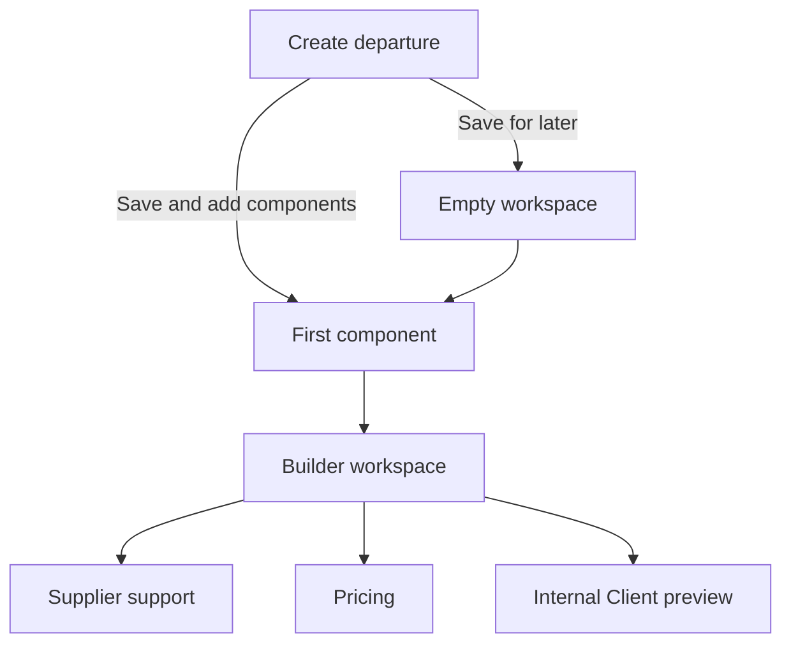

# M4D.0R — Builder interface remediation

**Status:** Shipped 2026-09-21 on [PR #122](https://github.com/tswarren/DepartureDesk/pull/122) as **interim** Staff builder interaction and presentation. **Primary Staff chrome superseded 2026-09-22** by shipped [M4D.1 Slice 1](m4d1-slice1-workspace-foundation.md) Composition. Domain tables, commands, and publication reject-`undecided` remain governed by [M4D.0](m4d0-narrow-group-departure-builder.md). Retain this document as historical interim presentation authority. Focused fulfillment/source/Cruise/Hotel helpers may still live under the builder controller namespace with Composition `return_to`. Not authority for M4E or streamlined discovery backlog.

**Related authority and discovery:**

- [M4D.0 — Narrow group departure builder](m4d0-narrow-group-departure-builder.md)
- [M4D.1 — Departure Composition Workspace](m4d1-departure-composition-workspace.md) (Accepted; Slice 1 shipped)
- [M4D.1 Slice 1 — Workspace foundation](m4d1-slice1-workspace-foundation.md) (shipped primary Staff chrome)
- [M4D.0 — Streamlined group departure builder](drafts/DepartureDesk-M4D0-streamlined-group-departure-builder-draft.md) (discovery only)
- [M4 task flow and contract](m40-task-flow-and-contract.md)
- [Interface contract](../ui/interface-contract.md)
- [ADR 0014](../adr/0014-client-offers-publication-and-supply-compatibility.md)

## Purpose

The M4D.0 domain additions are intended to let an average travel agent think in terms of an end result:

> Record a group departure, outline what the Client will receive, and return later knowing what to do next.

The interface must not require the agent to understand Service Offer topology, Package-version ownership, fulfillment bases, Supplier bindings, readiness evaluators, or publication rules merely to record that concept.

PR #122 implements many required records and commands, but presents them as additive sections and controls inside the existing administrative Departure page. That produces a technically complete but cognitively fragmented experience. This plan defines the required screen hierarchy, transitions, disclosure rules, and acceptance proof for remediation.

## Product outcome

During the first session, an agent can:

1. save the named concept with rough or exact timing and responsibility;
2. leave immediately without losing the concept;
3. add recognizable Client-facing components without Supplier or price decisions;
4. create the usual main Package through one clear question;
5. mark components Included or Optional and arrange them;
6. return to one calm workspace with one useful recommended action;
7. choose whether to work on Supplier support, Pricing, or Client preview;
8. see known Client totals and explicit pending facts without invented zeroes.

The success condition remains **the concept and rough component outline are safely recorded**. The interface must never imply that first-session success requires activation, publication, Supplier commitment, complete pricing, or Client distribution.

## What this remediation preserves

Preserve the underlying domain direction unless a separate code review identifies an invariant defect:

- Departure target timing as descriptive, non-authoritative text;
- draft-only `undecided` fulfillment;
- stable Service Offer identity from the first outline save;
- atomic first Package plus component creation;
- outline creation without Supplier, capacity, cost, or Client price;
- included/optional Package placement;
- Package-inclusion ordering;
- derived readiness and common-scenario results;
- Staff-only internal preview;
- shipped Service Offer, Package, pricing, choice, term, and Supplier-planning authority.

This is not permission to introduce a second outline model, workflow table, persisted completion percentage, component subclass hierarchy, or proposal-distribution subsystem.

## Core interaction model

The builder is a **task workspace**, not another section of the Departure record.

The agent should experience three levels:

1. **Departure concept** — name, rough/exact timing, responsibility.
2. **Client package outline** — what Clients receive, choose, or pay for distinctly.
3. **Preparation outcome** — Supplier support, Pricing, or Client preview.

Supplier and pricing mechanics remain reachable, but they appear only when relevant to the selected outcome or a component's one recommended action.

Routes, Turbo frames, or full-page requests may implement these states. The visible screen boundaries and back/continue behavior are required even if engineering chooses different HTTP paths.

## Information hierarchy

### The default Staff surface

For a Staff user managing a draft or active Departure, the builder is the primary body of the working page.

Above the builder, show only a compact identity header:

- Departure name;
- Draft/Active status;
- target or exact timing;
- responsible Office;
- a secondary **Departure details** action.

Do not place the full administrative definition list before the builder. Reference, description, time zone, currency, responsible user, activation timestamp, departed timestamp, lifecycle corrections, and similar facts belong on the secondary Departure details surface or disclosure.

### Existing operational surfaces

Keep existing records authoritative, but do not render their full tables as peer panels beneath the builder by default.

Provide clearly labeled navigation to:

- **Supplier planning**;
- **Client offers and Packages**;
- **Departure details**;
- **Lifecycle actions**, when permitted.

The default builder must not become a single long page containing the administrative profile, builder, Supplier Arrangement table, Service Offer table, creation forms, pricing preview, and Client preview simultaneously.

### Viewer behavior

Viewer behavior remains unchanged. A Viewer does not receive unpublished builder content or builder mutations. Published facts remain governed by the accepted M4D rules.

## Global presentation rules

1. Show one primary action per decision region.
2. Show one recommended next action for the workspace.
3. Never expand component-creation forms on the default populated workspace.
4. Never expose all fulfillment choices and all specialized helpers on every component card.
5. Use Client-recognizable labels in the primary interface. Technical lineage and version facts belong in detail disclosures.
6. Pending facts remain **Pending**, **Not added**, or **Decide later**. Never display them as zero, complete, or implicitly resolved.
7. A working-outcome selection changes the active work region. It must not merely append another section at the bottom of the same page.
8. No interface action may create a second Service Offer when the user's intent is to add Supplier support to the existing outline component.
9. No helper may invent cabin categories, room categories, occupancies, Supplier facts, or prices.
10. Errors re-render the active screen with submitted values and branch choices preserved.

## Screen 1 — Create group departure

### Purpose

Record the minimum concept without asking the agent to model the trip.

### Visible content

- **Departure name** — required.
- **When is it?**
  - Not known yet.
  - Month, season, or possible dates.
  - Exact dates.
- Conditional target-timing or paired exact-date fields.
- **Responsible Office** — proposed from current/default Office and changeable.

### Advanced disclosure

- description;
- time zone;
- operating currency;
- responsible Staff member, prefilled from the creator where M2 permits.

### Actions

- **Save and add components** — primary.
- **Save for later** — secondary.
- **Cancel** — quiet navigation.

Both save buttons invoke the same `CreateDeparture` domain command. The chosen submit intent controls only the redirect:

| Intent | Destination |
| --- | --- |
| Save and add components | First-component screen for the saved Departure |
| Save for later | Empty builder workspace with confirmation that the concept is safe |

Do not replace these with one generic **Save departure** action.

### Timing behavior

- Selecting a different timing mode may hide irrelevant fields.
- Do not silently erase entered target or exact values merely because the user temporarily switches modes. Clear irrelevant values at the validated command boundary after successful submission, not during exploratory UI toggling.
- Explain descriptive target timing in user language: “This helps describe the trip; exact dates can be added later.” Do not lead with lifecycle authority terminology.

### Error behavior

- Render the same form with `422 Unprocessable Entity`.
- Preserve the selected timing mode and entered values.
- Place the error summary at `#form-error-summary` and link errors to fields.
- If no active Office exists, explain the required recovery and link to the permitted Office surface. Do not invent an Office.

## Screen 2 — Empty saved workspace

### Purpose

Reassure the agent that the minimum outcome succeeded and make the next action obvious.

### Visible content

- compact Departure header;
- confirmation: **Your departure concept is saved**;
- name, timing, responsible Office, and Draft status;
- recommended next action: **Add the first component**;
- a short explanation: “Add anything Clients will see, choose, or pay for distinctly.”

### Actions

- **Add the first component** — primary.
- **Edit departure details** — secondary.
- **Return to departures** — quiet.

Do not show empty Supplier Arrangement and Service Offer tables as the empty-state experience.

## Screen 3 — Add the first component

### Purpose

Capture one Client-recognizable component and make the main-Package decision without duplicate entry.

### One form only

The screen contains one shared set of component inputs:

- **Component name** — required.
- **When Clients see it** — optional descriptive timing.

Then ask:

> Will most travelers buy these components together as one main package?

Choices:

- **Yes, create the main package** — recommended.
- **Not yet** — save the component without Package assignment.

When **Yes** is selected, reveal:

- **Package name**, defaulted from the Departure name and editable;
- **Placement**: Included or Optional.

When **Not yet** is selected, hide Package name and placement. Submit the already-entered component name and timing through the outline command. Do not present a second alternative form with duplicate fields.

### What is deliberately absent

Do not ask for:

- Supplier;
- fulfillment basis;
- capacity;
- Supplier cost;
- Client price;
- deposit terms;
- publication state;
- Cruise or Hotel category details.

### Actions and result

- **Save component** — primary.
- **Back to workspace** — secondary.

Successful Package choice uses the atomic Package-plus-component command. Successful **Not yet** uses outline creation. Both return to the builder workspace with a saved confirmation and **Add another component** available.

### Error behavior

Re-render this screen with the component fields, Package decision, Package name, and placement preserved. Do not redirect to the workspace with only a flash message and discarded input.

## Screen 4 — Add another component

### Purpose

Let the agent extend the rough Client outline without exposing operational setup.

### With one selected editable Package

Show one compact form:

- component name;
- optional Client timing;
- Included or Optional placement.

Create the existing Package-owned Service Offer with `undecided` fulfillment.

### Without a Package

Show:

- component name;
- optional Client timing;
- explanation that it will remain **Not yet assigned to a Package**.

Offer **Create main package** as a secondary action. That action must let Staff deliberately select which unassigned drafts to adopt. It must not silently adopt every draft.

### With multiple editable Packages

Require an explicit Package choice for this request. Do not silently use the first Package. Preserve the choice in the request/session only; do not add a persisted primary-Package designation.

### Completion actions

- **Save and add another** — remains on the focused add screen with a fresh form.
- **Save and return to workspace** — returns to the builder.
- **Cancel** — returns without mutation.

**Start from Supplier planning** remains a secondary alternative. It is not mixed into the simple outline form.

## Screen 5 — Builder workspace

### Purpose

Help an agent understand the emerging Client result and choose the next useful preparation outcome.

### Required vertical order

1. Compact Departure identity.
2. Recommended next action.
3. Preparation-outcome choice.
4. Package summary.
5. Itinerary components.
6. Collapsed remaining checklist.
7. Secondary links to detailed operational surfaces.

### Recommended next action

Display:

- action-oriented label;
- one sentence explaining why it matters;
- one specific action button.

Examples:

- **Add another component** — “Your Package currently contains only transportation.”
- **Decide how the Farewell dinner is provided** — “It is still an outline and makes no Supplier or capacity claim.”
- **Add the Farewell dinner Client price** — “The ordinary package total is complete; the optional dinner remains pending.”
- **Review the internal Client preview** — “The core package can now be reviewed with pending facts labeled.”

Do not use a generic **Open** button. The button label must state the action.

### Preparation-outcome choice

Ask:

> What do you want to prepare next?

Choices:

- **Supplier support**;
- **Pricing**;
- **Client preview**.

The choice is request/session presentation state only. Selecting it changes the current working region or navigates to the corresponding focused surface. It does not persist a workflow state.

No hidden default should make Supplier support appear selected before the agent chooses it. A first visit may show the general workspace recommendation.

### Package summary

Show:

- Package name;
- number of included and optional components;
- Client terms summary when present;
- the most useful common Client total or known subtotal;
- explicit pending inputs;
- **Review pricing** as a contextual action when relevant.

Do not lead with Package version, ownership topology, pricing-definition type, or source-binding terminology.

### Itinerary components

Show Package inclusions in position order, followed by unassigned drafts in creation order.

Each card contains:

- Client name/title;
- Included, Optional, or Not yet assigned;
- Client timing or **Timing not added**;
- compact fulfillment summary;
- compact Client-price summary;
- exactly one contextual action;
- a collapsed **Remaining setup** checklist;
- a quiet **View component details** link.

The one contextual action is derived from the selected outcome when one is active. Examples:

| Outcome | Possible card action |
| --- | --- |
| General | Add missing timing, assign to Package, or decide provision |
| Supplier support | Decide how provided, connect Supplier source, or review Supplier support |
| Pricing | Add Client price or review calculation |
| Client preview | Complete a Client-visible title/timing fact or preview the component |

Do not render Agency fulfilled, On request, Supplier-backed, Cruise setup, Hotel setup, and Open component as six peer actions.

### Remaining checklist

Use four derived groups:

1. Itinerary and Package
2. Supplier support
3. Pricing and Client terms
4. Ready to publish

The checklist is secondary context. It must not become a percentage, wizard step counter, or persisted completion state.

Publication findings remain visible here, but they do not automatically become the recommended action during early preparation.

## Recommendation-selection contract

The recommender must understand the agent's current context rather than globally ranking every finding.

### Selection order

1. If a preparation outcome is selected, consider actionable findings for that outcome first.
2. Within that outcome, correctness blockers outrank ordinary incomplete work.
3. A waiting finding never outranks another action the agent can perform now.
4. If the selected outcome has no actionable work, recommend the next generally useful itinerary, Supplier, or pricing action.
5. Recommend internal Client preview when the core scenario can be meaningfully reviewed, even if explicitly optional facts remain pending.
6. Recommend activation/publication work only when:
   - the agent explicitly enters publication preparation; or
   - itinerary, Supplier-support target, and required pricing/terms work are otherwise ready.

### Explicit exclusions

- **Activate the Departure** must not outrank adding or completing components during initial outline work merely because publication eventually requires activation.
- A future publication blocker is not automatically the current task.
- The route must be explicit and valid. Do not dynamically build a helper name and rescue routing failures back to the current page.
- Recommendation labels and destinations are part of the read contract and require focused tests.

## Screen 6 — Supplier-support outcome

### Purpose

Let Staff decide how each existing component will be provided without changing its identity.

### Component-first view

For each relevant component, show its current status and one action:

- Decide how provided;
- Connect Supplier support;
- Review connected Supplier support;
- Waiting for Supplier;
- No further Supplier work for the selected target.

The agent may switch to the existing Supplier-centered planning views, but returning must preserve the component and Package context.

### Decide how provided

Use a focused chooser:

- Supplier-supported;
- On request;
- Agency fulfilled;
- External fulfillment;
- Decide later.

Explain each in plain language. Do not present these as a row of terse buttons on every component card.

### Supplier-supported path

The action operates on the current Service Offer:

1. open Departure-scoped Supplier-source search;
2. select an existing compatible Supplier source or navigate to create the needed Supplier planning;
3. return to the same component;
4. add the binding and resolve fulfillment on that same Service Offer identity.

It must not call the collection flow that creates a second Service Offer from the selected source.

Required, alternative, and choice-gated bindings remain advanced existing paths.

## Screen 7 — Pricing outcome

### Purpose

Answer the agent's first pricing question: “What will a typical Client pay?”

### Initial content

Show common Package scenarios before component worksheets:

- ordinary two-traveler composition when valid;
- supported single occupancy when explicitly represented;
- named occupancy examples already supported by price/choice facts;
- one isolated option variation at a time.

For each scenario show:

- traveler/occupancy description;
- selected choices and optional components;
- Client total or known subtotal;
- per-traveler amount when meaningful;
- Complete or Pending state;
- exact missing inputs.

### Pending arithmetic

If an optional dinner lacks a price, show:

> Known subtotal $1,950 + dinner price pending

Do not show $1,950 as the final option-inclusive total. Do not substitute $0 for the missing dinner.

### Actions

- **Set Package price**;
- **Set component price** on the relevant pending item;
- **Try another scenario** through the shipped manual preview;
- expandable calculation lines.

Qualified Supplier forecast, commission, and indicative margin remain Staff-only.

## Screen 8 — Internal Client preview

### Purpose

Let Staff review the current end result without implying that anything has been shared.

### Presentation

Render a distinct Client-oriented surface with a persistent banner:

> Internal preview — not shared with Clients

Show in Client order:

- Departure name and target/exact timing;
- included components;
- optional components;
- Client timing;
- choices and the selected example;
- Client price and terms when known;
- prominent but calm Pending labels.

Hide internal fulfillment codes, Package-version facts, Supplier costs, margin, source IDs, and readiness reason codes.

### Behavior

- Preview creates no capacity, demand, publication, proposal, PDF, link, notification, Client Trip, Charge, or receipt record.
- Pending facts are acceptable for internal review.
- **Back to workspace** returns to the same Package and preparation context.

## Screen 9 — Arrange itinerary

### Purpose

Change Client presentation order without creating a second scheduling model.

### Behavior

- Available when a Package has at least two inclusions.
- Enter a focused reorder mode.
- Provide keyboard-operable Move up and Move down controls.
- Save the exact complete inclusion permutation.
- Return to the ordinary component list after save.
- Unassigned components remain after Package inclusions and show **Assign to a Package to arrange**.

The no-JavaScript/full-page path must perform the same action. Do not depend on an inline global JavaScript function as the only usable reorder mechanism.

## Cruise and Hotel setup helpers

### Entry

Specialized setup is an optional action reached from component setup. Do not show both **Cruise cabin setup** and **Hotel room setup** on every component card.

The Staff member must deliberately choose the relevant helper. That choice is presentation/setup context, not permission to create a Service Offer subclass.

### Cruise helper

Operate on one existing Cruise Service Offer and collect actual known facts:

- category name/code;
- supported occupancy examples;
- optional Resource/Pool activation when known;
- Client price facts when known;
- attributable Supplier economics when available.

### Hotel helper

Use the same primitives for:

- room category;
- supported occupancy/night examples;
- optional Resource/Pool activation when known;
- Client price and attributable Supplier economics when available.

### No invented defaults

Do not write generic Inside/Ocean view/Balcony/Suite or Standard/Deluxe/Suite options merely because a helper was opened. Placeholder examples may appear as instructional text, but persistence requires Staff-submitted category facts.

If choices already exist, the helper must edit or extend them deliberately. It must not replace the entire choice graph without an explicit review and confirmation.

## Multiple-Package behavior

- With no editable Package, show unassigned outline behavior and the optional **Create main package** path.
- With exactly one editable Package, the UI may call it the main Package.
- With multiple editable Packages, require explicit selection before Package-specific creation, reordering, pricing, or preview.
- An invalid or missing `package_id` in a multiple-Package context must not silently select the first Package.
- The selection remains request/session presentation context. Do not add `primary_package_id` in this slice.

## Terminology

Use these primary labels:

| Domain fact | Staff-facing primary label |
| --- | --- |
| Service Offer outline | Component |
| No owning Package version | Not yet assigned to a Package |
| `undecided` fulfillment | Decide later |
| M3-backed fulfillment | Supplier-supported or Supplier-backed |
| Package inclusion placement | Included / Optional |
| `client_timing_text` | When Clients see it |
| Draft Package preview | Internal Client preview |
| Missing calculation input | Pending — name the missing fact |

Use Service Offer, binding, version, basis, and evaluator terminology only on advanced/detail surfaces where those distinctions help Staff perform the task.

## Visual treatment

Follow the existing DepartureDesk design system and Harbor & Waypoint palette:

- Navy provides stable application structure and headings.
- Teal identifies active selection and primary movement.
- Amber marks a meaningful deadline or item requiring attention, not ordinary navigation.
- White surfaces sit on the warm Cloud workspace background.
- Use restrained borders and modest radii; avoid stacking multiple nested panels.

The builder should feel calm and operational. Component cards must scan as an itinerary, not as independent administrative forms. Use spacing and typographic hierarchy before adding boxes.

At 1280–1400px, the workspace may place Package/checklist context beside the component list. At 375–768px, place the recommendation, outcome choice, Package summary, and components in one vertical sequence. No primary action may be pushed into horizontal overflow.

## Error, concurrency, and recovery behavior

1. Validation errors re-render the active screen with submitted values.
2. Idempotency keys remain stable across validation recovery and ordinary resubmission.
3. Optimistic-lock conflicts explain that the Departure, Package, or component changed and offer a safe reload.
4. A failed atomic first Package/component action leaves neither an empty Package nor orphan component.
5. Returning from Supplier search, pricing, or detail editing preserves the relevant Departure, Package, component, and preparation outcome.
6. A stale or invalid Package/component identifier fails closed within the current Agency.
7. Success notices confirm the user's result: “Component saved,” not internal aggregate operations.

## Required implementation changes relative to PR #122

The remediation should, at minimum:

1. Replace the single Departure-create submit with the two intent-specific saves.
2. Make the builder the primary Staff working surface and demote the full administrative/Supplier/offer tables.
3. Replace the two first-component forms with one conditional form.
4. Remove expanded add-component forms from the default populated workspace.
5. Replace the action cluster on each component with one contextual action plus a checklist disclosure.
6. Make preparation outcomes select real focused content and influence recommendation selection.
7. Prevent early publication blockers from dominating ordinary builder recommendations.
8. Bind Supplier support to the current outline Service Offer rather than creating a second offer.
9. Remove one-click generic Cruise/Hotel data creation; replace it with input-driven helpers.
10. Require explicit Package selection when multiple editable Packages exist.
11. Replace dynamic route-helper construction with explicit, tested action destinations.
12. Re-render failed outline forms instead of redirecting and losing submitted context.
13. Add browser/system proof of the complete journey and negative-disclosure requirements.

## Acceptance journey

Use a three-day mixed departure:

- included private transportation;
- included Hotel with Standard/Deluxe Client choice;
- included scheduled activity;
- optional dinner or excursion with incomplete pricing;
- seasonal target timing plus exact component timing where known;
- one Supplier-supported component;
- one Agency-fulfilled component;
- one component still set to Decide later.

Prove this sequence:

1. Create the Departure with seasonal timing and responsible Office.
2. Use **Save for later** and see the empty saved workspace.
3. Enter the first-component screen from that workspace.
4. Enter the component once, choose the recommended main Package option, and save it atomically.
5. Add the other components individually as Included or Optional.
6. Arrange the Package inclusions with keyboard controls.
7. Return to the workspace and see one recommended action, not every possible action.
8. Choose Supplier support and connect a Supplier source to the existing transportation component without changing its Service Offer identity.
9. Mark the activity Agency fulfilled.
10. Leave the optional dinner as Decide later.
11. Choose Pricing and see complete ordinary totals plus an explicitly pending optional scenario.
12. Choose Client preview and see a Client-oriented itinerary with Pending labels.
13. Leave and return to the Departure; the concept and components remain understandable without a persisted workflow state.

## Required system and integration proof

### Creation and routing

- **Save and add components** reaches the first-component state.
- **Save for later** reaches the empty workspace.
- Both save the same valid Departure facts.
- Timing-mode changes and validation recovery preserve user input.

### First component

- Only one component-name control is present.
- Package fields appear only for the Package choice.
- The unassigned path does not require Package facts.
- Failure preserves the selected branch and values.

### Workspace disclosure

- The builder precedes detailed operational information.
- A populated workspace contains no expanded create-component form by default.
- Each component exposes at most one primary contextual action.
- Both specialized helpers are not simultaneously exposed on an ordinary component card.
- Full Supplier Arrangement and Service Offer tables are not rendered in the default builder body.

### Recommendations

- Early outline work never recommends activation solely because publication is blocked.
- Supplier, Pricing, and Preview selections produce outcome-relevant recommendations.
- Waiting Supplier work does not outrank an actionable pricing or itinerary task.
- Every recommendation destination resolves without a rescue fallback.

### Identity preservation

- Connecting Supplier support preserves the existing Service Offer ID.
- No duplicate component is created by the Supplier-supported path.
- Cruise/Hotel helpers persist only submitted categories.
- Opening a helper without submitting writes nothing.

### Packages

- Exactly one editable Package can be treated as main.
- Multiple Packages require explicit selection.
- An invalid Package selection does not fall back to the first Package.
- Reordering submits an exact permutation with and without enhanced JavaScript behavior.

### Pricing and preview

- Missing amounts remain pending rather than zero.
- Known subtotals are qualified as subtotals.
- Preview contains no Supplier cost, margin, binding, or internal version facts.
- Preview creates no publication, capacity, demand, or accounting record.

### Permissions and presentation

- Viewer receives no unpublished builder content or mutations.
- Staff cannot cross Agency or Departure boundaries through IDs.
- Keyboard focus order follows the visible task order.
- `#form-error-summary`, labels, field descriptions, and status text are accessible.
- Required journeys reflow at 375, 768, 1280, and 1400 pixels.

## Non-goals

This remediation does not add:

- Supplier-document upload;
- structured schedule rows beyond descriptive Client timing;
- persisted preparation focus;
- proposal links, versions, notifications, or PDFs;
- Sales-action policy;
- booking requests, Holds, deposits, or automatic confirmation;
- Client/Supplier funding-gap policy;
- full pricing-combination explorer;
- new component subclass tables;
- M5 Client Trip or accounting records.

## Exit

The interface remediation is complete when an average travel agent can safely record a concept, outline the usual Client Package, and return to a workspace that presents the end result and one useful next action—without first learning DepartureDesk's internal commercial graph.

The domain records may remain sophisticated. The default workflow must not feel sophisticated merely because those records exist.

## Dated amendment — M4D.1 (2026-09-21)

M4D.0R remains the **interim** shipped Staff builder UI on the M4D.0 domain base. **Future** Staff composition presentation is governed by Accepted [M4D.1 — Departure Composition Workspace](m4d1-departure-composition-workspace.md). Do not implement M4D.1 until that plan’s accepted sub-slice names the work. Demote or redirect `/departures/:id/builder` only when M4D.1 Slice 1 exits.
