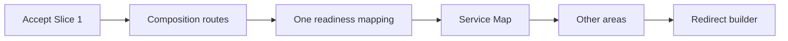

# M4D.1 Slice 1 — Workspace foundation

**Status:** Accepted 2026-09-22. Implementation authority for M4D.1 Slice 1 only.

**Parent authority:** [M4D.1 — Departure Composition Workspace](m4d1-departure-composition-workspace.md), especially §§7–10, 16, 19–20, and the Slice 1 delivery and exit contract in §21.

**Implementation base:** [`8e89aa0`](https://github.com/tswarren/DepartureDesk/commit/8e89aa0), or one later CI-green `main` descendant pinned before implementation begins. [`c64f973`](https://github.com/tswarren/DepartureDesk/commit/c64f973) remains the PR #122 merge and parent M4D.1 domain baseline; it is not a second checkout layered with later documentation commits.

**Scope locked:** Slice 1 only. This plan does not authorize Slice 2A–2D typed Cruise adapters, choice-to-rate-category persistence, Supplier-to-Client provenance, multi-row Service entry, M4E, or M5.



## 1. Outcome

Slice 1 replaces the interim builder as the ordinary Staff entry point for composing draft and active Departures. It introduces five persistent, freely navigable areas over the shipped M3/M4 records:

1. Overview
2. Services
3. Suppliers
4. Package & Client terms
5. Review

This is a workspace and navigation change, not a new lifecycle or domain model. It must let Staff outline Services and reach every existing Supplier, Package, pricing, and terms capability without exposing a second aggregate or stranding work behind the retired builder page.

Slice 1 is intentionally a thin foundation. It is judged on safe navigation, outline work, derived guidance, and capability preservation—not on the Smith Cruise typed-entry calmness that begins in Slice 2.

## 2. Authority and documentation timing

Acceptance of this plan authorizes its named implementation work. Until its exit proof passes:

- [M4D.0R](m4d0r-builder-interface-remediation.md) remains the shipped interim Staff presentation;
- Composition must not be described as the shipped primary Staff chrome;
- `/departures/:id/builder` retirement must not be documented as shipped; and
- the Group departure builder section of [the interface contract](../ui/interface-contract.md) remains current.

The acceptance change set touches only this plan, the planning index, and `AGENTS.md` to identify Slice 1 as Accepted but unshipped.

The shipping change set, after all exit proof is green, must:

- mark this slice shipped;
- amend the parent M4D.1 status;
- supersede M4D.0R's primary-builder presentation clauses;
- amend the interface contract, current-state architecture, roadmap, documentation index, and `AGENTS.md`;
- document the `/builder` redirect; and
- retain M4D.0R as historical interim authority.

## 3. Locked route design

Use one singular Composition resource beneath a Departure:

```ruby
resources :departures do
  resource :composition, only: :show, controller: "departure_compositions" do
    get :services
    get :suppliers
    get :package
    get :review
  end
end
```

| Path | Area |
| --- | --- |
| `/departures/:departure_id/composition` | Overview |
| `/departures/:departure_id/composition/services` | Services |
| `/departures/:departure_id/composition/suppliers` | Suppliers |
| `/departures/:departure_id/composition/package` | Package & Client terms |
| `/departures/:departure_id/composition/review` | Review |

Use `DepartureCompositionsController` and views under `app/views/departure_compositions/`. Do not implement area selection with `?area=`.

The only Composition presentation context parameters are:

- `outcome`;
- `package_id`; and
- a closed `return_to` value of `services`, `suppliers`, `package`, or `review`.

These parameters never establish Agency, Departure, Package, or permission scope. Unknown outcomes and return targets are ignored or rejected safely. An invalid or cross-Departure `package_id` is not accepted as context.

The focused Add Service routes belong under Composition naming. They may use `CompositionServicesController` (or an equivalently narrow controller) and must provide ordinary `new` and `create` actions that return to Composition Services. They must not make `builder/components` the new ordinary entry point.

## 4. Locked redirect behavior

| Existing action | Slice 1 destination |
| --- | --- |
| Staff opens a draft or active Departure | Composition Overview |
| Save for later | Composition Overview |
| Save and add components | Add Service, returning to Services |
| `/builder?work_on=preview` | Composition Review with `outcome=proposal` |
| `/builder?work_on=supplier` | Composition Suppliers with `outcome=supplier` |
| `/builder?work_on=pricing` | Composition Package with `outcome=pricing` |
| Builder URL with `package_id` | Preserve only validated same-Departure Package context |
| Viewer opens a Departure | Existing non-builder show |
| Staff opens a departed Departure | Existing non-composition show |
| Direct Composition route for a departed Departure | Ordinary Departure show |

Replace the current `DeparturesController#show` builder redirect only for actors with `manage_departures` opening a draft or active Departure.

`GET /departures/:id/builder` becomes a compatibility redirect after Slice 1 proof is green. It must preserve only the mapped outcome and validated Package context. It must never render the retired builder body.

## 5. Workspace shell

Every area renders the same compact workspace header:

- Departure name;
- lifecycle status;
- exact or descriptive timing;
- responsible Office;
- selected Package context when applicable; and
- a **Departure details** link to the existing editor.

The five-area navigation is persistent, keyboard-accessible, and never used as a completion gate. Area labels and statuses describe current facts; they do not require Staff to move in order.

Preserve `outcome` and validated `package_id` while navigating. Do not store selected Package or preparation outcome in the session or in domain records.

## 6. Overview

Overview is aggregate navigation, not a fifth work status. It shows:

- identity and timing summary;
- selected preparation outcome;
- one recommended next action;
- a short unresolved-facts list;
- the four work-area summaries;
- **Add Service**; and
- **Add Arrangement**.

Overview has no independent **Ready** badge. It may display the recommended action and the status of the four work areas.

### 6.1 Empty-state starting point

Show **What are you starting with?** whenever the Departure has no editable Service Offers, no editable Packages, and no Supplier Arrangements. This applies immediately after creation and on later returns to the still-empty Departure.

| Selection | Navigation only |
| --- | --- |
| Supplier proposal | Suppliers / Add Arrangement |
| Client package idea | Services / Add Service |
| Rough list | Services / Add Service |
| Nothing else | Remain on Overview |

The answer is not persisted. Slice 1 provides no multi-row rough-list form.

## 7. Outcomes, readiness, and area summaries

### 7.1 Canonical outcomes

| Composition outcome | Existing meaning | Staff-facing label |
| --- | --- | --- |
| `supplier` | Supplier support | Supplier readiness |
| `pricing` | Pricing | Pricing review |
| `proposal` | Former builder `preview` / Client-facing preparation | Client proposal preparation |
| `publication` | Filter over shipped publication findings | Publication readiness |

Accept `preview` only as a compatibility alias on old builder URLs and redirect it to `proposal`. New links and UI copy generate `proposal` / **Client proposal preparation**—never label the ordinary outcome as “preview.”

### 7.2 One findings mapping

Extend `EvaluateDepartureBuilderReadiness` so every existing or new finding exposes:

- `affected_area`; and
- `applicable_to?(outcome)` or declared `applicable_outcomes`.

Define that mapping in one place inside or immediately beside the evaluator. Do not duplicate it in the summary service, recommendation service, helpers, controllers, or views.

`RecommendDepartureBuilderAction` consumes finding applicability. Once migrated, it must not retain a separate `OUTCOME_GROUPS` or equivalent catalog. A method-based Finding API is acceptable if changing the existing Data members would add disproportionate churn. Keep the existing service class names unless a thin compatibility wrapper is demonstrably simpler; the UI uses Composition vocabulary.

Publication uses the shipped M4D readiness behavior. Slice 1 filters and presents those findings; it does not redesign publication.

### 7.3 `SummarizeDepartureCompositionAreas`

Add one pure read service with these inputs:

- Agency;
- actor, where permission-sensitive;
- Departure;
- outcome; and
- optional validated Package.

It returns one result for each of the **four work areas** (Services, Suppliers, Package & Client terms, Review) with:

- key;
- label;
- derived status;
- count of relevant findings;
- primary route; and
- selected Package context where applicable.

Overview remains in the five-area navigation but is **not** given an independent Ready/status badge from this service. Overview may display the recommendation and the four work-area summaries only.

It persists nothing. The allowed work-area statuses are:

- **Not started**;
- **In progress**;
- **Needs attention**; and
- **Ready for outcome**.

Status is derived from shipped records and the shared outcome-aware finding catalog. No area-completion, recommendation, readiness, or scenario fact may be stored.

## 8. Services area

Services is the ordinary Service Map over existing `ServiceOffer` records. It does not create a component, outline, category, or workflow table.

The Service Map follows parent §10.2 and shows the Client-facing service, inclusion or optional placement, Client timing, fulfillment/source state, pricing state, and the most relevant action. It must support usable outline work without expanding a full create form inside each row.

### 8.1 Add Service

The focused Add Service form reuses the shipped commands:

- `CreateServiceOfferOutline`;
- `CreateInitialPackageWithOutlineServiceOffer`; and
- `CreatePackageInlineServiceOffer`.

It preserves the one-form Package decision, validates the same shipped facts, keeps the existing audit behavior, and returns to Composition Services. Multi-row creation is explicitly deferred to a later accepted sub-slice.

### 8.2 Existing capability and return safety

Every applicable Service row keeps links for:

- **Open current Supplier planning**; and
- **Connect using advanced source selection**.

Focused fulfillment, source, Cruise, or Hotel helpers may temporarily remain under the builder controller namespace. They must accept only the closed Composition `return_to` values, preserve validated `outcome` and `package_id`, and return to the originating Service Map row. They must never return to the retired builder show page.

Build destinations with trusted route helpers. Reject arbitrary return URLs.

## 9. Suppliers area

Slice 1 Suppliers is a modest orchestration page over existing Arrangement capabilities. It shows the Departure's Supplier Arrangements and links to the exact existing Arrangement index, new Arrangement, and Arrangement workspace/show routes.

Use **Current Supplier planning** as the ordinary interim label. Reserve **Advanced setup** for graph-oriented detail. Do not add a typed adapter, new Arrangement command, new Supplier-support status, or copied Arrangement editor.

## 10. Package & Client terms area

Show Package composition, inclusion ordering, existing Client pricing/terms summaries, and explicit links to the shipped Package, price, payment-schedule, cancellation-policy, and stated-condition editors.

Slice 1 does not compile Supplier terms into Client terms and does not introduce new Client-term authoring behavior.

### 10.1 Package context

| Editable Packages | Behavior |
| --- | --- |
| Zero | Show empty guidance; do not fabricate a Package |
| One | Select it implicitly |
| Multiple | Require Staff selection; never choose the first silently |

An invalid or cross-Departure `package_id` results in not found or an explicit recovery state. Selection survives Composition navigation only through validated query context, never session persistence.

## 11. Review area

Review is a compiler and router, not a fifth editor. It shows:

- selected outcome;
- one recommended next action;
- findings grouped by affected area and action;
- common Package scenarios when `DeriveCommonPackageScenarios` can calculate them;
- exact pending inputs when it cannot fully calculate them; and
- deep links to the existing editor that resolves each finding.

Review uses current facts only. It does not persist totals, introduce a second findings engine, or implement the Client-term compiler. Slice 1 Review is not judged on Smith Cruise calmness; that proof begins with Slice 2.

## 12. Transaction, authorization, and technical invariants

Slice 1 preserves the shipped section-scoped transactions and command behavior. It adds no giant Composition transaction.

It also adds:

- no migrations or persistence changes;
- no new permissions;
- no new audit actions (existing outline commands retain their shipped audits);
- no change to publication, Sales enabled, or live-feasibility commands;
- no change to Supplier cost, capacity, activation, deadline, or successor records;
- no readiness, scenario, summary, or workflow table;
- no removal of advanced editors;
- no expansion of Viewer access; and
- no copied controller write path that bypasses authoritative commands.

All Agency, Departure, Package, Service Offer, and Arrangement loading remains scoped through the current Agency and existing permission catalog. Cross-Agency and cross-Departure identifiers return not found.

## 13. Implementation sequence

1. Add the Composition routes, controller, shared header, and five-area navigation.
2. Implement canonical outcome parsing and safe Package/return context.
3. Extend the existing readiness findings with the single area/outcome mapping.
4. Add `SummarizeDepartureCompositionAreas` and render Overview.
5. Build Services as the Service Map and move ordinary Add Service entry under Composition.
6. Add the modest Suppliers, Package, and Review orchestration pages with existing-editor links.
7. Migrate focused-editor return targets away from the builder show page.
8. Prove routing, authorization, context preservation, accessibility, and existing capability reachability.
9. Redirect `/builder`, demote the interim authority in shipping documentation, and mark Slice 1 shipped only after all proof is green.

## 14. Test contract

### 14.1 Routing and authorization

- Staff show for draft/active redirects to Composition Overview.
- Old builder URLs map every supported `work_on` value.
- Only a valid same-Departure `package_id` is preserved.
- Viewer cannot access Composition and retains ordinary Departure show behavior.
- Staff Composition is limited to draft/active Departures.
- A departed direct Composition route redirects to ordinary show.
- A cross-Agency Departure returns not found.

### 14.2 Empty-state routing

- Save for later reaches Overview and shows starting-point choices.
- Save and add components reaches focused Add Service.
- Each starting-point choice navigates and persists nothing.
- Returning to an unchanged empty Overview shows the chooser again.

### 14.3 Package context

- Prove zero, one, and multiple editable Package behavior.
- Prove invalid and cross-Departure Package recovery.
- Prove Package selection survives Composition navigation through query context and is absent from session state.

### 14.4 Readiness compatibility

- Existing M4D.0 finding codes and recommendation behavior remain valid.
- The `preview` compatibility alias becomes `proposal`.
- Publication blockers do not dominate Supplier work when `outcome=supplier`.
- Area status remains absent from persistence and schema.
- Recommendation and area summary consume the same applicability mapping.

### 14.5 Services and return safety

- Add Service exercises each existing outline command branch and returns to Services.
- Service Map row actions reach all existing fulfillment/source capabilities.
- Closed return targets preserve area, outcome, and valid Package context on success and validation failure.
- Arbitrary URLs and invalid return targets are rejected.
- No focused editor returns to the retired builder show page.

### 14.6 System and release gate

- Five-area navigation is keyboard-complete.
- Error summary, linked errors, entered values, and selected branches survive failed forms.
- Layouts are proven at 375, 768, 1280, and 1400 pixels.
- Query counts remain bounded for representative Smith and Vineyard workspaces.
- The full Docker test, system-test, lint, security, and Tailwind gates used for PR #122 are green on the pinned tip.

## 15. Exit criteria

Slice 1 is complete only when:

1. Staff opening a draft or active Departure enters Composition Overview.
2. Five persistent areas are keyboard-accessible and freely navigable.
3. Services provides a usable outline and Service Map over existing Service Offers.
4. Suppliers, Package, and Review preserve access to every existing capability.
5. Overview supplies one outcome-aware recommendation and the derived empty-state starting-point chooser.
6. Area summaries are derived and persist nothing.
7. Review compiles current facts and deep-links to existing editors.
8. Old `/builder` URLs redirect with safe context mapping.
9. Viewer and departed behavior remain unchanged.
10. No typed adapters, Client-term compiler, schema change, or second findings engine has been introduced.
11. M4D.0R's primary-builder clauses are demoted only after complete routing and system proof passes.
12. Full CI is green.

## 16. Explicit non-goals

This slice does not authorize:

- Slice 2A–2D Cruise stop points;
- choice `client_rate_category_key` or Supplier-to-Client provenance fingerprint work;
- multi-row Service entry;
- typed Cruise, Hotel, Transportation, Activity, Meal, or Excursion adapters;
- a Client-term compiler;
- a second outline aggregate or findings engine;
- migrations, new permissions, or new audit actions;
- removal of advanced graph editors;
- completion of the full M4D.1 milestone;
- M4E or M5;
- source-document storage;
- proposal sharing or notifications; or
- actual booking, Traveler, obligation, payment, or ledger records.
