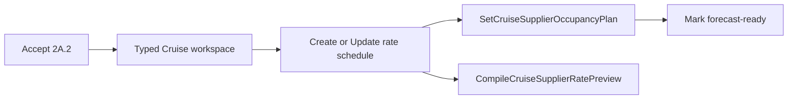

# M4D.1 Slice 2A.2 — Cruise Supplier rates and occupancy totals

**Status:** Shipped 2026-09-22. Implementation authority for M4D.1 Slice 2A.2 only (parent Stop point C). Parent [M4D.1](m4d1-departure-composition-workspace.md) remains Accepted for later slices. This plan is the **sole shipped authority** for typed Cruise Supplier rates and occupancy totals. Slice 2B+, Client connection, and M4E remain unauthorized until named.

**Parent authority:** [M4D.1 — Departure Composition Workspace](m4d1-departure-composition-workspace.md), especially §§11–12, 19–20, and the Slice 2A.2 delivery contract in §21.

**Implementation base:** [`917ff5c`](https://github.com/tswarren/DepartureDesk/commit/917ff5c) (merge of [PR #128](https://github.com/tswarren/DepartureDesk/pull/128) — shipped M4D.1 Slice 2A.1 typed Cruise sailing and cabin inventory).

**Scope locked:** Stop point C only — typed Cruise Supplier rate schedule, occupancy planning, and Supplier total preview over generic M3C. This plan does not authorize Slice 2B deposits/deadlines, Client Service connection, Client prices, Package scenarios, or Vineyard acceptance.

## 1. Outcome

For one saved Cruise cabin category, Staff can:

1. Enter common Supplier rate terms without seeing the M3C graph.
2. Save partial terms and return later.
3. See per-cabin Single, Double, and Triple totals whenever maximum occupancy supports them.
4. See gross Supplier cost even while commission or other figures remain pending.
5. Explicitly record the expected occupancy mix when known.
6. Mark the terms forecast-ready only after reviewing omissions and assumptions.
7. Escape to advanced cost planning when the Supplier contract does not fit the supported shape.

No Client, Service Offer, Package, booking, or payment records are created.

## 2. Authority and documentation timing

Acceptance of this plan authorized its named implementation work. Exit proof is green.

**Shipping note (2026-09-22):** Composition Cruise workspace offers typed Supplier rates, occupancy planning, and Single/Double/Triple previews over generic M3C. Slice 2B deposits/deadlines remain unauthorized.

The shipping change set marks this slice shipped and updates the parent, planning index, roadmap, terminology, and `AGENTS.md`.

## 3. User-facing workflow

### 3.1 Cruise workspace

Replace the current Supplier-rates placeholder with one row per cabin category.

| Category state | Primary action |
| --- | --- |
| No exact-context cost source | Add Supplier rates |
| Working definition | Continue Supplier rates |
| Forecast-ready definition | Review Supplier rates |
| Unsupported cost graph | Open advanced cost planning |
| Activated version without a draft | Create successor draft |

Each row may summarize:

- category code and name;
- estimate or contracted stage;
- working or forecast-ready status;
- supported preview occupancies;
- known Single/Double/Triple gross totals;
- whether commission and net totals are pending or omitted.

These states are derived. Do not persist a Cruise-rate workflow status.

Preload category rate state for the Cruise workspace rather than issuing per-category graph queries.

Successor creation from an activated Arrangement returns Staff to the typed Cruise workspace (same 2A.1 remediation contract).

### 3.2 Supplier rate workspace

Use one page with three independently saved sections.

#### Section A — Supplier terms

Show the selected context prominently:

- Supplier
- Ship and sailing
- Cabin category
- Maximum occupancy
- Departure operating currency
- Estimate or contracted terms

Charge and credit fields:

- First and second traveler fare
- Additional traveler fare
- Single supplement
- NCCF
- First and second traveler discount
- Additional traveler discount
- Taxes, fees, and port charges
- Notes or readiness provenance where required

**Expected commission** uses progressive disclosure.

**How is expected commission stated?**

- Not provided yet
- Dollar amount
- Percentage

**Dollar amount** requires both:

- Commission amount
- Applies per: Traveler or Cabin

More complicated dollar arrangements—different amounts for first/second/additional travelers, group-wide commission, tiers, or conditions—belong in advanced cost planning.

**Percentage** requires:

- Commission percentage
- A checklist of the canonical Supplier components for commission bases

**Commission is calculated on** (charges → `add` base links):

- First/second fare
- Additional-person fare
- Single supplement
- NCCF
- Taxes, fees, and port charges

**Subtract before calculating commission** (discounts → `subtract` base links):

- First/second discount
- Additional-person discount

Suggested UI defaults (not authoritative until saved):

- Suggested selected: first/second fare; additional fare when present; single supplement when present
- Suggested unselected: NCCF; taxes/fees; discounts

Staff must review and confirm selections before saving. Save is the confirmation. The saved base links—not the suggested defaults—are authoritative. Do not persist a separate commission-confirmation flag.

Form semantics:

- Blank means unknown or not decided yet.
- Zero means a known zero.
- While the definition is working, omitted common terms remain visibly pending.
- Commission is never inferred.
- When Staff marks the schedule forecast-ready, Staff confirms that remaining omissions are not applicable, including that omitted commission means **no expected commission**—not an unknown value.

Commission and net display states:

| State | Gross Supplier cost | Commission | Net cost |
| --- | ---: | ---: | ---: |
| Not provided yet (working) | Shown when calculable | Pending | Pending |
| Dollar amount complete | Shown | Shown | Shown |
| Percentage UI incomplete (no durable commission component yet) | Shown | Pending | Pending |
| Percentage and bases saved | Shown | Shown | Shown |
| Forecast-ready with commission omitted | Shown | No commission | Same as gross |

Actions:

- **Save Supplier terms**
- **Save and continue to occupancy planning**
- **Open advanced cost planning**

#### Section B — Occupancy previews and planning

Separate two concepts visually.

**Per-cabin illustrations**

Derived ephemerally from `maximum_occupancy`:

- Single, when maximum occupancy is at least 1
- Double, when at least 2
- Triple, when at least 3

These illustrations do not create occupancy profiles and do not assert an expected sales mix.

**Forecast occupancy mix**

Staff may explicitly enter expected cabin counts:

| Occupancy | Expected cabins |
| --- | ---: |
| Single | Optional positive integer |
| Double | Optional positive integer |
| Triple | Optional positive integer when supported |

Persist an occupancy profile only when Staff confirms a positive expected count. Its `resource_unit_count` is that count—not an arbitrary `1` used merely to enable preview.

If the forecast mix is unknown, Staff can leave it pending and still see per-cabin illustrations.

Action:

- **Save occupancy planning**

#### Section C — Review and mark forecast-ready

Show:

- known rate lines;
- omitted lines;
- per-cabin illustrations;
- recorded forecast mix;
- combined forecast total when a mix exists;
- expected commission;
- net cost after commission;
- provenance required for contracted terms;
- exact blockers preventing readiness.

Before confirmation, state clearly:

> Blank Supplier terms will be treated as not applicable. Omitted expected commission will be treated as no expected commission—not as an unknown value. The recorded occupancy counts will become the planning assumptions used by Supplier forecasts.

Actions:

- **Mark terms forecast-ready**
- **Keep working**
- **Open advanced cost planning**

Term/component edits clear readiness through shipped M3C behavior. Occupancy-plan edits clear readiness through the typed occupancy command in §5.2.

## 4. Durable record mapping

Each cabin category uses an exact context:

- Arrangement Item: Cruise
- Occurrence: sailing
- Resource: cabin category
- Charging Supplier: the eligible Supplier for that context

| Form term | M3C representation |
| --- | --- |
| Cost schedule | `SupplierCostSource` |
| Estimate/contracted terms | `SupplierCostDefinition.stage` |
| First/second fare | `supplier_charge`, `unit_rate`, `occupancy_positions`, positions 1–2 |
| Additional fare | `supplier_charge`, `unit_rate`, `occupancy_positions`, position 3 onward |
| Single supplement | `supplier_charge`, `unit_rate`, `single_occupancy_units` |
| NCCF | `supplier_charge`, `unit_rate`, `persons` |
| First/second discount | `supplier_credit`, `unit_rate`, `occupancy_positions`, positions 1–2 |
| Additional discount | `supplier_credit`, `unit_rate`, `occupancy_positions`, position 3 onward |
| Taxes/fees/port charges | `supplier_charge`, `unit_rate`, `persons`, separately labeled |
| Dollar commission per traveler | `expected_commission`, `unit_rate`, `persons` |
| Dollar commission per cabin | `expected_commission`, `unit_rate`, `resource_units` |
| Percentage commission | `expected_commission`, `percentage`, last among commission bases |
| Included charge base | `SupplierCostComponentBase` with `direction = add` |
| Deducted discount base | `SupplierCostComponentBase` with `direction = subtract` |
| Commission not provided (working) | No commission component while definition remains working |
| Occupancy planning context | `SupplierCostUsageAssumption` |
| Single/Double/Triple mix | `SupplierCostOccupancyProfile` |
| Expected cabin count | Profile `resource_unit_count` |
| Anonymous travelers | Ordered profile-position rows |
| Common traveler label | Item-scoped participant category, normally `Traveler` |

The commission component must appear after every component it uses as a base.

Mode changes (not provided ↔ dollar ↔ percentage, or dollar traveler ↔ cabin) must atomically replace the commission component and its base links without changing fare, NCCF, discount, or tax components.

No new Cruise rate, fare-category, or occupancy table is authorized.

Rate-section saves must not touch capacity evidence, Admin overrides, or unrelated Pool facts.

## 5. Commands and save boundaries

Use bounded typed orchestration over existing M3C helpers. Each section command owns authorization, canonical locks, idempotency, one transaction, optimistic checks, version bump, and audit at its public boundary. Extract reusable `*_already_locked!` / `clear_readiness!` helpers from `CostCommandSupport`. Do not chain public multi-transaction M3C commands for one section save.

### 5.1 Rate terms

- `CreateCruiseSupplierRateSchedule`
- `UpdateCruiseSupplierRateSchedule`

Create atomically:

- the exact-context cost source;
- one working estimate or contracted definition;
- submitted canonical components;
- commission component and base links when provided.

A failed component or base link rolls back the entire rate-section save.

Blank fields do not create placeholder components. On update:

- entering a value creates or updates its canonical component;
- clearing a value removes that canonical component and dependent base links safely;
- commission method changes replace the commission component and bases atomically;
- unrelated or unsupported components are never silently deleted.

Create is idempotent for replay-safe retries. Update rejects stale locks.

### 5.2 Occupancy planning

- `SetCruiseSupplierOccupancyPlan`

This command atomically creates or reconciles:

- the exact-context usage assumption;
- the selected item-scoped participant category;
- explicitly confirmed profiles;
- position rows;
- expected cabin counts.

It must not automatically create Single, Double, and Triple profiles.

Whenever it changes profile membership, expected cabin counts, participant positions, or participant category assignments, it must clear forecast-ready on definitions using that exact Item/Occurrence/Resource context in the **same transaction**. Do not rely on definition fingerprint alone for occupancy invalidation.

### 5.3 Forecast readiness

- `MarkCruiseSupplierRateScheduleForecastReady`

This is a thin typed adapter around existing forecast-readiness behavior. It additionally verifies:

- the graph still matches the supported Cruise-rate shape;
- at least one meaningful Supplier charge exists;
- required usage assumptions exist when a forecast mix is claimed;
- commission bases are valid when a percentage commission is entered;
- contracted terms include provenance;
- Staff explicitly confirmed omissions, including omitted commission as no expected commission.

It must not create missing terms or occupancy profiles during readiness confirmation.

### 5.4 Read adapters

- `CompileCruiseSupplierRatePreview` — pure read adapter; must reuse `EvaluateSupplierCostForecast`; must not implement a second calculation engine.
- `DetectCruiseSupplierRateShape` — category-scoped; distinct from `DetectCruiseArrangementShape`.

## 6. Preview compiler

`CompileCruiseSupplierRatePreview` responsibilities:

- create ephemeral Single/Double/Triple inputs for per-cabin illustration;
- request component evaluation from the existing evaluator;
- overlay typed-form completeness semantics;
- distinguish **Known subtotal** from **Total**;
- suppress expected net when commission is pending;
- show no-commission net equal to gross when forecast-ready and commission was omitted;
- return exact pending-field identifiers for the UI;
- return an advanced-editor result when the graph is not canonical.

Persisted occupancy profiles are used for the combined forecast. Ephemeral scenarios are used for per-cabin comparisons.

## 7. Compatibility and escape rules

`DetectCruiseSupplierRateShape` is category-scoped. Advanced costs must not make the entire Cruise Arrangement incompatible.

Typed editing may reopen:

- one dollar commission per traveler;
- one dollar commission per cabin;
- one percentage commission with bases drawn only from canonical rate components;
- the canonical fare, supplement, NCCF, discount, and tax components in §4.

Send these to advanced planning without rewriting:

- multiple overlapping commission components;
- tiered commission;
- minimum commission;
- bases using noncanonical components;
- commission based on group-wide or conditional facts;
- different dollar commission amounts by traveler position;
- multiple sources, custom formulas, unrelated percentage arrangements, or ambiguous duplicates.

If the graph is unsupported:

- summarize that Supplier terms exist;
- do not flatten or rewrite them;
- send Staff to advanced cost planning.

## 8. Activation and successor behavior

- Typed writes operate only on a draft Arrangement version.
- Activated definitions remain frozen (M3D.7).
- If no draft exists, Staff must create a successor before editing; successor creation returns to the typed Cruise workspace.
- The existing successor-copy contract must copy sources, definitions, components, bases, assumptions, profiles, and positions.
- Editing copied terms clears readiness when required.
- The typed form must never mutate an activated version.

## 9. Routes

| Method | Path | Purpose |
| --- | --- | --- |
| GET | `/departures/:departure_id/arrangements/:id/cruise/cabin-categories/:resource_id/supplier-rates` | Supplier rate workspace |
| POST | `/departures/:departure_id/arrangements/:id/cruise/cabin-categories/:resource_id/supplier-rates` | Create rate schedule |
| PATCH | `/departures/:departure_id/arrangements/:id/cruise/cabin-categories/:resource_id/supplier-rates` | Update Supplier terms |
| PUT | `/departures/:departure_id/arrangements/:id/cruise/cabin-categories/:resource_id/supplier-rates/occupancy-plan` | Save occupancy plan |
| POST | `/departures/:departure_id/arrangements/:id/cruise/cabin-categories/:resource_id/supplier-rates/forecast-readiness` | Mark forecast-ready |

The Supplier-rate page returns to the same cabin-category rate context after every save.

## 10. Smith calculation proof

For the accepted O1 terms:

- first/second fare: $1,624;
- additional fare: $406;
- NCCF: $320 per traveler;
- first/second discount: $150 per traveler;
- additional discount: $37.50;
- taxes/fees: $137 per traveler;
- single supplement: $1,624.

The per-cabin gross Supplier illustrations should be:

| Scenario | Gross Supplier cost |
| --- | ---: |
| Single | $3,555.00 |
| Double | $3,862.00 |
| Triple | $4,687.50 |

These totals exclude commission.

The Smith acceptance fixture must not invent a Celebrity commission rate. It must demonstrate:

- gross totals remain visible;
- expected commission is Pending;
- net Supplier cost is Pending.

## 11. Acceptance tests

The slice must prove:

- Smith canonical component mapping and the three stated gross totals;
- pending commission preserves gross but suppresses net;
- dollar commission per traveler;
- dollar commission per cabin;
- percentage commission using fares and supplement;
- discounts excluded from the percentage base;
- discounts explicitly subtracted from the percentage base;
- changing commission methods removes obsolete components and links;
- missing or unconfirmed percentage bases leave commission and net pending (no durable incomplete percentage component);
- occupancy changes clear readiness;
- maximum occupancy 2 does not offer Triple;
- previews do not persist profiles;
- occupancy profiles require explicit counts and confirmation;
- partial rate terms survive return and resume;
- each section rolls back independently on failure;
- create commands are idempotent;
- update commands reject stale locks;
- activated versions cannot be edited;
- successor drafts retain copied cost facts and return to the typed Cruise workspace;
- advanced graphs are never rewritten by the typed adapter;
- rate saves do not mutate capacity evidence, Admin overrides, or unrelated Pool facts;
- no Service Offer, Package, Client price, booking, Charge, Obligation, or Payment is created.

## 12. Explicit non-goals

- Supplier deposits and deadlines
- Client-service connection
- Cabin-category Client choices
- Client price compilation
- Supplier-to-Client provenance
- Package scenario economics
- Actual cash or collection gaps
- Group number entry
- Source-document upload
- Multi-currency Supplier terms
- Quad or more specialized Cruise formulas
- Automatic interpretation of contract PDFs
- Traveler-position-specific, tiered, minimum, or group-wide commission in the typed form

## 13. Exit criteria

Slice 2A.2 is complete when Staff can enter and resume the accepted O1 Supplier terms, see truthful Single/Double/Triple gross illustrations, optionally record an explicit occupancy forecast, state ordinary dollar or percentage commission when known, and obtain commission/net figures when inputs support them—without seeing the generic cost graph or creating Client-side records.

Exit proof is green. This shipping change set marks Slice 2A.2 shipped.

## 14. Handoff to later slices

Slice 2B begins only when its own Accepted plan names deposits, deadlines, and activation-safe editing.

Client connection, choices, Client prices, Package scenarios, and Vineyard proof remain later M4D.1 slices.

## 15. Handoff after ship

Slice 2B begins only when its own Accepted plan names deposits, deadlines, and activation-safe editing.
